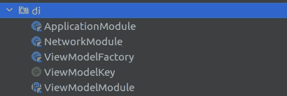

# 在网络模块中使用 Hilt

> 原文：<https://medium.com/codex/using-hilt-in-the-network-module-6ff8c50027d6?source=collection_archive---------13----------------------->

Google 发布了 Dagger，与其他依赖注入框架不同，它提供了严格生成的实现(无反射),这意味着它可以很容易地在 Android 应用程序中使用。

使用像 Dagger 这样的框架进行依赖注入有助于在很大程度上减少样板代码，并帮助开发人员加快开发过程。依赖注入(DI)允许你使代码非常模块化，从而使单元测试更加有效。


伊戈尔·菲格雷多在 [Unsplash](https://unsplash.com?utm_source=medium&utm_medium=referral) 上的照片

> Hilt 提供了一种将 Dagger 依赖注入整合到 Android 应用程序中的标准方法。Hilt 试图为 Android 应用程序简化 Dagger 相关的基础设施，并提供一种简单的方法来为各种构建类型(例如测试、调试或发布)提供不同的绑定。

在这个博客系列中，我们将了解如何使用 Hilt 来创建网络模块，以避免在 Android 中为联网编写重复的代码。

**注意，本系列包含用 Kotlin 编写的代码。**

你可以从这里跳到这个系列的任何部分

 [## 中等

### 创建网络模块](/@priyansh-kedia/creating-the-network-module-with-hilt-3eefc54b72)  [## 中等

### 创建视图模型依赖项](/@priyansh-kedia/creating-viewmodel-dependencies-using-hilt-ff8005488910) 

## 了解我们的网络模块的结构

我们从在 android 中添加对 Hilt 的依赖开始。所有这些依赖都可以在[这里](https://developer.android.com/training/dependency-injection/hilt-android#setup)找到。

然后，我们创建应用程序类。Android 的应用程序类是包含所有其他组件的应用程序中的基类。在 android 生命周期中，**应用程序类**在任何其他**类**之前被实例化。

```
@HiltAndroidApp
class MyApp: Application() { override fun onCreate() {
        super.onCreate()
        instance = this
    }

    companion object {
        lateinit var instance: MyApp
            private set
    }
}
```

在上面的代码中，我们创建了一个类，并将其扩展到 Application 类。然后在 **onCreate** 中创建并实例化我们类的私有实例。

然后创建一个公共静态(Kotlin 中的伴生对象)来访问应用程序的实例。

这就是我们模块的目录结构



我们的网络模块的目录结构

我们将彻底理解每个文件的内容。

## 应用模块

```
@Module
@InstallIn(ApplicationComponent::class)
class ApplicationModule {

    @Provides
    @Singleton
    fun provideApp(): Application {
        return MyApp.instance
    }
}
```

**@Module** 用于在 DI 中注释贡献对象图的类。

**@InstallIn** 指定模块将安装在哪个类中。我们使用 **ApplicationComponent** 在应用程序的整个生命周期中安装模块。

**@Provides** 标注方法创建提供者方法绑定。

**@Singleton** 用于指定始终只创建该类的一个实例。

我们可以看到，这个方法将用于提供我们在应用程序类中实例化的应用程序类的实例。该方法不会直接用于网络模块。

接下来，我们将了解网络模块。在这里阅读[。](/@priyansh-kedia/creating-the-network-module-with-hilt-3eefc54b72)

**参考文献**

 [## 柄

### Hilt 提供了一种将 Dagger 依赖注入整合到 Android 应用程序中的标准方法。剑柄的目标…

匕首.开发](https://dagger.dev/hilt/)