# 使用图像识别发送电子邮件，GUI 自动化系列 II。

> 原文：<https://medium.com/codex/using-image-recognition-to-send-an-email-gui-automation-series-ii-511bb7660fe2?source=collection_archive---------3----------------------->

## [法典](http://medium.com/codex)

今天我们将使用 PyAutoGUI 打开一个新的 chrome 标签，登录到一个电子邮件帐户，写一个草稿，然后发送它。这是 GUI 自动化教程系列的第二部分，所以如果您还没有 Python 和 PyAutoGUI 的经验，请查看第一篇教程中的[。我们还将使用 gmail 作为示例，但当我们完成后，您应该能够使用任何电子邮件帐户进行操作。有一个 TL；如果你想直接跳到代码。也可以访问我的](https://thefounder.medium.com/how-to-make-a-google-search-bot-gui-automation-series-i-9eb5618d3a27) [Github](https://github.com/wwidjaja1/GUI) 获取这里解释的代码。

让我们从我们的步骤列表开始:

1.  点击 windows 键，搜索 chrome，打开 chrome(在第一个教程中有介绍)
2.  打开新选项卡(在第一个教程中介绍)
3.  键入[gmail.com](http://gmail.com/)(或者[mail.yahoo.com](http://mail.yahoo.com/)或者另一个域名，如果你愿意的话)
4.  在用户名框中输入光标。输入密码。登录
5.  通过对话框验证成功登录
6.  找到“撰写”按钮
7.  输入收件人、主题和电子邮件。发送电子邮件

在上一个教程中，我们复习了一些基本的 PyAutoGUI 函数(写，热键，按，截图)。这一次，我们想使用 PyAutoGUI。**locate center screen**(" image . png "，confidence = float)，其中 0 < float < 1。

这个功能很酷。您可以对任何图像进行截图(如通缉令)，然后让 PyAutoGUI 在“野外”再次找到该图像

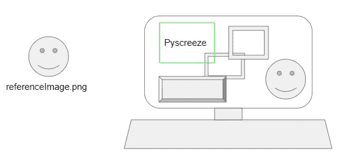

完全艺术化的谷歌幻灯片演示 PyScreeze 如何找到图像。

PyAutoGUI 通过使用 PyScreeze 来实现这一点，PyScreeze 是 PyAutoGUI 自动安装的另一个 Python 模块。它从左上角开始扫描你的屏幕，然后向右下方扫描，直到找到与你传递到 locateCenterOnScreen 函数中的文件相匹配的图像。置信区间允许您要求它查找的图像与屏幕上显示的图像之间存在一定的差异。因此，90%的置信度意味着只需要 90%的像素匹配，允许微小的差异。

locateCenterOnScreen()函数还返回屏幕上图像中心的 x 和 y 坐标，允许我们自动点击鼠标。

关于这个简洁函数如何工作的文档在[这里](https://pyautogui.readthedocs.io/en/latest/screenshot.html)。

**设计流程**:

1.  打开一个名为 autoEmailer.py 的新 Python 文件，或者打开 autoSearcher.py 文件，从 try/except 块中删除一些代码，直到我们只剩下步骤 1 和 2(打开 Chrome 标签)。然后将该代码移动到它自己的名为“openChrome”的函数中

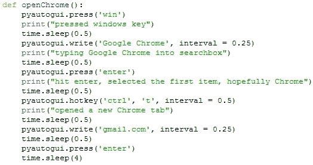

你也可以从我的 Github 中复制这段代码

2.好了，现在事情变得有趣了。你需要截取一些你桌面上的截图。我喜欢剪贴工具(或剪贴和草图),因为我们可以从一开始就捕捉到我们想要的精确区域，但完整的截图和随后的裁剪也一样有效。我们获取这些图像，并告诉我们的代码，这些是它应该注意的按钮。

当你在 Gmail 主页上时，记下你看到的内容:

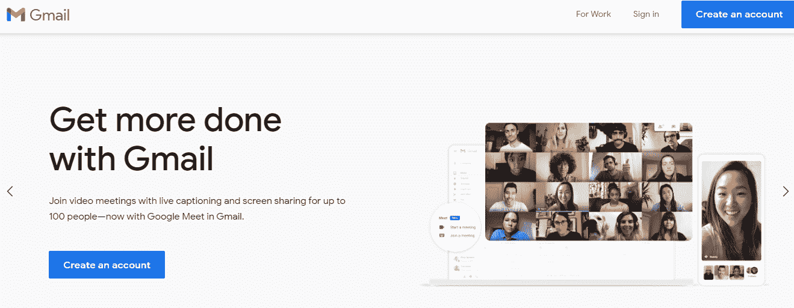

注销后您会看到什么

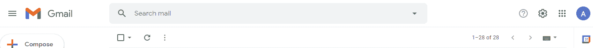

登录后您会看到什么

如果您已注销，您会看到类似顶部的内容。如果你登录了，你会看到类似底部的东西

3.现在我们问自己，下一步是什么？嗯，我们设计我们的代码，让它通过一个主循环处理这两种情况。我们将在“编写代码”一节中讨论如何创建一个主循环，但是现在，让我们只收集数据并假设您需要登录。让我们假设我们是鼠标光标，并注意它的行程:

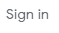

截屏或截取文本中的签名，将其保存为“signInButton.png”

4.我们假设你有一个 gmail 帐户，所以我们只需点击登录按钮或文本。截屏显示“登录”文本，并将其保存为“signInButton.png”(稍后，我们将在 signInButton.png 中传递一个函数来自动点击它)

5.现在点击“登录”,看看下一个屏幕上有什么

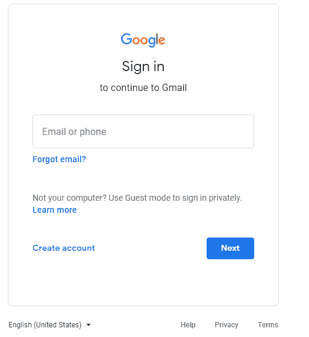

6.你下一步会点击什么？当然是“电子邮件或电话”箱。截屏并将其命名为“signInBoxBlank.png”

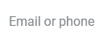

signInBoxBlank.png

7.你也有可能得到这样的屏幕。

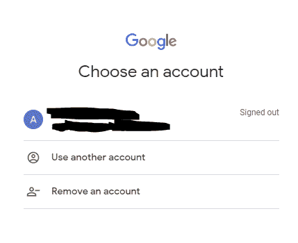

8.发现尽可能多的分支是一个好主意，这样我们的代码可以处理不同的屏幕(尽管有时这是不可能的，因为有些屏幕不能被“召唤”，比如 2FA 提醒)。现在，让我们保持简单，为 90%的情况编程。我们将假设您是唯一的用户，并且想要重新登录。截屏你的图标或“注销”文本。请注意，如果您想为多次登录实现这一点，您需要选择您的图标，甚至是整个电子邮件。

我的偶像。我把它命名为“smallSignInIcon.png”

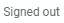

“已注销”的文本。如果你是从我的 Github 复制的，这个叫做“chooseAccount.png”

9.现在，单击开始您的帐户的登录过程。下一页很可能是这两种情况之一:

A.)密码字段已经突出显示。在这种情况下，蓝色的文本框显示，我们只需要让我们的程序键入密码，然后点击“enter”请注意，这是我们识别图像的时间，但是一旦我们看到它，就做一些事情而不是点击它。

A.)密码字段已经突出显示。在这种情况下，蓝色的文本框显示，我们只需要让我们的程序键入密码，然后点击“enter”请注意，这是我们识别图像的时间，但是一旦我们看到它，就做一些事情而不是点击它。当密码字段已经突出显示时，显示蓝色文本。我把它叫做“cursorAlreadySet.png”

B.)密码字段不会突出显示。在这种情况下，会显示灰色文本，我们希望单击它来键入我们的密码。

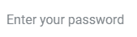

当光标没有自动选择字段时，会显示此文本。我把它叫做“cursorNotSetforPass.png”

10.这是我们的代码逻辑:键入密码，如果 cursorAlreadySet.png 是可见的，按回车键。否则，单击“cursorNotSetforPass.png”字段，然后键入密码并按回车键。

登录后您会看到什么

11.这里，我们假设我们已经登录(如果我们已经登录，我们也可以从步骤 1 直接到达这里)

12.找到撰写按钮，截屏后点击它。

我称之为“composeButton.png”

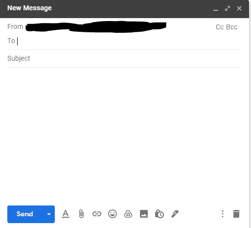

在 gmail 中撰写电子邮件时弹出的窗口。请注意,“到”字段是自动选择的。

13.点击后，一个新的迷你窗口出现。由于“To”字段是自动选择的，我们的代码可能会开始使用 write()函数键入收件人(在我的代码中，我让它在循环中按每个收件人的 tab 键，直到所有收件人都被添加)。

14.完成收件人后，只需再次按 tab 键，用 write()键输入主题。

15.再次点击 tab 键进入正文。现在您已经在正文中，用 write()键入消息。

16.现在用热键()按 ctrl+Enter 发送。

**编写代码**

好了，现在我们完成了数据收集，我们需要将这个设计转化为代码。我们可以分两步走。

1.  创建“主循环”或“游戏循环”结构
2.  创建阶段或状态以便在主循环中跳转

在我们的上一个教程中，我们两个都没有做。我们刚刚经历了 5 个步骤。但是这个任务有更多的分支步骤，简单地浏览可能会导致错误。我们可以很容易地从我们的主循环开始，然后我们可以花另一个教程通过添加定义的状态来改进它。

**回路设计**:

1.  主循环继续执行，直到出现停止或中断条件。像游戏一样，计算机不断检查其环境的变化，然后更新或刷新代码中的某些变量，从而改变其他内部变量或屏幕上显示的内容。
2.  每一个可能存在的步骤或动作都被放入主循环中，只有在满足条件时才会被触发(在我们的例子中，是看到图像、文本或按钮)。循环运行速度很快，以毫秒或微秒级刷新每个循环运行的条件值。
3.  在任何时候，我们都可以放入中断，甚至状态(未来教程)。现在，像这样做一个循环可以让我们无论是否登录都可以发送电子邮件，而不必考虑分支！

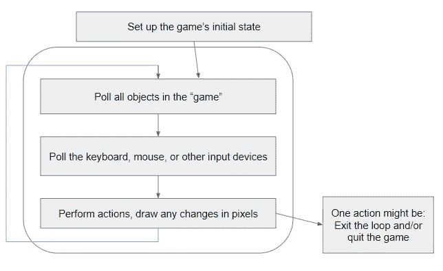

游戏循环设计工作原理的一般框图

这是一个为随机“闲置”游戏(如 cookie clicker)制作的游戏循环示例，奖励用户按下“s”键:

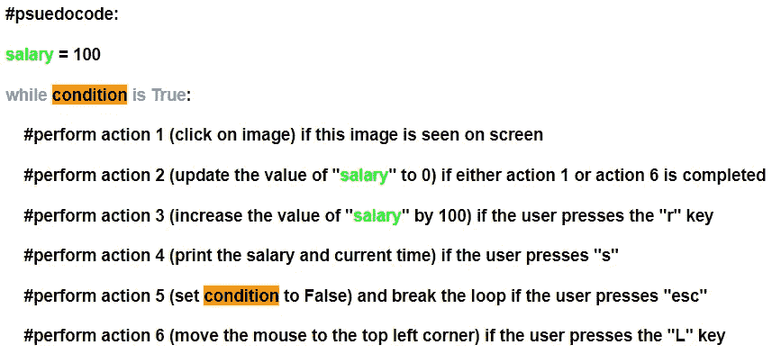

空闲游戏的伪代码循环

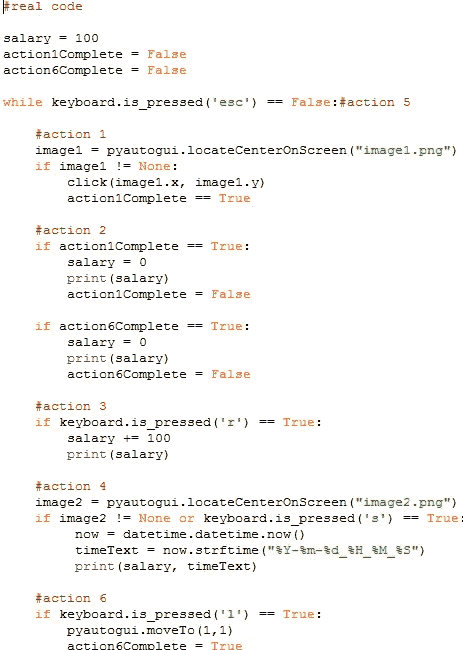

上述“游戏”的实际代码。不要担心运行这个。重点是在一些简单的东西上看到一个真实的例子

现在回到我们的电子邮件设计，每个自动决策过程可以总结如下:

1.  我看到这个图像了吗？如果没有，抓紧直到我开始(再做一次循环)
2.  好的，我看到了这个图像，现在我需要做这个动作(如果是按钮，点击它。如果是字段，就在里面写。)
3.  …就是这样。事实证明，这导致了看起来非常简单的代码。让我们尝试一个带有登录按钮的示例:

当你想点击这张图片时

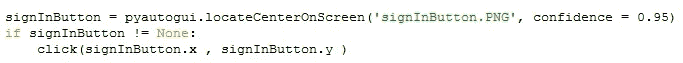

使用此代码

现在，每隔一幅图像重复一次，并加入书写函数。

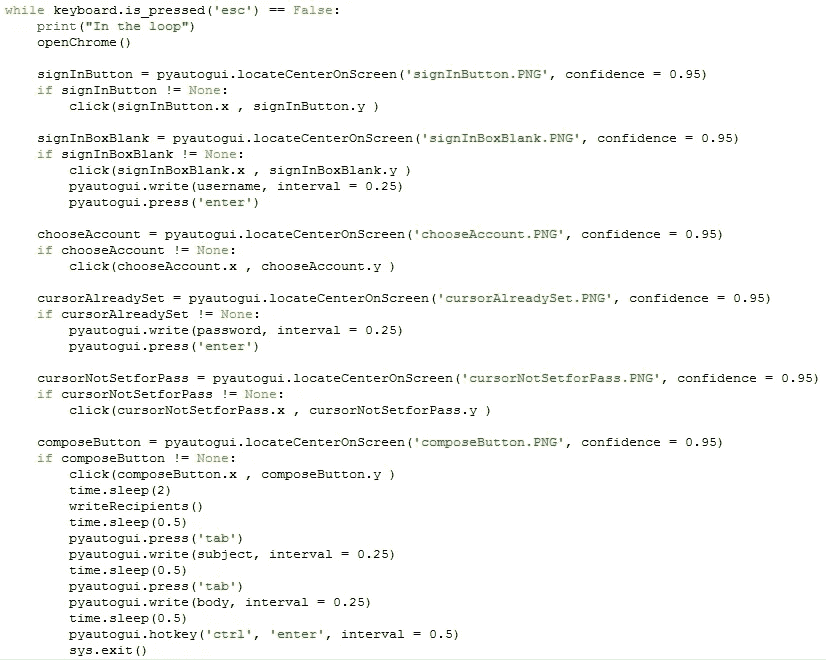

在更改了硬编码字段之后，您可以用我的文件亲自尝试一下。在未来的教程中，我们可能会讨论这些类型的改进:

1.  创建事件侦听器和线程，而不是任意休眠
2.  创建固定的帧速率并使用 PyGame 获得更好的游戏循环
3.  创建一个配置文件，这样我们就不会硬编码任何变量
4.  使用 OCR 和/或机器学习训练的图像识别 ai，所以我们不需要收集参考图像
5.  介绍其他 API 和软件包

**TL；博士**:

1.  如果您还不熟悉 Python 和 PyAutoGUI，请完成教程 1。
2.  进入我的 [Github](https://github.com/wwidjaja1/GUI) ，下载名为“autoEmailer.py”的 python 文件和名为“autoEmailerImages.zip”的图片压缩文件(解压图片并确保它们与 autoEmailer.py 在同一个文件夹中)
3.  编辑硬编码字段，例如 writeRecipients()函数中的“用户名”、“密码”和 recipientList 变量。(或者，创建一个配置文件)。运行 autoEmailer.py 文件

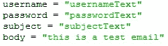

更改这些字段中的文本

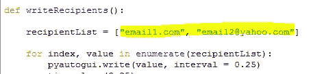

同时更改突出显示的值

**脚注**:

1.  从数学的角度来看，这是大量的计算。PyAutoGUI 文档显示，在 1920 x 1080 的屏幕上定位一幅图像需要 1-2 秒。计算机一个像素一个像素地移动一个窗口，并将它所看到的与参考图像进行比较。如果它在寻找一个 40 x 40 的图像，它将从[左上，右下] = [(0，0)，(40，-40)]定义的矩形开始，然后移动到[(0，0)，(41，-40)]，[(0，0)，(42，-40)]……[(0，0)，(1879，-40)]，[(0，0)，(1880，-40)]，[(0，-1)，(40，-41)]，[(0，-1)，(41，-41)]对于你们这些算法迷来说，这是 O( (a -c + 1)*(b-d+1))的最坏情况复杂度，其中屏幕尺寸是 a×b 像素，而我们想要的图像是 c×d 像素。对于一个 40 x 40 的图像，如果图像直到右下角才被找到，那么就要比较超过 190 万个像素。