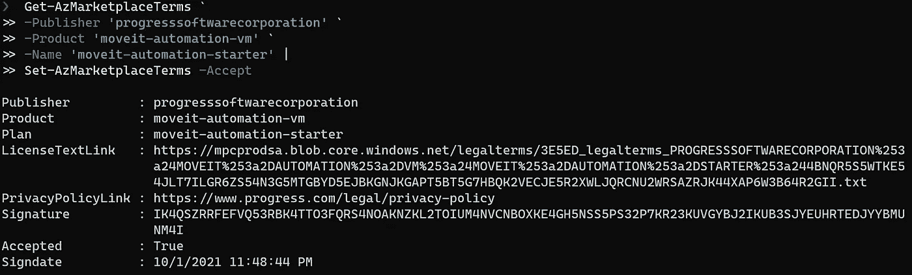
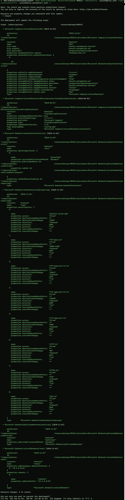
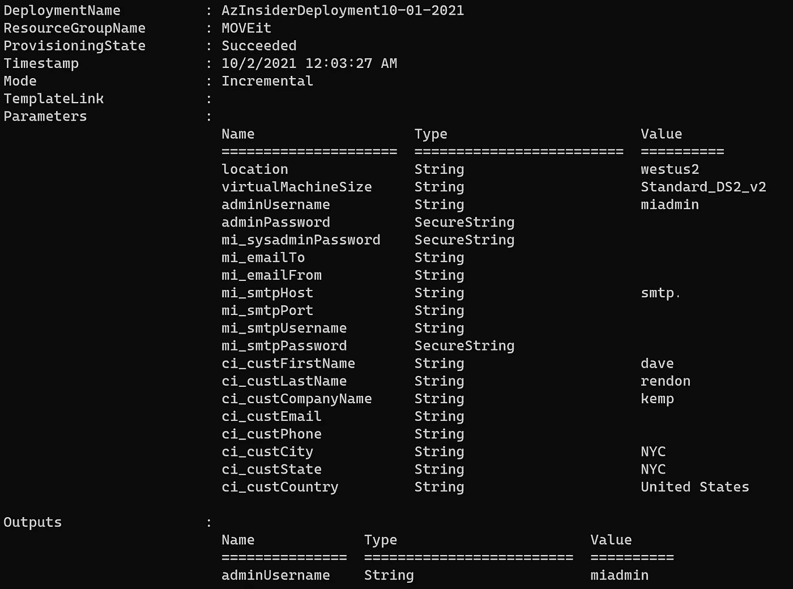
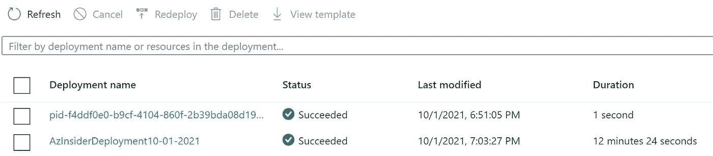
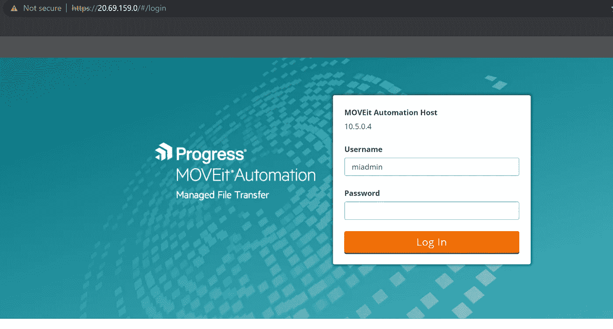
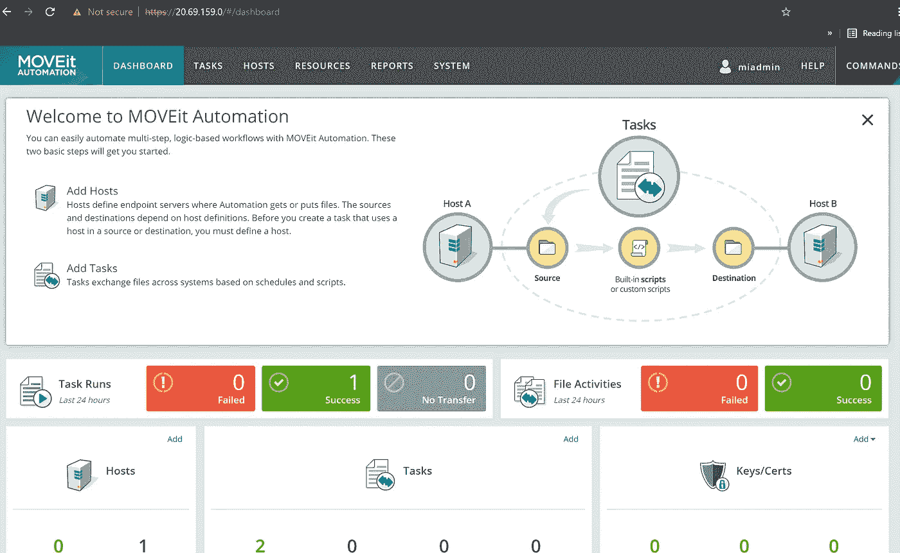

# 在 Azure 中部署 MOVEit 的⚡Using 基础设施代码(ARM 模板)

> 原文：<https://medium.com/codex/using-infrastructure-as-code-arm-templates-to-deploy-moveit-in-azure-7b2e7e4aae18?source=collection_archive---------4----------------------->

学习部署全功能的 MOVEit 自动化解决方案。

本文的目标是展示如何使用 ARM 模板利用基础设施即代码在 Azure 中部署 MOVEit 解决方案。

# 什么是 MOVEit？

Progress MOVEit Automation 是一款托管文件传输(MFT)自动化软件，运行在 Azure 或您首选的云提供商的虚拟机之上。它提供了以下好处:

*   无需任何编程技能，轻松自动化多步骤、基于逻辑的工作流程
*   授权的业务线管理员可以监控、安排和运行自动化文件传输任务
*   端到端数据加密和经确认的安全性，符合内部政策和法规要求
*   RESTful API 和 PowerShell 脚本支持与第三方应用的灵活集成
*   该控制面板能够对关键 MOVEit 自动化功能进行主动、一目了然的洞察

本文的主要目的是使用 ARM 模板来自动化该解决方案的部署过程。让我们从先决条件开始。

## 部署 MOVEit 的先决条件。

*   有效的 Azure 订阅
*   拥有所有者或贡献者角色的 Azure 用户
*   SMTP 中继。SMTP 电子邮件服务器能够接受来自 Azure 中运行的虚拟机的出站电子邮件。您可以在部署后配置 SMTP。

现在让我们创作我们的 ARM 模板。

我们将开始定义参数。

# 1.MOVEit ARM 模板—参数

该解决方案运行在虚拟机之上，因此我们将定义以下参数:

*   位置
*   虚拟机大小
*   管理员用户名和密码
*   客户姓名
*   公司名称
*   客户电子邮件
*   电话
*   城市
*   状态
*   国家
*   系统管理员密码
*   电子邮件至
*   电子邮件发件人
*   SMTP 端口
*   SMTP 用户名和密码

下面的代码显示了 ARM 模板的参数部分的定义:

```
"parameters": {
        "location": {
            "type": "string"
        },
        "virtualMachineSize": {
            "type": "string"
        },
        "adminUsername": {
            "type": "string"
        },
        "adminPassword": {
            "type": "securestring"
        },
        "mi_sysadminPassword": {
            "type": "securestring"
        },
        "mi_emailTo": {
            "type": "string"
        },
        "mi_emailFrom": {
            "type": "string"
        },
        "mi_smtpHost": {
            "type": "string"
        },
        "mi_smtpPort": {
            "type": "string"
        },
        "mi_smtpUsername": {
            "type": "string"
        },
        "mi_smtpPassword": {
            "type": "securestring"
        },
        "ci_custFirstName": {
            "type": "string"
        },
        "ci_custLastName": {
            "type": "string"
        },
        "ci_custCompanyName": {
            "type": "string"
        },
        "ci_custEmail": {
            "type": "string"
        },
        "ci_custPhone": {
            "type": "string"
        },
        "ci_custCity": {
            "type": "string",
            "defaultValue": ""
        },
        "ci_custState": {
            "type": "string",
            "defaultValue": ""
        },
        "ci_custCountry": {
            "type": "string",
            "defaultValue": ""
        }
    },
```

请注意，我们使用“ *secureString* ”来传递部署中的密码/机密和敏感数据。这些机密不会存储在部署历史记录中，也不会被记录。

现在我们将定义要使用的变量。

# 2.MOVEit ARM 模板—变量

在 ARM 模板的变量部分，我们将包括以下内容:

*   虚拟机名称
*   虚拟网络名称
*   网络接口名称
*   网络安全组名称
*   地址前缀
*   子网名称
*   子网前缀
*   公共 IP 地址名称
*   公共 IP 地址类型
*   发布者名称
*   提供
*   库存单位
*   版本
*   图像参考
*   计划

下面的代码显示了 ARM 模板的变量部分的定义:

```
"variables": {
        "virtualMachineName": "MIA",
        "virtualNetworkName": "vnet1",
        "networkInterfaceName": "nic1",
        "networkSecurityGroupName": "nsg1",
        "addressPrefix": "10.5.0.0/16",
        "subnetName": "subnet1",
        "subnetPrefix": "10.5.0.0/24",
        "publicIpAddressName": "publicip1",
        "publicIpAddressType": "dynamic",
        "myPublisher": "progresssoftwarecorporation",
        "myOffer": "moveit-automation-vm",
        "mySKU": "moveit-automation-starter",
        "myVersion": "latest",
        "myImageReference": {
            "publisher": "[variables('myPublisher')]",
            "offer": "[variables('myOffer')]",
            "sku": "[variables('mySKU')]",
            "version": "[variables('myVersion')]"
        },
        "myPlan": {
            "name": "[variables('mySKU')]",
            "product": "[variables('myOffer')]",
            "publisher": "[variables('myPublisher')]"
        }
    },
```

接下来，我们将定义资源。

# 3.MOVEit ARM 模板—资源

在 ARM 模板的资源部分，我们将使用具有外部范围的嵌套模板来定义部署。

下面的代码显示了 ARM 模板的资源部分的定义:

```
"resources": [
        {
            "name": "pid-f4ddf0e0-b9cf-4104-860f-2b39bda08d19-partnercenter",
            "type": "Microsoft.Resources/deployments",
            "apiVersion": "2020-10-01",
            "properties": {
                "mode": "Incremental",
                "template": {
                    "$schema": "[https://schema.management.azure.com/schemas/2019-04-01/deploymentTemplate.json#](https://schema.management.azure.com/schemas/2019-04-01/deploymentTemplate.json#)",
                    "contentVersion": "1.0.0.0",
                    "resources": []
                }
            }
        },
        {
            "name": "[variables('virtualMachineName')]",
            "type": "Microsoft.Compute/virtualMachines",
            "apiVersion": "2019-12-01",
            "plan": "[variables('myPlan')]",
            "location": "[parameters('location')]",
            "dependsOn": [
                "[concat('Microsoft.Network/networkInterfaces/', variables('networkInterfaceName'))]"
            ],
            "properties": {
                "osProfile": {
                    "computerName": "[variables('virtualMachineName')]",
                    "adminUsername": "[parameters('adminUsername')]",
                    "adminPassword": "[parameters('adminPassword')]",
                    "windowsConfiguration": {
                        "provisionVmAgent": "true"
                    }
                },
                "hardwareProfile": {
                    "vmSize": "[parameters('virtualMachineSize')]"
                },
                "storageProfile": {
                    "imageReference": "[variables('myImageReference')]",
                    "osDisk": {
                        "name": "[variables('virtualMachineName')]",
                        "createOption": "FromImage",
                        "managedDisk": {
                            "storageAccountType": "Standard_LRS"
                        }
                    }
                },
                "networkProfile": {
                    "networkInterfaces": [
                        {
                            "id": "[resourceId('Microsoft.Network/networkInterfaces', variables('networkInterfaceName'))]"
                        }
                    ]
                }
            },
            "resources": [
                {
                    "apiVersion": "2018-06-01",
                    "type": "extensions",
                    "name": "CustomScriptExtension",
                    "location": "[parameters('location')]",
                    "dependsOn": [
                        "[concat('Microsoft.Compute/virtualMachines/', variables('virtualMachineName'))]"
                    ],
                    "tags": {
                        "displayName": "config-app"
                    },
                    "properties": {
                        "publisher": "Microsoft.Compute",
                        "type": "CustomScriptExtension",
                        "typeHandlerVersion": "1.8",
                        "autoUpgradeMinorVersion": true,
                        "protectedSettings": {
                            "commandToExecute": "[concat ('C:\\Deploy\\PreMIBoot.exe', ' -app mia -vmSize ', base64(parameters('virtualMachineSize')), ' -mi_emailTo ',  base64(parameters('mi_emailTo')), ' -mi_emailFrom ', base64(parameters('mi_emailFrom')), ' -mi_smtpHost ', base64(parameters('mi_smtpHost')), ' -mi_smtpPort ', base64(parameters('mi_smtpPort')), ' -mi_smtpUsername ', base64(parameters('mi_smtpUsername')), ' -mi_smtpPassword ', base64(parameters('mi_smtpPassword')), ' -mi_sysadminPassword ', base64(parameters('mi_sysadminPassword')),  ' -ci_custFirstName ', base64(parameters('ci_custFirstName')), ' -ci_custLastName ', base64(parameters('ci_custLastName')), ' -ci_custCompanyName ', base64(parameters('ci_custCompanyName')), ' -ci_custEmail ', base64(parameters('ci_custEmail')), ' -ci_custPhone ', base64(parameters('ci_custPhone')), ' -ci_custCity ', base64(parameters('ci_custCity')), ' -ci_custState ', base64(parameters('ci_custState')), ' -ci_custCountry ', base64(parameters('ci_custCountry')))]"
                        }
                    }
                }
            ]
        },
        {
            "name": "[variables('virtualNetworkName')]",
            "type": "Microsoft.Network/virtualNetworks",
            "apiVersion": "2018-11-01",
            "location": "[parameters('location')]",
            "properties": {
                "addressSpace": {
                    "addressPrefixes": [
                        "[variables('addressPrefix')]"
                    ]
                },
                "subnets": [
                    {
                        "name": "[variables('subnetName')]",
                        "properties": {
                            "addressPrefix": "[variables('subnetPrefix')]"
                        }
                    }
                ]
            }
        },
        {
            "name": "[variables('networkInterfaceName')]",
            "type": "Microsoft.Network/networkInterfaces",
            "apiVersion": "2018-11-01",
            "location": "[parameters('location')]",
            "dependsOn": [
                "[resourceId('Microsoft.Network/publicIPAddresses', variables('publicIPAddressName'))]",
                "[resourceId('Microsoft.Network/virtualNetworks', variables('virtualNetworkName'))]",
                "[resourceId('Microsoft.Network/networkSecurityGroups', variables('networkSecurityGroupName'))]"
            ],
            "properties": {
                "ipConfigurations": [
                    {
                        "name": "ipconfig1",
                        "properties": {
                            "subnet": {
                                "id": "[resourceId('Microsoft.Network/virtualNetworks/subnets', variables('virtualNetworkName'), variables('subnetName'))]"
                            },
                            "privateIPAllocationMethod": "Dynamic",
                            "publicIpAddress": {
                                "id": "[resourceId('Microsoft.Network/publicIpAddresses', variables('publicIpAddressName'))]"
                            }
                        }
                    }
                ],
                "networkSecurityGroup": {
                    "id": "[resourceId('Microsoft.Network/networkSecurityGroups', variables('networkSecurityGroupName'))]"
                }
            }
        },
        {
            "name": "[variables('publicIpAddressName')]",
            "type": "Microsoft.Network/publicIpAddresses",
            "apiVersion": "2018-11-01",
            "location": "[parameters('location')]",
            "properties": {
                "publicIpAllocationMethod": "[variables('publicIpAddressType')]"
            }
        },
        {
            "name": "[variables('networkSecurityGroupName')]",
            "type": "Microsoft.Network/networkSecurityGroups",
            "apiVersion": "2018-11-01",
            "location": "[parameters('location')]",
            "properties": {
                "securityRules": [
                    {
                        "name": "default-allow-rdp",
                        "properties": {
                            "priority": 1000,
                            "sourceAddressPrefix": "*",
                            "protocol": "Tcp",
                            "destinationPortRange": "3389",
                            "access": "Allow",
                            "direction": "Inbound",
                            "sourcePortRange": "*",
                            "destinationAddressPrefix": "*"
                        }
                    },
                    {
                        "name": "HTTP-In",
                        "properties": {
                            "priority": 1010,
                            "sourceAddressPrefix": "*",
                            "protocol": "Tcp",
                            "destinationPortRange": "80",
                            "access": "Allow",
                            "direction": "Inbound",
                            "sourcePortRange": "*",
                            "destinationAddressPrefix": "*"
                        }
                    },
                    {
                        "name": "HTTPS-In",
                        "properties": {
                            "priority": 1020,
                            "sourceAddressPrefix": "*",
                            "protocol": "Tcp",
                            "destinationPortRange": "443",
                            "access": "Allow",
                            "direction": "Inbound",
                            "sourcePortRange": "*",
                            "destinationAddressPrefix": "*"
                        }
                    },
                    {
                        "name": "SSH-In",
                        "properties": {
                            "priority": 1030,
                            "sourceAddressPrefix": "*",
                            "protocol": "Tcp",
                            "destinationPortRange": "22",
                            "access": "Allow",
                            "direction": "Inbound",
                            "sourcePortRange": "*",
                            "destinationAddressPrefix": "*"
                        }
                    },
                    {
                        "name": "FTP-In",
                        "properties": {
                            "priority": 1040,
                            "sourceAddressPrefix": "*",
                            "protocol": "Tcp",
                            "destinationPortRange": "21",
                            "access": "Allow",
                            "direction": "Inbound",
                            "sourcePortRange": "*",
                            "destinationAddressPrefix": "*"
                        }
                    },
                    {
                        "name": "FTP-Implicit-In",
                        "properties": {
                            "priority": 1050,
                            "sourceAddressPrefix": "*",
                            "protocol": "Tcp",
                            "destinationPortRange": "990",
                            "access": "Allow",
                            "direction": "Inbound",
                            "sourcePortRange": "*",
                            "destinationAddressPrefix": "*"
                        }
                    },
                    {
                        "name": "FTP-Data-In",
                        "properties": {
                            "priority": 1060,
                            "sourceAddressPrefix": "*",
                            "protocol": "Tcp",
                            "destinationPortRange": "3000-3100",
                            "access": "Allow",
                            "direction": "Inbound",
                            "sourcePortRange": "*",
                            "destinationAddressPrefix": "*"
                        }
                    },
                    {
                        "name": "FTP-Explicit-CC-In",
                        "properties": {
                            "priority": 1070,
                            "sourceAddressPrefix": "*",
                            "protocol": "Tcp",
                            "destinationPortRange": "10021",
                            "access": "Allow",
                            "direction": "Inbound",
                            "sourcePortRange": "*",
                            "destinationAddressPrefix": "*"
                        }
                    },
                    {
                        "name": "FTP-Implicit-CC-In",
                        "properties": {
                            "priority": 1080,
                            "sourceAddressPrefix": "*",
                            "protocol": "Tcp",
                            "destinationPortRange": "10990",
                            "access": "Allow",
                            "direction": "Inbound",
                            "sourcePortRange": "*",
                            "destinationAddressPrefix": "*"
                        }
                    }
                ]
            }
        }
    ],
```

注意在上面的代码中，我们定义了虚拟机及其属性，包括操作系统配置文件、硬件配置文件、存储和网络配置文件。

然后，我们包括运行自定义脚本扩展的扩展，并引用网络组件和公共 IP 地址。

最后，我们定义网络安全组，并为 RDP、入站 HTTP(S)、入站 SSH 和 FTP 添加安全规则。

在参考资料部分之后，我们为管理员用户名定义了一个输出。

```
"outputs": {
        "adminUsername": {
            "type": "string",
            "value": "[parameters('adminUsername')]"
        }
    }
```

# 4.MOVEit 完整手臂模板

下面的代码展示了完整的 ARM 模板。

```
{
    "$schema": "[https://schema.management.azure.com/schemas/2019-04-01/deploymentTemplate.json#](https://schema.management.azure.com/schemas/2019-04-01/deploymentTemplate.json#)",
    "contentVersion": "1.0.0.0",
    "parameters": {
        "location": {
            "type": "string"
        },
        "virtualMachineSize": {
            "type": "string"
        },
        "adminUsername": {
            "type": "string"
        },
        "adminPassword": {
            "type": "securestring"
        },
        "mi_sysadminPassword": {
            "type": "securestring"
        },
        "mi_emailTo": {
            "type": "string"
        },
        "mi_emailFrom": {
            "type": "string"
        },
        "mi_smtpHost": {
            "type": "string"
        },
        "mi_smtpPort": {
            "type": "string"
        },
        "mi_smtpUsername": {
            "type": "string"
        },
        "mi_smtpPassword": {
            "type": "securestring"
        },
        "ci_custFirstName": {
            "type": "string"
        },
        "ci_custLastName": {
            "type": "string"
        },
        "ci_custCompanyName": {
            "type": "string"
        },
        "ci_custEmail": {
            "type": "string"
        },
        "ci_custPhone": {
            "type": "string"
        },
        "ci_custCity": {
            "type": "string",
            "defaultValue": ""
        },
        "ci_custState": {
            "type": "string",
            "defaultValue": ""
        },
        "ci_custCountry": {
            "type": "string",
            "defaultValue": ""
        }
    },
    "variables": {
        "virtualMachineName": "MIA",
        "virtualNetworkName": "vnet1",
        "networkInterfaceName": "nic1",
        "networkSecurityGroupName": "nsg1",
        "addressPrefix": "10.5.0.0/16",
        "subnetName": "subnet1",
        "subnetPrefix": "10.5.0.0/24",
        "publicIpAddressName": "publicip1",
        "publicIpAddressType": "dynamic",
        "myPublisher": "progresssoftwarecorporation",
        "myOffer": "moveit-automation-vm",
        "mySKU": "moveit-automation-starter",
        "myVersion": "latest",
        "myImageReference": {
            "publisher": "[variables('myPublisher')]",
            "offer": "[variables('myOffer')]",
            "sku": "[variables('mySKU')]",
            "version": "[variables('myVersion')]"
        },
        "myPlan": {
            "name": "[variables('mySKU')]",
            "product": "[variables('myOffer')]",
            "publisher": "[variables('myPublisher')]"
        }
    },
    "resources": [
        {
            "name": "pid-f4ddf0e0-b9cf-4104-860f-2b39bda08d19-partnercenter",
            "type": "Microsoft.Resources/deployments",
            "apiVersion": "2020-10-01",
            "properties": {
                "mode": "Incremental",
                "template": {
                    "$schema": "[https://schema.management.azure.com/schemas/2019-04-01/deploymentTemplate.json#](https://schema.management.azure.com/schemas/2019-04-01/deploymentTemplate.json#)",
                    "contentVersion": "1.0.0.0",
                    "resources": []
                }
            }
        },
        {
            "name": "[variables('virtualMachineName')]",
            "type": "Microsoft.Compute/virtualMachines",
            "apiVersion": "2019-12-01",
            "plan": "[variables('myPlan')]",
            "location": "[parameters('location')]",
            "dependsOn": [
                "[concat('Microsoft.Network/networkInterfaces/', variables('networkInterfaceName'))]"
            ],
            "properties": {
                "osProfile": {
                    "computerName": "[variables('virtualMachineName')]",
                    "adminUsername": "[parameters('adminUsername')]",
                    "adminPassword": "[parameters('adminPassword')]",
                    "windowsConfiguration": {
                        "provisionVmAgent": "true"
                    }
                },
                "hardwareProfile": {
                    "vmSize": "[parameters('virtualMachineSize')]"
                },
                "storageProfile": {
                    "imageReference": "[variables('myImageReference')]",
                    "osDisk": {
                        "name": "[variables('virtualMachineName')]",
                        "createOption": "FromImage",
                        "managedDisk": {
                            "storageAccountType": "Standard_LRS"
                        }
                    }
                },
                "networkProfile": {
                    "networkInterfaces": [
                        {
                            "id": "[resourceId('Microsoft.Network/networkInterfaces', variables('networkInterfaceName'))]"
                        }
                    ]
                }
            },
            "resources": [
                {
                    "apiVersion": "2018-06-01",
                    "type": "extensions",
                    "name": "CustomScriptExtension",
                    "location": "[parameters('location')]",
                    "dependsOn": [
                        "[concat('Microsoft.Compute/virtualMachines/', variables('virtualMachineName'))]"
                    ],
                    "tags": {
                        "displayName": "config-app"
                    },
                    "properties": {
                        "publisher": "Microsoft.Compute",
                        "type": "CustomScriptExtension",
                        "typeHandlerVersion": "1.8",
                        "autoUpgradeMinorVersion": true,
                        "protectedSettings": {
                            "commandToExecute": "[concat ('C:\\Deploy\\PreMIBoot.exe', ' -app mia -vmSize ', base64(parameters('virtualMachineSize')), ' -mi_emailTo ',  base64(parameters('mi_emailTo')), ' -mi_emailFrom ', base64(parameters('mi_emailFrom')), ' -mi_smtpHost ', base64(parameters('mi_smtpHost')), ' -mi_smtpPort ', base64(parameters('mi_smtpPort')), ' -mi_smtpUsername ', base64(parameters('mi_smtpUsername')), ' -mi_smtpPassword ', base64(parameters('mi_smtpPassword')), ' -mi_sysadminPassword ', base64(parameters('mi_sysadminPassword')),  ' -ci_custFirstName ', base64(parameters('ci_custFirstName')), ' -ci_custLastName ', base64(parameters('ci_custLastName')), ' -ci_custCompanyName ', base64(parameters('ci_custCompanyName')), ' -ci_custEmail ', base64(parameters('ci_custEmail')), ' -ci_custPhone ', base64(parameters('ci_custPhone')), ' -ci_custCity ', base64(parameters('ci_custCity')), ' -ci_custState ', base64(parameters('ci_custState')), ' -ci_custCountry ', base64(parameters('ci_custCountry')))]"
                        }
                    }
                }
            ]
        },
        {
            "name": "[variables('virtualNetworkName')]",
            "type": "Microsoft.Network/virtualNetworks",
            "apiVersion": "2018-11-01",
            "location": "[parameters('location')]",
            "properties": {
                "addressSpace": {
                    "addressPrefixes": [
                        "[variables('addressPrefix')]"
                    ]
                },
                "subnets": [
                    {
                        "name": "[variables('subnetName')]",
                        "properties": {
                            "addressPrefix": "[variables('subnetPrefix')]"
                        }
                    }
                ]
            }
        },
        {
            "name": "[variables('networkInterfaceName')]",
            "type": "Microsoft.Network/networkInterfaces",
            "apiVersion": "2018-11-01",
            "location": "[parameters('location')]",
            "dependsOn": [
                "[resourceId('Microsoft.Network/publicIPAddresses', variables('publicIPAddressName'))]",
                "[resourceId('Microsoft.Network/virtualNetworks', variables('virtualNetworkName'))]",
                "[resourceId('Microsoft.Network/networkSecurityGroups', variables('networkSecurityGroupName'))]"
            ],
            "properties": {
                "ipConfigurations": [
                    {
                        "name": "ipconfig1",
                        "properties": {
                            "subnet": {
                                "id": "[resourceId('Microsoft.Network/virtualNetworks/subnets', variables('virtualNetworkName'), variables('subnetName'))]"
                            },
                            "privateIPAllocationMethod": "Dynamic",
                            "publicIpAddress": {
                                "id": "[resourceId('Microsoft.Network/publicIpAddresses', variables('publicIpAddressName'))]"
                            }
                        }
                    }
                ],
                "networkSecurityGroup": {
                    "id": "[resourceId('Microsoft.Network/networkSecurityGroups', variables('networkSecurityGroupName'))]"
                }
            }
        },
        {
            "name": "[variables('publicIpAddressName')]",
            "type": "Microsoft.Network/publicIpAddresses",
            "apiVersion": "2018-11-01",
            "location": "[parameters('location')]",
            "properties": {
                "publicIpAllocationMethod": "[variables('publicIpAddressType')]"
            }
        },
        {
            "name": "[variables('networkSecurityGroupName')]",
            "type": "Microsoft.Network/networkSecurityGroups",
            "apiVersion": "2018-11-01",
            "location": "[parameters('location')]",
            "properties": {
                "securityRules": [
                    {
                        "name": "default-allow-rdp",
                        "properties": {
                            "priority": 1000,
                            "sourceAddressPrefix": "*",
                            "protocol": "Tcp",
                            "destinationPortRange": "3389",
                            "access": "Allow",
                            "direction": "Inbound",
                            "sourcePortRange": "*",
                            "destinationAddressPrefix": "*"
                        }
                    },
                    {
                        "name": "HTTP-In",
                        "properties": {
                            "priority": 1010,
                            "sourceAddressPrefix": "*",
                            "protocol": "Tcp",
                            "destinationPortRange": "80",
                            "access": "Allow",
                            "direction": "Inbound",
                            "sourcePortRange": "*",
                            "destinationAddressPrefix": "*"
                        }
                    },
                    {
                        "name": "HTTPS-In",
                        "properties": {
                            "priority": 1020,
                            "sourceAddressPrefix": "*",
                            "protocol": "Tcp",
                            "destinationPortRange": "443",
                            "access": "Allow",
                            "direction": "Inbound",
                            "sourcePortRange": "*",
                            "destinationAddressPrefix": "*"
                        }
                    },
                    {
                        "name": "SSH-In",
                        "properties": {
                            "priority": 1030,
                            "sourceAddressPrefix": "*",
                            "protocol": "Tcp",
                            "destinationPortRange": "22",
                            "access": "Allow",
                            "direction": "Inbound",
                            "sourcePortRange": "*",
                            "destinationAddressPrefix": "*"
                        }
                    },
                    {
                        "name": "FTP-In",
                        "properties": {
                            "priority": 1040,
                            "sourceAddressPrefix": "*",
                            "protocol": "Tcp",
                            "destinationPortRange": "21",
                            "access": "Allow",
                            "direction": "Inbound",
                            "sourcePortRange": "*",
                            "destinationAddressPrefix": "*"
                        }
                    },
                    {
                        "name": "FTP-Implicit-In",
                        "properties": {
                            "priority": 1050,
                            "sourceAddressPrefix": "*",
                            "protocol": "Tcp",
                            "destinationPortRange": "990",
                            "access": "Allow",
                            "direction": "Inbound",
                            "sourcePortRange": "*",
                            "destinationAddressPrefix": "*"
                        }
                    },
                    {
                        "name": "FTP-Data-In",
                        "properties": {
                            "priority": 1060,
                            "sourceAddressPrefix": "*",
                            "protocol": "Tcp",
                            "destinationPortRange": "3000-3100",
                            "access": "Allow",
                            "direction": "Inbound",
                            "sourcePortRange": "*",
                            "destinationAddressPrefix": "*"
                        }
                    },
                    {
                        "name": "FTP-Explicit-CC-In",
                        "properties": {
                            "priority": 1070,
                            "sourceAddressPrefix": "*",
                            "protocol": "Tcp",
                            "destinationPortRange": "10021",
                            "access": "Allow",
                            "direction": "Inbound",
                            "sourcePortRange": "*",
                            "destinationAddressPrefix": "*"
                        }
                    },
                    {
                        "name": "FTP-Implicit-CC-In",
                        "properties": {
                            "priority": 1080,
                            "sourceAddressPrefix": "*",
                            "protocol": "Tcp",
                            "destinationPortRange": "10990",
                            "access": "Allow",
                            "direction": "Inbound",
                            "sourcePortRange": "*",
                            "destinationAddressPrefix": "*"
                        }
                    }
                ]
            }
        }
    ],
    "outputs": {
        "adminUsername": {
            "type": "string",
            "value": "[parameters('adminUsername')]"
        }
    }
}
```

现在，我们将处理参数文件来引用部署中的所有值，而不是在部署时手动传递它们。

# 5.MOVEit 参数文件

在参数文件中，我们将定义解决方案的所有实际值。这包括步骤 1 中定义的所有参数列表。

*重要提示:*

*   虚拟机的用户名应该是' *miadmin'*
*   您可以对 SMTP 服务器使用不同的配置

下面的代码显示了参数文件的定义。

```
{
    "$schema": "[https://schema.management.azure.com/schemas/2015-01-01/deploymentParameters.json#](https://schema.management.azure.com/schemas/2015-01-01/deploymentParameters.json#)",
    "contentVersion": "1.0.0.0",
    "parameters": {
        "location": {
            "value": "westus2"
        },
        "virtualMachineSize": {
            "value": "Standard_DS2_v2"
        },
        "adminUsername": {
            "value": "miadmin"
        },
        "adminPassword": {
            "value": "YourPassword"
        },
        "ci_custFirstName": {
            "value": "dave"
        },
        "ci_custLastName": {
            "value": "rendon"
        },
        "ci_custCompanyName": {
            "value": "kemp"
        },
        "ci_custEmail": {
            "value": "[Y](mailto:drendon@kemp.ax)ourMailAddress"
        },
        "ci_custPhone": {
            "value": "34729220191"
        },
        "ci_custCity": {
            "value": "NYC"
        },
        "ci_custState": {
            "value": "NYC"
        },
        "ci_custCountry": {
            "value": "United States"
        },
        "mi_sysadminPassword": {
            "value": "YourPassword"
        },
        "mi_emailTo": {
            "value": "[Y](mailto:drendon@kemp.ax)ourMailAddress"
        },
        "mi_emailFrom": {
            "value": "[Y](mailto:drendon@kemp.ax)ourMailAddress"
        },
        "mi_smtpHost": {
            "value": "smtp.office365.com"
        },
        "mi_smtpPort": {
            "value": "587"
        },
        "mi_smtpUsername": {
            "value": "[Y](mailto:drendon@kemp.ax)ourMailAddress"
        },
        "mi_smtpPassword": {
            "value": "YourPassword"
        }
    }
}
```

现在，我们将继续部署该解决方案。

# 6.使用 ARM 模板部署 MOVEit

在部署此解决方案之前，我们必须接受虚拟机映像的法律条款。

要阅读并接受法律条款，您可以使用 PowerShell 通过下面的 cmdlet 接受条款和条件:

```
Get-AzMarketplaceTerms `
-Publisher 'progresssoftwarecorporation' `
-Product 'moveit-automation-vm' `
-Name 'moveit-automation-starter' |
Set-AzMarketplaceTerms -Accept
```

下图显示了上述命令的输出。



Azure Marketplace 条款— MOVEit

一旦我们接受法律条款，我们将部署 ARM 模板。

在此部署之前，我们创建了一个名为“MOVEit”的资源组。

我们将使用下面的 cmdlet 来验证和部署 ARM 模板。

```
$date = Get-Date -Format "MM-dd-yyyy"
$deploymentName = "AzInsiderDeployment"+"$date"New-AzResourceGroupDeployment -Name $deploymentName -ResourceGroupName MOVEit -TemplateFile .\azuredeploy.json -TemplateParameterFile .\azuredeploy.parameters.json -c
```

注意，我们使用标志-c 来验证具有假设功能的 ARM 模板。你可以在这里阅读更多关于假设 T4 的内容。

下图显示了 ARM 模板的验证过程。



使用 WhatIF — MOVEit 进行 ARM 模板验证

正如您在上面的图像中看到的，假设操作将让您看到如果您部署模板，资源将如何变化。现在，我们将确认部署的执行。

下图显示了部署操作的输出。



MOVEit — ARM 模板部署输出

此解决方案的部署大约需要 14 分钟，因为它将部署资源并执行自定义脚本。



MOVEit — ARM 模板部署

现在我们可以使用 [HTTPS://VMPublicIPAddress 访问虚拟机。](http://HTTPS://VMPublicIPAddress.)



MOVEit —虚拟机访问

然后，您应该会看到初始仪表板



移动自动化

希望这能让您更好地理解如何使用 ARM 模板部署 MOVEit。

[*在此加入****azin sider****邮箱列表。*](http://eepurl.com/gKmLdf)

*-戴夫·r*