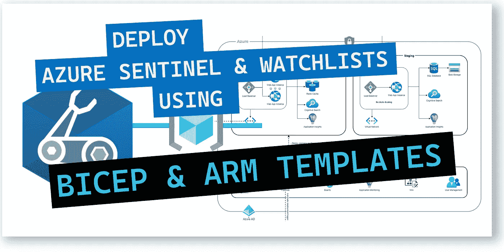
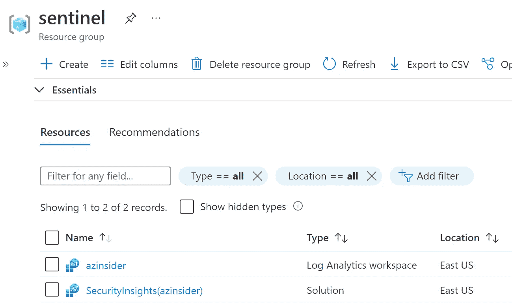
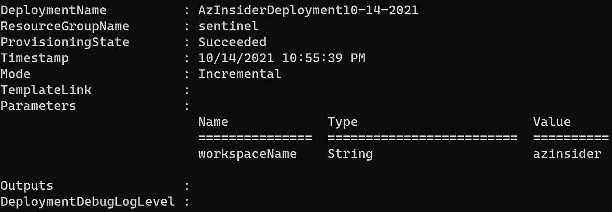
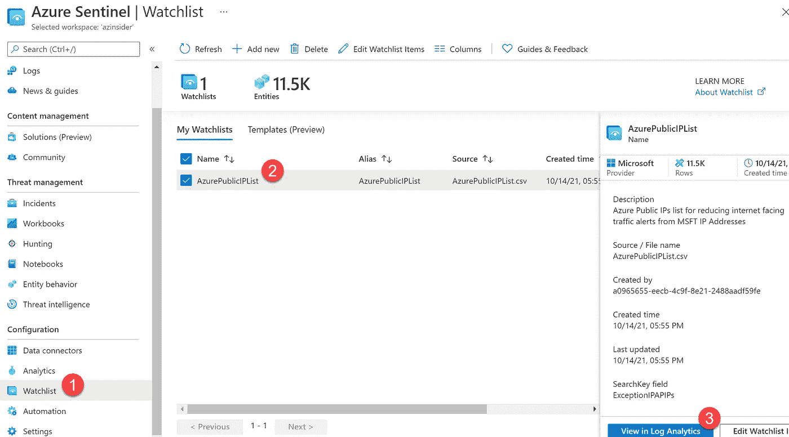
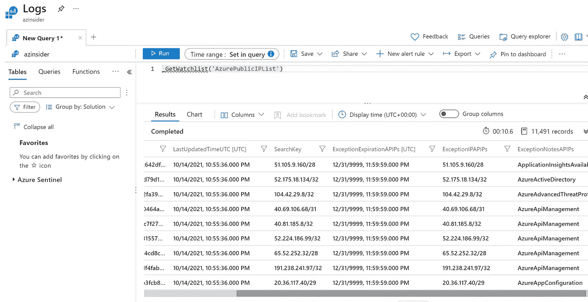

# 💪使用基础设施即代码来部署 Azure Sentinel +观察列表以降低 IP 误报

> 原文：<https://medium.com/codex/using-infrastructure-as-code-to-deploy-azure-sentinel-watchlists-to-lower-ip-false-positives-e78e3adba9f3?source=collection_archive---------2----------------------->

使用此解决方案调查 Azure 环境中的活动。



使用基础设施即代码来部署 Azure Sentinel +观察列表以降低 IP 误报

本文旨在向您展示如何使用基础设施即代码来部署部署 Azure Sentinel 和观察列表所需的资源，以便您可以调查威胁和响应事件。

# 什么是 Azure Sentinel？

**Azure Sentinel 是一个云原生安全信息和事件管理器(SIEM)平台**，它使用内置人工智能来帮助分析整个企业的大量数据，并从多个来源收集数据。它支持开放的标准格式，如 CEF 和系统日志。

Azure Sentinal 是部署在 Azure 中的 PaaS 解决方案；您可以从多个来源收集数据，包括内部数据源或多个云提供商。

要部署此解决方案，您需要一个日志分析工作区。然后，在该工作区上启用 Azure Sentinel。

一旦 Azure Sentinel 启用，您就可以开始使用 Azure 提供的一些连接器连接多个数据源，或者执行手动集成。

现在我们将讨论一下**观察列表**。

# Azure Sentinel 观察列表？🤔

将观察列表视为一个组件，它将帮助您从外部数据源收集数据，以便与 Azure Sentinel 环境中的事件相关联。

通过观察列表，您可以从外部来源构建自己的数据，这些数据可以导入 Azure Sentinel，然后用于与分析或搜索规则相关联。

观察列表可以包含一个详细信息列表，然后转换成 Azure Sentinel 中使用的日志格式。

在以下示例中，我们将执行以下操作:

1.  *使用 Bicep 部署新的日志分析工作区和 Azure Sentinel。*
2.  *部署包含 Azure 公共 IP 列表的 Azure Sentinel 观察列表。*

## 先决条件

*   Azure 订阅和资源组
*   对资源组拥有所有者/参与者权限的用户
*   Bicep 安装在您的本地机器上
*   Azure PowerShell
*   Visual Studio 代码

现在让我们使用 Bicep 部署一个新的日志分析工作区和 Azure Sentinel。

# 1.使用 Bicep 部署新的日志分析工作区和 Azure Sentinel。

我们将使用下面的 Bicep 文件来部署新的日志分析工作区并启用 Azure Sentinel:

我们将使用下面的代码来部署上面的 Bicep 文件:

```
$date = Get-Date -Format "MM-dd-yyyy"
$deploymentName = "AzInsiderDeployment"+"$date"New-AzResourceGroupDeployment -Name $deploymentName -ResourceGroupName sentinel -TemplateFile .\sentinel.bicep
```

部署完成后，您应该会在资源组中看到日志分析工作区和 Sentinel，如下所示:



Azure 日志分析工作区和哨兵

下一步是部署包含 Azure 公共 IP 列表的 Azure Sentinel 观察列表。

# 2.部署包含 Azure 公共 IP 列表的 Azure Sentinel 观察列表

我们将使用以下 ARM 模板执行 Azure Sentinel 观察列表的部署。

上面的 ARM 模板包含列出 Azure 公共 IP 的观察列表。您可以在以下 URL 中找到 Azure IP 范围和服务标签:

[](https://www.microsoft.com/en-us/download/details.aspx?id=56519) [## Azure IP 范围和服务标签-公共云

### Azure IP 范围和服务标签-公共云

Azure IP 范围和服务标签-公共 Cloudwww.microsoft.com](https://www.microsoft.com/en-us/download/details.aspx?id=56519) 

现在，我们将使用下面的命令部署 ARM 模板，并将 Azure Sentinel 所在的相同资源组作为目标:

```
New-AzResourceGroupDeployment -Name $deploymentName -ResourceGroupName sentinel -TemplateFile .\listIP.json
```

在部署期间，您需要传递工作区的名称。下图显示了部署输出:



部署输出

现在你可以导航到 Azure 门户，在 Azure Sentinel 解决方案中，你会看到观察列表。选择 Watchlists 选项，您将看到最近部署的新观察列表。现在，您可以在日志分析中查看它。



Azure 哨兵观察列表

如果您选择“在日志分析中查看”选项，您将查询所有列表，结果将显示在工作区中，如下所示:



Azure 公共 IP 列表

现在，您可以使用此观察列表来降低获得 Azure IP 地址的检测的误报率，或者丰富数据来调查您环境中的活动。

[*在此加入****azin sider****邮箱列表。*](http://eepurl.com/gKmLdf)

*-戴夫·r·*