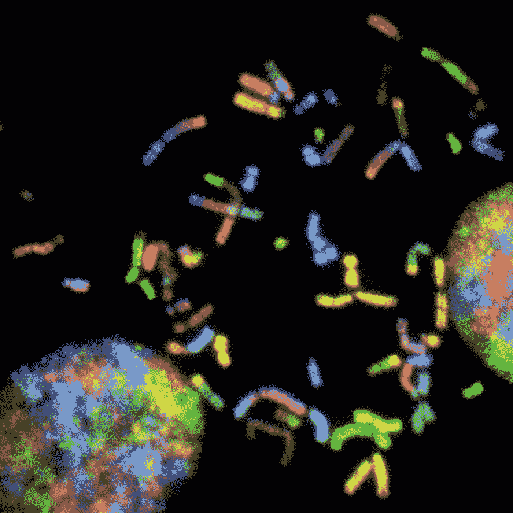

# 使用整合基因组浏览器(IGV)检查基因组杂合性

> 原文：<https://medium.com/codex/using-integrative-genomic-viewer-igv-to-inspect-for-genomic-heterozygosity-c2d7b43097ab?source=collection_archive---------7----------------------->

## 使用这个有用的遗传学工具的指南

[国家癌症研究所](https://unsplash.com/@nci?utm_source=medium&utm_medium=referral)在 [Unsplash](https://unsplash.com?utm_source=medium&utm_medium=referral) 上拍摄的照片

对于从事遗传学研究的科学家来说，有许多有价值的工具。一个这样的工具是[整合基因组浏览器](http://software.broadinstitute.org/software/igv/home)。这个程序有几个功能对查看测序数据的人很有用。我将为一个试图抓住的人讲解一个重点功能…