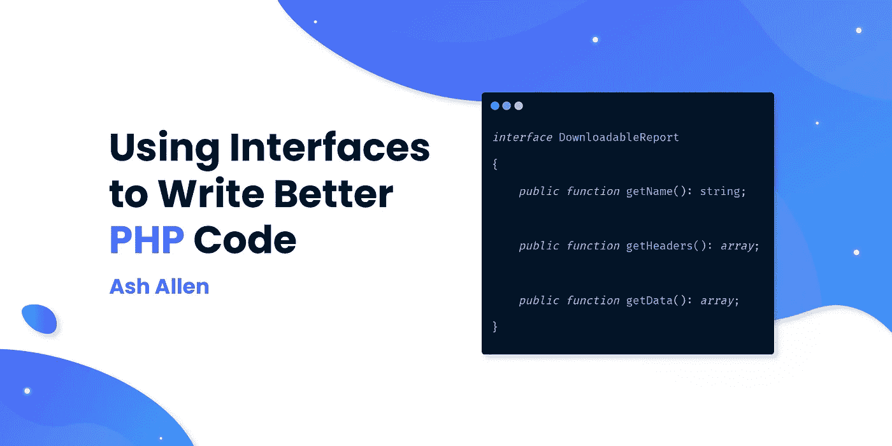

# 使用接口编写更好的 PHP 代码

> 原文：<https://medium.com/codex/using-interfaces-to-write-better-php-code-429f4635421d?source=collection_archive---------2----------------------->



# 介绍

在编程中，确保你的代码可读性、可维护性、可扩展性和易测试性是很重要的。我们可以在代码中改进所有这些因素的方法之一是使用接口。

# 目标受众

本文面向对 OOP(面向对象编程)概念和在 PHP 中使用继承有基本理解的开发人员。如果你知道如何在你的 PHP 代码中使用继承，这篇文章应该是可以理解的。

# 什么是接口？

从根本上来说，接口只是对一个类应该做什么的描述。它们可用于确保实现该接口的任何类都将包含该接口中定义的每个公共方法。

接口**可以是:**

*   用于定义类的公共方法。
*   用于定义类的常数。

接口**不能**是:

*   自行实例化。
*   用于为类定义私有或受保护的方法。
*   用于定义类的属性。

接口用于定义一个类应该包含的公共方法。重要的是要记住，只定义了方法签名，它们不包括方法体(就像你通常在类的方法中看到的那样)。这是因为接口仅用于定义对象之间的通信，而不是像在类中那样定义通信和行为。为了给出一点上下文，这个例子展示了一个定义了几个公共方法的示例接口:

```
interface DownloadableReport
{
    public function getName(): string;

    public function getHeaders(): array;

    public function getData(): array;
}
```

根据 php.net[的说法，接口有两个主要用途:](https://www.php.net/manual/en/language.oop5.interfaces.php)

1.  允许开发人员创建可互换使用的不同类的对象，因为它们实现相同的一个或多个接口。一个常见的例子是多个数据库访问服务、多个支付网关或不同的缓存策略。不同的实现可以交换，而不需要对使用它们的代码进行任何更改。
2.  允许函数或方法接受符合接口的参数并对其进行操作，而不关心对象还可以做什么或如何实现。这些接口通常被命名为 Iterable、Cacheable、Renderable 等等，以描述行为的重要性。

# 在 PHP 中使用接口

接口可能是 OOP(面向对象编程)代码库的无价部分。它们允许我们分离代码并提高可扩展性。举个例子，让我们看看下面这个类:

```
class BlogReport
{
    public function getName(): string
    {
        return 'Blog report';
    }
}
```

正如你所看到的，我们已经用一个返回字符串的方法定义了一个类。通过这样做，我们已经定义了方法的行为，因此我们可以看到`getName()`是如何构建返回的字符串的。然而，假设我们在另一个类的代码中调用这个方法。另一个类不会关心字符串是如何建立的，它只关心字符串是如何返回的。例如，让我们看看如何在另一个类中调用这个方法:

```
class ReportDownloadService
{
    public function downloadPDF(BlogReport $report)
    {
        $name = $report->getName(); // Download the file here...
    }
}
```

尽管上面的代码可以工作，但是让我们想象一下，我们现在想要添加下载包装在`UsersReport`类中的用户报告的功能。当然，我们不能在我们的`ReportDownloadService`中使用现有的方法，因为我们已经强制要求只能传递一个`BlogReport`类。因此，我们必须重命名现有方法，然后添加一个新方法，如下所示:

```
class ReportDownloadService
{
    public function downloadBlogReportPDF(BlogReport $report)
    {
        $name = $report->getName();

        // Download the file here...
    }

    public function downloadUsersReportPDF(UsersReport $report)
    {
        $name = $report->getName();

        // Download the file here...
    }
}
```

虽然您实际上看不到它，但是让我们假设上面的类中的其余方法使用相同的代码来构建下载。我们可以将共享代码提升到方法中，但是我们仍然可能有一些共享代码。除此之外，我们将有多个进入类的入口点，这些入口点运行几乎相同的代码。这可能会在将来尝试扩展代码或添加测试时导致额外的工作。

例如，让我们想象我们创造了一个新的`AnalyticsReport`；我们现在需要向类中添加一个新的`downloadAnalyticsReportPDF()`方法。您可能会看到这个文件开始快速增长。这可能是一个使用界面的完美地方！

让我们从创建一个开始；我们称之为`DownloadableReport`,定义如下:

```
interface DownloadableReport
{
    public function getName(): string;

    public function getHeaders(): array;

    public function getData(): array;
}
```

我们现在可以更新`BlogReport`和`UsersReport`来实现`DownloadableReport`接口，如下例所示。但是请注意，我故意写错了`UsersReport`的代码，这样我就可以演示一些东西了！

```
class BlogReport implements DownloadableReport
{
    public function getName(): string
    {
        return 'Blog report';
    }

    public function getHeaders(): array
    {
        return ['The headers go here'];
    }

    public function getData(): array
    {
        return ['The data for the report is here.'];
    }
}class UsersReport implements DownloadableReport
{
    public function getName()
    {
        return ['Users Report'];
    }

    public function getData(): string
    {
        return 'The data for the report is here.';
    }
}
```

如果我们试图运行我们的代码，我们会因为以下原因而出错:

1.  缺少`getHeaders()`方法。
2.  `getName()`方法不包括在接口的方法签名中定义的返回类型。
3.  `getData()`方法定义了一个返回类型，但它与接口的方法签名中定义的类型不同。

因此，为了更新`UsersReport`以使其正确实现`DownloadableReport`接口，我们可以将其改为:

```
class UsersReport implements DownloadableReport
{
    public function getName(): string
    {
        return 'Users Report';
    }

    public function getHeaders(): array
    {
       return [];
    }

    public function getData(): array
    {
        return ['The data for the report is here.'];
    }
}
```

既然我们的两个报表类都实现了相同的接口，我们可以像这样更新我们的`ReportDownloadService`:

```
class ReportDownloadService
{
    public function downloadReportPDF(DownloadableReport $report)
    {
        $name = $report->getName();

        // Download the file here...
    }
}
```

我们现在可以将一个`UsersReport`或`BlogReport`对象正确无误地传递给`downloadReportPDF()`方法。这是因为我们现在知道报表类上需要的必要方法存在，并且以我们期望的类型返回数据。

作为向方法传递接口而不是类的结果，这允许我们基于方法做什么而不是如何做来松散地耦合 T4 和报告类。

如果我们想要创建一个新的`AnalyticsReport`，我们可以让它实现相同的接口，然后这将允许我们将报告对象传递到相同的`downloadReportPDF()`方法中，而不需要添加任何新的方法。如果您正在构建自己的包或框架，并且希望给予开发人员创建自己的类的能力，这可能特别有用。您可以简单地告诉他们实现哪个接口，然后他们可以创建自己的新类。例如，在 [Laravel](https://laravel.com/docs/8.x/cache#adding-custom-cache-drivers) 中，您可以通过实现`Illuminate\Contracts\Cache\Store`接口来创建自己的自定义缓存驱动程序类。

除了使用接口来改进实际代码之外，我倾向于喜欢接口，因为它们充当了代码即文档的角色。例如，如果我试图弄清楚一个类能做什么和不能做什么，我倾向于在使用它的类之前先看接口。它告诉你所有被调用的方法，而我不需要太关心这些方法是如何运行的。

值得我的 Laravel 开发者读者注意的是，你会经常看到术语“契约”和“接口”互换使用。根据 [Laravel 文档](https://laravel.com/docs/8.x/contracts)，“Laravel 的契约是一组定义框架提供的核心服务的接口”。因此，重要的是要记住契约是一个接口，但是接口不一定是契约。通常，契约只是框架提供的一个接口。要了解更多关于使用合同的信息，我建议阅读一下[文档](https://laravel.com/docs/8.x/contracts),因为我认为它很好地分解了它们是什么，如何使用它们以及何时使用它们。

# 结论

希望通过阅读这篇文章，它能让你对什么是接口、如何在 PHP 中使用接口以及使用接口的好处有一个简单的了解。

对于我的任何 Laravel 开发人员读者，我将在下周写一篇新的博文，向你们展示如何在 Laravel 中使用适配器模式。如果你对此感兴趣，可以在我的网站上[订阅我的时事通讯，这样我发布的时候你就能得到通知。](https://ashallendesign.co.uk/blog)

如果这篇文章对你理解接口有所帮助，我很乐意听到评论。继续建造令人敬畏的东西！🚀

非常感谢[阿迪蒂亚·卡达姆](https://www.linkedin.com/in/aditya-kadam-77a594134/)、[杰·托勒](https://www.linkedin.com/in/jae-toole/)和[汉娜·廷克勒](https://www.linkedin.com/in/hannah-tinkler-28783792/)校对了这篇文章并帮助我改进它！

*最初发表于*[*https://ashallendesign.co.uk*](https://ashallendesign.co.uk/blog/using-interfaces-to-write-better-php-code)*。*