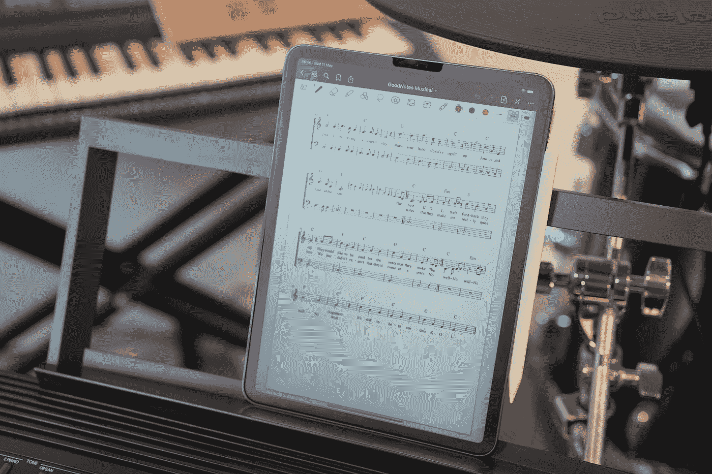
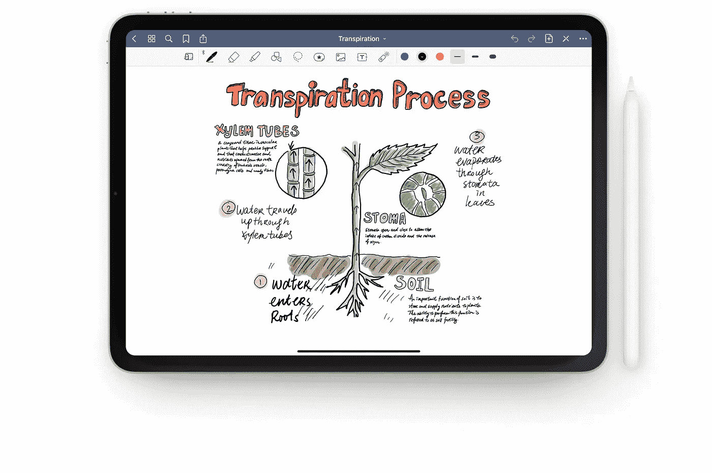
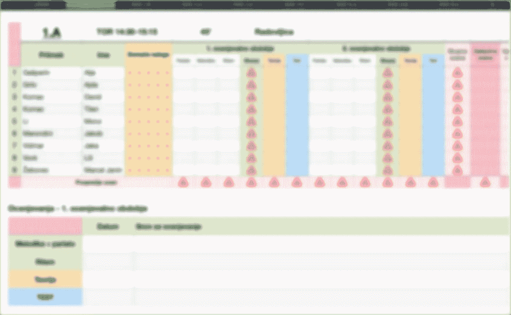
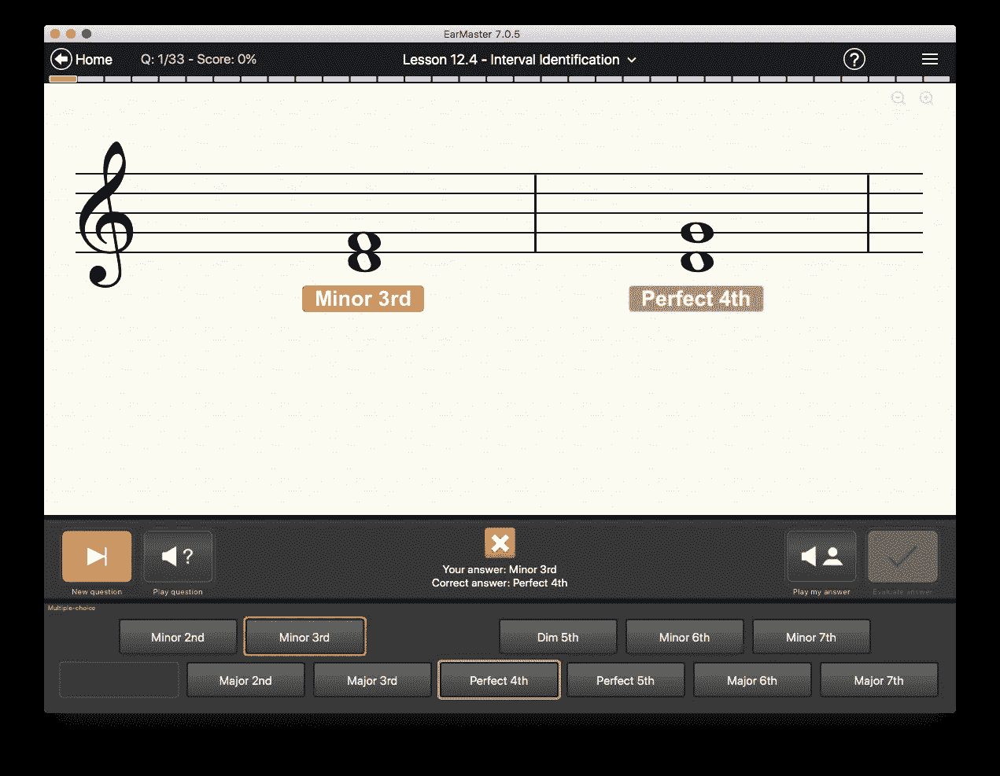

# 在教室里使用 iPad 上音乐课

> 原文：<https://medium.com/codex/using-ipad-in-the-classroom-for-music-lessons-fda68ddf2a5a?source=collection_archive---------20----------------------->

## 我在课堂上使用 iPad 的体验，以及我使用的应用程序和一些有用的技巧。

[GoodNotes](https://unsplash.com/@goodnotes?utm_source=medium&utm_medium=referral) 在 [Unsplash](https://unsplash.com?utm_source=medium&utm_medium=referral) 上拍照

大家好！

> 一年多来，我一直使用配有 Apple Pencil 的 **iPad Air 5** 和 Macbook Air 作为我的主要教学工具。

# 我的教学工具和设置

教授个人乐器有点不同，但我和一群 6 到 16 岁的学生一起工作，所以我需要的不仅仅是一台 iPad。我告诉你，我班上的学生不用 iPads，但是他们有带纸的作业本和音乐笔记本。

通过在教室里作为老师使用 iPad，我的工作变得更加容易和有趣。

> 所有的练习册都是 PDF 格式，使用 AirPlay I screen 可以将它们镜像到一个大的电视屏幕上。

现在我可以用苹果铅笔在练习册上写字，或者打开一张空白的乐谱纸，就像我用粉笔在黑板上写字一样。在学生离开后，拥有一台 Macbook Air 也有助于你的工作。

# 我正在使用哪些应用程序？

## 好笔记

有很多笔记应用程序。我已经尝试了很多，其中许多都有类似的功能，但有一个对我来说很突出。如果有兴趣，我可以写一篇关于这些应用的对比文章。

图片来自 Goodnotes 网站

> 我在课堂上日常使用的最好的应用之一是[**good notes**](https://www.goodnotes.com)**。**

这是我的主要应用程序，用于写“在板上”，在工作簿上，在纸上，或者只是对我想到的任何事情做一些快速笔记。每个班级都有一个文件夹，里面有该年级的 PDF 练习册和用于写作的乐谱纸。这很有用，因为上一课的所有内容都会留在乐谱纸上，学生可以更快地回忆起这些内容。

在根文件夹中，我有两个笔记本，上面有乐谱纸——一个记录旋律，一个记录节奏。

> 作为一名教师，有了这些工具和设置，你会变得更快，这真的很有趣。

在每堂课中，我在标签页中打开需要的文档，并在它们之间快速切换，我们都可以做更多的事情。学生们喜欢它，尽管他们没有 iPads，但不知何故他们对它更感兴趣。

## 苹果数字

> 另一个对我这个老师有用的 app 是 [**数字**](https://www.apple.com/numbers/) 。

是的，苹果的免费应用程序，你可以在那里创建班级学生的完整名单。我扩展了关于学生的(内部)成绩或笔记以及每个班级的月计划的列表。完美满足我的需求，但你可以使用 Excell 应用程序或类似的。

## 耳麦

如果教乐理，没有听觉训练是不行的。对于学生来说，这是一项非常重要的技能。

图片来自 EarMaster 网站

> 一个耳朵训练 app 比如 [**EarMaster**](https://www.earmaster.com) 可以给你和你的学生很大的帮助。

我们用这个应用程序练习音程和和弦识别，学生更有动力。他们可以在家里用这个应用程序练习，这是最大的优势。

不管你用什么 app 进行耳朵训练，我觉得你还是要时不时的用钢琴和学生一起练习音程和和弦。

使用 **Apple Music** 和 **YouTube** 应用上的播放列表搜索视频也很有用。

# 结论

作为一名音乐理论老师，我总是试图找到新的方法与我的学生互动。我没有在这篇文章中涵盖所有的应用程序和技巧，在课堂上使用技术的方式实在太多了。

> 在我看来，有了 iPad，整个教学过程变得更快，作为教师的你也更有效率。

感谢您的阅读。一直很感激。

汤姆(男子名)