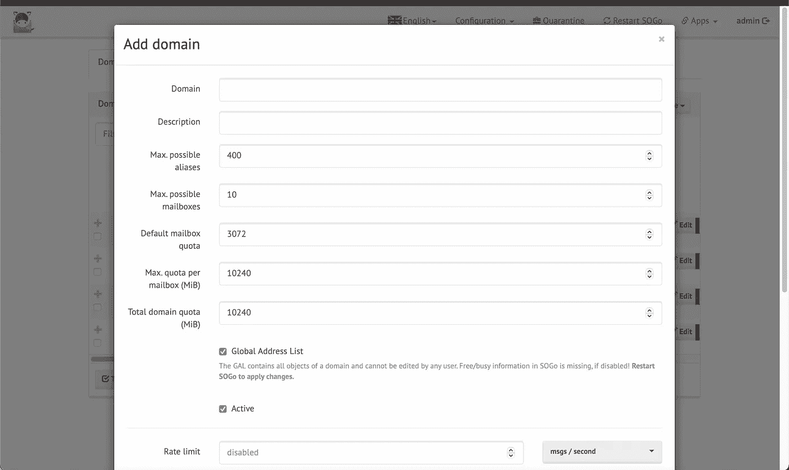
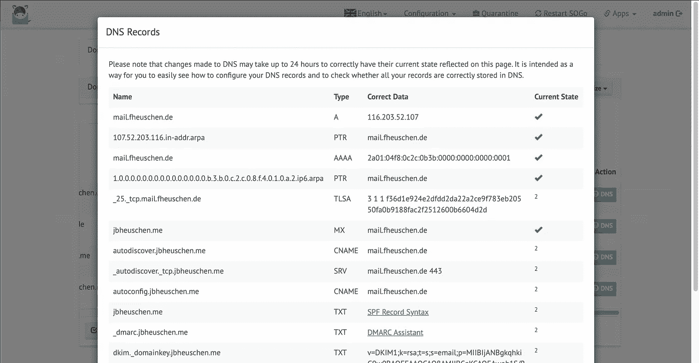
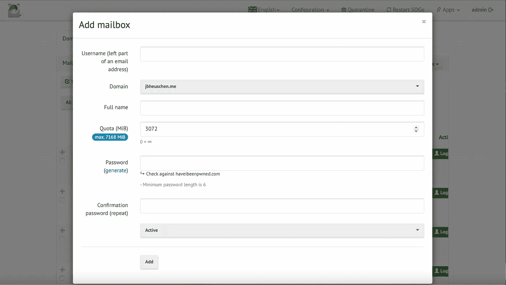
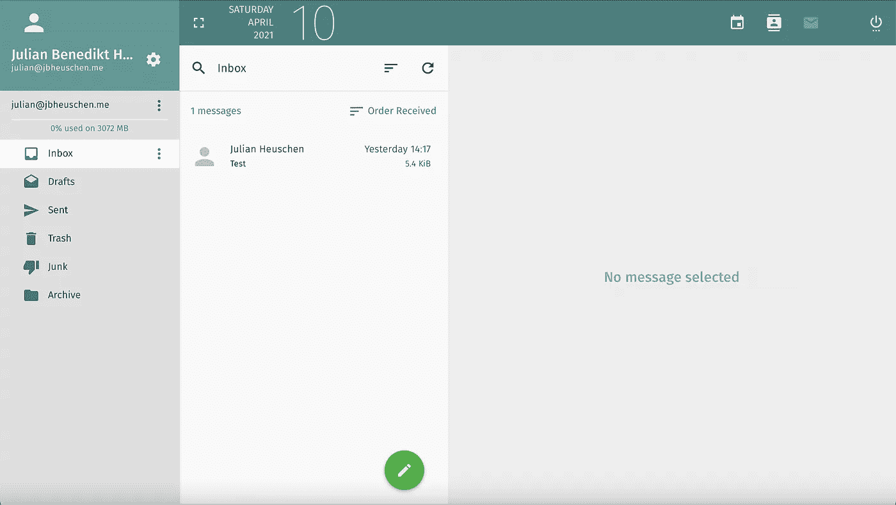
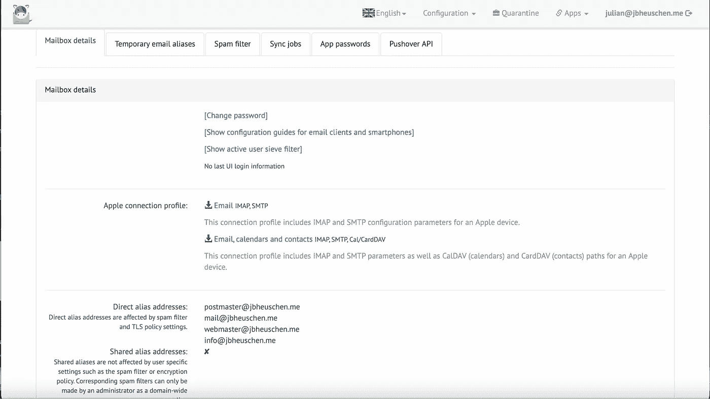

# 使用 Mailcow 作为邮件服务器

> 原文：<https://medium.com/codex/using-mailcow-as-a-mail-server-edfabb050e8?source=collection_archive---------1----------------------->

你听说过 mailcow 吗？我最近买了一个新的域名，想建立一个邮件服务器。在完全自己设置和使用第三方服务之间做出选择，我运行了基于 docker 的邮件服务器套件，名为“ *mailcow* ”。

Mailcow 是一个 dockerized，似乎很容易管理的邮件服务器套件。在这篇文章中，我想写下我使用 Mailcow 的头几个月的经历，并最终得出结论，使用它可能有哪些缺点，以及在我看来是否值得。

# 该装置

首先，我显然必须安装 Mailcow。安装本身实际上非常简单。但是，有几个先决条件:

*   你需要安装 Docker 和 Docker Compose(如他们各自的网站所述)
*   由于 Mailcow 附带了一个完全集成的群件，它有时会占用大量资源。不过，这些组件中有许多是可以禁用的，对于普通用户来说并不是真正必要的。

记住这些，我们可以通过克隆 mailcow-dockerized 的 git 存储库来开始安装(记住要为此使用合适的目录——我个人使用的是 */opt/mailcow-dockerized/* ):

```
# git clone [https://github.com/mailcow/mailcow-dockerized](https://github.com/mailcow/mailcow-dockerized) && cd mailcow-dockerized/
```

克隆完成后，我们可以运行包含的 *generate_config.sh* 脚本，以交互方式生成必要的配置文件。最后，我们可以像启动任何其他 docker compose 项目一样启动 mailcow。也就是说，我们运行:

```
# docker-compose pull && docker-compose up -d
```

现在，您应该能够通过导航到您在配置生成过程中指定的主机名来访问 Mailcow 的 web 界面。在我的例子中，我创建了一个`mail`子域。您应该能够使用凭证`admin / moohoo`登录(并随后更改这些凭证)。

## 设置域



添加域

更改密码后，您的第一个操作可能是添加您的域。这可以在*配置→邮件设置→域→添加域*中完成，只需填写您的 FQDN 即可——以后一切都可以更改。一旦你完成了这些，你就可以打开 DNS 对话框来查看 Mailcow 建议你创建/修改的 DNS 记录。就我而言，我已经自己创建了其中的大部分。**请记住:根据您的 TTL，您的记录可能需要一段时间才能在全球范围内可用，因此您可以发送和接收邮件！**



我的邮箱建议的 DNS 记录

创建了所有必要的记录后，我还想使用 *DKIM* 。为此，我必须导航到*配置→配置&细节→配置→ ARC/DKIM 密钥*并为各自的域生成一个密钥。一旦你生成了密钥，回到前面提到的 DNS 记录对话框；现在应该可以看到一个`dkim._domainkey.yourdomain`记录(TXT)。一旦你创建了这个记录， *DKIM* 就应该工作了。

## 设置邮箱



添加新邮箱

我的下一步是开始设置邮箱。这和添加域一样简单，可以在*配置→邮件设置→邮箱→添加邮箱中完成。*接下来的对话要求您输入用户名(即电子邮件地址的左边部分)和密码。如果您有多个域名，请确保选择正确的域名！

## 发送和接收邮件



SOGo 群件为您提供了一个网络邮件系统

到目前为止，我们已经可以开始收发邮件了。你可以直接使用 *SMTP/IMAP* 或者使用内置的群件 *SOGo* 来实现。由于前者可能是不言自明的(只需使用 Mailcow 的主机名作为*SMTP*&*IMAP*服务器)，在这一点上我将采用第二种方法。您可以在`https://{MAILCOW_HOSTNAME}/SOGo`访问您的 Mailcow 的 *SOGo* 实例，并使用您刚刚选择的用户名和密码登录。顺便说一下，SOGo 也为你提供了可同步的日历和联系人管理。此外， *SOGo* 支持 ***ActiveSync*** —也就是说，您可以将您的邮件帐户添加为 Exchange 帐户，从而获得即时推送通知！



从用户的角度看 mailcow 用户界面

最后但同样重要的是，不仅管理员可以登录到 *mailcow UI* (您刚刚添加邮箱的那个)。用户也可以随后为自己创建临时别名、查看隔离邮件、更改密码或调整垃圾邮件过滤器的敏感度。此外，mailcow 允许 iOS/macOS 用户下载一个 ***配置描述文件，*** 自动设置他们的帐户。

# 管理功能

我发现 mailcow 最棒的一点是我们提供了大量的管理功能。其中包括:

*   别名、临时别名和域别名
*   资源(例如，您可以将物理房间作为资源进行管理，邀请它参加日历活动，从而查看它的使用情况等。)
*   同步作业
*   过滤器和地址重写(不是 Mailcow 独有的，但是非常容易管理)
*   多个管理用户，以及特定于域的管理帐户
*   一个扩展的 REST API
*   oauth 2-支持
*   自动 SSL 证书生成和续订

# 更新 Mailcow

我们所有人的一个共同任务是保持事物的最新状态。使用 mailcow，我们可以很容易地做到这一点，只需转到我们的 mailcow 目录并运行:

```
# ./update.sh
```

该脚本将更新配置文件和所有 docker 容器(有时可能需要很长时间)。有时，更新脚本本身已经改变，这将要求您运行它两次(但是，它会要求您这样做)。重要的文件已经提前备份了。

# 在低内存环境中使用 Mailcow

我曾经在一个只有 2GB 内存的开发服务器上安装了 mailcow，随后就遇到了 mailcow 内存不足的问题。在这种情况下，您可以通过禁用 *mailcow.conf* 文件中的 *ClamAV* 和 *Solr* 来大幅减少 mailcow 的 RAM 使用，而不会影响其大部分功能:

```
SKIP_CLAMD=y
SKIP_SOLR=y
```

通过 docker compose 重新启动 mailcow 后，它应该使用更少的内存。

# 我的经历

我已经使用 mailcow 大约一年半了，我对它非常满意。我一直在为我自己和我的家人使用它，我没有遇到任何明显的困难或问题。它非常适合我的用例。

此外，我认为非常积极的一点是，mailcow 不仅得到了维护，而且得到了积极的扩展和发展。当我回想并比较我大约一年前安装的套件和今天的安装时，其间有许多新引入的功能。此外，配置非常简单:大多数事情可以使用管理 web 界面立即完成——大多数其他事情可以通过中央`mailcow.conf`配置文件完成。

## 不足之处

在我看来，最大的缺点就是套件太泛。大多数功能我从未使用过。例如，mailcow 带有一个 XMPP 消息服务器，或者一个设备齐全的群件。虽然肯定有这样的用例，但我们大多数人可能不会经常使用它们。但是，这些服务中有许多可以通过配置文件手动禁用。作为一名开发人员，经常困扰我的一件事是 REST API 没有得到很好的记录。不过，我不得不承认，随着[文档](https://mailcow.docs.apiary.io/#)的开发，这已经变得更好了。

# 我的裁决

我认为 Mailcow 是一个很棒的邮件服务器套件，尽管并不适合所有人。对于像我这样不关注邮件服务器管理的人来说，mailcow 是拥有自己的、功能齐全的邮件服务器的一个非常好的方式，而不必花费大量的时间来微调它的配置。还有一个你可以获得支持的社区。不过，我认为，我们当中也有一些人更愿意“手动”配置他们的服务器，并对他们的系统拥有绝对的控制权。虽然使用 mailcow 也可以做到这一点，但在这种情况下，不使用 mailcow 可能更容易。