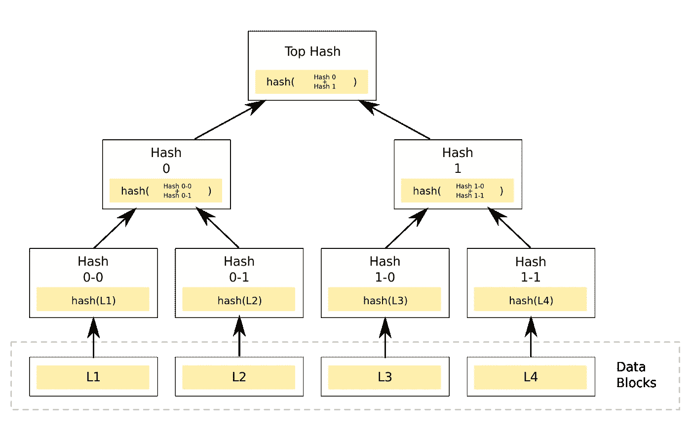

# 将 Merkle 树用于智能合约

> 原文：<https://medium.com/codex/using-merkle-trees-for-smart-contracts-24ccf6f75a0a?source=collection_archive---------2----------------------->

实施 NFT 白名单的安全而简单的方法。


照片由 [niko photos](https://unsplash.com/@niko_photos?utm_source=unsplash&utm_medium=referral&utm_content=creditCopyText) 在 [Unsplash](https://unsplash.com/s/photos/tree?utm_source=unsplash&utm_medium=referral&utm_content=creditCopyText) 上拍摄

Merkle 证明经常被用在 NFT 合约中，这些合约有某种白名单的特征。我不是它的超级粉丝，因为它也需要链外代码。但即使有了链外代码，这也是防止僵尸程序或非白名单地址制造令牌的一个非常好的方法。

那么什么是 Merkle 证明，Merkle 树，外链代码做什么，内链代码做什么？让我们来看看这篇文章。

# 什么是 Merkle 树？

Merkle trees，顾名思义，是一种树状结构，其中每个节点都标有一些数据的散列。最底层的节点称为**叶。**

需要散列的数据有多少，就有多少叶子。叶节点和根节点之间的节点由它下面的节点的连接散列决定。听起来很多，但是让我们看看下面的图像。



一棵大树。图片取自[此处](/@ItsCuzzo/using-merkle-trees-for-nft-whitelists-523b58ada3f9)。

现在我们大致知道了 Merkle 树是什么，我们可以开始实现它了。

# 服务器端代码

我们的离线程序将简单地散列几个假以太坊地址，这样我们就可以在我们将要编写的智能契约中检查它们的有效性。我将编写一个简单的 NodeJS 程序，该程序将记录相关的哈希，我将使用 Remix 将其复制粘贴到智能合约的函数调用中。

让我们从初始化项目并安装 Merkle tree 实现所需的正确包开始。

```
npm init -y
npm i merkletreejs
npm i keccak256
```

这样，我们可以很容易地创建一个 Merkle 树。我列了一个小清单，上面有 7 个我随机挑选的以太坊地址。然后使用`keccak256`，我创建了一个名为`leaves`的新列表，其中包含每个地址的`keccak256`散列。

有了这个列表，我们就可以用树叶和`keccak256`函数作为参数创建一个新的`MerkleTree`。

这样，当您运行`node index.js`时，我们在控制台中就有了打印机 Merkle 树及其根散列。

## Merkle 证明

现在我们有了根散列、树和树叶，我们可以验证给定的散列是否是树的一部分，因此是有效的。在现实世界的应用程序中，您可以从前端获取用户的地址。我们只需从列表中获取一个。

接下来，我们使用`keccak256`散列地址，并使用`getHexProof()`检索证明。该证明随后与交易一起被发送到智能合约。

如果我们真的想的话，我们也可以在后台验证它。它对于白名单应用程序没有用，但是知道它是如何工作的还是有好处的，因为我们将在智能合约中做一些类似的事情。

现在让我们启动 Remix 并创建一个智能契约来为我们做这件事。

# 智能合同

智能契约将简单地做与最后一段中的最终代码片段相同的事情。它将使用另一个库中的一个简单函数来验证叶子和根散列的证明。

我们用 OpenZeppelin 的合同来帮助验证 Merkle 的证据。在生产环境中，一定要有一个设置根的功能，如果您的后端不知何故失败了，就禁用对有效证明的检查。

# 结论

本质上就是这样。我们已经讨论了如何创建一棵 Merkle 树，如何为一片叶子创建一个证明，以及如何验证证明的有效性。有了这个，你可以简单地使用公共地址而不是像我一样的随机列表来创建一个白名单智能契约。

**非常感谢你的阅读，祝你有美好的一天。**

[支持我支持 Medium 成为会员](https://mbvissers.medium.com/membership)。它帮了我很大的忙，它不会额外花费你，你可以阅读尽可能多的中等文章！

在 [Twitter](https://twitter.com/0xmbvissers) 和 [gm.xyz](https://gm.xyz/u/mbvissers.eth) 关注我。

在这里查看我是[的开发人员的项目](https://kangaroomob.io/)。

在 Polygon 上查看我最新的 [NFT 收藏](https://www.pixel-pizzas.com/)。