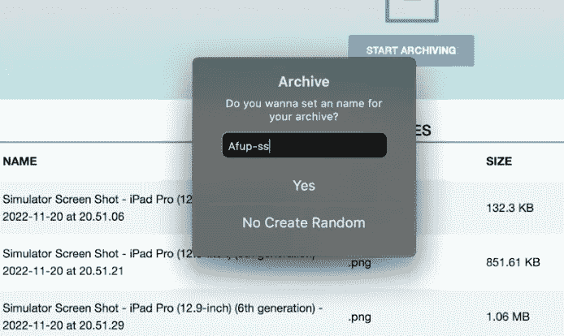
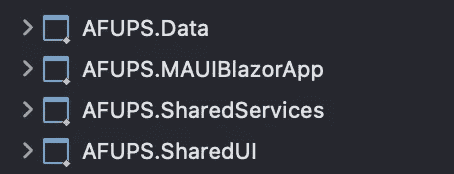
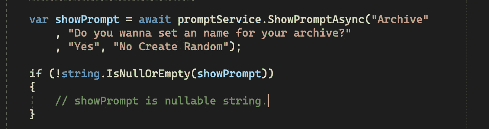
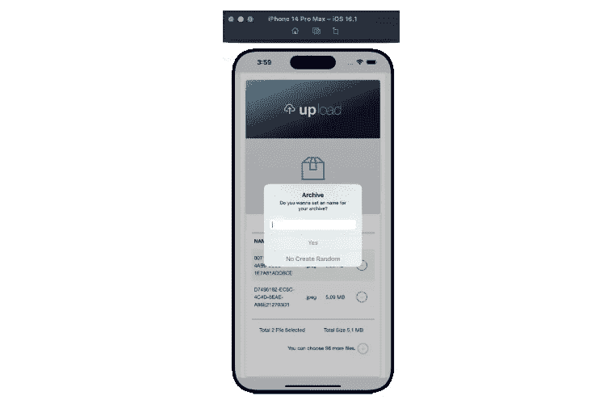

# 使用本机提示。网毛伊岛 Blazor

> 原文：<https://medium.com/codex/using-native-prompt-with-net-maui-blazor-f91fdfb6aa4b?source=collection_archive---------8----------------------->


。NET MAUI Blazor 本机提示

大家好，欢迎来到这个短片，但我认为它会对你有用。我将展示在开发跨平台的应用程序时，我们如何以简单的方式使用警告和提示。

这就是我们努力实现的目标:



[AFUP 档案馆名称](/codex/i-published-the-application-i-developed-with-net-maui-blazor-aedc2655f410)

首先，我们需要创建一个使用所有平台的接口，命名为:IPromptService

我们特别使用接口的另一个原因是，如果我们愿意，我们可以在不改变代码的情况下，使用共享 ui 将其转换为 web 应用程序。
当您将共享 ui 集成到 web 应用程序中时，您所要做的就是重写服务，您的应用程序将不会出现问题，因为它将使用相同的接口。

```
 public interface IPromptService
    {
        Task ShowAlertAsync(string title, string message, string cancel = "OK");
        Task<bool> ShowConfirmationAsync(string title, string message, string accept = "Yes", string cancel = "No");
        Task<string> ShowPromptAsync(string title, string message, string accept = "Yes", string cancel = "No");

        void ShowAlert(string title, string message, string cancel = "OK");
        void ShowConfirmation(string title, string message, Action<bool> callback,
                              string accept = "Yes", string cancel = "No");
    }
```

现在我们已经创建了我们的接口，让我们用它在**毛伊岛**项目中创建一个类。

我特别提到毛伊岛项目，以防你像我一样有一个支离破碎的结构。



之所以在这里，是因为我们实际上将使用 Xamarin，此时我们将使用 [Xamarin](https://dotnet.microsoft.com/en-us/apps/xamarin) 运行警报。

```
 public class PromptService : IPromptService
    {
        // ----- async calls (use with "await" - MUST BE ON DISPATCHER THREAD) -----

        public Task ShowAlertAsync(string title, string message, string cancel = "OK")
        {
            return Application.Current.MainPage.DisplayAlert(title, message, cancel);
        }

        public Task<bool> ShowConfirmationAsync(string title, string message, string accept = "Yes", string cancel = "No")
        {
            return Application.Current.MainPage.DisplayAlert(title, message, accept, cancel);
        }

        public Task<string> ShowPromptAsync(string title, string message, string accept = "Yes", string cancel = "No")
        {
            return Application.Current.MainPage.DisplayPromptAsync(title, message, accept, cancel,maxLength:100);
        }

        // ----- "Fire and forget" calls -----

        /// <summary>
        /// "Fire and forget". Method returns BEFORE showing alert.
        /// </summary>
        public void ShowAlert(string title, string message, string cancel = "OK")
        {
            Application.Current.MainPage.Dispatcher.Dispatch(async () =>
                await ShowAlertAsync(title, message, cancel)
            );
        }

        /// <summary>
        /// "Fire and forget". Method returns BEFORE showing alert.
        /// </summary>
        /// <param name="callback">Action to perform afterwards.</param>
        public void ShowConfirmation(string title, string message, Action<bool> callback,
                                     string accept = "Yes", string cancel = "No")
        {
            Application.Current.MainPage.Dispatcher.Dispatch(async () =>
            {
                bool answer = await ShowConfirmationAsync(title, message, accept, cancel);
                callback(answer);
            });
        }
    }
```

有了我们创建的接口提供的类，我们现在可以在我们想要的项目中使用 alert 和 prompt，并根据返回编写逻辑。

当然，在 MauiProgram.cs 中定义我们的服务也很重要。

```
 builder.Services.AddSingleton<IPromptService, PromptService>();
```

现在我们可以以两种方式使用这项服务。
我们可以从页面或组件的代码后面添加它。或者我们可以使用 [@code](http://twitter.com/code) 和 razor 直接添加到 razor 文件中。
我将通过代码后面其实都一样。

我去了。我想打印提示的组件的 cs 文件&我正在注入我们的提示服务。

```
 [Inject]
    private IPromptService promptService { get; set; }
```

现在，我可以通过调用 ShowPromptAsync 方法在屏幕上显示提示，只要我希望提示出现在任何地方。



[AFUP 毛伊岛 ISO 档案馆](/codex/i-published-the-application-i-developed-with-net-maui-blazor-aedc2655f410)

无需做任何额外的调整就可以在 iOS、Android、MAC 和 windows 上流畅运行。如果你按照我描述的顺序进行，你不会有任何问题。

请随意留下反馈。
后会有期。