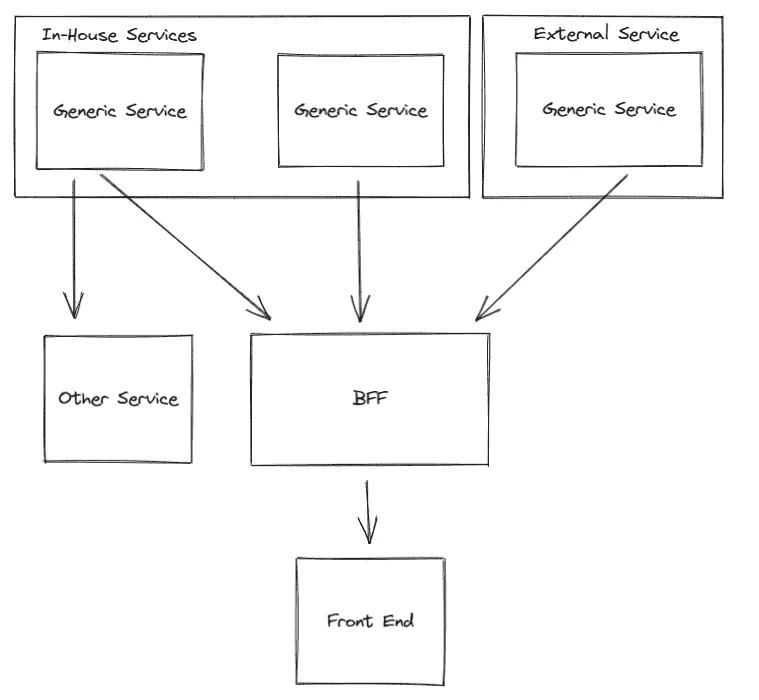
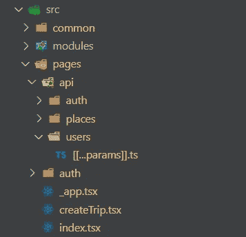

# 使用 NextJS API 路由作为 BFF

> 原文：<https://medium.com/codex/using-nextjs-api-routes-as-a-bff-4c5065d2dbae?source=collection_archive---------4----------------------->

## NextJS API 路由如何作为开箱即用的 BFF 工作


由 [Ales Nesetril](https://unsplash.com/@alesnesetril?utm_source=medium&utm_medium=referral) 在 [Unsplash](https://unsplash.com?utm_source=medium&utm_medium=referral) 上拍摄的照片

## 什么是 NextJS

NextJS 是一个非常受欢迎的 React web 框架，它允许开箱即用的服务器端呈现和静态站点生成，以及一套固执己见的设置和工具，如“*和“*动态导入”*。其中一个特性是“[*API routes*](https://nextjs.org/docs/api-routes/introduction)*”*，自动公开 API 文件夹下的文件作为端点。文档对该功能的描述如下:*

```
*Any file inside the folder pages/api is mapped to /api/* and will be treated as an API endpoint instead of a page. They are server-side only bundles and won't increase your client-side bundle size.*
```

## *什么是 BFF 架构设计模式*

*BFF 或“后端对前端”架构模式涉及创建一个指定的后端服务，该服务具有一个接口或一组指定给特定前端服务的契约。[微软在他们的“云架构”系列](https://docs.microsoft.com/en-us/azure/architecture/patterns/backends-for-frontends)中对此模式有很好的描述。*

*[这有许多风格和变化，Sam Newman 在他的文章《谈论模式》中概述了其中一些。出于实现的目的，我们将引用一个单独的 BFF，它为 NextJS 前端提供了一个接口。](https://samnewman.io/patterns/architectural/bff/)*

**

*使用 NextJS 的 BFF 模式的服务交互示例图*

## *利用 API 路由创建 BFF*

*如前所述，默认情况下，NextJS 有一种自以为是的方式来创建 API 路由和前端代码。下面是一个 NextJS 如何构建其前端和 API 路由的例子。*

**

*API 路由与前端路由共存的示例*

*在本例中，API 路由映射如下:*

*   *https://{some-host:api-port}com/users/{id}*

*前端路由是这样的:*

*   *[https://{ some-host:frontend-port }。com/](https://{some-host}.com/users/{id})*
*   *[https://{ some-host:frontend-port }。com/c](https://{some-host}.com/users/{id}) reateTrip*

*这样，我们就能够使用某种形式的 HTTP 客户端(如 Fetch 或 Axios)向 BFF 发出请求，在 BFF 中，我们将拥有执行以下任务的端点:*

*   ***数据转换:**BFF 可以调用一些服务，并对响应数据进行转换，使其适合前端。*
*   ***集成多个服务:**BFF 能够将许多不同的服务编排在一起，即使它们位于不同的服务边界内。它可以用来与 Stripe 或 MailChimp 等公共 API 集成，并将这些 API 与可能的内部服务交织在一起。*
*   ***缓存:**为了防止过度调用服务，可以专门为 BFF 建立中间缓存，并根据前端的需求定制它们的设置。*
*   ***统一错误处理:**由于 BFF 是前端使用的唯一接口，我们可以提供一种统一的方式来处理和形成前端将使用的错误代码，允许我们操纵或丰富服务可能返回的现有错误，使其成为前端可以轻松解析的内容。*
*   ***认证:**BFF 可以提供和控制 JWT 令牌生命周期的端点，并进一步使用它们来保护某些 API 路由，还可以将令牌代理给其他服务，或者只是控制前端的认证流。*

*虽然这些好处可以通过 BFF 模式单独实现，但是 NextJS 允许在新的或现有的项目中建立 BFF 的一种方便有效的方式。此外，它确实在模式之上提供了额外的好处，因为它们协同工作。*

## *共享代码和类型*

*在前端和 BFF 之间共享代码的好处是，您可以跨两个系统重用代码和类型。这意味着您能够在两个服务之间拥有类型安全和稳定的契约，因为 BFF 是前端将与之交互的唯一接口。当在两个包含某些常用类型的服务之间创建请求和响应时，这非常方便。*

*虽然这在服务之间引入了紧密耦合，但是由于这种模式的本质，它实际上对我们是有益的。*

## *较少的部署*

*由于服务共同存在于同一个 NextJS 代码库中，所以可以以垂直方式跨整个堆栈进行更改，并且只需要一次部署。这也减少了维护项目所需的 IaaC 的数量，并且应该使实施和维护 CI/CD 实践更加有效。*

## *结论*

*BFF 模式强大而灵活。它可以被设计成几种不同的变体，并为前端开发提供一个精简和集中的接口。NextJS 正在成为一个越来越受欢迎的 React web 框架，通过其预打包的 API 路由，开发人员可以轻松地为他们的前端创建和维护一个强大的 BFF 服务。*