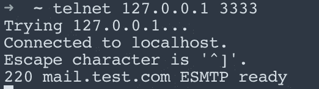
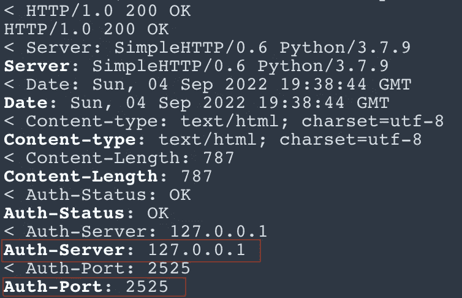
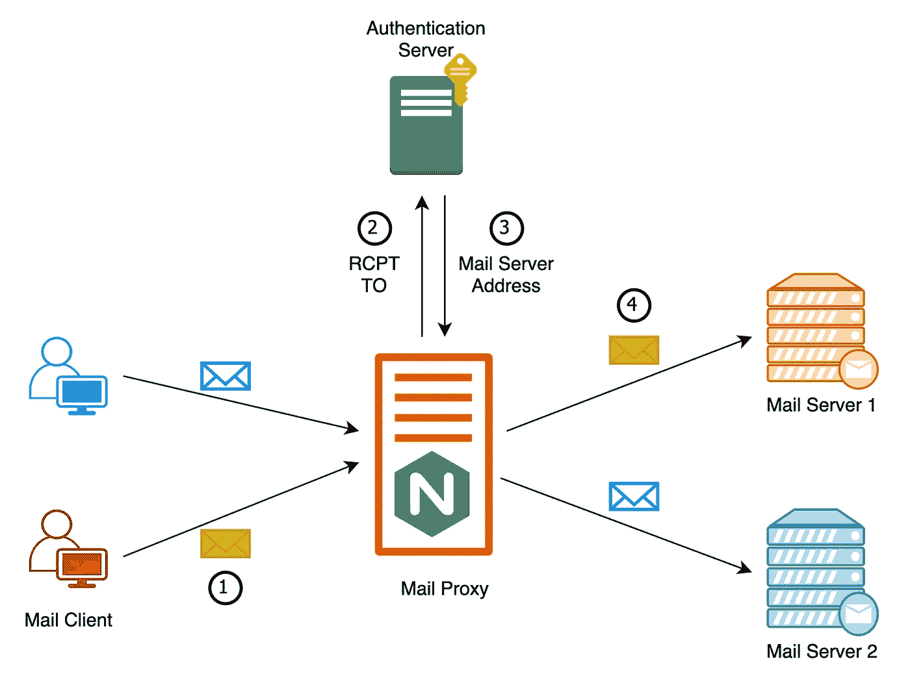
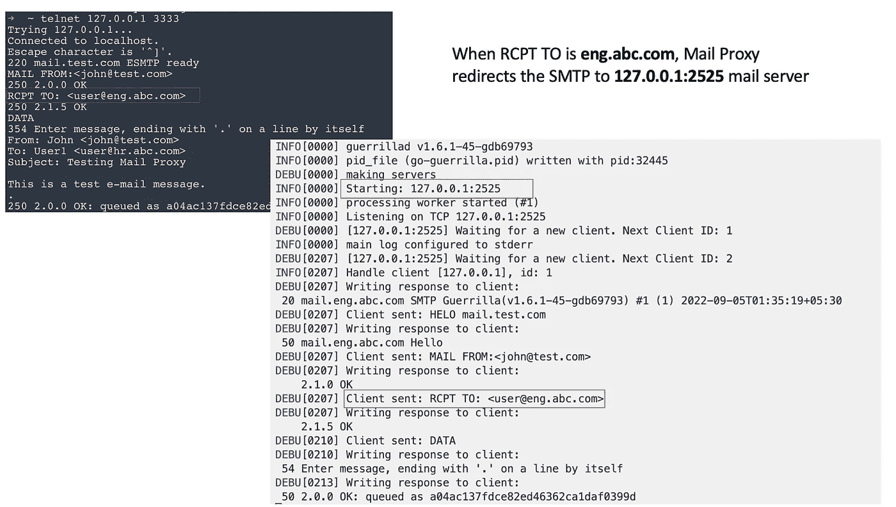
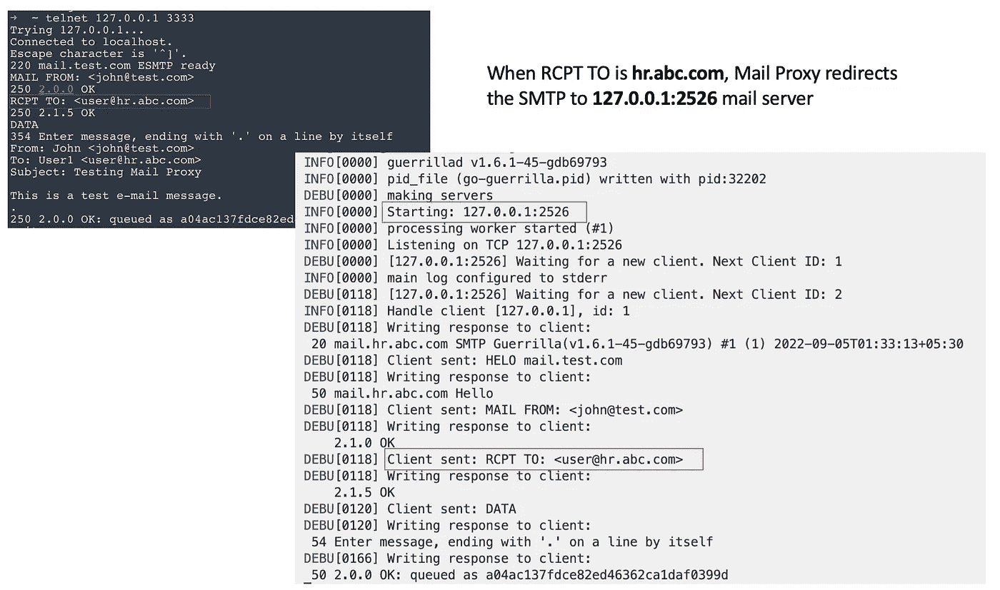

# NGINX 作为邮件代理服务器:初学者指南

> 原文：<https://medium.com/codex/using-nginx-as-mail-proxy-server-a-beginners-guide-a862f45f5013?source=collection_archive---------1----------------------->


蜜琪拉·威登霍夫在 [Unsplash](https://unsplash.com?utm_source=medium&utm_medium=referral) 上拍摄的照片

让我们先来看看 SMTP 代理服务器的定义。

> [**SMTP 代理**](https://en.wikipedia.org/wiki/SMTP_proxy) 是专门的邮件传输代理(MTA)，与其他类型的代理服务器类似，它将 SMTP 会话传递给其他 MTA，而不使用典型 MTA 的存储转发方法。当 SMTP 代理收到连接时，它会启动另一个到目标 MTA 的 SMTP 会话。来自目的地 MTA 的任何错误或状态信息都将通过代理传回发送 MTA

在这篇博客中，我们将配置和使用 NGINX 作为邮件代理服务器。 [**NGINX 邮件代理**](https://docs.nginx.com/nginx/admin-guide/mail-proxy/mail-proxy/) 支持 SMTP、IMAP 和 POP3 协议，可以将电子邮件客户端流量代理到其中一个上游邮件服务器。它带来了几个优点，比如容易扩展邮件服务器，以及根据一些规则(比如收件人地址)在邮件服务器之间分配负载。

> 按照本指南安装 [NGINX](https://docs.nginx.com/nginx/admin-guide/installing-nginx/installing-nginx-open-source/)

**配置 SMTP 邮件代理服务器**

让我们从 NGINX [配置](https://docs.nginx.com/nginx/admin-guide/mail-proxy/mail-proxy/#configuring-smtpimappop3-mail-proxy-servers)文件开始。

```
mail {
    server_name mail.test.com;
    auth_http   http://127.0.0.1:8000;
    # disabling [xclient command](https://nginx.org/en/docs/mail/ngx_mail_proxy_module.html)
    xclient off; server {
        listen     3333;
        protocol   smtp;
        smtp_auth  none;
    }
}
```

**服务器名称**:邮件服务器的名称

**auth_http** : HTTP 认证服务器，用于根据一些规则重定向请求(我们将在下一节详细讨论)。

**服务器:**运行在 127.0.0.1:3333 上的代理邮件服务器。我们没有对我们的服务器使用任何身份验证(SMTP auth 是 none)。

让我们通过 telnet 到端口 **3333** 上的 **127.0.0.1** 来验证代理邮件服务器。



连接到邮件代理

**设置认证服务器**

代理服务器在收到来自客户端的请求时，向 HTTP 服务器请求认证(在我们的示例中没有认证)。认证成功后，它会根据规则返回邮件服务器的 IP 地址和端口。

```
HTTP/1.0 200 OK
Auth-Status: OK
Auth-Server: <host> # the server name or IP address of the upstream server that will used for mail processing
Auth-Port: <port> # the port of the upstream server
```

下面是一个简单的 python 认证服务器，它使用**收件人地址**规则来选择邮件服务器。收件人地址在标题 **Auth-SMTP-To** 中发送。代理还发送其他与身份验证相关的重要消息头，这超出了本例的范围。你可以在这里阅读详细的。

*注意:我们在端口****2525****和****2526****上运行两个本地* ***邮件服务器*** *，用于接受邮件代理重定向的流量。我正在使用*[*go-guerrilla*](https://github.com/flashmob/go-guerrilla)，一个 *ny 邮件服务器将完成这项工作。*

在本例中，如果接收者是**eng.abc.com**，我们将流量重定向到 **127.0.0.1:2525** ，如果接收者是**hr.abc.com**，则将流量重定向到 **127.0.0.1:2526**

在继续之前，让我们验证一下身份验证服务器。

*curl-vvv-H " Auth-SMTP-To:RCPT To:<foo@eng.abc.com>"-I http://localhost:8000*



收件人 eng.abc.com 的验证服务器响应

**工作流程示例**



NGINX 邮件代理流程

1.  邮件客户端向 NGINX 邮件代理服务器发送 SMTP 请求。
2.  邮件代理将客户机请求和类似于 **Auth-SMTP-To 的头一起发送给认证服务器。**
3.  认证服务器基于收件人地址规则决定要连接的上游邮件服务器，并在响应报头中返回**邮件服务器 IP** 和**端口**。
4.  邮件代理将客户端的请求重定向到适当的邮件服务器。

让我们看一个端到端的例子来理解完整的流程。

在第一个例子中，user@eng.abc.com 的 RCPT 是*，因此邮件代理将流量重定向到 *127.0.0.1:2525* 邮件服务器。*

**

*当 RCPT 到 eng.abc.com 是**时**，交通被重定向到 **127.0.0.1:2525***

*在第二个例子中，user@hr.abc.com 是 RCPT，所以邮件代理将流量重定向到邮件服务器。*

**

*当 RCPT 到达 hr.abc.com**时**，交通被重定向到 **127.0.0.1:2526***

*我试图展示一个基本的端到端流程来开始。希望这对你有帮助。感谢您的时间:-)*