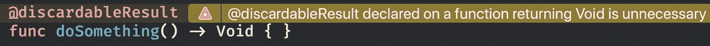

# 将可选的贴图与空函数一起使用

> 原文：<https://medium.com/codex/using-optional-map-with-void-functions-2c758f5cbf19?source=collection_archive---------4----------------------->

许多 swift 开发人员都知道，任何没有明确指定返回类型的函数都将返回`Void`。

通常，忽略返回类型会产生以下警告:


忽略函数的返回类型

然而，对于返回`Void`的函数来说就不是这样了(否则我们会到处都是警告！)使用`@discardableResult`注释时，这一点变得很明显:



默认情况下，可以放弃无效结果

这最终意味着以下两个函数是等价的:

```
func doSomething() -> Void {
    ...
}func doSomething() { 
    ...
}
```

另一个有趣的事实是`Void?`也不会产生任何警告。这对于可选链接是必要的，因为可选链接的`Void`功能是`Void?`。如果不是这种情况，下面将出现一个错误:

```
let myType: MyType? = MyType()myType?.doSomething()
```

`Void`的这些特性结合起来提供了`Optional.map(_:)`的一种不寻常但却很方便的用法。当我们检查`map`函数时，我们看到返回类型与`transform`闭包的返回类型相同，只是包装在一个`Optional`中。

```
func map<U>(_ transform: (Wrapped) throws -> U) rethrows -> U?
```

我们知道，如果 transform 函数返回`Void`，那么`map`将返回`Void?`，可以安全地忽略它。因此，下面的代码完全有效，并且不显示任何警告:

```
func doSomething(_ message: String) {
    ...
}let message: String? = "Hello, World!"message.map(doSomething)
```

这比如下所示的替代方案节省了几行代码:

```
func doSomething(_ message: String) {
    ...
}let message: String? = "Hello, World!"if let message = message {
    doSomething(value: message)
}
```