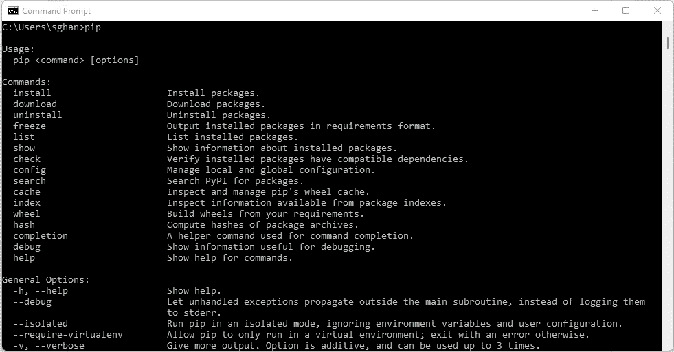
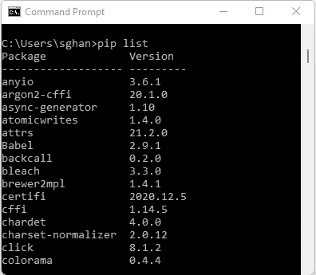
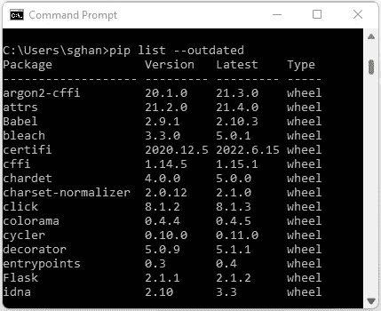
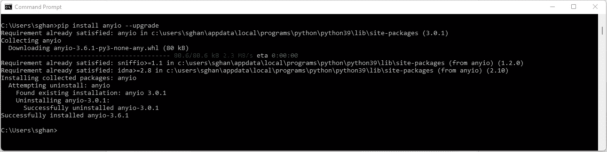
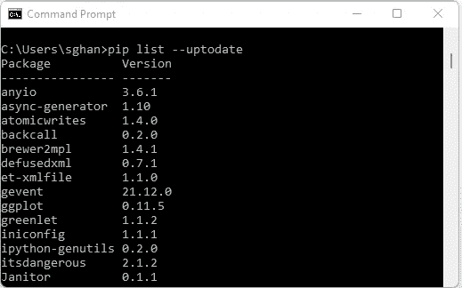

# 使用 Pip 管理 Python 库/包

> 原文：<https://medium.com/codex/using-pip-to-manage-python-libraries-packages-a1d7fcb38a2f?source=collection_archive---------6----------------------->

# 从前

*“从前有一个男孩叫皮普，现在皮普是一个特别的孩子，他有一些神奇的力量…”*

由[克里斯·哈迪](https://unsplash.com/@chrishardyphotography?utm_source=medium&utm_medium=referral)在 [Unsplash](https://unsplash.com?utm_source=medium&utm_medium=referral) 上拍摄的照片

Pip 听起来像是经典的迪士尼电影或皮克斯电影中的一个角色的名字，除了可爱和蓬松的描述，Pip 实际上是您在掌握 Python 的过程中需要学习的基本部分之一，尤其是如果您使用基本的库和包。

# 什么是包管理器？

Pip 是 Python 的一个包管理器，类似于其他编程语言，如 Javascript、HTML 和 CSS，它们有 Bower，Java 有 Maven。包管理器让编程语言变得栩栩如生。软件包包含由他人构建的有用代码，可以节省您的时间和精力。以 Pandas 为例，Pandas 是 Python 中的一个包，它允许你操作数据、执行清理操作、合并和连接、检查数据、执行统计计算等等。对于数据科学家和分析师来说，这很可能是最受欢迎的软件包。所以如果没有包，用 Python 编码将会是一个更加艰难的旅程。

# 如何使用 Pip？

使用命令提示符(或 Mac OS 上的终端)可以像精灵一样命令 Pip。如果你简单地键入并输入命令“Pip ”,这将向你显示 Pip 中所有命令的完整列表。这些包括“安装”、“下载”或“显示”，我们将在本文中讨论。

只需在命令提示符下输入“Pip”就可以看到完整的命令列表

# 查看现有包

命令“Pip List”将显示机器上所有现有 Python 库/包的列表。这是检查一个包是否已经存在于您的机器上或者它的任何依赖项上的好方法。

# **查找过期包**

机器上的过期包增加了 Python 脚本和程序无法工作或执行的风险。因此在 Python 中更新包是很重要的，这可以使用 Pip 很容易地完成。首先，命令“Pip list-outsided”将向您显示过期软件包的完整列表以及它们的最新版本

# 升级软件包

这是 Pip 的一个常见用例，升级软件包通常是保持某些脚本和 python 程序运行的必要条件。每当你想升级一个软件包，只需使用命令“pip 升级(软件包名称)”。在上面的例子中，我们列表中的第一个包“Anyio”是过时的，我们目前有 3.0.1，而最新的可用版本是 3.6.1，因此要升级它，我们输入“pip install anyio - upgrade ”,一旦完成，结果将显示如下

使用“Pip 安装(此处为软件包名称)-升级”来升级您的过期软件包

# 检查所有最新的软件包

现在，为了检查结果，我们还可以使用一个命令来显示所有最新的软件包。要做到这一点，只需在下面的例子中输入“pip list - update ”,我们可以看到我们的包 Anyio 现在已更新到最新版本 3.6.1

“Pip 列表-最新”将显示最新 Python 包的完整列表

如果你觉得我的内容有用，请考虑订阅 Medium，支持像我这样的作者:[*【https://medium.com/@sghani77/membership】*](/@sghani77/membership)