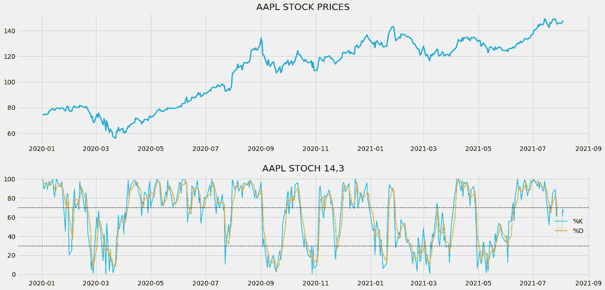
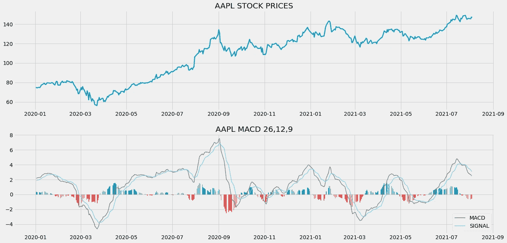
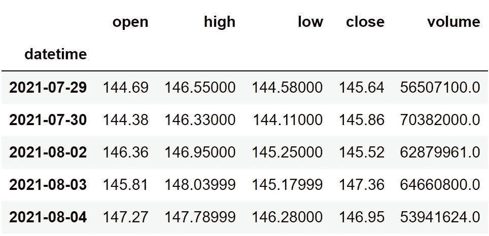
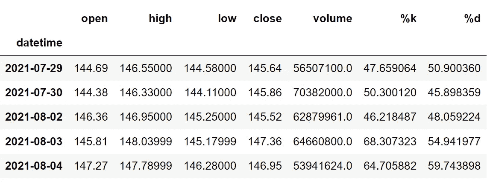
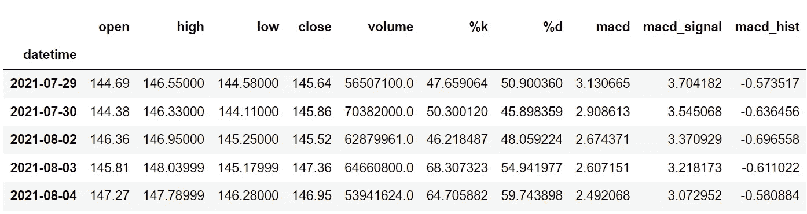
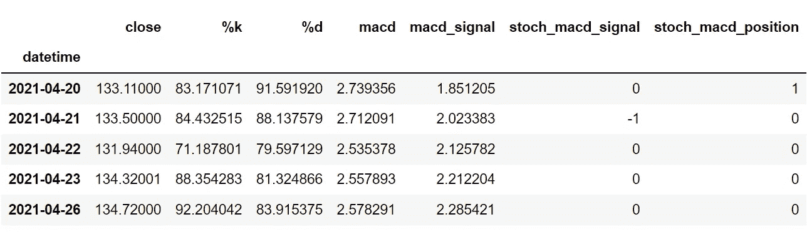

# 使用 Python 创建创新的交易策略并取得更好的结果

> 原文：<https://medium.com/codex/using-python-to-create-an-innovative-trading-strategy-and-achieve-better-results-702dcf4359ce?source=collection_archive---------1----------------------->

## 用 Python 结合多个指标创建非常规交易策略的实践指南


安纳斯·阿尔尚蒂在 [Unsplash](https://unsplash.com/@anasalshanti?utm_source=unsplash&utm_medium=referral&utm_content=creditCopyText) 上的照片

交易舞台上充斥着大量的人，他们的目标是从股市中发财。因此，要想在这个庞大的人群中脱颖而出，并在市场上保持强大的优势，创新非常规且未被普遍利用的新想法是必不可少的。例如，自从引入技术指标以来，几乎每个人都开始使用它们，但要取得成功，就必须创造性地使用它们，而不是采用传统的策略。这正是我们今天要做的。

在本文中，我们将使用 Python 来创建一个创新的交易策略，它结合了两个强大的指标，即随机振荡器和移动平均线收敛/发散(MACD)指标，最终目的是尽可能消除错误信号，实现更好的结果。事不宜迟，让我们进入文章吧！

在继续之前，如果你想在没有任何代码的情况下回溯测试你的交易策略，有一个解决方案。这是[的后验区](https://www.backtestzone.com/)。这是一个平台，可以免费对不同类型的可交易资产的任意数量的交易策略进行回溯测试，无需编码。点击这里的链接，你可以马上使用这个工具:[https://www.backtestzone.com/](https://www.backtestzone.com/)

# 随机振荡器

随机振荡器是一种基于动量的领先指标，广泛用于识别市场是处于超买还是超卖的状态。这就引出了我们的下一个问题。在令人担忧的市场中，什么是超买和超卖？当市场的趋势看起来非常看涨并且一定会盘整时，股票被认为是超买。类似地，当市场趋势似乎极度看跌并有反弹趋势时，股票到达超卖区域。

由于其归一化功能，随机振荡器的值总是在 0 到 100 之间。一般超买和超卖水平分别被认为是 70 和 30，但它可能因人而异。随机振荡器包括两个主要组件:

*   **%K 线:**这条线是随机振荡器指标中最重要、最核心的组成部分。它也被称为快速随机指标。这条线的唯一目的是表达市场的当前状态(超买或超卖)。这条线的计算方法是从股票的收盘价中减去股票在指定时间段内达到的最低价格，然后将该差值除以从最高股票价格中减去股票在指定时间段内达到的最低价格所得的值。通过将上述步骤计算出的值乘以 100，得到最终值。用最流行的设置 14 作为周期数来计算%K 线的方法可以表示如下:

```
**%K = 100 * ((14 DAY CLOSING PRICE - 14 DAY LOWEST PRICE) - (14 DAY HIGHEST PRICE - 14 DAY LOWEST PRICE))**
```

*   **%D 线:**又称慢随机指标，无非是%K 线在特定时期的移动平均线。它也被称为%K 线的平滑版本，因为%D 线的线图看起来比%K 线更平滑。%D 行的标准设置是周期数为 3。

这就是计算随机振子分量的整个过程。现在，让我们分析一个图表，其中苹果的收盘价数据与随机振荡器一起绘制，随机振荡器分别以 14 和 3 作为%K 线和% D 线的回望期，以建立对该指标及其使用方式的牢固理解。



作者图片

该图细分为两个面板:上面板和下面板。上面的面板代表苹果收盘价的线图。下面的面板包括随机振荡器的组件。作为领先指标，随机振荡指标不能和收盘价一起绘制，因为指标值和收盘价变化很大。因此，它与收盘价(在我们的例子中低于收盘价)分开绘制。

我们之前讨论过的成分%K 线和%D 线分别用蓝色和橙色绘制。您还可以注意到%K 和%D 线上方和下方的两条额外的黑色虚线。它是被称为波段的随机振荡器的附加组件。这些波段用来突出超买和超卖的区域。如果%K 线和%D 线都在高波段上方交叉，那么股票被认为是超买。同样，当%K 和%D 线都穿过低波段时，股票被认为超卖。

# MACD

在学习 MACD 之前，有必要知道指数移动平均线(EMA)是什么意思。EMA 是一种移动平均线(MA ),它自动为最近的数据点分配较大的权重(除了重要性之外),而为遥远过去的数据点分配较小的权重。例如，一份试卷将由 10%的一分问题、40%的三分问题和 50%的长答案问题组成。从这个例子中，您可以观察到，我们根据重要性级别为试卷的每个部分分配了唯一的权重(长答案问题可能比一分问题更重要)。

现在，MACD 是一个趋势跟踪领先指标，通过减去两个指数移动平均线(一个周期较长，另一个周期较短)来计算。MACD 指标有三个显著的组成部分。

*   **MACD 线:**这条线是两个给定的指数均线之差。为了计算 MACD 线，需要计算一个周期较长的均线(慢速线)和一个周期较短的均线(快速线)。最快和最慢的长度分别是 12，26。从快速均线中减去慢速均线可以得到最终的 MACD 线值。计算 MACD 线的公式可以表示如下:

```
**MACD LINE = FAST LENGTH EMA - SLOW LENGTH EMA**
```

*   **信号线:**这条线是 MACD 线本身在给定时间段内的指数移动平均线。计算信号线最流行的时期是 9。由于我们平均了 MACD 线本身，信号线将比 MACD 线更平滑。
*   **直方图:**顾名思义，是特意绘制出来揭示 MACD 线和信号线区别的直方图。这是用来识别趋势的一个很好的组件。计算直方图的公式可表示如下:

```
**HISTOGRAM = MACD LINE - SIGNAL LINE**
```

既然我们已经了解了 MACD 到底是什么。让我们分析一张 MACD 的图表来建立对指标的直觉。



作者图片

此图中有两个面板:顶部面板是苹果收盘价的图，底部面板是计算的 MACD 成分的一系列图。让我们拆开来看看每一个部件。

底部面板中第一个也是最明显的部分显然是计算直方图值的图。你可以注意到，每当市场显示负趋势时，该图就会变红，每当市场显示正趋势时，该图就会变绿。直方图的这个特性在识别市场趋势时变得非常方便。每当 MACD 线和信号线之间的差异很大时，直方图就扩展得更大，并且值得注意的是，直方图有时收缩，表示两个其他分量之间的差异相对较小。

接下来的两个组件是 MACD 线和信号线。MACD 线是灰色的线图，显示了苹果股价的慢速均线和快速均线之间的差异。同样，蓝色的线图是代表 MACD 线本身的均线的信号线。正如我们之前讨论的，信号线看起来更像是 MACD 线的平滑版本，因为它是通过平均 MACD 线本身的值计算出来的。

# 交易策略

现在我们已经对随机振荡指标和 MACD 指标建立了一些基本的直觉。让我们讨论一下这篇文章中我们将要实施的交易策略。这个策略非常简单。

如果%K 和%D 线低于 30，MACD 和信号线小于-2，我们就做多(买入股票)。类似地，如果%K 和%D 线交叉超过 70，并且 MACD 指标的两个分量都大于 2，我们做空(卖出股票)。我们的交易策略可以表述如下:

```
IF **%K < 30** AND **%D < 30** AND **MACD.L < -2** AND **SIGNAL.L < -2** ==> **BUY**
IF **%K > 70** AND **%D > 70** AND **MACD.L > 2** AND **SIGNAL.L > 2** ==> **SELL**
```

就是这样！我们的理论部分到此结束，让我们进入编程部分，我们将首先使用 Python 从头构建指标，构建讨论的交易策略，对苹果股票数据进行回溯测试，最后将结果与 SPY ETF 的结果进行比较。来做点编码吧！在继续之前，关于免责声明的一个注意事项:本文的唯一目的是教育人们，必须被视为一个信息，而不是投资建议等。

# 用 Python 实现

编码部分分为以下几个步骤:

```
**1\. Importing Packages
2\. Extracting Stock Data from Twelve Data
3\. Stochastic Oscillator Calculation
4\. MACD Calculation
5\. Creating the Trading Strategy
6\. Creating our Position
7\. Backtesting
8\. SPY ETF Comparison**
```

我们将按照上面列表中提到的顺序，系好安全带，跟随每一个即将到来的编码部分。

## 步骤 1:导入包

将所需的包导入 python 环境是一个不可跳过的步骤。主要的包是处理数据的 Pandas，处理数组和复杂函数的 NumPy，用于绘图的 Matplotlib，以及进行 API 调用的请求。二级包是数学函数的 Math 和字体定制的 Termcolor(可选)。

**Python 实现:**

```
**# IMPORTING PACKAGES** 
import pandas as pd
import numpy as np
import requests
import matplotlib.pyplot as plt
from math import floor
from termcolor import colored as cl

plt.style.use('fivethirtyeight')
plt.rcParams['figure.figsize'] = (20,10)
```

现在我们已经将所有需要的包导入到 python 中。我们用十二数据的 API 端点来拉一下苹果的历史数据。

## 步骤 2:从 12 个数据中提取股票数据

在这一步，我们将使用由[twelvedata.com](https://twelvedata.com/)提供的 API 端点提取苹果的历史股票数据。在此之前，请注意 twelvedata.com:十二数据公司是领先的市场数据提供商之一，拥有大量各种市场数据的 API 端点。它非常容易与十二数据提供的 API 进行交互，并且拥有有史以来最好的文档。此外，确保你有一个 twelvedata.com[的账户，只有这样，你才能访问你的 API 密匙(用 API 提取数据的重要元素)。](https://twelvedata.com/)

**Python 实现:**

```
**# EXTRACTING STOCK DATA** 
def get_historical_data(symbol, start_date):
    api_key = 'YOUR API KEY'
    api_url = f'https://api.twelvedata.com/time_series?symbol={symbol}&interval=1day&outputsize=5000&apikey={api_key}'
    raw_df = requests.get(api_url).json()
    df = pd.DataFrame(raw_df['values']).iloc[::-1].set_index('datetime').astype(float)
    df = df[df.index >= start_date]
    df.index = pd.to_datetime(df.index)
    return df

aapl = get_historical_data('AAPL', '2010-01-01')
aapl.tail()
```

**输出:**



作者图片

**代码解释:**我们做的第一件事是定义一个名为‘get _ historical _ data’的函数，该函数将股票的符号(‘symbol’)和历史数据的起始日期(‘start _ date’)作为参数。在函数内部，我们定义了 API 键和 URL，并将它们存储到各自的变量中。接下来，我们使用“get”函数提取 JSON 格式的历史数据，并将其存储到“raw_df”变量中。在对原始 JSON 数据进行清理和格式化之后，我们将以干净的 Pandas 数据帧的形式返回它。最后，我们调用创建的函数从 2010 年开始提取苹果的历史数据，并将其存储到‘AAPL’变量中。

## 步骤 3:随机振荡器计算

在这一步，我们将按照之前讨论过的方法和公式来计算随机振荡器的分量。

**Python 实现:**

```
**# STOCHASTIC OSCILLATOR CALCULATION** 
def get_stoch_osc(high, low, close, k_lookback, d_lookback):
    lowest_low = low.rolling(k_lookback).min()
    highest_high = high.rolling(k_lookback).max()
    k_line = ((close - lowest_low) / (highest_high - lowest_low)) * 100
    d_line = k_line.rolling(d_lookback).mean()
    return k_line, d_line

aapl['%k'], aapl['%d'] = get_stoch_osc(aapl['high'], aapl['low'], aapl['close'], 14, 3)
aapl.tail()
```

**输出:**



作者图片

**代码解释:**我们首先定义一个名为“get_stoch_osc”的函数，它分别将股票的高点(“高点”)、低点(“低点”)、收盘价数据(“收盘”)以及%K 线(“K _ 回看”)和%D 线(“D _ 回看”)的回看周期作为参数。在函数内部，我们首先使用 Pandas 软件包提供的“滚动”、“最小”和“最大”函数计算指定周期数的最低下限和最高上限数据点，并将这些值存储到“最低下限”和“最高上限”变量中。

接下来是%K 线计算，我们将公式代入代码，并将读数存储到“k 线”变量中，然后，我们计算%D 线，这不过是获取指定周期数的%K 线读数的 SMA。最后，我们将返回值并调用函数来存储 Apple 的随机振荡器读数，分别以 14 和 3 作为%K 和%D 线的回望周期。

## 第四步:MACD 计算

在这一步中，我们将从提取的苹果历史数据中计算 MACD 指标的所有组成部分。

**Python 实现:**

```
**# MACD CALCULATION** 
def get_macd(price, slow, fast, smooth):
    exp1 = price.ewm(span = fast, adjust = False).mean()
    exp2 = price.ewm(span = slow, adjust = False).mean()
    macd = pd.DataFrame(exp1 - exp2).rename(columns = {'close':'macd'})
    signal = pd.DataFrame(macd.ewm(span = smooth, adjust = False).mean()).rename(columns = {'macd':'signal'})
    hist = pd.DataFrame(macd['macd'] - signal['signal']).rename(columns = {0:'hist'})
    return macd, signal, hist

aapl['macd'] = get_macd(aapl['close'], 26, 12, 9)[0]
aapl['macd_signal'] = get_macd(aapl['close'], 26, 12, 9)[1]
aapl['macd_hist'] = get_macd(aapl['close'], 26, 12, 9)[2]
aapl = aapl.dropna()
aapl.tail()
```

**输出:**



作者图片

**代码解释:**首先，我们定义一个名为“get_macd”的函数，它获取股票的价格(“prices”)、慢速均线的长度(“slow”)、快速均线的长度(“fast”)以及信号线的周期(“smooth”)。

在函数内部，我们首先使用 Pandas 提供的“ewm”函数计算快速和慢速长度 ema，并将它们分别存储到“ema1”和“ema2”变量中。

接下来，我们通过从快速均线中减去慢速均线来计算 macd 线的值，并以熊猫数据帧的形式存储到“MACD”变量中。接下来，我们定义了一个名为“signal”的变量来存储信号线的值，该值是通过在指定的时间段内获取 macd 线值(“MACD”)的均线来计算的。

然后，我们通过从信号线的值(“信号”)中减去 macd 线的值(“MACD”)来计算直方图值，并将它们存储到“hist”变量中。最后，我们返回所有计算出的值，并调用创建的函数来存储苹果的 MACD 组件。

## 步骤 5:创建交易策略:

在这一步，我们将在 python 中实现所讨论的随机振荡器和移动平均线收敛/发散(MACD)组合交易策略。

**Python 实现:**

```
**# TRADING STRATEGY** 
def implement_stoch_macd_strategy(prices, k, d, macd, macd_signal):    
    buy_price = []
    sell_price = []
    stoch_macd_signal = []
    signal = 0

    for i in range(len(prices)):
        if k[i] < 30 and d[i] < 30 and macd[i] < -2 and macd_signal[i] < -2:
            if signal != 1:
                buy_price.append(prices[i])
                sell_price.append(np.nan)
                signal = 1
                stoch_macd_signal.append(signal)
            else:
                buy_price.append(np.nan)
                sell_price.append(np.nan)
                stoch_macd_signal.append(0)

        elif k[i] > 70 and d[i] > 70 and macd[i] > 2 and macd_signal[i] > 2:
            if signal != -1 and signal != 0:
                buy_price.append(np.nan)
                sell_price.append(prices[i])
                signal = -1
                stoch_macd_signal.append(signal)
            else:
                buy_price.append(np.nan)
                sell_price.append(np.nan)
                stoch_macd_signal.append(0)

        else:
            buy_price.append(np.nan)
            sell_price.append(np.nan)
            stoch_macd_signal.append(0)

    return buy_price, sell_price, stoch_macd_signal

buy_price, sell_price, stoch_macd_signal = implement_stoch_macd_strategy(aapl['close'], aapl['%k'], aapl['%d'], aapl['macd'], aapl['macd_signal'])
```

**代码解释:**首先，我们定义一个名为‘bb _ stoch _ strategy’的函数，它将股票价格(‘prices’)、k 线读数(‘K’)、D 线读数(‘D’)、MACD 线(‘MACD’)和信号线(‘MACD _ Signal’)作为参数。

在该函数中，我们创建了三个空列表(buy_price、sell_price 和 stoch_macd_signal ),在创建交易策略时，将在这些列表中追加值。

之后，我们通过 for 循环实施交易策略。在 for 循环内部，我们传递某些条件，如果条件得到满足，相应的值将被追加到空列表中。如果购买股票的条件得到满足，买入价将被追加到“buy_price”列表中，信号值将被追加为 1，表示购买股票。类似地，如果卖出股票的条件得到满足，卖价将被追加到“sell_price”列表中，信号值将被追加为-1，表示卖出股票。最后，我们返回附加了值的列表。然后，我们调用创建的函数并将值存储到各自的变量中。

## 步骤 6:创建我们的职位

在这一步中，我们将创建一个列表，如果我们持有股票，该列表将指示 1；如果我们不拥有或持有股票，该列表将指示 0。

**Python 实现:**

```
**# POSITION** 
position = []
for i in range(len(stoch_macd_signal)):
    if stoch_macd_signal[i] > 1:
        position.append(0)
    else:
        position.append(1)

for i in range(len(aapl['close'])):
    if stoch_macd_signal[i] == 1:
        position[i] = 1
    elif stoch_macd_signal[i] == -1:
        position[i] = 0
    else:
        position[i] = position[i-1]

close_price = aapl['close']
k_line = aapl['%k']
d_line = aapl['%d']
macd_line = aapl['macd']
signal_line = aapl['macd_signal']
stoch_macd_signal = pd.DataFrame(stoch_macd_signal).rename(columns = {0:'stoch_macd_signal'}).set_index(aapl.index)
position = pd.DataFrame(position).rename(columns = {0:'stoch_macd_position'}).set_index(aapl.index)

frames = [close_price, k_line, d_line, macd_line, signal_line, stoch_macd_signal, position]
strategy = pd.concat(frames, join = 'inner', axis = 1)

strategy
```

**输出:**



作者图片

**代码解释:**首先，我们创建一个名为‘position’的空列表。我们传递两个 for 循环，一个是为“位置”列表生成值，以匹配“信号”列表的长度。另一个 for 循环是我们用来生成实际位置值的循环。

在第二个 for 循环中，我们对“signal”列表的值进行迭代，而“position”列表的值被附加到满足哪个条件上。如果我们持有股票，头寸的价值仍为 1；如果我们卖出或不持有股票，头寸的价值仍为 0。最后，我们正在进行一些数据操作，将所有创建的列表合并到一个数据帧中。

从显示的输出中，我们可以看到，在第一行中，我们在股票中的位置仍然是 1(因为交易信号没有任何变化)，但是当交易信号代表买入信号(-1)时，我们的位置突然变成了 0。我们的头寸将保持-1，直到交易信号发生一些变化。现在是时候实现一些回溯测试过程了！

## 步骤 7:回溯测试

在继续之前，有必要知道什么是回溯测试。回溯测试是查看我们的交易策略在给定股票数据上表现如何的过程。在我们的例子中，我们将对苹果股票数据实施随机振荡器和 MACD 组合交易策略的回溯测试过程。

**Python 实现:**

```
**# BACKTESTING** 
aapl_ret = pd.DataFrame(np.diff(aapl['close'])).rename(columns = {0:'returns'})
stoch_macd_strategy_ret = []

for i in range(len(aapl_ret)):
    try:
        returns = aapl_ret['returns'][i] * strategy['stoch_macd_position'][i]
        stoch_macd_strategy_ret.append(returns)
    except:
        pass

stoch_macd_strategy_ret_df = pd.DataFrame(stoch_macd_strategy_ret).rename(columns = {0:'stoch_macd_returns'})

investment_value = 100000
number_of_stocks = floor(investment_value / aapl['close'][0])
stoch_macd_investment_ret = []

for i in range(len(stoch_macd_strategy_ret_df['stoch_macd_returns'])):
    returns = number_of_stocks * stoch_macd_strategy_ret_df['stoch_macd_returns'][i]
    stoch_macd_investment_ret.append(returns)

stoch_macd_investment_ret_df = pd.DataFrame(stoch_macd_investment_ret).rename(columns = {0:'investment_returns'})
total_investment_ret = round(sum(stoch_macd_investment_ret_df['investment_returns']), 2)
profit_percentage = floor((total_investment_ret / investment_value) * 100)
print(cl('Profit gained from the STOCH MACD strategy by investing $100k in AAPL : {}'.format(total_investment_ret), attrs = ['bold']))
print(cl('Profit percentage of the STOCH MACD strategy : {}%'.format(profit_percentage), attrs = ['bold']))
```

**输出:**

```
**Profit gained from the STOCH MACD strategy by investing $100k in AAPL : 1189853.94**
**Profit percentage of the STOCH MACD strategy : 1189%**
```

**代码解释:**首先，我们使用 NumPy 包提供的“diff”函数计算苹果股票的回报，并将其作为数据帧存储到“aapl_ret”变量中。接下来，我们传递一个 for 循环来迭代' aapl_ret '变量的值，以计算我们从交易策略中获得的回报，这些回报值被追加到' stoch_macd_strategy_ret '列表中。接下来，我们将“stoch_macd_strategy_ret”列表转换为数据帧，并将其存储到“stoch_macd_strategy_ret_df”变量中。

接下来是回溯测试过程。我们将通过投资 10 万美元到我们的交易策略中来回测我们的策略。首先，我们将投资金额存储到“投资值”变量中。之后，我们正在计算使用投资金额可以购买的苹果股票数量。你可以注意到，我使用了 Math 软件包提供的“floor”函数，因为当投资金额除以苹果股票的收盘价时，它会输出一个十进制数。股票数量应该是整数，而不是小数。使用“底数”函数，我们可以去掉小数。请记住,“floor”函数比“round”函数要复杂得多。然后，我们传递一个 for 循环来查找投资回报，后面是一些数据操作任务。

最后，我们打印了我们在交易策略中投入 10 万美元的总回报，显示我们在大约 10 年半的时间里获得了大约 119 万美元的利润，利润率为 1189%。太好了！现在，让我们将我们的回报与 SPY ETF(一种旨在跟踪标准普尔 500 股票市场指数的 ETF)的回报进行比较。

## 第八步:间谍 ETF 对比

这一步是可选的，但强烈推荐，因为我们可以了解我们的交易策略相对于基准(间谍 ETF)的表现如何。在这一步中，我们将使用我们创建的“get_historical_data”函数提取 SPY ETF 数据，并将我们从 SPY ETF 获得的回报与我们在 Apple 上的交易策略回报进行比较。

你可能已经注意到，在我所有的算法交易文章中，我没有将策略结果与标准普尔 500 市场指数本身进行比较，而是与 SPY ETF 进行比较，这是因为大多数股票数据提供商(如 12 Data)不提供标准普尔 500 指数数据。所以，我别无选择，只能选择间谍 ETF。如果你有幸得到标准普尔 500 市场指数数据，建议用它来做比较，而不是任何 ETF。

**Python 实现:**

```
**# SPY ETF COMPARISON** 
def get_benchmark(start_date, investment_value):
    spy = get_historical_data('SPY', start_date)['close']
    benchmark = pd.DataFrame(np.diff(spy)).rename(columns = {0:'benchmark_returns'})

    investment_value = investment_value
    number_of_stocks = floor(investment_value/spy[0])
    benchmark_investment_ret = []

    for i in range(len(benchmark['benchmark_returns'])):
        returns = number_of_stocks*benchmark['benchmark_returns'][i]
        benchmark_investment_ret.append(returns)

    benchmark_investment_ret_df = pd.DataFrame(benchmark_investment_ret).rename(columns = {0:'investment_returns'})
    return benchmark_investment_ret_df

benchmark = get_benchmark('2010-01-01', 100000)

investment_value = 100000
total_benchmark_investment_ret = round(sum(benchmark['investment_returns']), 2)
benchmark_profit_percentage = floor((total_benchmark_investment_ret/investment_value)*100)
print(cl('Benchmark profit by investing $100k : {}'.format(total_benchmark_investment_ret), attrs = ['bold']))
print(cl('Benchmark Profit percentage : {}%'.format(benchmark_profit_percentage), attrs = ['bold']))
print(cl('STOCH MACD Strategy profit is {}% higher than the Benchmark Profit'.format(profit_percentage - benchmark_profit_percentage), attrs = ['bold']))
```

**输出:**

```
**Benchmark profit by investing $100k : 287249.77**
**Benchmark Profit percentage : 287%**
**STOCH MACD Strategy profit is 902% higher than the Benchmark Profit**
```

**代码解释:**此步骤中使用的代码与前一个回溯测试步骤中使用的代码几乎相似，但我们不是投资苹果，而是通过不实施任何交易策略来投资 SPY ETF。从输出可以看出，我们的交易策略跑赢了 SPY ETF 902%。太棒了。

# 最后的想法！

经过一个压倒性的过程，粉碎了理论和编码部分，我们已经成功地了解了什么是随机振荡器和移动平均线收敛/发散，结合这两个指标使用 Python 创建了一个交易策略，并超越了间谍 ETF 的表现。

这篇文章只是对编程如何应用于金融，尤其是股票市场的一瞥。由此，我们可以说，为了在市场上保持强大的优势，掌握编程艺术和其他类似的技术概念是至关重要的。

**主办:** [EOD 历史数据](https://eodhistoricaldata.com/r/?ref=DHY3H8NT)是金融应用编程接口市场的领导者之一，提供各种各样的应用编程接口，从基本的每日市场数据到高度可定制的应用编程接口，如金融新闻应用编程接口和股票筛选应用编程接口。他们所有的 API 都是以一种本质上易于使用的方式设计的，因此初学者可以毫无障碍地使用它们。我个人使用过 [EOD 历史数据公司的](https://eodhistoricaldata.com/r/?ref=DHY3H8NT)API，从我的经验来看，他们的 API 既适合专业人士也适合业余爱好者，用于辅助项目和构建企业级应用程序。

## 完整代码:

```
# IMPORTING PACKAGES

import pandas as pd
import numpy as np
import requests
import matplotlib.pyplot as plt
from math import floor
from termcolor import colored as cl

plt.style.use('fivethirtyeight')
plt.rcParams['figure.figsize'] = (20,10)

# EXTRACTING STOCK DATA

def get_historical_data(symbol, start_date):
    api_key = 'YOUR API KEY'
    api_url = f'https://api.twelvedata.com/time_series?symbol={symbol}&interval=1day&outputsize=5000&apikey={api_key}'
    raw_df = requests.get(api_url).json()
    df = pd.DataFrame(raw_df['values']).iloc[::-1].set_index('datetime').astype(float)
    df = df[df.index >= start_date]
    df.index = pd.to_datetime(df.index)
    return df

aapl = get_historical_data('AAPL', '2010-01-01')
aapl.tail()

# STOCHASTIC OSCILLATOR CALCULATION

def get_stoch_osc(high, low, close, k_lookback, d_lookback):
    lowest_low = low.rolling(k_lookback).min()
    highest_high = high.rolling(k_lookback).max()
    k_line = ((close - lowest_low) / (highest_high - lowest_low)) * 100
    d_line = k_line.rolling(d_lookback).mean()
    return k_line, d_line

aapl['%k'], aapl['%d'] = get_stoch_osc(aapl['high'], aapl['low'], aapl['close'], 14, 3)
aapl.tail()

# STOCHASTIC OSCILLATOR PLOT

plot_data = aapl[aapl.index >= '2020-01-01']

ax1 = plt.subplot2grid((14,1), (0,0), rowspan = 7, colspan = 1)
ax2 = plt.subplot2grid((15,1), (9,0), rowspan = 6, colspan = 1)
ax1.plot(plot_data['close'], linewidth = 2.5)
ax1.set_title('AAPL STOCK PRICES')
ax2.plot(plot_data['%k'], color = 'deepskyblue', linewidth = 1.5, label = '%K')
ax2.plot(plot_data['%d'], color = 'orange', linewidth = 1.5, label = '%D')
ax2.axhline(70, color = 'black', linewidth = 1, linestyle = '--')
ax2.axhline(30, color = 'black', linewidth = 1, linestyle = '--')
ax2.set_title(f'AAPL STOCH 14,3')
ax2.legend(loc = 'right')
plt.show()

# MACD CALCULATION

def get_macd(price, slow, fast, smooth):
    exp1 = price.ewm(span = fast, adjust = False).mean()
    exp2 = price.ewm(span = slow, adjust = False).mean()
    macd = pd.DataFrame(exp1 - exp2).rename(columns = {'close':'macd'})
    signal = pd.DataFrame(macd.ewm(span = smooth, adjust = False).mean()).rename(columns = {'macd':'signal'})
    hist = pd.DataFrame(macd['macd'] - signal['signal']).rename(columns = {0:'hist'})
    return macd, signal, hist

aapl['macd'] = get_macd(aapl['close'], 26, 12, 9)[0]
aapl['macd_signal'] = get_macd(aapl['close'], 26, 12, 9)[1]
aapl['macd_hist'] = get_macd(aapl['close'], 26, 12, 9)[2]
aapl = aapl.dropna()
aapl.tail()

# MACD PLOT

plot_data = aapl[aapl.index >= '2020-01-01']

def plot_macd(prices, macd, signal, hist):
    ax1 = plt.subplot2grid((11,1), (0,0), rowspan = 5, colspan = 1)
    ax2 = plt.subplot2grid((11,1), (6,0), rowspan = 5, colspan = 1)

    ax1.plot(prices, linewidth = 2.5)
    ax1.set_title('AAPL STOCK PRICES')
    ax2.plot(macd, color = 'grey', linewidth = 1.5, label = 'MACD')
    ax2.plot(signal, color = 'skyblue', linewidth = 1.5, label = 'SIGNAL')
    ax2.set_title('AAPL MACD 26,12,9')

    for i in range(len(prices)):
        if str(hist[i])[0] == '-':
            ax2.bar(prices.index[i], hist[i], color = '#ef5350')
        else:
            ax2.bar(prices.index[i], hist[i], color = '#26a69a')

    plt.legend(loc = 'lower right')

plot_macd(plot_data['close'], plot_data['macd'], plot_data['macd_signal'], plot_data['macd_hist'])

# TRADING STRATEGY

def implement_stoch_macd_strategy(prices, k, d, macd, macd_signal):    
    buy_price = []
    sell_price = []
    stoch_macd_signal = []
    signal = 0

    for i in range(len(prices)):
        if k[i] < 30 and d[i] < 30 and macd[i] < -2 and macd_signal[i] < -2:
            if signal != 1:
                buy_price.append(prices[i])
                sell_price.append(np.nan)
                signal = 1
                stoch_macd_signal.append(signal)
            else:
                buy_price.append(np.nan)
                sell_price.append(np.nan)
                stoch_macd_signal.append(0)

        elif k[i] > 70 and d[i] > 70 and macd[i] > 2 and macd_signal[i] > 2:
            if signal != -1 and signal != 0:
                buy_price.append(np.nan)
                sell_price.append(prices[i])
                signal = -1
                stoch_macd_signal.append(signal)
            else:
                buy_price.append(np.nan)
                sell_price.append(np.nan)
                stoch_macd_signal.append(0)

        else:
            buy_price.append(np.nan)
            sell_price.append(np.nan)
            stoch_macd_signal.append(0)

    return buy_price, sell_price, stoch_macd_signal

buy_price, sell_price, stoch_macd_signal = implement_stoch_macd_strategy(aapl['close'], aapl['%k'], aapl['%d'], aapl['macd'], aapl['macd_signal'])

# TRADING SIGNALS PLOT

plt.plot(aapl['close'])
plt.plot(aapl.index, buy_price, marker = '^', markersize = 10, color = 'green')
plt.plot(aapl.index, sell_price, marker = 'v', markersize = 10, color = 'r')

# POSITION

position = []
for i in range(len(stoch_macd_signal)):
    if stoch_macd_signal[i] > 1:
        position.append(0)
    else:
        position.append(1)

for i in range(len(aapl['close'])):
    if stoch_macd_signal[i] == 1:
        position[i] = 1
    elif stoch_macd_signal[i] == -1:
        position[i] = 0
    else:
        position[i] = position[i-1]

close_price = aapl['close']
k_line = aapl['%k']
d_line = aapl['%d']
macd_line = aapl['macd']
signal_line = aapl['macd_signal']
stoch_macd_signal = pd.DataFrame(stoch_macd_signal).rename(columns = {0:'stoch_macd_signal'}).set_index(aapl.index)
position = pd.DataFrame(position).rename(columns = {0:'stoch_macd_position'}).set_index(aapl.index)

frames = [close_price, k_line, d_line, macd_line, signal_line, stoch_macd_signal, position]
strategy = pd.concat(frames, join = 'inner', axis = 1)

strategy.head()
strategy[-75:-70]

# BACKTESTING

aapl_ret = pd.DataFrame(np.diff(aapl['close'])).rename(columns = {0:'returns'})
stoch_macd_strategy_ret = []

for i in range(len(aapl_ret)):
    try:
        returns = aapl_ret['returns'][i] * strategy['stoch_macd_position'][i]
        stoch_macd_strategy_ret.append(returns)
    except:
        pass

stoch_macd_strategy_ret_df = pd.DataFrame(stoch_macd_strategy_ret).rename(columns = {0:'stoch_macd_returns'})

investment_value = 100000
number_of_stocks = floor(investment_value / aapl['close'][0])
stoch_macd_investment_ret = []

for i in range(len(stoch_macd_strategy_ret_df['stoch_macd_returns'])):
    returns = number_of_stocks * stoch_macd_strategy_ret_df['stoch_macd_returns'][i]
    stoch_macd_investment_ret.append(returns)

stoch_macd_investment_ret_df = pd.DataFrame(stoch_macd_investment_ret).rename(columns = {0:'investment_returns'})
total_investment_ret = round(sum(stoch_macd_investment_ret_df['investment_returns']), 2)
profit_percentage = floor((total_investment_ret / investment_value) * 100)
print(cl('Profit gained from the STOCH MACD strategy by investing $100k in AAPL : {}'.format(total_investment_ret), attrs = ['bold']))
print(cl('Profit percentage of the STOCH MACD strategy : {}%'.format(profit_percentage), attrs = ['bold']))

# SPY ETF COMPARISON

def get_benchmark(start_date, investment_value):
    spy = get_historical_data('SPY', start_date)['close']
    benchmark = pd.DataFrame(np.diff(spy)).rename(columns = {0:'benchmark_returns'})

    investment_value = investment_value
    number_of_stocks = floor(investment_value/spy[0])
    benchmark_investment_ret = []

    for i in range(len(benchmark['benchmark_returns'])):
        returns = number_of_stocks*benchmark['benchmark_returns'][i]
        benchmark_investment_ret.append(returns)

    benchmark_investment_ret_df = pd.DataFrame(benchmark_investment_ret).rename(columns = {0:'investment_returns'})
    return benchmark_investment_ret_df

benchmark = get_benchmark('2010-01-01', 100000)

investment_value = 100000
total_benchmark_investment_ret = round(sum(benchmark['investment_returns']), 2)

benchmark_profit_percentage = floor((total_benchmark_investment_ret/investment_value)*100)
print(cl('Benchmark profit by investing $100k : {}'.format(total_benchmark_investment_ret), attrs = ['bold']))
print(cl('Benchmark Profit percentage : {}%'.format(benchmark_profit_percentage), attrs = ['bold']))
print(cl('STOCH MACD Strategy profit is {}% higher than the Benchmark Profit'.format(profit_percentage - benchmark_profit_percentage), attrs = ['bold']))
```