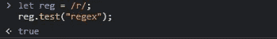
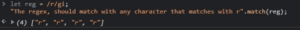
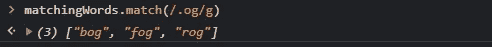
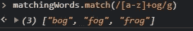

# 在 JavaScript 中使用正则表达式

> 原文：<https://medium.com/codex/using-regular-expressions-in-javascript-edcd5942de89?source=collection_archive---------8----------------------->


图多尔·巴休在 [Unsplash](https://unsplash.com?utm_source=medium&utm_medium=referral) 上的照片

在熨斗学校完成我的软件工程训练营后，我觉得“这只是开始，我还有很多要学的。”在查看提供免费学习课程的网站以继续我的教育时，我决定开始参加由 [freeCodeCamp](https://www.freecodecamp.org/) 主办的 JavaScript 数据结构和算法认证，这样我可以进一步巩固我的普通 JavaScript 技能，并通过课程学习更有效的算法求解方法。在我写这篇文章的时候，我仍然在研究这个课程，并且在研究了一会儿之后，我偶然发现了 Regex(正则表达式),这引起了我的兴趣。在 Flatiron boot camp 的第一阶段，我学习了足够多的 Ruby 正则表达式，能够为我的第一个项目创建一个方法，该方法只接受数字作为输入来访问我创建的类中的某个对象实例。JavaScript 的语法和方式看起来更容易理解和实现，并且通过其内置的方法，很容易评估字符串或数字中的字符或数字是否匹配(至少就我目前的知识而言)。

关于正则表达式的使用，实际上有很多文档，所以我将在这篇博客中回顾一些基础知识，以突出可能的用法和一些实现理想输出的语法。在这篇文章的结尾，我会提供一些资源，你可以在那里学到更多关于正则表达式的知识。另请注意，我将在这篇文章中互换正则表达式和正则表达式，但是正则表达式也可以在其他地方被称为:正则表达式、正则表达式和正则表达式。

首先，您可以学习简单的语法:

您可以通过首先用字符串包装您想要或不想匹配的字符或单词来编码所有正则表达式，您将使用 regex 来表示 like so:

```
/example/
```

您可以在代码中将它们设置为变量，方法有两种:

初始化变量并将其赋给表达式文字(文字正则表达式):

```
let regex = /chars/;
```

或者，您可以使用类构造函数，并传入要作为字符串计算的 chars 参数:

```
let regexTwo = new RegExp('chars');
regexTwo;// /chars/
```

对于动态编程来说，最好使用后一种操作，其中要计算的正则表达式可以改变(例如，用户的输入)。

从这里开始，您可以使用一些不同的方法来测试或*匹配*您想要用字符串或值(数字)评估的模式。

# 。测试()

您可以使用 regex 和带有 regex 的 test()内置方法，根据您在 regex 中使用的特殊字符来评估字符串是否包含字符或匹配字符。下面是一个对 regex 使用此方法并计算字符串的基本示例:



使用。test()返回一个布尔值。

与。test()方法，首先使用 regex 创建并链接在。方法，然后传递要测试的字符串的参数。的。test()操作返回一个布尔值(True 或 False)，如果您需要在记录输入的 web 应用程序中创建一个紧密的控制流，这可能会很有帮助。

# 。匹配()

不是返回一个布尔值。match()实际上会返回字符串中与您创建的正则表达式完全匹配的部分。在下面的例子中，我只将字符' r '作为目标，所以它将返回字符串中的第一个 r。请记住。match()将返回一个数组。所以要小心使用它:



使用。match()返回与正则表达式匹配的所有实例的数组。

在我的 Chrome 控制台代码片段(我上面的例子)中，我添加了两个标志，允许我从链接的字符串中返回所有“r”字符。匹配()。Match 与 test()略有不同，它不像 test()那样将方法链接到正则表达式，而是将方法链接到要计算的字符串/值，并将正则表达式作为参数传递给 match 方法。此外，在没有标志或显式正则表达式定义的情况下，如果使用。match()操作，它将从要计算的字符串中返回正则表达式匹配的第一个实例。

如果你注意到我上面的例子，在我的正则表达式的末尾有字母 *gi* 。T2 g T3 和 T4 I T5 就是所谓的旗帜。

标志是具有特殊含义的字符，可以附加到正则表达式模式的末尾，以修改正则表达式模式从给定字符串返回的方式和内容。上例中使用的 *g* 标志表示“全局”此标志用于匹配被评估的字符串中出现的所有模式。因此，在我上面的例子中，我创建了只有“r”的模式，当使用 *g* 标志时，返回字符串中所有出现的“r”字符，因此返回了四个 r 的数组。

虽然它并不真正适用于这个示例，但是附加的 *i* 标志是为了忽略大小写的特殊性，因此它将返回在前面的示例代码片段中出现的所有大写的 r(如果有任何大写的话)。这两个标志似乎很常用，但是你可以在这里了解更多关于其他标志的信息[。](https://www.codeguage.com/courses/regexp/flags)

关于正则表达式，你可能会有疑问的另一件很酷的事情(如果你不知道正则表达式或者它是如何工作的)，是使用连续分组的能力。我的意思是，假设你想过滤掉任何含有数字的输入。创建如下所示的正则表达式模式既漫长又混乱:

```
let numberPattern = /0123456789/;
```

实际上，您可以使用方括号[]和(-)之间的破折号/连字符创建一种您想要的集合模式，但是数字/字母必须彼此递增。假设您必须找到只匹配数值的输入。您可以像这样创建一个正则表达式模式:

```
let numberPat = /[0-9]/;
```

该语法将表示一个范围，并将被识别为匹配 0 到 9 之间任何数字的模式。你也可以对字母这样做，记住对数字使用从最小值到最大值的范围，然后在使用字母时按字母排序。这种方式看起来更干净，我也更容易理解。

# 正则表达式中的特殊字符

现在，我们已经了解了一些基础知识，了解可以使用的特殊字符可以极大地帮助您在 JavaScript 中使用正则表达式进行模式匹配。有时在模式中使用特殊字符来操作正则表达式中的实际模式。我举一个例子，一组字符串以相同的字母结尾，以不同的字母开头:

。(句点)是一个特殊字符，您可以使用它来匹配字符串中出现的单词，字符串中的单词可能有相同的单词，就像诗歌或韵文一样:

```
let matchingWords = "Go to the bog in the fog and catch a frog";
matchingWords.match(/.og/g);
```

在我的浏览器控制台中执行上述代码时，结果如下:



match 返回字符串以“og”结尾的所有实例。

在这个例子中，我犯了一个错误，我的正则表达式模式只查找所有匹配三个字符的匹配。的。只占了 3 个字符。要纠正这一点，我们可以使用另一个特殊字符，但我们必须删除句点。

特殊字符+说明了我们在上面的例子中遇到的问题。因为。是通配符，它将查找模式位置中的任何字符，即使是空格。因此，使用+字符允许我们调用特定的字符，在本例中是一个或多个字母，并修改我们的 regex 模式的行为，以便在该位置读取一个或多个字符，可以这么说:



使用+字符匹配长度超过 3 个字符的实例，同时忽略空白。

这实现了正确返回所有以“og”结尾的实例的预期结果，这与前面使用。正则表达式中的(通配符)字符。

这些只是用 regex 可以做的事情的几个例子，还有许多更复杂的方法和使用正则表达式的理由。

请让我知道你对我的例子和解释的看法。我知道关于正则表达式还有很多内容要介绍，但是我只是想分享正则表达式的基础知识和强大功能，供像我这样的人使用，他们可能知道正则表达式，可能被它吓倒，或者真的没有使用过正则表达式。我希望这是有帮助的，我会在下面发布更多的资源，包括我写这篇文章时遇到的一个很棒的小抄。我很想听听我的想法或任何我可以做得更好的事情，以及关于未来博客想法的事情。黑客快乐！

**资源:**

MDN -> [正则表达式](https://developer.mozilla.org/en-US/docs/Web/JavaScript/Guide/Regular_Expressions)

code gauge->[Regex 标志表](https://www.codeguage.com/courses/regexp/flags#:~:text=The%20table%20below%20illustrates%20some%20of%20the%20other%20flags%20used%20in%20regular%20expressions.)

debuggex->[JS Regex cheat sheet](https://www.debuggex.com/cheatsheet/regex/javascript)