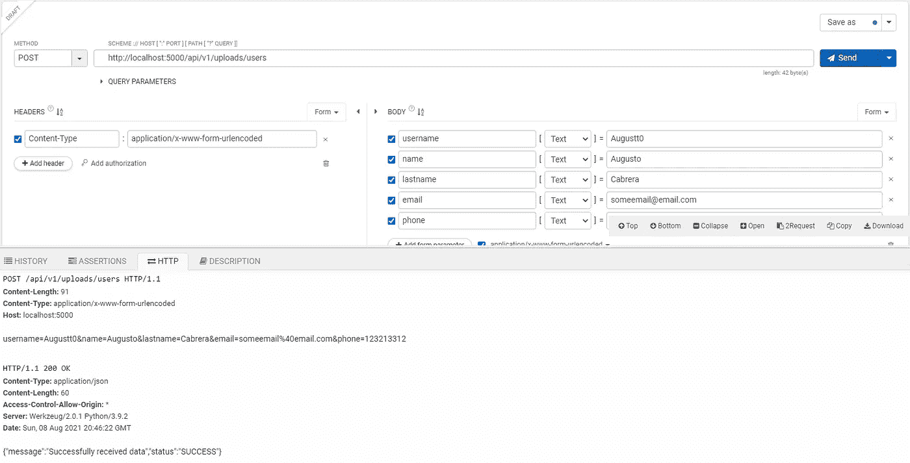

# 通过 Flutter 使用自托管服务

> 原文：<https://medium.com/codex/using-self-hosted-services-with-flutter-3d823e503778?source=collection_archive---------16----------------------->


有大量的教程告诉你如何使用[谷歌 Firebase](https://firebase.google.com/) 和 [Flutter](https://flutter.dev/) ，但是如果你想为独立的电子邮件验证系统或评论过滤等提供自己的服务呢？

你可以使用 Python 和 [Flask](https://flask.palletsprojects.com/) ，你必须将脚本和你的应用程序连接起来。让我们看看如何做到这一点。

## 首先，创建一个 Python 脚本。

所以你想创建自己的小系统来保存你的用户数据。你可以用 Flask 来创建一个 web 服务，用 TinyDB 来保存所有的用户数据。

## 装置

```
pip install Flask
pip install tinydb
```

## 初始化烧瓶

我们必须创建 Flask 类的一个实例。然后，我们使用 route decorator 向 Flask 显示哪个路由将激活该函数。

在本文末尾，您已经有了完整的 GitHub 项目资源库！

## 正在初始化 TinyDB

在本文末尾，您已经有了完整的 GitHub 项目资源库！

## 有用的功能

这是一个错误消息生成器，它将帮助我们生成对错误的响应。

在本文末尾，您已经有了完整的 GitHub 项目资源库！

## 下一步

所以我们已经导入并初始化了两个主包。现在我们将创建我们的函数。

首先，我们要上传用户的数据。为此，我们将创建两个函数，一个用于从我们的 Flutter 应用程序(或任何不必专门用 Flutter 开发的外部应用程序)获取用户数据，另一个用于将用户数据保存到数据库中。

## 从外部应用程序获取用户数据

我们首先创建一个名为“/api/v1/uploads/users”的路由，它使用 POST 方法从外部应用程序(在本例中是一个 Flutter 应用程序)获取用户数据。然后，我们验证每个字段都有数据，并保存数据。

在本文末尾，您已经有了完整的 GitHub 项目资源库！

## 保存用户数据

接下来，我们创建一个函数，允许我们将接收到的数据保存到数据库中。这个函数创建一个查询，询问我们想要保存的用户名，这样我们可以确保该用户不存在。

在本文的最后，您已经有了完整的 GitHub 项目资源库！

## 正在检索用户数据

我们将创建另一个允许我们请求用户数据的路径。

在本文末尾，您已经有了完整的 GitHub 项目资源库！

## 从数据库获取用户数据

当我们询问用户名时，这段代码将返回用户的数据。

在本文末尾，您已经有了完整的 GitHub 项目资源库！

## 设置烧瓶环境

您必须执行这些命令才能运行您的 python 脚本。

这个用于设置环境变量，其中“main”是 python 脚本的名称。

```
Linux | MacOS:
$ export FLASK_APP=mainCMD:
> set FLASK_APP=mainWindows Powershell:
> $env:FLASK_APP = "main"
```

然后，为了运行您的应用程序，只需在控制台的脚本目录下运行该命令。

```
flask run
```

## 测试我们的脚本

为了测试这个脚本，你可以使用一个名为 [Taled API Tester](https://www.talend.com/) 的 Google Chrome 扩展，它将允许你提出任何类型的请求来测试你的 API。



使用 Taled API 测试器进行测试

# 示例 Flutter 应用

现在，我们已经准备好 python 脚本来接收和检索用户数据。接下来我们要做的是我们的 Flutter 应用。

要创建一个新的 Flutter 应用程序，您只需编写下一个命令:

```
> flutter create appname
```

其中 appname 是您的应用程序的名称。在这种情况下，我将使用

```
> flutter create flutterapp
```

然后，我们将删除所有默认的示例代码，我们将开始编写自己的应用程序。

## 所需的库

您必须将 dio 库添加到您的 pubspec.yaml 文件中。这个库将用于服务器和应用程序之间的通信。

## 不安全的 HTTP

由于这是一个教程，我们将通过在我们的 *AndroidManifest.xml* 中设置这个来允许 HTTP 请求，但是**我不建议在版本中这样做。**

```
android:usesCleartextTraffic="true"
```

## 用户级

首先，我们将创建一个“用户”类，它将是用户对象，这不是必需的，但可以让你舒适地工作。

在本文末尾，您已经有了完整的 GitHub 项目资源库！

## 主页

我们的应用程序将有一个主页，我们将分为两部分，第一个将用于上传用户，第二个将用于搜索用户。

我假设您知道 Flutter 是什么，所以我将只解释如何从我们的 api 发送和检索数据。请记住，您已经在本文末尾获得了完整的项目 GitHub 资源库。

## 添加新用户

我们创建一个 Map 类型的变量，我们将在其中插入我们的用户数据。然后，使用 Dio 库，我们创建一个 Dio 对象，它将被用作我们的应用程序之间的连接器。

我们检查响应代码，以检测是否有任何错误，如果一切正常，显示一个对话框。

## 搜索用户

我们创建一个函数，它将一个字符串(用户名)作为参数，这将用于创建一个 GET 方法到我们的服务器，并从那里获取用户的数据。

[GitHub 链接到这个项目](https://github.com/augustt0/Flask_Flutter)

[请我喝杯咖啡](https://www.buymeacoffee.com/augustt0)

[我的 YouTube 频道](https://www.youtube.com/c/AugustoCabrera)