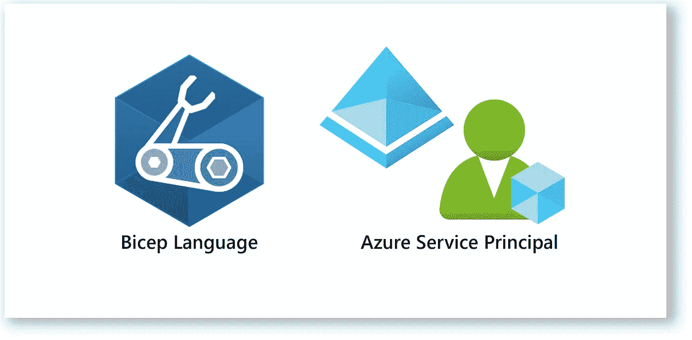
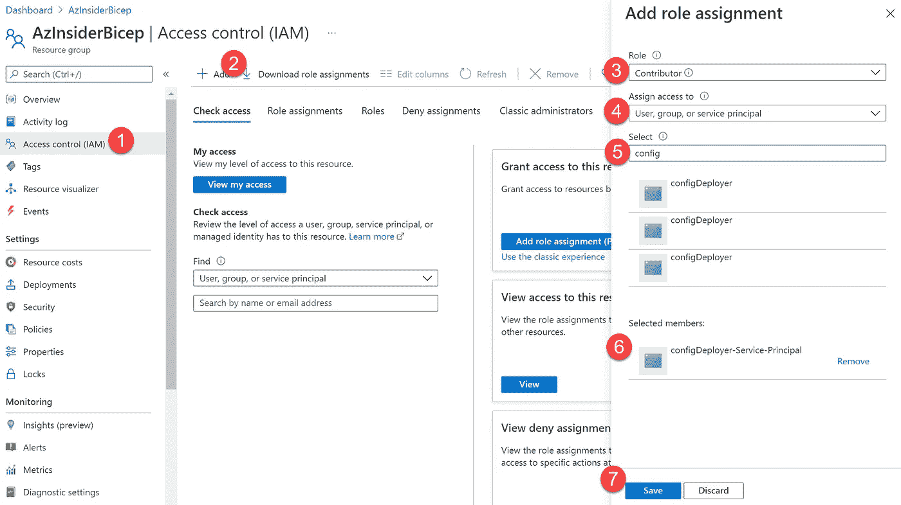
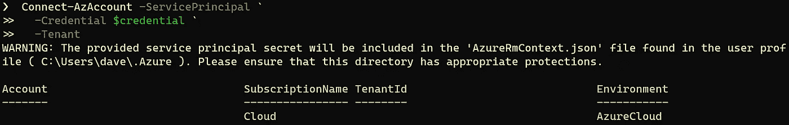
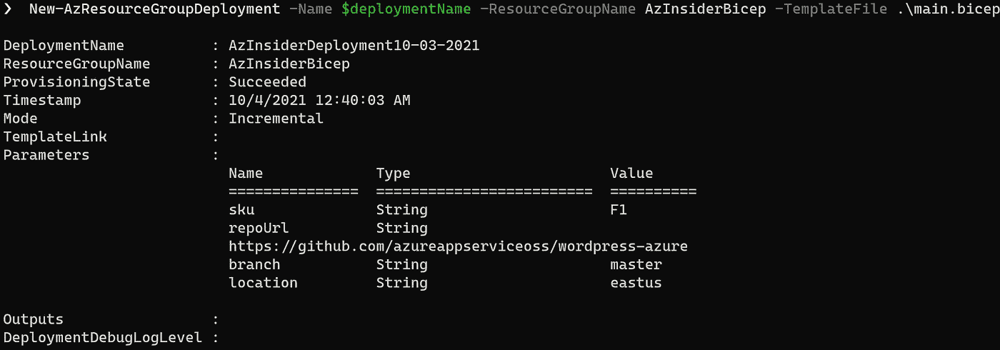

# 💪为 Bicep 部署使用服务主体

> 原文：<https://medium.com/codex/using-service-principals-for-bicep-deployments-eb54d31b67c8?source=collection_archive---------4----------------------->

设想一个场景，其中一个管道将您的基础设施部署到三个环境中——开发、测试和生产。了解如何为 Bicep 部署启用适当的访问。



为 Bicep 部署使用服务主体

# 为什么您应该关心服务主体的使用？

Azure 服务主体是为应用程序、托管服务和自动化工具访问 Azure 资源而创建的身份。

您可以通过分配给服务主体的角色来限制访问，从而控制可以访问哪些资源以及在哪个级别上访问。

设想一个场景，其中您有一个将基础设施部署到三个环境的管道——开发、测试和生产。每个环境都在一个专用的资源组中，有三个不同的订阅。

在这种情况下，您可以创建一个服务主体，并授予它对三个订阅中的每个资源组的访问权限。

更好的解决方案是使用多个服务主体将生产环境和非生产环境分开。然而，理想的解决方案是每个环境都有一个专门的服务主体。

有了三个服务主体，每个环境一个，您可以更好地控制哪些资源可以被访问以及在哪个级别被访问。

服务主体的密钥过期后，客户端不能使用该密钥进行鉴定。你需要发行一把新的钥匙。

你可以参考这篇[文章](https://docs.microsoft.com/en-us/azure/active-directory/develop/howto-create-service-principal-portal#register-an-application-with-azure-ad-and-create-a-service-principal?WT.mc_id=AZ-MVP-5000671)来创建一个使用 Azure 门户的服务主体。

现在让我们看看如何使用服务主体来部署 Bicep 文件。

## 先决条件:

*   有效的 Azure 订阅
*   Azure PowerShell 已安装
*   Azure 二头肌已安装
*   服务主体(包括这些值:应用程序客户端 ID、目录租户 ID、机密)

## 我们将做什么:

*   以您自己的用户帐户登录。
*   创建资源组
*   为服务主体分配角色
*   创建二头肌文件
*   使用服务主体来部署创建 WordPress 网站的 Bicep 文件。

# 1.登录您自己的用户帐户。

您可以使用下面的命令登录:

```
Connect-AzAccount -Tenant 'XXXXXXXX-XXXX-XXXX-XXXX-XXXXXXXXXXXXX' -SubscriptionId 'XXXXXXXXX-XXXX-XXXX-XXXX-XXXXXXXXXXXX'
```

我们不指定租户和订阅 ID。

# 2.创建资源组

现在，我们将使用下面的命令创建一个资源组:

```
New-AzResourceGroup -Name ifabrik -Location eastus
```

# 3.将角色分配给服务主体

要将角色分配给服务主体，您自己的用户帐户需要用户访问管理员角色分配。

要创建角色分配，您可以使用以下命令:

```
New-AzRoleAssignment `
  -ApplicationId APPLICATION_ID `
  -RoleDefinitionName Contributor `
  -Scope RESOURCE_GROUP_ID `
```

如果您更喜欢使用 Azure 门户，您可以转到资源组，然后选择“访问控制(IAM)”，单击“添加”/“添加角色分配”，然后提供选择服务主体，如下图所示:



# 4.二头肌文件

我们将使用下面的 Bicep 代码，用 MySQL 在 App 中创建一个 WordPress 站点。获取下面的代码，并将其保存为本地机器中的' *main.bicep* '。

```
param sku string = 'F1'
param repoUrl string = 'https://github.com/azureappserviceoss/wordpress-azure'
param branch string = 'master'
param location string = resourceGroup().location

var hostingPlanName_var = '${uniqueString(resourceGroup().id)}hostingplan'
var siteName_var = '${uniqueString(resourceGroup().id)}website'

resource hostingPlanName 'Microsoft.Web/serverfarms@2020-06-01' = {
  sku: {
    name: sku
    capacity: 1
  }
  name: hostingPlanName_var
  location: location
  properties: {}
}

resource siteName 'Microsoft.Web/sites@2020-06-01' = {
  name: siteName_var
  location: location
  properties: {
    serverFarmId: hostingPlanName.id
    siteConfig: {
      localMySqlEnabled: true
      appSettings: [
        {
          name: 'WEBSITE_MYSQL_ENABLED'
          value: '1'
        }
        {
          name: 'WEBSITE_MYSQL_GENERAL_LOG'
          value: '0'
        }
        {
          name: 'WEBSITE_MYSQL_SLOW_QUERY_LOG'
          value: '0'
        }
        {
          name: 'WEBSITE_MYSQL_ARGUMENTS'
          value: '--max_allowed_packet=16M'
        }
      ]
    }
  }
}

resource siteName_web 'Microsoft.Web/sites/sourcecontrols@2020-06-01' = {
  parent: siteName
  name: 'web'
  properties: {
    repoUrl: repoUrl
    branch: branch
    isManualIntegration: true
  }
}

resource Microsoft_Web_sites_config_siteName_web 'Microsoft.Web/sites/config@2020-06-01' = {
  parent: siteName
  name: 'web'
  properties: {
    phpVersion: '7.0'
  }
}
```

接下来，我们将继续部署 Bicep 文件。

# 5.使用用户分配的托管身份部署 Bicep 文件。

首先，我们将使用下面的命令安全地提示您输入服务主体的凭据。

```
$credential = Get-Credential
```

系统将提示您提供用户名和密码:

*   用户:这将是应用程序 ID
*   密码:这将是秘密 id 的实际值。

您可以从 Azure 门户的 Active Directory 页面中获取此信息，然后选择应用注册并查找您的服务主体，然后选择“证书和机密”选项卡。如果需要，您可以创建新的客户端密码。

然后，我们将运行下面的命令，使用服务主体凭据登录。用您自己的租户 ID 的值替换 TENANT_ID。

```
Connect-AzAccount -ServicePrincipal `
  -Credential $credential `
  -Tenant TENANT_ID
```

下图显示了上述命令的输出:



现在，我们将使用下面的命令部署 WordPress 站点:

```
$date = Get-Date -Format "MM-dd-yyyy"
$deploymentName = "AzInsiderDeployment"+"$date"New-AzResourceGroupDeployment -Name $deploymentName -ResourceGroupName AzInsiderBicep -TemplateFile .\main.bicep
```

下图显示了部署操作的输出:



二头肌部署操作输出

如您所见，使用服务主体非常简单，您可以将它们与 Azure DevOps 集成，以控制对部署 Bicep 文件的环境的访问。

[*在此加入****azin sider****邮箱列表。*](http://eepurl.com/gKmLdf)

*-戴夫·r*