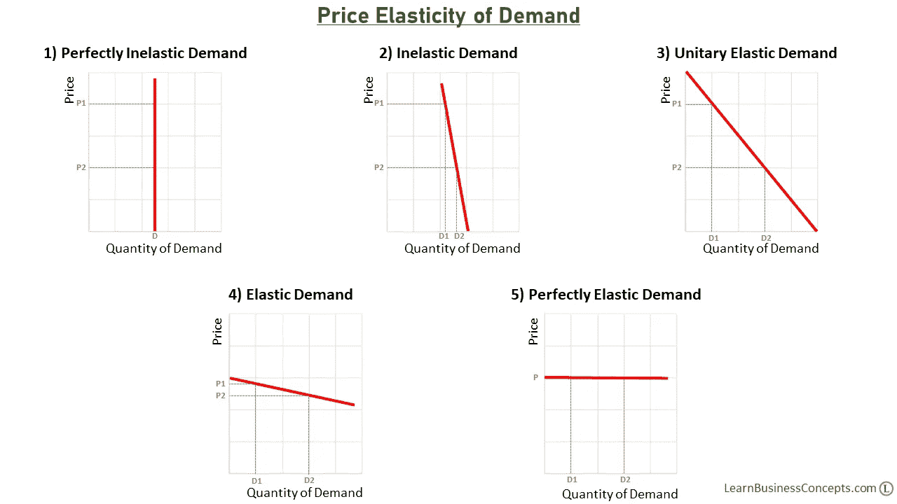
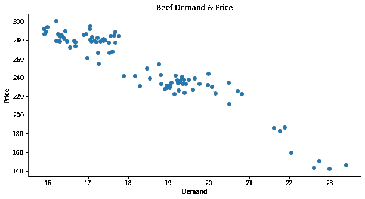
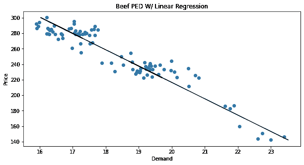
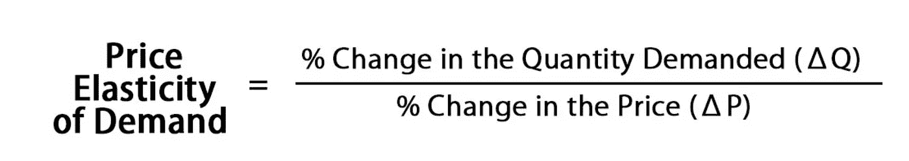

# 利用 Sklearn 测算牛肉需求的价格弹性

> 原文：<https://medium.com/codex/using-sklearn-to-measure-the-price-elasticity-of-demand-for-beef-8abef3b62953?source=collection_archive---------3----------------------->


随着高通胀和潜在衰退的逼近，企业不得不努力应对如何为产品定价的艰难决定。需求价格弹性(PED)是在对产品重新定价时要考虑的一个有价值的度量，因为它预测了需求对价格变化的反应。

Sklearn 的机器学习库为数据科学家提供了易于使用的工具来评估 PED。在这篇博客中，我将介绍如何使用 Python 的 Sklearn 库构建一个简单的线性回归模型来评估牛肉的 PED。训练完我们的模型后，我们将评估其性能，并讨论这些指标对 PED 的意义，以及我们如何利用这些信息做出更好的定价决策。我使用牛肉进行分析，但是过程和配方通常适用于任何产品。

# 需求的价格弹性(PED)

PED 是一个给定产品的需求对该产品价格的敏感程度的度量。价格和需求非常适合线性回归，因为对于大多数产品来说，价格和需求共享一个线性关系，价格的增加导致需求的减少。这种线性关系的斜率并不是所有产品都一样的，因此需要测量某种产品的需求与其价格的关联程度。



https://learnbusinessconcepts . com/WP-content/uploads/Types-of-Price-Elasticity-of-Demand-learnbusinessconcepts . com-。png

PED 的一个极端是需求无弹性的产品，如公用事业、处方药和烟草产品。这些产品是必需品或上瘾品，无论价格如何都必须购买。另一个极端是高弹性产品，如汽车和洗衣机，如果价格上涨，消费者可以推迟购买。

我们将研究牛肉价格，其弹性需求介于这两个极端之间。牛肉数据是在[这里](https://raw.githubusercontent.com/susanli2016/Machine-Learning-with-Python/master/beef.csv)找到的。我们的任务是建立一个描述牛肉 PED 的线性回归模型，并用它来预测基于价格的需求。



# 导入相关的 Sklearn 包

首先，将培训和评估我们的线性回归模型所需的 Sklearn 包导入笔记本。Sklearn 提供了这些类，因此您可以自动完成线性回归分析中的大部分工作。

```
#1\. Import the model_selection packages from sklearn used to split our training and testing datafrom sklearn.model_selection import train_test_split#2\. Import the linear_selection packages from sklearn used to split our training and testing datafrom sklearn.linear_model import LinearRegression#3\. Import the metrics packages from sklearn to evaluate the resultsfrom sklearn.metrics import mean_squared_error, r2_score
```

# 选择因变量和自变量

记住 PED 的概念是需求在一定程度上随着价格波动。从这个公式中，我们得出了因变量(需求)和自变量(价格)。在我们的 Pandas 数据框架中访问这些需求和价格序列，并将它们保存到变量中以备后用。

```
#Seperate our Pandas data frame into a dependant and independant variables#Independant variable
X = beef_df[['Price']]#Dependant variable
y = beef_df['Quantity']
```

# 拆分测试和培训数据

应该评估线性回归模型用新的和未知的数据预测结果的能力。以这种方式评估复制了我们作为企业经理的场景，我们希望以一些新的和以前未测试过的价格来预测销售业绩。出于这个原因，我们在训练期间在测试集中提供一些数据是至关重要的，我们稍后可以使用这些数据来评估模型的性能。

```
#Perform the train and test split on our dependant and independant variablesX_train, X_test, y_train, y_test = train_test_split(X, y, test_size=0.3, random_state=42)
```

# 训练我们的模型并进行预测

调用 Sklearn 的 LinearRegression 类，我们将实例化我们的模型，然后使其适合我们在上一步中创建的训练数据。

使用训练好的模型，我们将使用测试分割中的未知数据对需求进行预测。结果将是我们预测的需求值。

```
#Instantiate our linear regression
lr = LinearRegression()#Fit the model to our training data
lr.fit(X_train,y_train)#Make predictions 
train_predictions = lr.predict(X_train)
test_predictions = lr.predict(X_test)
```

# 解释结果

我们将寻找模型性能的以下指标和最终 PED 线的测量值。

1.  接近 1 的 r 平方表明我们的模型是准确的，并使用价格作为我们的输入解释了需求的大部分变化
2.  比较我们的训练和测试分割的 R 平方值给出了方差的指示，即我们的模型在可见和不可见数据之间有多精确
3.  均方根误差(RMSE)表示以需求为单位的预测的平均误差
4.  该系数描述了一个单位价格变化所导致的需求变化

```
#Import evaluation packages
from sklearn.metrics import mean_squared_error, r2_score
print(f' Train RMSE {round(mean_squared_error(y_train,train_predictions,squared=False),3)}')
print(f' Train R2 {round(r2_score(y_train,train_predictions),3)}')
print()
print(f' Train RMSE {round(mean_squared_error(y_test,test_predictions,squared=False),3)}')
print(f' Test R2 {round(r2_score(y_test,test_predictions),3)}')
print()
print(f'Price coefficient {round(lr.coef_[0],3)}')[OUT] [OUT]
Train RMSE 0.548
Train R2 0.909

Train RMSE 0.611
Test R2 0.882

Price coefficient -0.047
```

*   对于训练集和测试集，我们的 R 平方值都接近 1，表明我们的模型既准确又精确
*   RMSE 告诉我们，我们模型的预测平均会偏离需求 0.55-0.61 个单位
*   该系数表示，在其他因素不变的情况下，价格每上涨一个单位，牛肉需求就会下降 0.047

现在，我们将绘制预测线来显示牛肉的 PED。线性关系很清楚。我们看到我们的 PED 线最像上面图中[的例子#4，“弹性需求”。](https://learnbusinessconcepts.com/wp-content/uploads/Types-of-Price-Elasticity-of-Demand-LearnBusinessConcepts.com-.png)

```
#Import matplotlib
import matplotlib.pyplot as plt
%matplotlib inline#Create our scatterplot
fig, ax=plt.subplots(figsize=(10,5))
plt.scatter(y, X)
plt.plot(lr.predict(X),X,color='k')
ax.set_title("Beef PED W/ Linear Regression")
ax.set_xlabel('Demand')
ax.set_ylabel('Price')
plt.savefig('Images/Beef_pd_wlinearregression.png', bbox_inches='tight')
;
```



# 计算 PED

现在我们有了线性回归模型及其属性，我们可以求解 PED。根据我们的系数(-0.047)，我们知道单位价格和需求变化之间的关系，但是 PED 公式要求百分比变化。为了获得百分比变化，我们将沿着 PED 线选择两个价格点，预测它们相应的需求值，并将这些点用作下面等式中的变量。



```
#Select two price points along our PED line and put them in array format
price_point_1 = np.array(200)
price_point_2 = np.array(220)#estimate demand at these points. Re-shape the array and call upon our first valuedemand_estimate_1 = lr.predict(price_point_1.reshape(1, -1))[0]
demand_estimate_2 = lr.predict(price_point_2.reshape(1, -1))[0]#Place price points and demand estimates into our PED formula
PED = ((demand_estimate_2 - demand_estimate_1)/(demand_estimate_1))/((price_point_2 - price_point_1)/(price_point_1))#Print results
print(f'PED {round(PED,2)}')[OUT]
PED -0.46
```

我们的 PED 是-0.46，这意味着价格上涨 10%会导致需求下降 4.6%。PED 几乎总是为负，因为价格上涨时需求通常会减少，而价格下跌时需求会增加。当这个比率为负时，我们认为产品价格有弹性。在这种情况下，我们发现牛肉具有价格弹性。

# 常见错误

用双括号将自变量括起来，以创建数据框。我们的因变量只需要一个方括号，因为 Sklearn 期望一列数据作为线性回归的目标变量。由于我们的自变量中可以有多个列或特征，Sklearn 期望一个数据框而不是一个序列。

```
#Dependant variable
y = beef_df['Quantity']#Independant variable
X = beef_df[['Price']]print(f' Dependant variable type is {type(y)}')
print(f' Indpendant variable type is {type(X)}')[OUT]
Dependant variable type is <class 'pandas.core.series.Series'>
Indpendant variable type is <class 'pandas.core.frame.DataFrame'>
```

用 Sklearn 的做预测的时候。predict 方法给定一个数据点 X，将 X 值放入数组格式非常重要。此外，您必须根据数组调用的第一个值对其进行整形。

```
#Select two price points along our PED line and put them in array format
price_point_1 = np.array(200)
price_point_2 = np.array(220)#estimate demand at these points. Re-shape the array and call upon our first valuedemand_estimate_1 = lr.predict(price_point_1.reshape(1, -1))[0]
demand_estimate_2 = lr.predict(price_point_2.reshape(1, -1))[0]
```

# 结论

当考虑对产品重新定价时，了解该产品的 PED 很重要，这样你就可以预测消费者需求对这种变化的反应。Sklearn 提供易于使用的建模工具，用于构建线性回归模型，并使用这些模型预测给定新价格输入的需求。