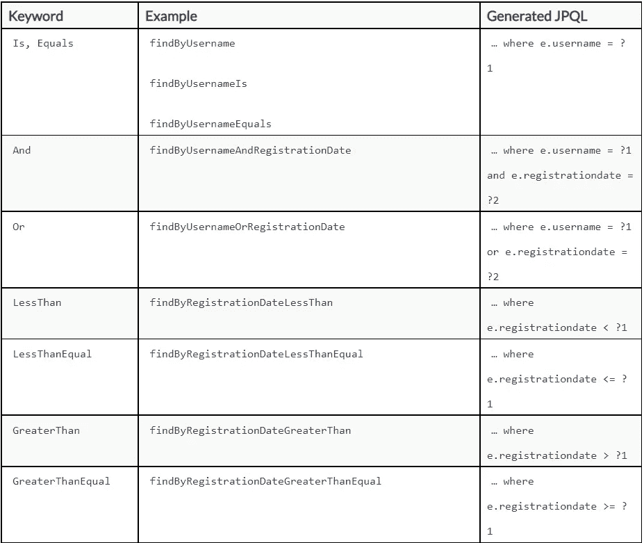
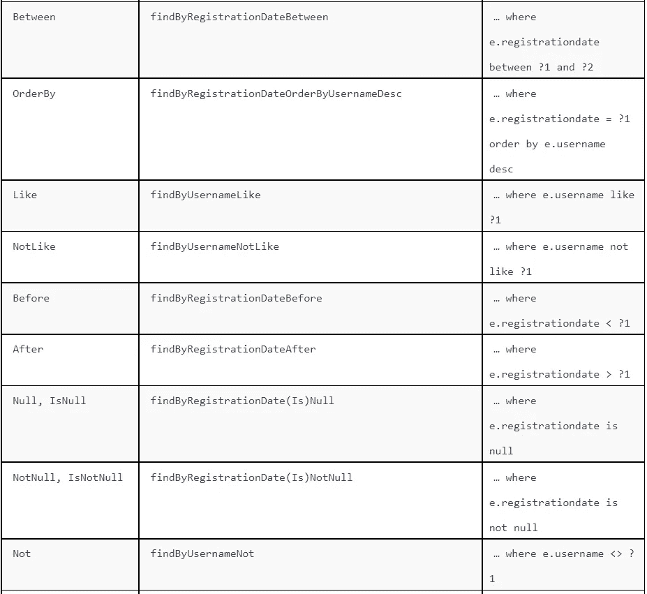
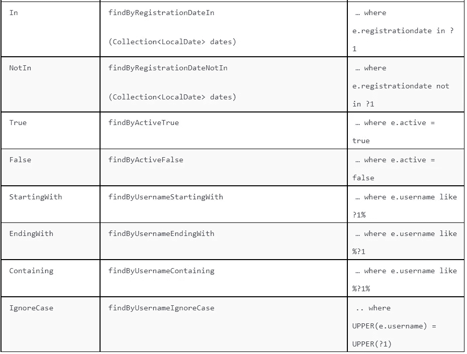

# 使用 Spring 数据 JPA

> 原文：<https://medium.com/codex/using-spring-data-jpa-f5c1a501c301?source=collection_archive---------10----------------------->

## 文章

## *来自* [*Java 持久化与 Spring 数据和 Hibernate*](https://www.manning.com/books/java-persistence-with-spring-data-and-hibernate?utm_source=medium&utm_medium=referral&utm_campaign=book_tudose2_java_10_26_21) *由 Catalin 图多塞*

*本文深入研究了使用 Spring Data JPA 访问数据库。*

通过在[manning.com](https://www.manning.com/books/java-persistence-with-spring-data-and-hibernate?utm_source=medium&utm_medium=referral&utm_campaign=book_tudose2_java_10_26_21)的结账处将 **fcctudose2** 输入折扣框，用 Spring Data 和 Hibernate 获得 35%的折扣。

本文假设您了解主要的 Spring 数据模块。

这里我们将重点讨论 Spring Data JPA，因为它用于与数据库交互。Spring Data JPA 主要用于从 Java 程序访问数据库。它在 JPA 提供者(例如 Hibernate)之上提供了一个新的抽象层，控制配置和事务管理。下面我们就来深入分析一下它的能力。我们仍然可以使用 JPA 和 Hibernate 定义和管理我们的实体，但是我们将提供 Spring Data JPA 作为与它们交互的替代方案。

## 用 Spring 数据定义查询方法

假设我们有一个名为“买者自负”的拍卖系统，我们想增加功能。我们将通过添加字段`email`、`level,`和`active`来扩展`User`类。一个用户可能有不同的级别，这将允许他或她执行特定的操作(例如，出价高于某个金额)。用户可以是活动的，也可以是退休的(即先前在买者自负拍卖系统中是活动的)。这是购买者应用程序需要保留的关于其用户的重要信息。演示的源代码可以在`springdatajpa2`文件夹中找到。

**清单 1 修改后的用户类**

```
**Path: Ch04/springdatajpa2/src/main/java/com/manning/javapersistence/springdatajpa/model/User.java
** @Entity
 @Table(name = "USERS")
 public class User {

     @Id
     @GeneratedValue
     private Long id;

     private String username;

     private LocalDate registrationDate;

     private String email;

     private int level;

     private boolean active;

     public User() {

     }

     public User(String username) {
         this.username = username;
     }

     public User(String username, LocalDate registrationDate) {
         this.username = username;
         this.registrationDate = registrationDate;
     }

     //getters and setters
 }
```

我们将开始向`UserRepository`接口添加新方法，并在新创建的测试中使用它们。

`UserRepository`接口将扩展`JpaRepository`，后者扩展`PagingAndSortingRepository`，后者又扩展`CrudRepository`。

`CrudRepository`提供基本的 CRUD 功能。`PagingAndSortingRepository`提供了对记录进行排序和分页的便捷方法(将在本章的后面讨论)。`JpaRepository`提供 JPA 相关的方法，比如批量刷新持久上下文和删除记录。另外，`JpaRepository`将`CrudRepository,`中的一些方法覆盖为`findAll`、`findAllById,`或`saveAll`，返回`List`而不是`Iterable`。

我们还将向`UserRepository`接口添加一系列查询方法，如下所示:

**清单 2 带有新方法的 UserRepository 接口**

```
**Path: Ch04/springdatajpa2/src/main/java/com/manning/javapersistence/springdatajpa/repositories/UserRepository.java
** public interface UserRepository extends JpaRepository<User, Long> {

    User findByUsername(String username);
    List<User> findAllByOrderByUsernameAsc();
    List<User> findByRegistrationDateBetween(LocalDate start, LocalDate end);
 List<User> findByUsernameAndEmail(String username, String email);
 List<User> findByUsernameOrEmail(String username, String email);
 List<User> findByUsernameIgnoreCase(String username);
 List<User> findByLevelOrderByUsernameDesc(int level);
 List<User> findByLevelGreaterThanEqual(int level);
 List<User> findByUsernameContaining(String text);
 List<User> findByUsernameLike(String text);
 List<User> findByUsernameStartingWith(String start);
 List<User> findByUsernameEndingWith(String end);
 List<User> findByActive(boolean active);
 List<User> findByRegistrationDateIn(Collection<LocalDate> dates);
 List<User> findByRegistrationDateNotIn(Collection<LocalDate> dates);

 }
```

查询方法的目的是从数据库中检索信息。Spring Data JPA 提供了一个查询构建器机制，它将根据存储库方法的名称来创建存储库方法的行为。我们稍后将分析修改查询，现在我们深入到以查找信息为目的的查询中。这个查询机制从方法名中删除前缀和后缀`find...By`、`get...By`、`query...By`、`read...By`、`count...By`，并解析剩下的内容。

您可以将包含表达式的方法声明为`Distinct`来设置一个 distinct 子句，将运算符声明为`LessThan`、`GreaterThan`、`Between`和`Like`，或者将复合条件声明为`And`或`Or`。您可以在引用属性并提供排序方向的查询方法名称中使用`OrderBy`子句来应用静态排序(`Asc`或`Desc`)。对于支持这种子句的属性，可以使用`IgnoreCase`。要删除行，必须在方法名中用`delete`替换`find`。另外，Spring Data JPA 会查看方法的返回类型。如果你想找到一个`User`并在一个`Optional`容器中返回它，方法返回类型将是`Optional<User>`。可能的返回类型的完整列表以及详细的解释可以在[https://docs . spring . io/spring-data/JPA/docs/2 . 5 . 2/reference//html/# appendix . query . return . types](https://docs.spring.io/spring-data/jpa/docs/2.5.2/reference/html/#appendix.query.return.types)中找到。

方法的名称需要遵循规则来确定结果查询。如果方法命名错误(例如，查询方法中的实体属性不匹配)，则在加载应用程序上下文时会出现错误。

表 1 描述了 Spring Data JPA 支持的关键字，以及每个方法名在 JPQL 中是如何转换的。



表 1 Spring 数据 JPA 和生成的 JPQL 中的关键字用法

作为所有未来测试的基类，我们将编写`SpringDataJpaApplicationTests`抽象类。

**清单 SpringDataJpaApplicationTests 抽象类**

```
**Path: Ch04/springdatajpa2/src/test/java/com/manning/javapersistence/springdatajpa/SpringDataJpaApplicationTests.java
** @SpringBootTest                                                             #A
 @TestInstance(TestInstance.Lifecycle.*PER_CLASS*)                             #B
 abstract class SpringDataJpaApplicationTests {
     @Autowired                                                              #C
     UserRepository userRepository;                                          #C

     @BeforeAll                                                              #D
     void beforeAll() {                                                      #D
         userRepository.saveAll(*generateUsers*());                            #D
     }                                                                       #D

     private static List<User> generateUsers() {                             #E
         List<User> users = new ArrayList<>();

        User john = new User("john", LocalDate.*of*(2020, Month.*APRIL*, 13));
         john.setEmail("john@somedomain.com");
         john.setLevel(1);
         john.setActive(true);

         //create and set a total of 10 users

         users.add(john);
         //add a total of 10 users to the list

         return users;
     }
     @AfterAll                                                               #F
     void afterAll() {                                                       #F
         userRepository.deleteAll();                                         #F
     }                                                                       #F

 }
```

**#A 由 Spring Boot 添加到最初创建的类中的@SpringBootTest 注释将告诉 Spring Boot 搜索主配置类(例如@SpringBootApplication 注释类)并创建将在测试中使用的 ApplicationContext。理解由 Spring Boot 添加到包含 main 方法的类中的@SpringBootApplication 注释将启用 Spring Boot 自动配置机制，并将启用对应用程序所在的包的扫描，以及允许在上下文中注册额外的 beans，这一点很重要。**

**#B 使用@TestInstance(测试实例。Lifecycle.PER_CLASS)注释，我们要求 JUnit 5 创建测试类的一个实例，并在所有测试方法中重用它。这将允许我们使@BeforeAll 和@AfterAll 带注释的方法成为非静态的，并在其中直接使用自动连接的 UserRepository 实例字段。**

**#C 我们自动连接一个用户存储库实例。由于@SpringBootApplication 注释，这种自动连接是可能的，它允许对应用程序所在的包进行扫描，并在上下文中注册 beans。**

在执行来自扩展 SpringDataJpaApplicationTests 的类的所有测试之前，@BeforeAll 注释方法将被执行一次。这个方法不会是静态的。

【The @ TestInstance(测试实例。Lifecycle.PER_CLASS)注释强制创建测试类的单个实例。它将把 generateUsers 方法创建的用户列表保存到数据库中。

在执行了扩展 SpringDataJpaApplicationTests 的类中的所有测试之后，@AfterAll 注释方法将被执行一次。这个方法不会是静态的。@TestInstance(测试实例。Lifecycle.PER_CLASS)注释强制创建测试类的单个实例。

接下来的测试将扩展这个类，并使用已经填充的数据库。为了测试现在属于`UserRepository`的方法，我们将创建`FindUsersUsingQueriesTest`类并遵循相同的编写测试的方法:调用存储库方法并验证其结果。

**清单 FindUsersUsingQueriesTest 类**

```
**Path: Ch04/springdatajpa2/src/test/java/com/manning/javapersistence/springdatajpa/FindUsersUsingQueriesTest.java
** public class FindUsersUsingQueriesTest extends SpringDataJpaApplicationTests {

     @Test
     void testFindAll() {
         List<User> users = userRepository.findAll();
         *assertEquals*(10, users.size());
     }

     @Test
     void testFindUser() {
         User beth = userRepository.findByUsername("beth");
         *assertEquals*("beth", beth.getUsername());
     }

     @Test
     void testFindAllByOrderByUsernameAsc() {
         List<User> users = userRepository.findAllByOrderByUsernameAsc();
         *assertAll*(() -> *assertEquals*(10, users.size()),
                 () -> *assertEquals*("beth", users.get(0).getUsername()),
                 () -> *assertEquals*("stephanie",
                        users.get(users.size() - 1).getUsername()));
     }

     @Test
     void testFindByRegistrationDateBetween() {
         List<User> users = userRepository.findByRegistrationDateBetween(
                 LocalDate.*of*(2020, Month.*JULY*, 1),
                 LocalDate.*of*(2020, Month.*DECEMBER*, 31));
         *assertEquals*(4, users.size());
     }

     //more tests
 }
```

## 限制查询结果、排序和分页

`first`和`top`关键字(等价使用)可以限制查询方法的结果。`top`和`first`关键字后面可以跟一个可选的数值，以指示要返回的最大结果大小。如果缺少该数值，结果大小将为 1。

`Pageable`是分页信息的接口。在实践中，我们使用实现它的`PageRequest`类。它可以指定页码、页面大小和排序标准。

我们将向`UserRepository`接口添加以下方法:

**清单 5 在用户存储库接口中限制查询结果、排序和分页**

```
**Path: Ch04/springdatajpa2/src/main/java/com/manning/javapersistence/springdatajpa/repositories/UserRepository.java
** User findFirstByOrderByUsernameAsc();
 User findTopByOrderByRegistrationDateDesc();
 Page<User> findAll(Pageable pageable);
 List<User> findFirst2ByLevel(int level, Sort sort);
 List<User> findByLevel(int level, Sort sort);
 List<User> findByActive(boolean active, Pageable pageable);
```

我们将编写以下测试来验证这些新添加的方法是如何工作的:

**清单 6 测试限制查询结果、排序和分页**

```
**Path: Ch04/springdatajpa2/src/test/java/com/manning/javapersistence/springdatajpa/FindUsersSortingAndPagingTest.java
** public class FindUsersSortingAndPagingTest extends                        
              SpringDataJpaApplicationTests {                               
     @Test
     void testOrder() {

         User user1 = userRepository.findFirstByOrderByUsernameAsc();        #A
         User user2 = userRepository.findTopByOrderByRegistrationDateDesc(); #A
         Page<User> userPage = userRepository.findAll(PageRequest.*of*(1, 3)); #B
         List<User> users = userRepository.findFirst2ByLevel(2,              #C
                                           Sort.*by*("registrationDate"));     #C

         *assertAll*(                                                         
                 () -> *assertEquals*("beth", user1.getUsername()),           
                 () -> *assertEquals*("julius", user2.getUsername()),         
                 () -> *assertEquals*(2, users.size()),     
                 () -> *assertEquals*(3, userPage.getSize()),                 
                 () -> *assertEquals*("beth", users.get(0).getUsername()),    
                 () -> *assertEquals*("marion", users.get(1).getUsername())   
         );                                                                 

     }

     @Test
     void testFindByLevel() {
         Sort.TypedSort<User> user = Sort.*sort*(User.class);                  #D

         List<User> users = userRepository.findByLevel(3,                    #E
                    user.by(User::getRegistrationDate).descending());        #E
         *assertAll*(                                                         
                 () -> *assertEquals*(2, users.size()),             
                 () -> *assertEquals*("james", users.get(0).getUsername())    
         );                                                                 

     }

     @Test
     void testFindByActive() {
         List<User> users = userRepository.findByActive(true,                #F
                    PageRequest.*of*(1, 4, Sort.*by*("registrationDate")));      #F
         *assertAll*(                                                       
                 () -> *assertEquals*(4, users.size()),           
                 () -> *assertEquals*("burk", users.get(0).getUsername())    
         );

     }
 }
```

**#A 第一个测试将按照用户名的升序查找第一个用户，按照注册日期的降序查找第一个用户。**

**#B 查找所有用户，拆分成页，返回大小为 3 的页码 1(页码从 0 开始)。**

**#C 查找级别 2 的前两个用户，按注册日期排序。**

**#D 第二个测试将定义用户类的排序标准。排序。TypedSort 扩展了 Sort，并可以使用方法句柄来定义排序所依据的属性。**

**#E 我们找到级别 3 的用户，并按注册日期降序排列。**

**#F 第三个测试会找到按注册日期排序的活跃用户，将他们拆分成页面，返回大小为 4 的页码 1(页码从 0 开始)。**

本文到此为止。感谢阅读。