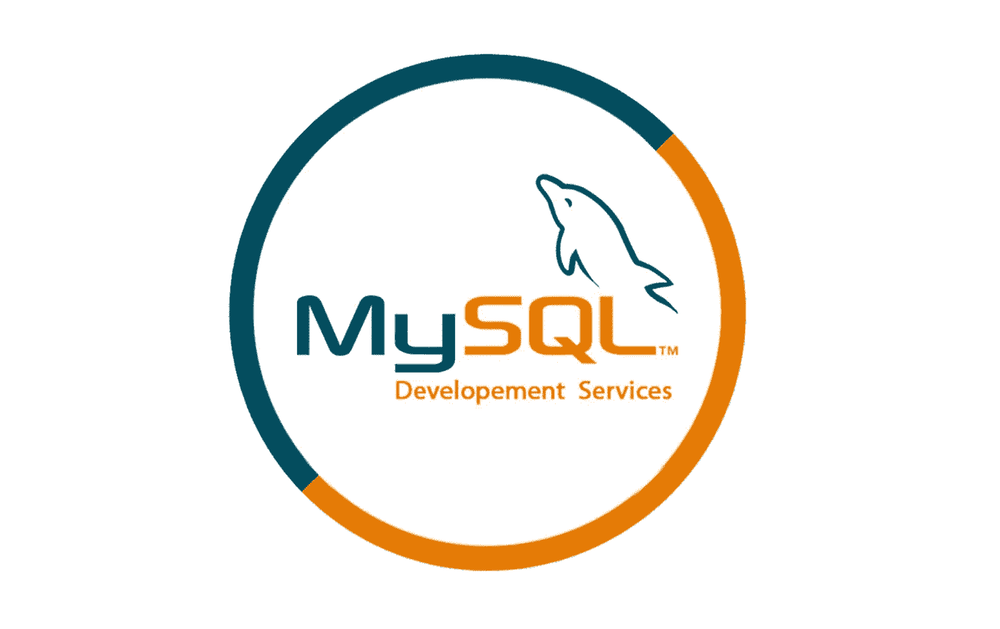

# 使用 SQL-MySql 快速分析数据

> 原文：<https://medium.com/codex/using-sql-mysql-to-analyze-data-quickly-6a9a93fa1700?source=collection_archive---------20----------------------->

# 介绍

为了处理存储在关系数据库管理系统(RDBMS)中的数据或处理关系数据流管理系统中的数据流，需要结构化查询语言(SQL)，一种具有专门领域的编程语言(RDSMS)。当处理涉及实体和变量之间关系的结构化数据时，它非常有用。

Edgar F. Codd 向 Donald D. Chamberlin 和 Raymond F. Boyce 教授了关系模型，他们在 20 世纪 70 年代早期在 IBM 开发 SQL 时使用了这种模型。开发这个版本是为了访问和管理 System R 中的数据，System R 是 IBM 最初的准关系数据库管理系统，由该公司圣何塞研究实验室的一个团队在 20 世纪 70 年代建立。它最初被称为 SEQUEL(结构化英语查询语言)。

# 用于数据分析的 SQL

用于数据分析的 SQL 指的是数据库查询语言一次连接几个数据库的能力及其对关系数据库的使用。最流行和最灵活的语言之一是 SQL，因为它结合了令人惊讶的低学习曲线和复杂的深度，使用户能够为数据分析构建有效的工具和仪表板。

为了快速构造数据库并与之交互，SQL 被开发成了各种各样的专有工具，每种工具都有自己的功能和利基市场。其中包括众所周知的 MySQL、Microsoft Access 和 PostgreSQL 工具。

除了是一种简单的语言，可以执行令人惊讶的复杂数据操作，SQL 仍然经常被使用，因为它可以快速地创建数据库并与之交互。

# 为什么要学 SQL？

微软、戴尔和埃森哲只是众多选择 SQL 的企业中的一小部分；它被广泛使用。它已经存在了大约 50 年，是目前使用的最古老的编程语言之一。

尽管 SQL 技能的主要用途是那些必须与关系数据库打交道的数据专业人员，但它在许多其他职位和行业中都是有益的，比如市场营销、业务分析和 web 开发。无论你是想在数据方面开始一个全新的职业，还是想在目前的职位上有所提升，SQL 都能帮到你。

# 为 SQL 释放资源

这里是提高 SQL 技能的两大资源。

1.  **w3School:**【https://www.w3schools.com/sql/】T2
2.  **爪哇**:[https://www.javatpoint.com/sql-tutorial](https://www.javatpoint.com/sql-tutorial)

如果你对此有任何意见，请在下面的评论区与我联系。

— —如果这篇文章对你有所帮助，考虑把它发给你关心的两个朋友。

> 免责声明:此内容仅用于教育目的和教学，这是非盈利性的教育博客，我无意不尊重任何人或紫罗兰任何文案问题。