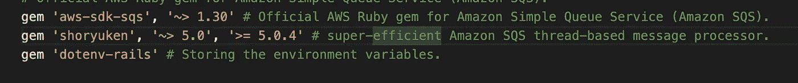
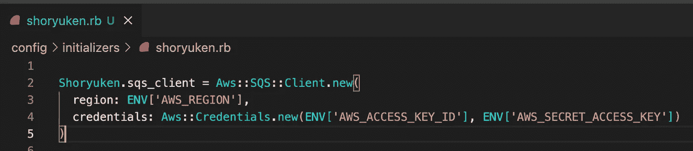
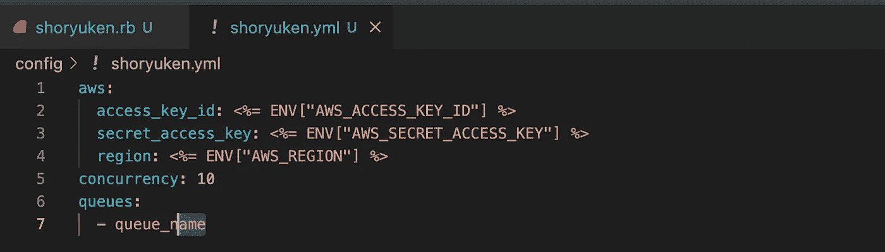
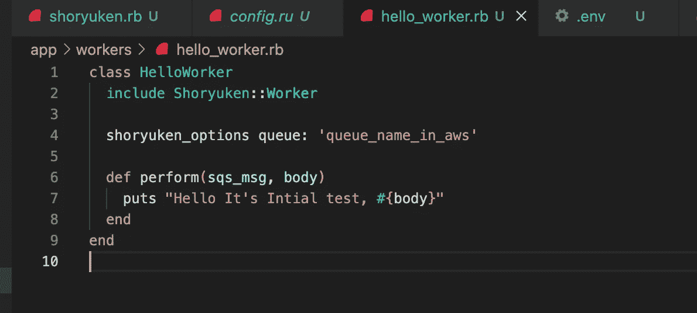
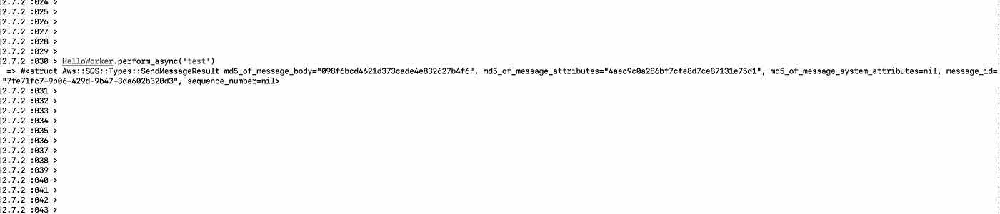
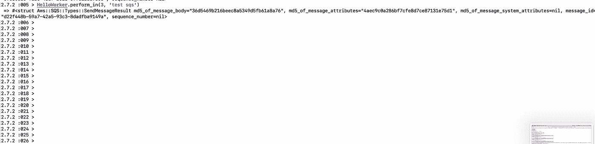
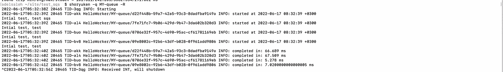

# 在 Rails 中使用 SQS 和 Shoryuken(基础)

> 原文：<https://medium.com/codex/using-sqs-with-shoryuken-in-rails-basics-78ab87cd8734?source=collection_archive---------7----------------------->

后台作业是在不影响系统正常操作的情况下在后台运行的过程，并向用户返回快速响应，它用于减少手动工作并使过程自动化。

> 为后台作业设置队列的最佳方式之一是亚马逊简单队列服务(SQS ),它是一种完全托管的消息队列服务，使您能够分离和扩展微服务、分布式系统和无服务器应用程序。在中阅读更多关于**的好处**

Shoryuken 是 ruby gem，帮助我们轻松地与 SQS 一起工作，它是一个超级高效的[亚马逊 SQS](https://aws.amazon.com/sqs/) 基于线程的消息处理器，支持持续轮询和基于线程的处理。

**让我们开始吧**

首先，我们需要将这些 gem 添加到 gem 文件中，并运行软件包安装:

**设置 Shoryuken 配置**

您可以在初始化器中使用凭据指定 Shoryuken.sqs_client，如下所示:

或者在`shoryuken.yml`文件中定义如下:

现在让我们这样定义我们的工人:

并确保队列名称与 AWS 中的队列名称相同，或者您可以通过 Shoryuken 添加:[configuring-queues-in-Shoryuken](https://github.com/ruby-shoryuken/shoryuken/wiki/Multiple-ways-of-configuring-queues-in-Shoryuken)。

现在我们可以调用我们的工人，将一条消息排队，然后像这样发送到 SQS`HelloWorker.perform_async('test sqs')`

**HelloWorker.perform_async('测试 sqs')**

或者，如果我们需要添加延迟来运行 worker，我们可以这样使用:

`HelloWorker.perform_in(interval(delay_seconds), 'test sqs')`

你好，工作人员。执行 _in( **3** 、 **'** 测试 sqs **'** )

**启动 Shoryuken**

`shoryuken -q queue_name_in_aws -R`

在 [Shoryuken-options](https://github.com/ruby-shoryuken/shoryuken/wiki/Shoryuken-options) 中阅读更多选项

> 通过运行 shoryuken，它将使用和接收来自 SQS 的消息，并通过调用 perform 方法和传递 sqs_msg 和 body 来开始处理它们。

好了🤷‍♂️，你可以深入参考和 shoryuken [宝石](https://github.com/ruby-shoryuken/shoryuken)和定制它与你需要的。

我希望这篇文章对 SQS 有所帮助。祝你今天愉快 ☀️.