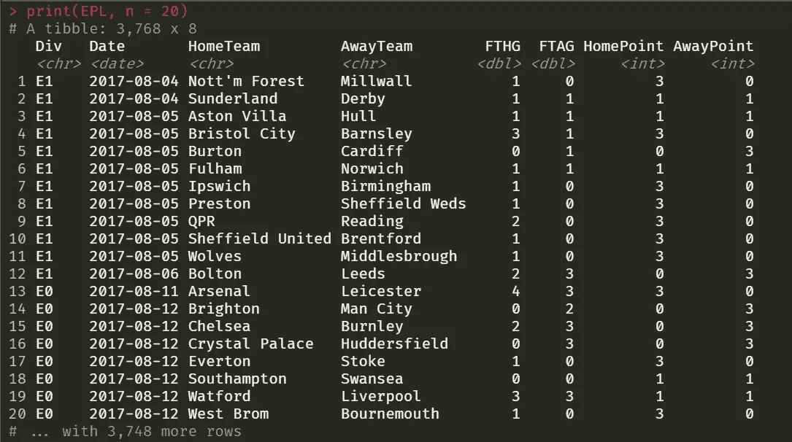
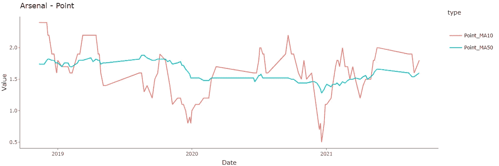
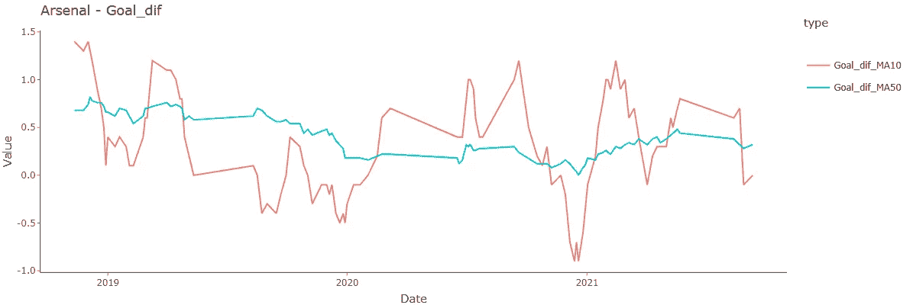
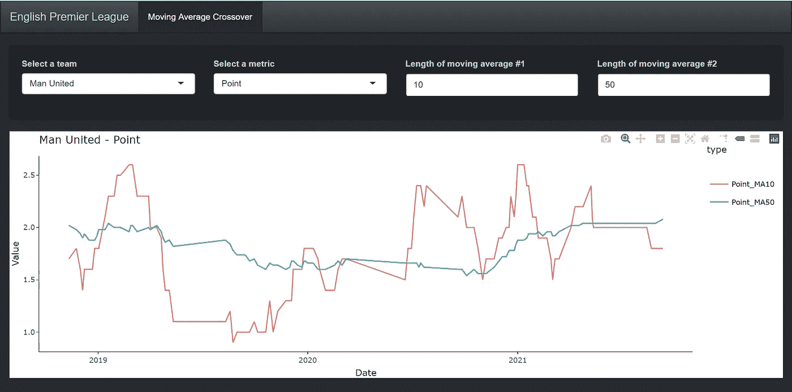

# 在足球中使用技术分析技巧

> 原文：<https://medium.com/codex/using-technical-analysis-techniques-in-football-5ead6c6d7af5?source=collection_archive---------10----------------------->


照片由[奥马尔·拉姆](https://unsplash.com/@lazyomar?utm_source=medium&utm_medium=referral)在 [Unsplash](https://unsplash.com?utm_source=medium&utm_medium=referral) 上拍摄

## 英格兰超级联赛中基于动量的球队实力可视化方法

简单移动平均线(SMA)指标是基于动量交易策略的简单而强大的工具。我既不支持也不反对在金融领域使用技术分析、基于动量的策略等，因为如果交易者足够熟练，几乎每种交易策略都有其使用案例。但是跳出它通常的应用范围，我认为尝试将它应用于英格兰超级联赛(EPL)足球(美国读者的足球)会很酷。

## 动量交易的简要介绍

*免责声明:这个非常简短的介绍绝不是财务建议。请不要这样使用它。在没有做好自己的研究之前，你不应该进入任何金融市场。投资可能有风险，你可能会失去你投资的东西。*

[动量交易](https://www.investopedia.com/trading/introduction-to-momentum-trading/)通常是一种短期交易策略，交易者试图买入上涨的股票，并在股价见顶时卖出。有很多方法可以确定哪些股票似乎在上涨，哪些股票已经见顶。一种方法是简单的移动平均线交叉技术，交易者从股票的时间序列数据中计算出两条不同的移动平均线。其中一个应该是“更长”的移动平均值，这意味着它应该在计算中使用比另一个更多的数据，例如 MA10 和 MA50。基本的想法是，当短均线穿过长均线时买入，反之亦然。[1]
让我们试着把这个想法应用到足球上。

# EPL 足球应用

撇开整个赌博的角度，很明显，我们不能*买一支正在上升的球队*，或者类似的，在它达到顶峰时卖出。然而，我们可以尝试使用移动平均交叉技术来了解团队的当前形式/实力。有几种方法可以做到这一点。在这里给出的例子中，我将只可视化四个不同的“指标”。一个是球队每场比赛的分数，其他三个是基于分数，即球队的进球，球队的进球，以及净胜球，即进球减去进球。我将在本文后面讨论可以使用的其他指标。此外，我选择通过在 R 中创建一个闪亮的应用程序来呈现这种可视化，以给分析一种更动态的感觉。[2，3，4，5]
不幸的是，这款闪亮的应用目前没有托管在任何地方，但回购可以在 [my Github](https://github.com/MoAnd) 上公开获得。

我会把团队解释为*在* *上升*时，短均线穿过长均线，反之亦然，就像普通股票一样，但我的目的不是买入或卖出，而是想象团队形态模式。显然，选择不同长度的均线会使结果有很大的不同，但事实上，这也是动量技术，尤其是交叉策略，更像是一种艺术形式，而不是简单的致富公式。

## 数据

我使用下面的 R 代码直接从[football-data.co.uk](https://www.football-data.co.uk/)获得了足球数据。[6]

```
EPL <- read_csv("[https://www.football-data.co.uk/mmz4281/2122/E0.csv](https://www.football-data.co.uk/mmz4281/2122/E0.csv)") %>%
  bind_rows(read_csv("[https://www.football-data.co.uk/mmz4281/2021/E0.csv](https://www.football-data.co.uk/mmz4281/2021/E0.csv)")) %>%
  bind_rows(read_csv("[https://www.football-data.co.uk/mmz4281/2021/E1.csv](https://www.football-data.co.uk/mmz4281/2021/E1.csv)")) %>%
  bind_rows(read_csv("[https://www.football-data.co.uk/mmz4281/1920/E0.csv](https://www.football-data.co.uk/mmz4281/1920/E0.csv)")) %>%
  bind_rows(read_csv("[https://www.football-data.co.uk/mmz4281/1920/E1.csv](https://www.football-data.co.uk/mmz4281/1920/E1.csv)")) %>%
  bind_rows(read_csv("[https://www.football-data.co.uk/mmz4281/1819/E0.csv](https://www.football-data.co.uk/mmz4281/1819/E0.csv)")) %>%
  bind_rows(read_csv("[https://www.football-data.co.uk/mmz4281/1819/E1.csv](https://www.football-data.co.uk/mmz4281/1819/E1.csv)")) %>%
  bind_rows(read_csv("[https://www.football-data.co.uk/mmz4281/1718/E0.csv](https://www.football-data.co.uk/mmz4281/1718/E0.csv)")) %>%
  bind_rows(read_csv("[https://www.football-data.co.uk/mmz4281/1718/E1.csv](https://www.football-data.co.uk/mmz4281/1718/E1.csv)")) %>%
  mutate(
    Date = dmy(Date),
    HomePoint = case_when(
      FTR == "H" ~ 3L, 
      FTR == "D" ~ 1L, 
      FTR == "A" ~ 0L
    ),
    AwayPoint = case_when(
      FTR == "A" ~ 3L, 
      FTR == "D" ~ 1L, 
      FTR == "H" ~ 0L
    )
  ) %>%
  arrange(Date, Time) %>%
  select(Div, Date, HomeTeam, AwayTeam, 
         FTHG, FTAG, HomePoint, AwayPoint)teams <- EPL %>% 
  filter(Div == "E0") %>% 
  distinct(HomeTeam) %>% 
  pull() %>% 
  sort()
```

上面的 R 代码生成了一个历史 EPL 匹配、其结果以及它们之间匹配点分布的数据集。我也包括了英格兰冠军赛，以便有一个完整的 EPL 升班马的数据集。



显示 EPL 数据集的 R 控制台的屏幕截图(按作者)

## r 函数

首先，让我介绍一下 Shiny 应用程序中使用的两个主要 R 函数中的第一个:`get_team_ma_scores`。此函数使用 EPL 数据集并计算团队的移动平均值。

```
get_team_ma_scores <- function(df, team, ma = c(10L, 50L)) {
  #' Get Team Moving Average Scores
  #' 
  #' Function to filter out a given teams' scores and calculate 
  #' moving averages of these scores.  
  #' 
  #' [@param](http://twitter.com/param) df Dataframe containing the EPL scores data.
  #' [@param](http://twitter.com/param) team string. The name of the team.
  #' [@param](http://twitter.com/param) ma numeric. The length of the two moving averages.
  #' 
  #' [@author](http://twitter.com/author) Morten Andersen

  first_ma_slide <- 
    timetk::slidify(mean, .period = ma[1], .align = "right")
  second_ma_slide <- 
    timetk::slidify(mean, .period = ma[2], .align = "right")

  ll <- list()
  ll[[paste0("MA", ma[1])]] <- first_ma_slide
  ll[[paste0("MA", ma[2])]] <- second_ma_slide

  df %>% 
    filter(
      str_detect(HomeTeam, pattern = team) | 
        str_detect(AwayTeam, pattern = team)
    ) %>% 
    mutate(
      Goal = if_else(HomeTeam == team, FTHG, FTAG),
      Goal_against = if_else(HomeTeam == team, FTAG, FTHG),
      Goal_dif = Goal - Goal_against,
      Point = if_else(HomeTeam == team, HomePoint, AwayPoint)
    ) %>% 
    select(-FTHG, -FTAG, -HomePoint, -AwayPoint) %>% 
    mutate(across(starts_with(c("Goal", "Point")), .fns = ll))
}
```

接下来，我们需要可视化移动平均线。这是通过第二个 R 函数`create_crossover_plot`完成的。

```
create_crossover_plot <- function(df, metric, team) {
  #' Create Moving Averages Crossover Plot
  #' 
  #' Function to prepare the data based on selections and
  #' then create the moving averages crossover plot. 
  #' 
  #' [@param](http://twitter.com/param) df Dataframe containing a team's moving average scores.
  #' [@param](http://twitter.com/param) metric string. The type of metric to show.
  #' [@param](http://twitter.com/param) team string. The name of the team.
  #' 
  #' [@author](http://twitter.com/author) Morten Andersen

  p <- na.omit(df) %>% 
    select(Date, starts_with(metric)) %>%
    pivot_longer(cols = starts_with(paste0(metric, "_MA")),
                 names_to = "type",
                 values_to = "Value") %>%
    ggplot(aes(x = Date, y = Value, col = type)) +
    ggtitle(paste(team, metric, sep = " - ")) +
    geom_path() +
    theme_classic()

  plotly::ggplotly(p)
}
```

现在，使用输入`team = 'Arsenal'`和
`metric = 'Point'`的这两个函数生成(截至 2021 年 9 月 17 日)以下阿森纳的移动平均交叉图。



阿森纳的点移动平均线交叉图(作者)

看看阿森纳的点移动平均线的交叉图，我们会得出结论，阿森纳目前正处于一个不错的时期，开始于他们在 2021 年春末*上升，*即跨越*，*。这意味着阿森纳目前每场比赛得到的分数比他们的长期(移动)平均值显示的要多。然而，用相同的均线长度看不同的指标，我们会得到不同的结论。下面显示的是阿森纳的净胜球移动平均线交叉图，它显示阿森纳最近已经交叉低于他们的长期净胜球平均线，即他们目前正在以比平时更低的净胜球结束比赛。从更广泛的角度来看，我们确实从两个不同的指标中看到了相同的一般模式，但是由于净胜球和积分具有非常高的相关性，这并不奇怪。这个小案例研究显示了尝试不同指标和移动平均长度的重要性，以及对数据的解释有一点怀疑的重要性。



阿森纳净胜球移动平均线的交叉图(作者)

## 闪亮的应用

让我们在一个闪亮的应用程序中把它们拼凑在一起，以获得跨多个团队的动态、交互式分析。
首先，UI 部分:

```
ui <- function(){
  navbarPage(
    title = "English Premier League",
    theme = shinytheme("slate"),
    tabPanel(
      title = "Moving Average Crossover",
      wellPanel(
        fluidRow(
          useSever(),
          column(
            width = 3,
            selectInput(
              "team",
              label = "Select a team",
              choices = teams,
              selected = teams[1]
            )
          ),
          column(
            width = 3,
            selectInput(
              "metric",
              label = "Select a metric",
              choices = c("Point","Goal","Goal_against","Goal_dif"),
              selected = "Point"
            )
          ),
          column(
            width = 3,
            numericInput(
              "ma1",
              label = "Length of moving average #1",
              value = 10L,
              min = 2L,
              max = 30L
            )
          ),
          column(
            width = 3,
            numericInput(
              "ma2",
              label = "Length of moving average #2",
              value = 50L,
              min = 10L,
              max = 100L
            )
          )
        )
      ),
      plotlyOutput("crossover_plot") %>% withSpinner()
    )
  )
}
```

接下来，服务器逻辑:

```
server <- function(input, output, session){ 
  team_df <- reactive({
    get_team_ma_scores(
      df = EPL,
      team = input$team,
      ma = c(input$ma1, input$ma2)
    )
  })
  output$crossover_plot <- renderPlotly(
    create_crossover_plot(
      df = team_df(),
      metric = input$metric,
      team = input$team
    )
  )
  sever(opacity = 0.85) 
}
```

最后，这产生了以下交互式英超联赛-移动平均线交叉闪亮的应用程序。



闪亮应用的屏幕截图(作者)

闪亮应用的完整项目代码可以在这里看到:[https://github.com/MoAnd/EPL_MA_Crossover](https://github.com/MoAnd/EPL_MA_Crossover)

## 扩展ˌ扩张

如前所述，只有想象力(和数据捕捉能力)才能为用移动平均交叉技术表示的指标设置限制。例如，我们可以从[沙发评分](https://www.sofascore.com)或[足球评论家](https://www.footballcritic.com)中查看团队或个人球员的得分。其他与足球相关的统计也可能是感兴趣的，例如预期进球(xGoals)、射门、命中目标射门等。此外，有时检查滚动中位数而不是平均值可能是有益的，特别是如果您有几个严重影响平均值的观察值(异常值)。

# 参考

[1]亚当·巴隆，《动量交易入门》(2021 年 9 月访问)，Investopedia，[https://www . Investopedia . com/Trading/Introduction-to-Momentum-Trading/](https://www.investopedia.com/trading/introduction-to-momentum-trading/)。

[2] R 核心团队，“R:统计计算的语言和环境”(2021)，奥地利维也纳 R 统计计算基金会。网址[https://www.R-project.org/](https://www.r-project.org/)。

[3] Wickham 等人，“欢迎来到 tidyverse”(2019)，《开源软件杂志》，4(43)，1686。

[4]温斯顿·张，，JJ·阿莱，卡森·西弗特，巴雷特·施洛克，谢一辉，，乔纳森·麦克弗森，艾伦·迪佩特，和芭芭拉·博尔赫斯，闪亮:Web 应用框架 R (2021)，R 包版本 1.6.0。【https://CRAN.R-project.org/package=shiny 号

[5] C. Sievert，与 R、plotly 和 shiny (2020 年)合作的基于网络的交互式数据可视化，Chapman and Hall/CRC 佛罗里达。

[6]Football-Data.co.uk(2021 年 9 月访问)，https://www.football-data.co.uk/englandm.php.