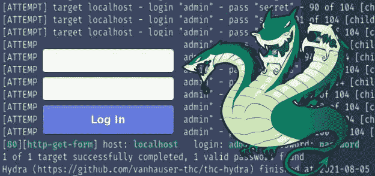
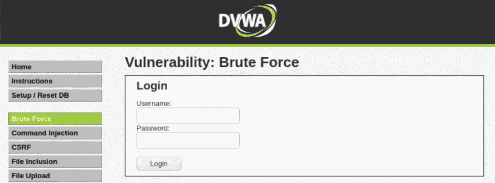
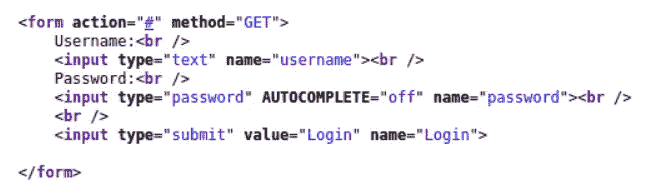
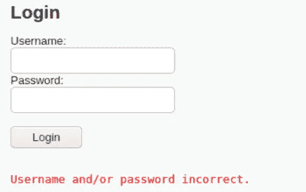
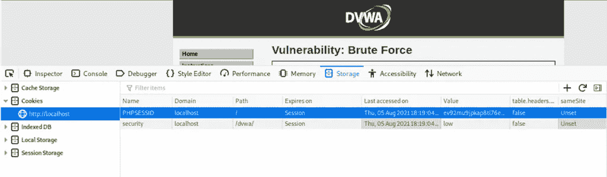
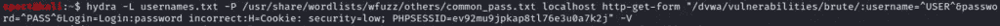
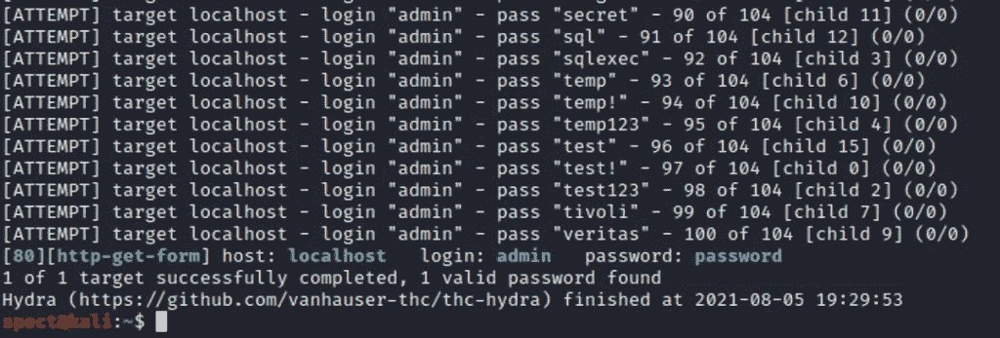

# 使用 THC Hydra 暴力破解登录表单

> 原文：<https://medium.com/codex/using-thc-hydra-to-brute-force-login-forms-7ee9c28a863c?source=collection_archive---------0----------------------->

THC Hydra 是一个用于登录表单的强大工具。它可以对不同类型的应用程序和服务执行暴力和字典攻击。

当 web 应用程序依赖用户名和密码作为其唯一的防线时，pentester 或恶意用户可以使用 Hydra 对其进行字典攻击。这将允许他们检索现有用户的凭据，然后利用这些凭据对受限页面进行未经授权的访问。



Hydra 不仅可以攻击 web 表单，还可以攻击许多其他协议，包括 SSH、SMB、FTP 等等。然而，在本文中，我们将只关注攻击 web 应用程序登录表单。

# 正在下载 THC Hydra

Hydra 与 Windows、macOS 和 Linux 兼容。

如果您使用的是 Kali Linux，那么您应该已经安装了 Hydra。

如果没有，那么你可以通过访问该产品的[官方 Github 库](https://github.com/vanhauser-thc/thc-hydra)并查看最新版本来下载。

下载完成后，您可以通过依次运行以下命令来编译和安装 Hydra:

```
./configure
make
make install
```

您可能还需要安装一些依赖项，以便 Hydra 正常工作。

下面是为基于 Debian 的发行版运行的命令。如果这些不适合您，您应该为您的发行版寻找等效的库。

```
apt-get install libssl-dev libssh-dev libidn11-dev libpcre3-dev libgtk2.0-dev libmysqlclient-dev libpq-dev libsvn-dev firebird-dev libmemcached-dev libgpg-error-dev libgcrypt11-dev libgcrypt20-dev
```

为了有一个我们可以测试 Hydra 的 web 应用程序，我将使用 **DVWA** 。这是一个易受攻击的 web 应用程序，您可以使用它来针对真实的目标合法地测试您的黑客技术。如果您想在您自己的环境中重现我将在这里介绍的步骤，您可以继续并下载它。否则，你可以跟着走。

现在我们已经准备好了一切，让我们开始吧。

# 识别表单参数

好了，现在我们要攻击下面的登录表单:



它位于我的本地机器的以下 URL 中:[http://localhost/DVWA/vulnerabilities/brute/](http://localhost/DVWA/vulnerabilities/brute/)

我们需要做的第一件事是确定表单参数，以及使用的方法。有许多方法可以做到这一点。

对于我们的例子，我们将检查页面的源代码，然后尝试定位与我们的登录表单相关联的代码块。

以下是我们得到的信息:



那么，我们能从中推断出什么呢？

首先，我们可以看出表单使用了 GET 方法。

我们还知道当提交时，表单重定向到同一个页面(我们可以从分配给“action”的值“#”中推断出这一点)。

最后，我们知道我们有三个参数:

*   **用户名:**这将具有用户名值。
*   **密码:**这个会有密码值。
*   **登录:**这与提交按钮相关联，并且将具有固定值“**登录**

# 获取单词表

每当您打算使用 THC Hydra 执行字典攻击时，您将有两种选择。

根据您可能从目标那里获得或没有获得的信息，您可以:

1.  为 Hydra 提供两个文件，(也称为单词列表):一个包含候选用户名列表，另一个包含候选密码；
2.  或者，如果您足够幸运地知道一个用户名，您可以只为它提供一个密码单词列表和一个用户名。注意，您也可以反过来做，这意味着您可以为可能的用户提供单个密码和一个单词列表(这在密码喷射攻击中非常有用)。

对于我们的例子，我们不知道用户名，所以我们将使用选项 1，因此我们将提供 2 个单词列表。

当我们启动 hydra 时，它将尝试这两个单词列表中存在的所有用户名和密码组合。

如果您没有用户名和密码的词汇表，您可以从 [SecLists](https://github.com/danielmiessler/SecLists) 下载您需要的内容。这是各种字典攻击的单词表集合。

# 编写 THC Hydra 命令

现在我们已经拥有了所有需要的元素，让我们创建我们的九头蛇指挥部。

运行 hydra 来强制登录表单的语法如下:

```
hydra -L USERFILE -P PASSWORDFILE DOMAIN/IP METHOD "REDIRECTIONURL:PARAMETERS:FAILMESSAGE:H=COOKIES"
```

以下是每个元素的含义:

*   USERFILE:候选用户名的单词列表。
*   PASSWORDFILE:候选密码的单词列表。
*   DOMAIN/IP:目标 web 应用程序的域名或 IP 地址。对于我们的例子，这是“本地主机”。
*   方法:因为我们有一个 GET 方法，我们将在这里使用 http-get-form。如果我们有 POST，我们会使用 http-post-form。
*   REDIRECTIONURL:这是在按下 submit 后表单将我们重定向到的完整 URL。因此，对于我们的例子，我们将使用“/DVWA/vulnerabilities/brute/”。
*   参数:这是我们将要输入参数的地方。这将等同于以下内容:“username=^USER^&password=^PASS^&login=login”，其中^user^和^pass^分别是用户名和密码单词列表中值的占位符。
*   FAILMESSAGE:这是当我们输入不正确的凭据时，web 应用程序显示的错误消息。这就是 Hydra 如何知道它得到了正确的用户名和密码。要获得此消息，我们只需用不正确的凭据填写表单。当我们试图在我们的目标上这样做时，我们得到以下消息:



*   COOKIES:这个值并不总是必需的，但有时可能是必需的。例如，如果您需要通过身份验证才能访问您的目标页面，那么您需要向 Hydra 提供与您的身份验证会话相关的 cookies。否则，它将无法访问该页面。因此，要检索用于 cookie 的值，您应该右键单击 web 页面并选择 Inspect。在出现的开发工具上，选择存储选项，然后单击 cookies(此方法可能因您的 web 浏览器而异)。按照这个过程，我得到了以下结果:



# 发起攻击

现在，我们的命令应该是这样的:



我在命令末尾添加了-V 标志，用于详细输出。这告诉 Hydra 不仅要在屏幕上显示找到的凭证，还要显示所有失败的尝试。

当我们启动命令时，我们应该看到 Hydra 尝试用户名和密码的组合。

几次尝试后，Hydra 找到了正确的用户名和密码。



正如这篇文章所展示的，我们之所以成功，是因为用户名和密码简单得可笑。如果有足够的复杂性，我们将花费更多的时间来找到正确的凭证。

# 结论

开发 THC Hydra 是为了证明破解密码是多么容易。它支持许多功能，包括许多具有有趣特性的模块。在这篇文章中，我们仅仅触及了皮毛。

如果你想更全面地了解九头蛇的能力，我邀请你阅读帮助:

```
hydra -h
```

*原载于 2021 年 8 月 6 日*[*【https://patchthenet.com】*](https://patchthenet.com/articles/using-thc-hydra-to-brute-force-login-forms/)*。*