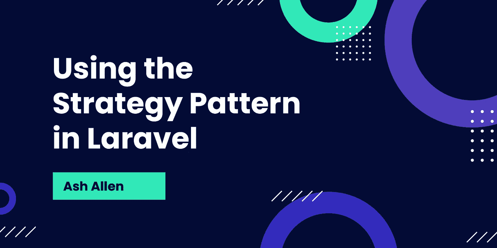

# 使用 Laravel 中的策略模式

> 原文：<https://medium.com/codex/using-the-bridge-pattern-in-laravel-8fbe484817f1?source=collection_archive---------1----------------------->



# 介绍

在软件和 web 开发中，编写可维护和可扩展的代码总是很重要。您最初创建的解决方案可能会随着时间的推移而改变。所以，你需要确保你写代码的方式在将来不需要整个重写或重构。

**策略模式**可以用来提高代码的可扩展性，也可以随着时间的推移提高可维护性。

# 目标受众

这篇文章是为 Laravel 开发人员写的，他们了解接口是如何工作的，以及如何使用它们来解耦你的代码。如果你对这个主题有点不确定，看看我上周的帖子，讨论了[使用接口编写更好的 PHP 代码](https://ashallendesign.co.uk/blog/using-interfaces-to-write-better-php-code)。

强烈建议您理解[依赖注入](https://laravel.com/docs/8.x/controllers#dependency-injection-and-controllers)以及 [Laravel 服务容器](https://laravel.com/docs/8.x/container#introduction)如何工作。

# 什么是策略模式？

[重构大师](https://refactoring.guru/design-patterns/strategy)将策略模式定义为“行为设计模式，它让你定义一系列算法，将每一个算法放入一个单独的类，并使它们的对象可以互换”。这一开始听起来可能有点可怕，但我保证没有你想象的那么糟糕。如果你想深入了解设计模式，我强烈推荐你去看看重构大师。他们在深入解释策略模式以及其他结构模式方面做得很好。

策略模式基本上是一种帮助我们分离代码并使其具有超级可扩展性的模式。事实上，你可能每天都在使用它，甚至在使用`Storage`和`Cache`立面(以及其他一些地方)时都没有注意到。假设您使用以下代码:

```
Cache::put('name', 'Ash Allen', 600);
```

上面的代码通过使用 [facade](https://laravel.com/docs/8.x/facades#introduction) 从服务容器中解析一个类。我不会深入探讨 facade 是如何工作的，因为这不是本文的真正目的，但是需要知道的重要一点是，这里的`Cache` facade 将一个接口(`Illuminate\Contracts\Cache\Factory`具体来说)绑定到一个类并使用它。然后在关键字' *name* 下存储单词'*Ash Allen*' 10 分钟。

正如你可能在 [Laravel 文档](https://laravel.com/docs/8.x/cache#introduction)和你的项目配置中注意到的，Laravel 支持一些不同的缓存驱动，包括: [Redis](https://redis.io/) 、 [DynamoDB](https://aws.amazon.com/dynamodb/) 、 [Memcached](https://memcached.org/) 和数据库。例如，如果我们在*中设置缓存驱动程序。env* 文件到`CACHE_DRIVER=redis`，当我们运行上面的代码片段时，数据将存储在我们的 Redis 缓存中。然而，如果我们将驱动程序改为`CACHE_DRIVER=database`，这将导致数据存储在数据库中。

每个不同的缓存驱动程序都有自己的类，处理框架如何与缓存交互。所以，当我们在我们的*里换驱动的时候。env* ，Laravel 需要知道使用哪个驱动。这就是策略模式介入的地方。在幕后，每当我们使用`Cache`外观时，Laravel 实际上是从服务容器解析一个`Illuminate\Contracts\Cache\Factory`接口。它通过检查配置值(例如 *redis* 、*数据库*等)来实现这一点。)然后将该接口映射到一个类。例如，每当我们将缓存驱动程序设置为`CACHE_DRIVER=redis`并尝试解析`Factory`接口时，我们将获得一个专门与 Redis 缓存交互的类，除此之外别无其他。

如您所见，策略模式可以提高代码的可扩展性。例如，如果我们想创建自己的自定义缓存驱动程序，我们可以只创建实现，然后让 Laravel 知道它可供使用。关于更多的上下文，[查看 Laravel 文档](https://laravel.com/docs/8.x/cache#adding-custom-cache-drivers)，看看如何添加你自己的驱动程序的例子。

# 使用 Laravel 中的策略模式

现在我们对策略模式有了一个基本的概念，让我们看看如何在我们自己的 Laravel 应用程序中使用它。

假设我们有一个 Laravel 应用程序，用户可以使用它来获取汇率和货币转换。现在，假设我们的应用程序使用一个外部 API ( [exchangeratesapi.io](https://exchangeratesapi.io) )来获取最新的货币转换。

我们可以创建这个类来与 API 交互:

```
class ExchangeRatesApiIO
{
    public function getRate(string $from, string $to): float
    {
        // Make a call to the exchangeratesapi.io API here and fetch
        // the exchange rate. return $rate;
    }
}
```

现在，让我们在控制器方法中使用这个类，这样我们就可以返回给定货币的汇率。我们将使用依赖注入来解析容器中的类:

```
class RateController extends Controller
{
    public function __invoke(ExchangeRatesApiIO $exchangeRatesApiIO): JsonResponse
    {
        $rate = $exchangeRatesApiIO->getRate(
            request()->from,
            request()->to,
        ); return response()->json(['rate' => $rate]);
    }
}
```

这段代码将按预期工作，但是我们已经将`ExchangeRatesApiIO`类与控制器方法紧密耦合。这意味着，如果我们决定迁移到使用不同的 API，比如 [Fixer](https://fixer.io) ，在未来，我们将需要用我们的新类替换代码库中所有使用`ExchangeRatesApiIO`类的地方。可以想象，在大型项目中，这有时会是一项缓慢而乏味的任务。因此，为了避免这个问题，我们可以使用策略模式来绑定和解析接口，而不是尝试在控制器方法中实例化一个类。

让我们首先创建一个新的`ExchangeRatesService`界面:

```
interface ExchangeRatesService
{
    public function getRate(string $from, string $to): float;
}
```

我们现在可以更新我们的`ExchangeRatesApiIO`类来实现这个接口:

```
class ExchangeRatesApiIO implements ExchangeRatesService
{
    public function getRate(string $from, string $to): float
    {
        // Make a call to the exchangeratesapi.io API here and fetch the exchange rate. return $rate;
    }
}
```

现在我们已经完成了，我们可以更新我们的控制器方法来注入接口而不是类:

```
class RateController extends Controller
{
    public function __invoke(ExchangeRatesService $exchangeRatesService): JsonResponse
    {
        $rate = $exchangeRatesService->getRate(
            request()->from,
            request()->to,
        ); return response()->json(['rate' => $rate]);
    }
}
```

当然，我们不能实例化一个接口；我们想要实例化`ExchangeRatesApiIO`类。因此，每当我们试图从容器中解析接口时，我们需要告诉 Laravel 该做什么。我们可以通过使用[服务提供者](https://laravel.com/docs/8.x/providers#introduction)来做到这一点。有些人更喜欢将这样的东西放在他们的`AppServiceProvider`中，并将他们所有的绑定放在一个地方。然而，我更喜欢为我想要创建的每个绑定创建一个单独的提供者。这纯粹是个人喜好，你觉得什么更适合你的工作流程。对于本例，我们将创建自己的服务提供商。

让我们使用 Artisan 命令创建一个新的服务提供者:

```
php artisan make:provider ExchangeRatesServiceProvider
```

然后我们需要记住在`app/config.php`中注册这个服务提供商，如下所示:

```
return [

    'providers' => [
        // ...
        \App\Providers\ExchangeRatesServiceProvider::class,
        // ...
    ],

];
```

现在，我们可以向服务提供者添加代码来绑定接口和类:

```
class ExchangeRatesServiceProvider extends ServiceProvider
{
    public function register(): void
    {
        $this->app->bind(ExchangeRatesService::class, ExchangeRatesApiIO::class);
    }
}
```

现在我们已经完成了所有这些，当我们在控制器方法中依赖注入`ExchangeRatesService`接口时，我们将收到一个可以使用的`ExchangeRatesApiIO`类。

# 更进一步

既然我们知道了如何将一个接口绑定到一个类，让我们更进一步。让我们想象一下，只要我们想更新一个配置字段，就可以决定是使用 ExchangeRatesAPI.io 还是 Fixer.io API。

我们还没有处理 Fixer.io API 的类，所以让我们创建一个并确保它实现了`ExchangeRatesService`接口:

```
class FixerIO implements ExchangeRatesService
{
    public function getRate(string $from, string $to): float
    {
        // Make a call to the Fixer API here and fetch the exchange rate. return $rate;
    }
}
```

我们现在将在我们的`config/services.php`文件中创建一个新字段:

```
return [ //... 'exchange-rates-driver' => env('EXCHANGE_RATES_DRIVER'),];
```

我们现在可以更新我们的服务提供者，以更改每当我们从容器中解析接口时将返回的类:

```
class ExchangeRatesServiceProvider extends ServiceProvider
{
    public function register(): void
    {
        $this->app->bind(ExchangeRatesService::class, function ($app) {
            if (config('services.exchange-rates-driver') === 'exchangeratesapiio') {
                return new ExchangeRatesApiIO();
            }

            if (config('services.exchange-rates-driver') === 'fixerio') {
                return new FixerIO();
            }

            throw new Exception('The exchange rates driver is invalid.');
        });
    }
}
```

现在，如果我们在*中设置汇率驱动因素。env* 到`EXCHANGE_RATES_DRIVER=exchangeratesapiio`并尝试从容器中解析`ExchangeRatesService`，我们将收到一个`ExchangeRatesApiIO`类。如果我们在*中设置汇率驱动因素。env* 到`EXCHANGE_RATES_DRIVER=fixerio`并尝试从容器中解析`ExchangeRatesService`，我们将收到一个`FixerIO`类。如果我们不小心将 driver 设置为其他任何东西，就会抛出一个异常，让我们知道这是不正确的。

由于这两个类实现了相同的接口，我们可以无缝地更改*中的`EXCHANGE_RATES_DRIVER`字段。env* 文件，不需要在任何地方修改任何其他代码。

# 结论

你脑子炸了吗？如果是，不用担心！就我个人而言，当我第一次了解这个话题时，我觉得很难理解。我觉得直到我付诸实践，自己用了，才开始真正理解。所以，我建议你自己花点时间尝试一下。一旦你习惯了使用它，我保证你会开始在你自己的项目中使用它。

希望这篇文章已经向您概述了什么是策略模式，以及如何在 Laravel 中使用它来提高代码的可扩展性和可维护性。

如果你觉得这篇文章有用，我很乐意在评论中听到。

继续建造令人敬畏的东西！🚀

*最初发表于*[](https://ashallendesign.co.uk/blog/using-the-bridge-pattern-in-laravel)**。**