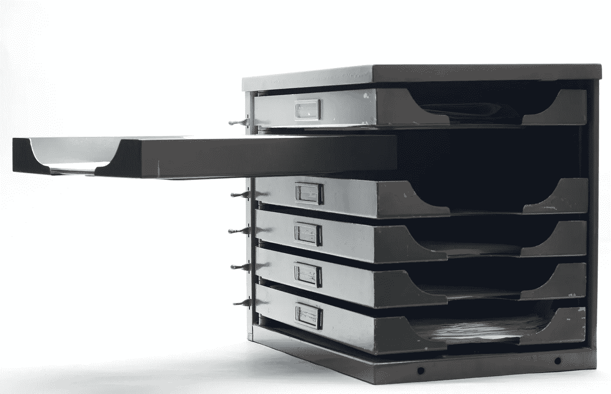

# 使用类似 Create-Table 的语句

> 原文：<https://medium.com/codex/using-the-create-table-like-statement-ff60a882b796?source=collection_archive---------12----------------------->

## 如何、何时以及为什么使用 BigQuery 函数

吉安卢卡·辛南特在 [Unsplash](https://unsplash.com/s/photos/copy?utm_source=unsplash&utm_medium=referral&utm_content=creditCopyText) 上拍摄的照片

使用 *creates table like* 语句，您可以将您的表复制到另一个具有相同元数据的表中。例如，如果您想要制作备份副本或归档数据，这可能会很有用。它也很好，你不必手动，但通过代码，是的，它也很容易自动化。