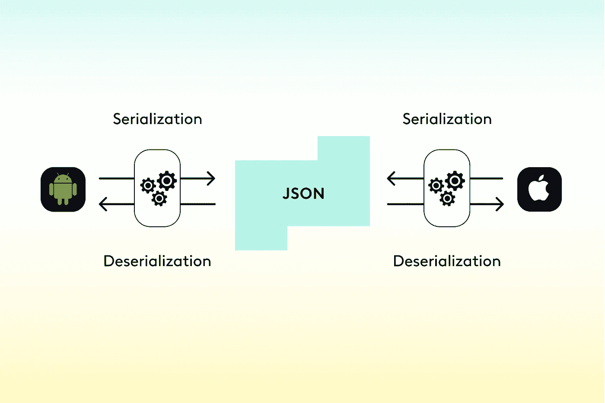
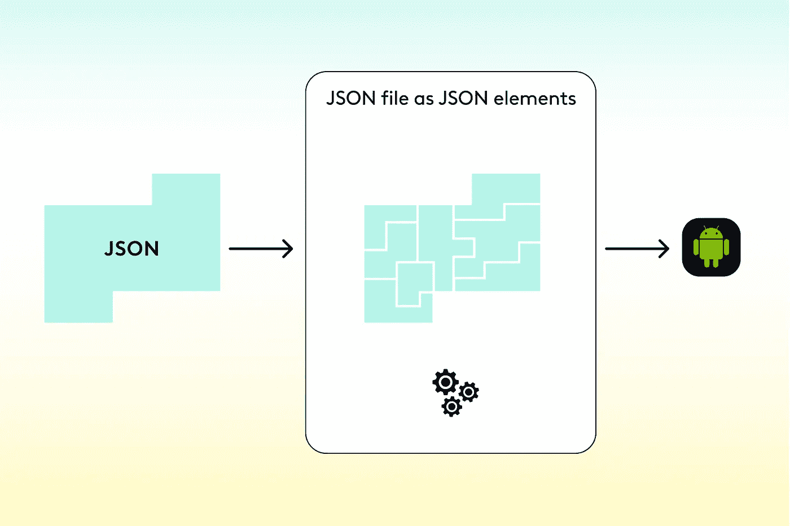

# 使用 Kotlin 序列化库进行严格的 JSON 序列化

> 原文：<https://medium.com/codex/using-the-kotlin-serialization-library-for-tough-json-serialization-82f8b7ae70dc?source=collection_archive---------0----------------------->

## 由[亚登·加维什](https://www.linkedin.com/in/yarden-gavish-6b2559227)

序列化——我们不能假装这是一个让许多人心跳加速的话题。

然而，如果你正在开发一个传递文件(比如通过服务器)或者保存信息到数据库的应用程序，序列化是不可避免的。

在这里，我们开发了照片和视频编辑应用程序。在我们这个时代，我们已经有了 Kotlin 序列化所能提供的最好(和最差)的第一手经验。

我们使用 [Kotlin 序列化](https://github.com/Kotlin/kotlinx.serialization)库，因为它与 Kotlin 兼容，具有比 Gson 或 Moshi 更快的运行时，并且可以在支持多平台的其他平台上运行。通常，默认的序列化程序会为我们做所有的工作。但是，当 JSON 文件与我们想要在 Kotlin 中表示它们的方式不同时，会有一些边缘情况迫使我们增加默认序列化的复杂性。

作为我们最新功能的一部分，我们需要创建跨平台的视频项目。这需要创建代表这些项目的平台无关的 JSON 文件。每个平台然后接收 JSON 文件，没有(或有限的)能力改变它们——使得转换到内存视频项目变得棘手。

JSON 文件跨 iOS 和 Android 两个平台使用。

在这篇文章中，我们将解释在处理不能直接映射到 Kotlin 对象的 JSON 文件时，如何处理棘手的序列化。具体来说，我们将探索在反序列化过程中使用`JsonTransformingSerializer`处理多态性和改变数据类型。

**多态性是怎么回事？**

让我们看一个视频项目对象的例子。这是一个简单的视频项目，由一系列层组成，特别是文本、音频和视频。JSON 文件如下所示:

从 JSON 的格式中，我们可以看到多态性是必需的。必须有一些通用的抽象层类型可以保存在一个列表中。每一层可以是音频、视频或文本。因此，我们可以尝试将`VideoProject`定义如下:

它由一系列层组成，其中`Layer`是一个抽象类。

每个特定的层都继承自这个抽象类。它们有一些相同的字段(如`startTime`和`duration`)，但它们也有一些特定于图层的字段。

这已经很好了，但是还不可序列化。

为了使其可序列化，我们首先需要了解一点 Kotlin 序列化程序如何处理多态性。Kotlin 序列化程序通过关键字`type`来区分不同的类型。这向序列化程序指示要序列化哪个子类。在上面的例子中，如果`type`是`AudioLayer`，那么串行化器知道寻找`volume`字段。

查看上面的 JSON，我们看到`type`字段存在，这意味着 Kotlin 序列化程序将使用这个字段来区分不同的子类。具体来说，序列化程序希望`type`字段与特定的类完全匹配。

在这种情况下，我们希望给 Kotlin 中的子类起一个合适的(camel-case)和有意义的名字，比如`AudioLayer`(而不是 JSON 中的`audio`)。为此，我们可以添加`@SerialName`注释，使层子类型与 JSON 中的`type`相匹配。对于音频层，如下所示:

这个注释可以在类级别或字段级别使用，当我们希望序列化的名称不同于 Kotlin 名称时，或者为了防止任何意外的重构，这个注释非常有用。例如，如果将来某一天这个类被重构为`MusicLayer`，那么`@SerialName`注释会保持反序列化工作。如果没有它，任何对类或字段的名称重构都会导致 JSON 和 Kotlin 对象之间的差异，从而导致反序列化失败。

现在回到我们的多态序列化。

如果预先知道所有的层，那么让`Layer`成为一个可序列化的密封类就足够了。像这样:

但是，如果类不能被密封，我们需要手动注册子类。这意味着创建一个包含所有子类的对象，比如`ProjectSerializer`。像这样:

然后，当编码或解码时，我们需要使用`ProjectSerializer`中的`projectJson`，如下所示:

这样做是因为我们可以使用编码字段`type`来区分不同的子类。然而，我们不能假设情况总是如此，尤其是如果 JSON 不是由 Kotlin 序列化程序创建的。

如果在上面的例子中没有`type`字段，而是描述每个层的字段被命名为`layer_type`，会发生什么？如果我们使用与上面相同的序列化程序，我们会得到以下错误:

`Polymorphic serializer was not found for missing class discriminator (‘null’)`

换句话说，Kotlin 序列化程序在说:“我不知道使用哪个序列化程序，因为我没有办法区分这些类。”

这里的解决方案是直接告诉序列化程序使用哪个字段来区分不同的类。这可以通过使用注释`@JsonClassDiscriminator`来实现。在我们的例子中，它看起来像这样:

序列化又开始工作了。

值得注意的是，这是我们特别面临的问题，因为序列化是平台不可知的。如果序列化最初是由 Kotlin 完成的，Kotlin 序列化程序会用子类名称对默认的`type`字段进行编码，然后用它来区分多态中的不同子类型。

**转型是关键**

让我们看看另一种情况，在这种情况下，JSON 中编写的复杂类型需要在对象中以不同的方式表示。为此，我们希望在完成反序列化之前以某种方式转换 JsonElements。我们可以将 JsonElements 视为 JSON 文件的抽象构建块。这种转变就像是把这些积木按照我们希望的方式重新组合。

Kotlin 序列化程序将 JSON 文件反序列化为 JSON 元素。这是我们应用转换的地方。

让我们看一个例子来深入研究一下。再次以我们的`VideoProject`为例，让我们给代表层中心的`TextLayer`添加一个字段。带有这个新字段的 JSON 将如下所示:

我们可以看到中心被定义为一个 JSON 数组。从文档中，我们被告知第一个值是 x 坐标，第二个是 y 坐标。

在 Kotlin 中，我们希望将中心字段表示为一个名为`Point`的数据类，因为从代码的角度来看，这是更正确的抽象。这看起来像是:

然而，上面定义的`Point`类将被序列化如下:

而不是它在 JSON 中是如何定义的(作为数组)。

如何在这两个 JSON 元素之间进行转换？解决方案是使用一个名为`JsonTransformingSerializer`的类。这个类允许您在序列化或反序列化之前，在不同的`JsonElements`之间进行任何必要的转换。例如，它允许您将一个`JsonArray`转换为`JsonObject`，反之亦然——这就是我们在这里的`Point`对象转换所需要的。

具体来说，我们可以覆盖函数`transformDeserialize(element: JsonElement)`和`transformSerialize(element: JsonElement),`，它们正是我们所需要的。在这些函数中，我们需要添加转换的逻辑。在我们的例子中，这意味着获取数组的元素并将它们映射到`Point`中的正确属性以创建一个`JsonObject`。

在反序列化中，这将类似于:

在序列化中，我们需要做相反的转换，将`JsonObject`中的值(同时省略键，它们是`x`和`y`)转换回`JsonArray`。这看起来像这样:

最后，我们需要在`TextLayer`的中间区域使用这个串行化器。

太好了！我们又一次实现了序列化！

这个接口在许多其他场景中也很有用，比如省略或操作某些值，或者数组包装/展开。

**结论**

我真诚地希望您能够始终使用默认的序列化程序来满足您所有的序列化需求。但是我知道有时候，就像跨平台 JSON 文件一样，默认的序列化不够好。在这些棘手的情况下，我希望这些 JSON 序列化示例对您有所帮助。

要了解更多信息，我还建议查看完整的 Kotlin 序列化指南([这里是](https://github.com/Kotlin/kotlinx.serialization/blob/master/docs/serialization-guide.md)),其中有很多例子和解释。

连载快乐！

—

***与我们一起创造魔法***

我们总是在寻找有前途的新人才。如果你对为创作者开发突破性的新工具感到兴奋，我们希望听到你的意见。从编写代码到研究新功能，你将被一个支持你的团队所包围，他们生活在技术之中。

听起来像你？ [*此处适用*](https://grnh.se/6654aee02us) *。*