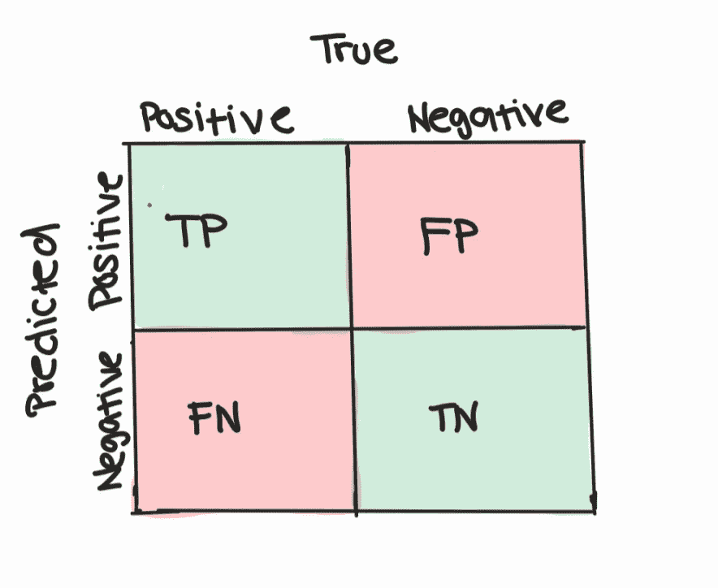
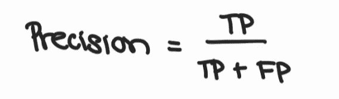
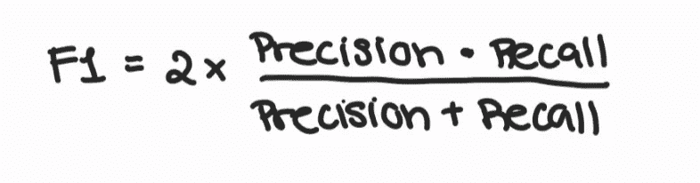
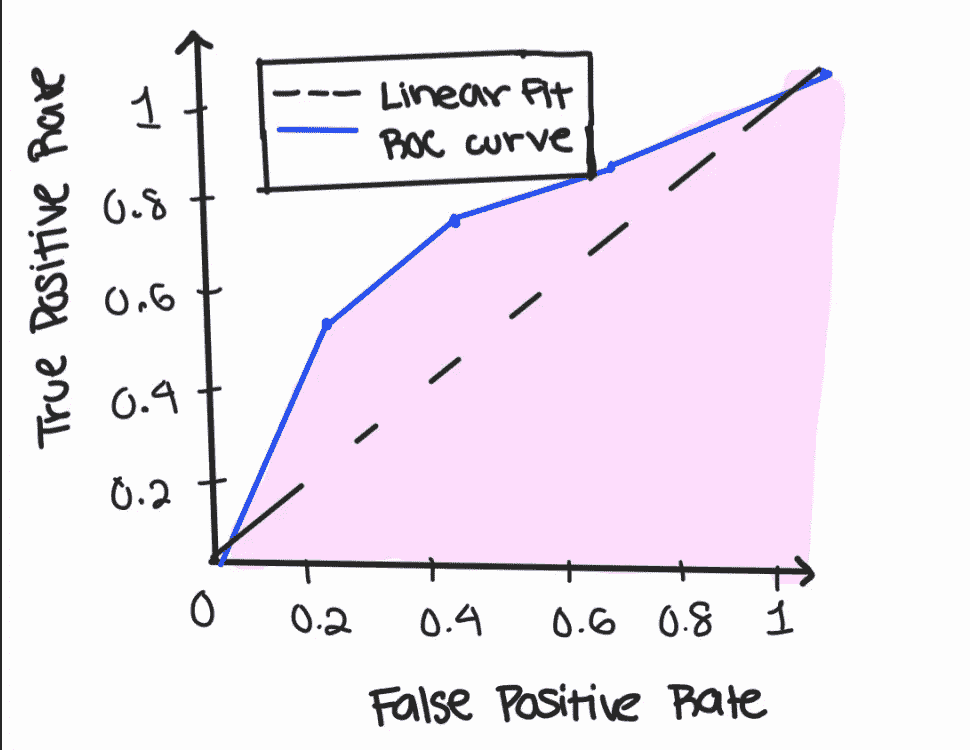

# 使用正确的绩效指标

> 原文：<https://medium.com/codex/using-the-right-performance-metrics-3708ef765fe?source=collection_archive---------15----------------------->

一些最广泛使用的性能指标是准确度、召回率、精确度和 F1 分数。

准确性是最广为人知的度量标准，是在实例总数中正确预测的观察值的数量。然而，计算准确度并不总是评估你的机器学习模型的最佳方式，让我们看看为什么。

# 准确性并不总是可靠的

我们的机器学习任务是预测某人是否患有心脏病。

该模型最终给出了 99.5%的准确率。印象深刻吧。但无心脏病者 995 人，有心脏病者 5 人。在这种情况下，如果模型被设计为仅预测负面实例，那么它将获得 99.5%的相同准确度。当数据集不平衡时，使用精度来评估模型并不是一个好主意。在这里，我们可以使用精确度和召回率作为可靠的性能指标。

# 什么是精度和召回率？

为了理解什么是精确和召回，让我们观察一个混淆矩阵。

作者图片

在混淆矩阵中，有以下值:

*   真阳性:患者实际上有心脏病，并且模型预测患者有心脏病
*   假阳性:病人没有心脏病，但是模型预测病人有心脏病
*   真正的否定:病人没有心脏病，模型预测病人没有心脏病
*   假阴性:病人实际上有心脏病，但是模型预测病人没有心脏病

当数据集不平衡时，精确度和召回率提供了一种评估模型性能的方法。精度，也称为正预测值，是正预测总数中正确预测的正观测值。

作者图片

根据 Will Koehrsen 的“超越准确性:精确度和召回”,精确度是相关案例的数量超过我们的模型所说的相关案例的数量

召回，也称为敏感度，是在真阳性值的总数中正确预测的阳性的数量。Koehresn 指出，召回率是数据集中所有相关案例的比例。

作者图片

# 精确度和召回率之间的权衡

存在一个问题:随着召回率的增加，精确度将降低，反之亦然。由于这个原因，在精确度和召回率之间有一个折衷。基于我们的模型试图解决的问题，我们可能想要更高的召回率和更低的精确度，或者更高的精确度和更低的召回率。

让我们回头看看我们的心脏病例子。我们希望我们的模型尽量减少假阴性的数量，因为我们希望避免将患者诊断为健康，即使他们可能患有心脏病。这样，我们的病人可以尽快接受治疗。在这种情况下，我们希望最大限度地提高查全率，因为我们希望在数据集中找到所有相关的病例(心脏病患者)。

另一方面，如果我们想将电子邮件归类为垃圾邮件或“垃圾邮件”呢？在这个例子中，我们希望我们的模型避免将“垃圾”邮件归类为垃圾邮件，以防止重要邮件丢失。因此，我们认为正确预测的“垃圾”邮件的数量比“垃圾”邮件的总数更重要。因此，对我们来说，精确度比召回更重要，因为我们希望尽量减少误报。

# F1 分数

对于大多数机器学习模型来说，你希望找到精确度和召回率之间的平衡。F1 分数，另一个性能指标，可以告诉我们准确率和召回率之间的平衡程度。为了计算 F1 分数，你要取精确和回忆的调和平均值，因为这将惩罚异常值。

作者图片

回到我们的心脏病模型，如果我们的分类器预测所有患者患有心脏病，我们的召回率将是 1，我们的精确度将是 0。这将导致 F1 分数等于 0。要获得 1 分的 F1 值，精确度和召回率都必须等于 1。

# 受试者工作特征曲线

我们还可以通过绘制 ROC 曲线(接收操作特性曲线)来找到精确度和召回率之间的完美平衡。ROC 曲线的想法是可视化当模型使用不同的阈值时，精确度和召回率如何变化。阈值类似于一个截止标记，该示例将被认为是积极的。例如，在心脏病分类问题中，阈值 0.3 将表明任何具有 0.3 或更大可能性患有心脏病的患者将被我们的模型分类为阳性。默认阈值为 0.5。较低的阈值增加了召回率，而较高的阈值增加了精确度，因此导致了折衷。较低的阈值允许我们最小化假阴性，而较高的阈值允许我们最小化假阳性。

下面是一个 ROC 曲线的例子:

作者图片

ROC 曲线比较了真阳性率和假阳性率。

根据上图，0.2 和 0.4 之间的阈值似乎是合理的，因为真阳性率大于假阳性率。

图中的黄色阴影位置代表 AUC(曲线下面积),面积越大表示性能越好。红色线比黑色虚线有更好的 AUC 分数。黑色虚线的 AUC 值为 0.5。

# 结论

根据机器学习问题，最好决定最大化哪个性能指标，无论是精度、召回率还是准确度。如果您正在寻找精确度和召回率之间的平衡，利用 F1 分数和 ROC 图也是一个好主意。

我希望这篇文章能够让您对这些重要的评估指标有所了解。

注意:我建议查看以下文章，了解更多详细信息:

https://towards data science . com/beyond-accuracy-precision-and-recall-3da 06 bea 9f 6c #:~:text = The % 20 idea % 20 is % 20 relative % 20 simple，a % 20 positive % 20 in % 20 our % 20 model。&text = By % 20 altering % 20 threshold % 2C % 20 we，right % 20 precision % 20 vs % 20 recall % 20 balance。

[https://towards data science . com/accuracy-precision-recall-or-f1-331 FB 37 C5 CB 9](https://towardsdatascience.com/accuracy-precision-recall-or-f1-331fb37c5cb9)