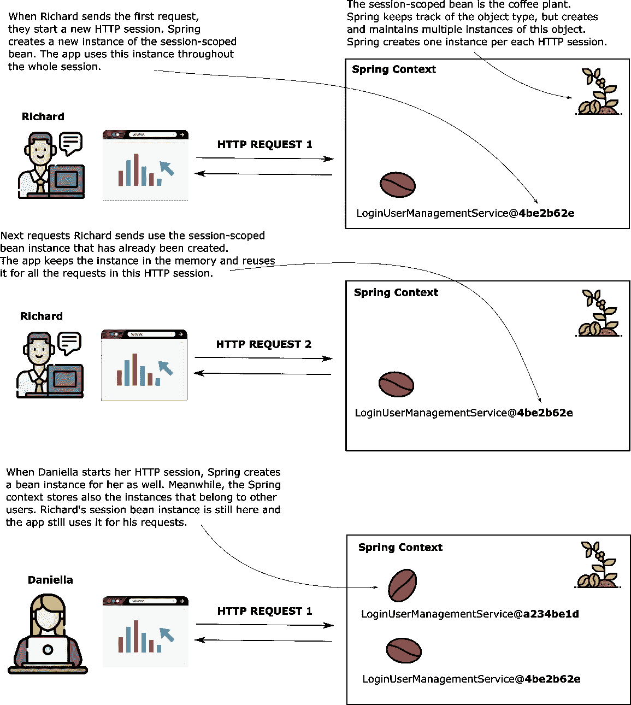
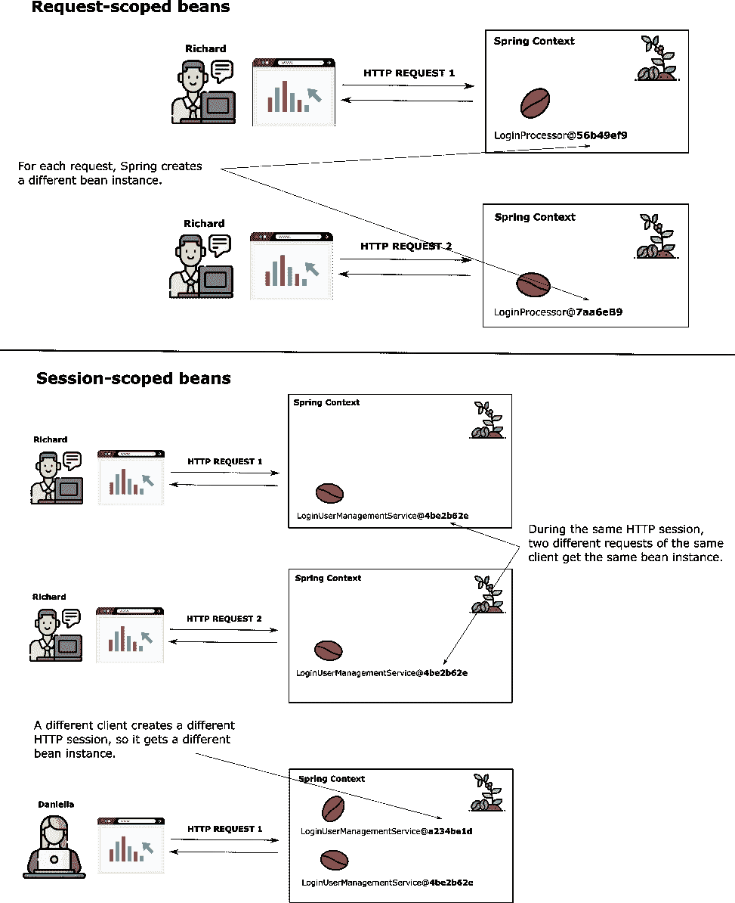
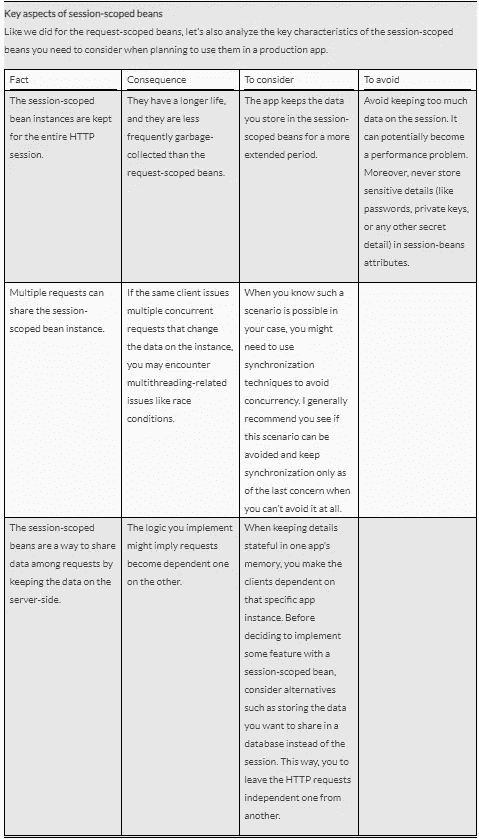
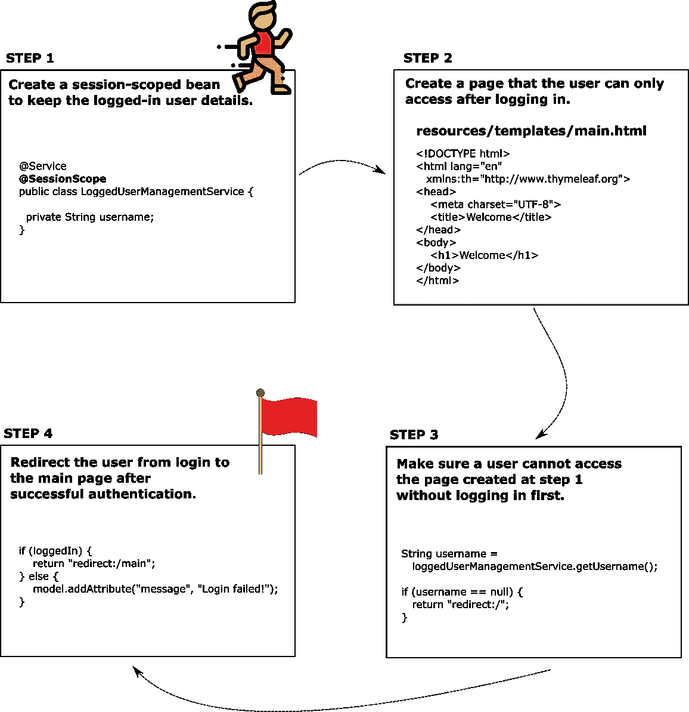
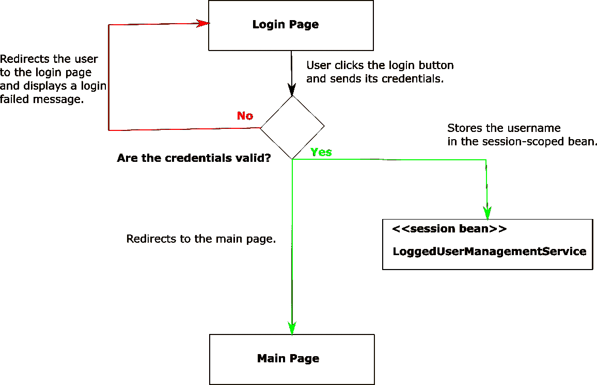
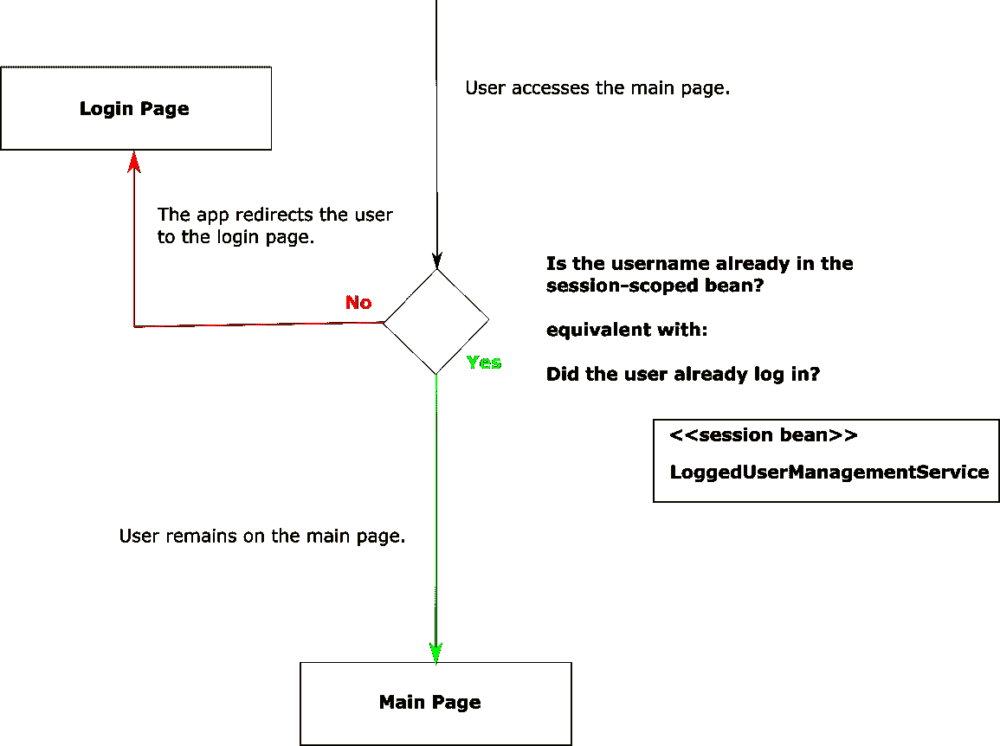
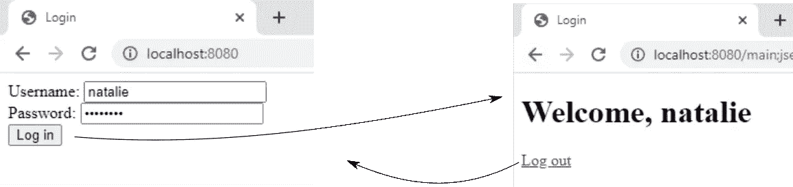
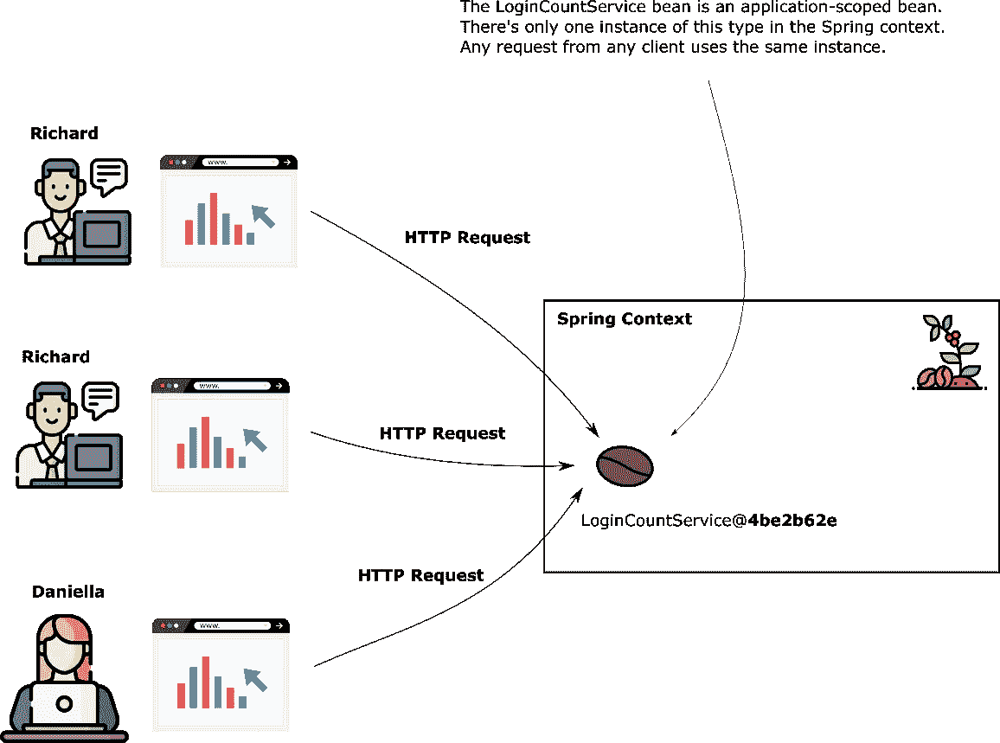
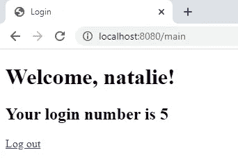

# 使用 Spring Web Scopes，第 2 部分

> 原文：<https://medium.com/codex/using-the-spring-web-scopes-part-2-59a3e952f641?source=collection_archive---------12----------------------->

## 文章

## *从* [*春天从这里开始*](https://www.manning.com/books/spring-start-here?utm_source=medium&utm_medium=organic&utm_campaign=book_spilca2_spring_9_22_20) *由 laurențiu·斯皮尔奇*

*本文涵盖*

*   *使用弹簧网示波器*
*   *为网络应用实现简单的登录功能*
*   *在网络应用程序中从一个页面重定向到另一个页面*

在[manning.com](https://www.manning.com/?utm_source=medium&utm_medium=organic&utm_campaign=book_spilca2_spring_9_22_20)的结账处，将 **fccspilca2** 输入折扣代码框，即可享受 40%的折扣。

在这里查看第 1 部分。

## **在 Spring web 应用程序中使用会话范围**

在本节中，我们将讨论会话范围的 beans。当你进入一个网络应用程序并登录后，你希望浏览该应用程序的页面，而该应用程序仍然记得你已经登录。会话范围的 bean 是由 Spring 管理的对象，Spring 为它创建一个实例并将其链接到 HTTP 会话。一旦客户端向服务器发送请求，服务器会在整个会话期间为该请求在内存中保留一个位置。当为特定客户机创建 HTTP 会话时，Spring 会创建一个会话范围 bean 的实例。只要 HTTP 会话仍然处于活动状态，该实例就可以在同一个客户机上重用。在整个 HTTP 会话中，存储在会话范围 bean 属性中的数据可用于所有客户机请求。这种存储数据的方法允许你存储用户在浏览你的应用页面时做了什么的信息。



图 8 会话范围的 bean 用于在客户机的整个 HTTP 会话中保持上下文中的 bean。Spring 为客户机打开的每个 HTTP 会话创建一个会话范围 bean 的实例。对于在同一个 HTTP 会话中发送的所有请求，客户端访问同一个实例。每个用户都有自己的会话，并访问会话范围 bean 的不同实例。

现在花点时间比较图 8 和图 2，图 8 展示了会话范围的 bean，图 2 展示了请求范围的 bean。图 9 也总结了这两种方法之间的比较。当您有一个请求范围的 bean 时，Spring 为每个 HTTP 请求创建一个新的实例，但是当您有一个会话范围的 bean 时，Spring 只为每个 HTTP 会话创建一个实例。会话范围的 bean 允许我们存储由同一客户机的多个请求共享的数据。



图 9 比较了请求作用域和会话作用域的 bean，帮助您更容易地形象化这两个 web bean 作用域之间的差异。当您希望 Spring 为每个请求创建一个新实例时，您可以使用请求范围的 beans。当您希望在客户机的整个 HTTP 会话中保留 bean(以及它所包含的任何详细信息)时，可以使用会话范围的 bean。

可以使用会话范围的 beans 实现的功能的几个例子是

*   登录-当经过身份验证的用户访问应用程序的不同部分并发送多个请求时，您需要保存他们的详细信息。
*   在线购物车—用户访问应用程序的多个位置，搜索他们添加到购物车的产品。购物车会记住客户添加的所有产品。



在本节中，我们将使用一个会话范围的 bean 来使我们的应用程序知道有用户登录，并在他们访问应用程序的不同页面时将他们识别为登录用户。通过这种方式，该示例向您传授了在使用生产应用程序时需要了解的所有相关细节。

让我们更改前面实现的应用程序，以显示只有登录用户才能访问的页面。一旦用户登录，应用程序会将他们重定向到该页面。该页面显示包含登录用户名的欢迎消息，并为用户提供通过单击页面上的链接注销的选项。

我们需要采取以下步骤来实现这一变化(图 10):

1.  创建一个会话范围的 bean 来保存登录用户的详细信息。
2.  创建用户只能在登录后访问的页面。
3.  确保用户在没有首先登录的情况下不能访问在第 1 点创建的页面。
4.  成功验证后，将用户从登录重定向到主页。



图 10 我们使用一个会话 bean 来实现只有登录用户才能访问的应用程序部分。一旦用户通过身份验证，应用程序会将他们重定向到页面，他们只有通过身份验证后才能访问该页面。如果用户试图在身份验证之前访问该页面，应用程序会将他们重定向到登录表单。

幸运的是，在 Spring 中，创建一个会话范围的 bean 就像在 bean 类中使用`@SessionScope`注释一样简单。让我们创建一个新的类，`LoggedUserManagementService,`,并使它的作用域如清单 5 所示。

**清单 5。定义一个会话范围的 bean 来保存记录的用户详细信息**

```
@Service    #A
 @SessionScope    #B
 public class LoggedUserManagementService {

   private String username;

   // Omitted getters and setters
 }
```

**#A 我们添加了@Service 原型注释来指示 Spring 在其上下文中将这个类作为 bean 来管理。**

我们使用@SessionScope 注释将 bean 的作用域改为 session。

每次用户成功登录时，我们都将其名称存储在这个 bean 的 username 属性中。我们自动连接了`LoginProcessor`类中的`LoggedUserManagementService` bean，我们之前实现它是为了处理认证逻辑。

**清单 6。使用** `**LoggedUserManagementService**`中的 **bean 登录逻辑**

```
@Component
 @RequestScope
 public class LoginProcessor {

   private final LoggedUserManagementService loggedUserManagementService;

   private String username;
   private String password;

   public LoginProcessor(    #A
     LoggedUserManagementService loggedUserManagementService) {
     this.loggedUserManagementService = loggedUserManagementService;
   }

   public boolean login() {
     String username = this.getUsername();
     String password = this.getPassword();

     boolean loginResult = false;
     if ("natalie".equals(username) && "password".equals(password)) {
       loginResult = true;
       loggedUserManagementService.setUsername(username);    #B
     }

     return loginResult;
   }

   // Omitted getters and setters
 }
```

**#A 我们自动连接 LoggedUserManagementService bean**

**#B 我们将用户名存储在 LoggedUserManagementService bean 上**

注意到`LoginProcessor` bean 保持在请求范围内。我们仍然需要 Spring 为每个登录请求创建这个实例。在请求执行身份验证逻辑的过程中，我们只需要用户名和密码属性值。

因为`LoggedUserManagementService` bean 是会话范围的，所以现在可以在整个 HTTP 会话中访问用户名值。您可以使用这个值来了解是否有人登录以及登录的人是谁。你不用担心多用户登录的情况；应用程序框架确保将每个 HTTP 请求链接到正确的会话。图 11 直观地描述了登录流程。



图 11 示例中实现的登录流程。当用户提交他们的凭证时，登录过程开始。如果用户的凭证正确，用户名将存储在会话范围的 bean 中，应用程序将用户重定向到主页。如果凭据无效，应用程序会将用户重定向回登录页面，并显示登录失败的消息。

现在，我们创建一个新页面，并确保只有已经登录的用户才能访问它。我们为新页面定义了一个新的控制器(我们称之为`MainController)`。我们将定义一个动作，并将其映射到/main 路径。为了确保用户只有登录后才能访问这个路径，我们检查了`LoggedUserManagementService` bean 是否存储了任何用户名。如果它没有存储用户名，我们将用户重定向到登录页面。要将用户重定向到另一个页面，控制器操作需要返回字符串“redirect:”后跟操作要将用户重定向到的路径。图 12 直观地展示了主页背后的逻辑。



图 12 某人只有在通过身份验证后才能访问主页。当应用程序对用户进行身份验证时，它将用户名存储在会话范围的 bean 中。这样，应用程序就知道用户已经登录了。当有人访问主页，并且用户名不在会话范围的 bean 中时(他们没有进行身份验证)，应用程序会将他们重定向到登录页面。

清单 6 展示了`MainController`类。

**清单 6。** `**MainController**` **类**

```
@Controller
 public class MainController {

   private final LoggedUserManagementService loggedUserManagementService;

   public MainController(    #A
     LoggedUserManagementService loggedUserManagementService) {
     this.loggedUserManagementService = loggedUserManagementService;
   }

   @GetMapping("/main")
   public String home() {
     String username =     #B
       loggedUserManagementService.getUsername();

     if (username == null) {    #C
       return "redirect:/";
     }

     return "main.html";    #D
   }
 }
```

**#A 我们自动连接 LoggedUserManagementService bean，以确定用户是否已经登录。**

**#B 我们取用户名值，如果有人登录，这个值应该不同于 null。**

**#C 如果用户没有登录，我们会将用户重定向到登录页面。**

**#D 如果用户登录，我们返回主页面的视图。**

您需要在 Spring Boot 项目的 resources/templates 文件夹中添加定义视图的 main.html。清单 7 显示了 main.html 页面的内容。

**清单 7。main.html 页面的内容**

```
<!DOCTYPE html>
 <html lang="en" xmlns:th="http://www.thymeleaf.org">
 <head>
     <meta charset="UTF-8">
     <title>Welcome</title>
 </head>
 <body>
     <h1>Welcome</h1>
 </body>
 </html>
```

允许用户注销也很容易；您需要将`LoggedUserManagementService`会话 bean 中的用户名设置为 null。让我们在页面上创建一个注销链接，并在欢迎消息中添加已登录的用户名。清单 8 显示了定义我们视图的 main.html 页面的变化。

**清单 8。向 main.html 页面添加注销链接**

```
<!DOCTYPE html>
 <html lang="en" xmlns:th="http://www.thymeleaf.org">
 <head>
     <meta charset="UTF-8">
     <title>Login</title>
 </head>
 <body>
     <h1>Welcome, <span th:text="${username}"></span></h1>    #A
     <a href="/main?logout">Log out</a>    #B
 </body>
 </html>
```

**#A 我们从控制器获取用户名，并在页面的欢迎消息中显示出来。**

**#B 我们在页面上添加一个链接，设置一个名为“logout”的 HTTP 请求参数。当控制器获得该参数时，它会从会话中删除用户名的值。**

这些 main.html 页面的变化也假设控制器中的一些变化，以完成功能。清单 9 展示了如何在控制器的动作中获取注销请求参数，并将用户名发送到页面上显示的视图。

**清单 9。基于注销请求参数**注销用户

```
@Controller
 public class MainController {

   // Omitted code

   @GetMapping("/main")   
   public String home(
       @RequestParam(required = false) String logout,    #A
       Model model    #B
   ) {
     if (logout != null) {    #C
       loggedUserManagementService.setUsername(null);
     }

     String username = loggedUserManagementService.getUsername();

     if (username == null) {
       return "redirect:/";
     }

     model.addAttribute("username" , username);    #D
     return "main.html";
   }
 }
```

如果存在的话，我们得到注销请求参数。

我们添加一个模型参数来发送用户名到视图。

如果 logout 参数存在，我们从 LoggedUserManagementService bean 中删除用户名。

**#D 我们将用户名发送给视图。**

为了完成该应用程序，我们希望更改`LoginController`以在用户通过身份验证后将他们重定向到主页面。为了达到这个结果，我们需要改变清单 10 所示的`LoginController`的动作。

**清单 10。登录后将用户重定向到主页面**

```
@Controller
 public class LoginController {

   // Omitted code

   @PostMapping("/")
   public String loginPost(
       @RequestParam String username,
       @RequestParam String password,
       Model model
   ) {
     loginProcessor.setUsername(username);
     loginProcessor.setPassword(password);
     boolean loggedIn = loginProcessor.login();

     if (loggedIn) {   #A
       return "redirect:/main";
     }

     model.addAttribute("message", "Login failed!");
     return "login.html";
   }
 }
```

**#A 当用户成功认证后，应用程序会将他们重定向到主页面。**

现在，您可以启动应用程序并测试登录。当您提供正确的凭据时，应用程序会将您重定向到主页。点击“注销”链接，应用程序会将你重定向回登录页面。如果您试图在未进行身份验证的情况下访问主页，应用程序会重定向您进行登录。



图 13 这个视觉呈现了两个页面之间的流程。当用户登录时，应用程序会将他们重定向到主页面。用户可以点击注销链接，应用程序会将他们重定向回登录表单。

## **在 Spring web app 中使用应用范围**

在本节中，我们讨论应用范围。我想提到它的存在，让你意识到它是如何工作的，并强调最好不要在生产应用程序中使用它。所有客户端请求共享一个应用程序范围的 bean(图 14)。



图 14 理解 Spring web 应用程序中的应用程序范围。来自所有客户端的所有 HTTP 请求共享应用程序范围的 bean 的实例。Spring 上下文只提供了 bean 类型的一个实例，供任何需要的人使用。

应用程序范围接近于单例的工作方式。不同之处在于，在上下文中不能有更多相同类型的实例，并且在讨论 web 作用域(包括应用程序作用域)的生命周期时，我们总是使用 HTTP 请求作为参考点。对于单例 bean 和应用程序作用域 bean，最好有不可变的属性，但是如果使属性不可变，可以直接使用单例 bean。

通常，我建议开发人员避免使用应用程序范围的 beans。通常，最好直接使用持久层，比如数据库，而不是在应用程序范围的 bean 中处理数据。

最好能看到一个例子来更好地理解这个案例。让我们修改一下本文中的应用程序，添加一个统计登录尝试次数的特性。

因为我们必须对所有用户的登录尝试进行计数，所以我们将把计数存储在应用程序范围的 bean 中。让我们创建一个`LoginCountService`应用程序范围的 bean，它将计数存储在一个属性中。清单 11 显示了这个类的定义。

**清单 11。** `**LoginCountService**` **类统计登录尝试次数**

```
@Service
 @ApplicationScope    #A
 public class LoginCountService {

   private int count;

   public void increment() {
     count++;
   }

   public int getCount() {
     return count;
   }
 }
```

@ApplicationScope 注释将此 bean 的作用域更改为应用程序作用域。

然后，`LoginProcessor`可以自动连接这个 bean，并为任何新的登录尝试调用`increment()`方法，如清单 12 所示。

**清单 12。针对每个登录请求增加登录计数**

```
@Component
 @RequestScope
 public class LoginProcessor {

   private final LoggedUserManagementService loggedUserManagementService;
   private final LoginCountService loginCountService;

   private String username;
   private String password;

   public LoginProcessor(    #A
     LoggedUserManagementService loggedUserManagementService, 
     LoginCountService loginCountService) {
     this.loggedUserManagementService = loggedUserManagementService;
     this.loginCountService = loginCountService;
   }

   public boolean login() {
     loginCountService.increment();    #B

     String username = this.getUsername();
     String password = this.getPassword();

     boolean loginResult = false;
     if ("natalie".equals(username) && "password".equals(password)) {
       loginResult = true;
       loggedUserManagementService.setUsername(username);
     }

     return loginResult;
   }

   // Omitted code
 }
```

**#A 我们通过构造函数的参数注入 LoginCountService bean】**

我们对每次登录尝试增加计数。

现在您需要做的最后一件事就是显示这个值。您可以在控制器的动作中使用一个`Model`参数来将计数值发送给视图。然后，您可以使用百里香叶在视图中显示该值。清单 13 展示了如何将值从控制器发送到视图。

**清单 13。从控制器发送计数值以显示在主页面上**

```
@Controller
 public class MainController {

   // Omitted code

   @GetMapping("/main")
   public String home(
       @RequestParam(required = false) String logout,
       Model model
   ) {
     if (logout != null) {
       loggedUserManagementService.setUsername(null);
     }

     String username = loggedUserManagementService.getUsername();
     int count = loginCountService.getCount();    #A

     if (username == null) {
       return "redirect:/";
     }

     model.addAttribute("username" , username);
     model.addAttribute("loginCount", count);    #B

     return "main.html";
   }
 }
```

**#A 从应用程序作用域的 bean 中获取计数。**

**#B 向视图发送计数值。**

清单 14 展示了如何在页面上显示计数值。

**清单 14。在主页面上显示计数值**

```
<!DOCTYPE html>
 <html lang="en" xmlns:th="http://www.thymeleaf.org">
 <head>
     <meta charset="UTF-8">
     <title>Login</title>
 </head>
 <body>
     <h1>Welcome, <span th:text="${username}"></span>!</h1>
     <h2>
       Your login number is
       <span th:text="${loginCount}"></span>    #A
     </h2>
     <a href="/main?logout">Log out</a>
 </body>
 </html>
```

**#A 在页面上显示计数。**

运行您的应用程序，您会在主页上发现登录尝试的总次数，如图 15 所示。



图 15 应用程序的结果是一个显示所有用户登录总数的网页。该主页显示登录尝试的总次数。

目前就这些。如果你想了解更多，请在曼宁的 liveBook 平台[点击](https://livebook.manning.com/book/spring-start-here?origin=product-look-inside&utm_source=medium&utm_medium=organic&utm_campaign=book_spilca2_spring_9_22_20)查看这本书。