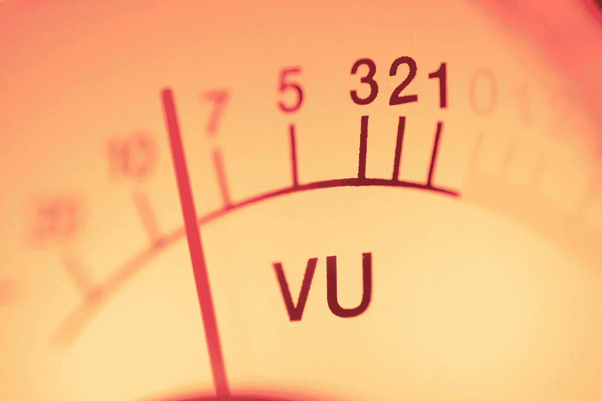
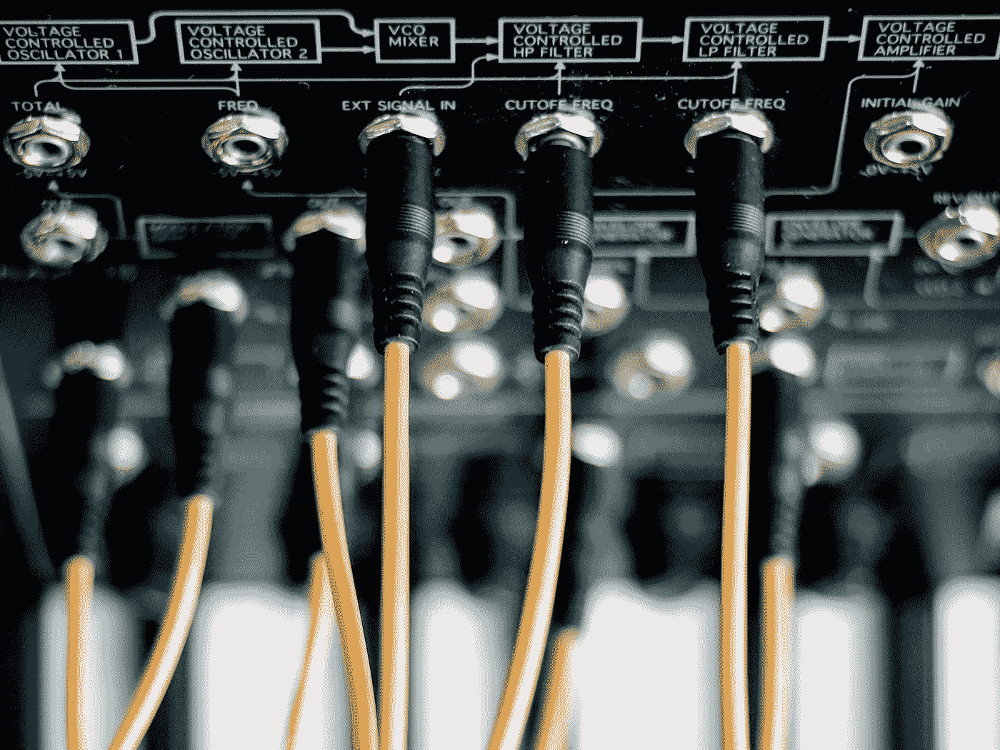
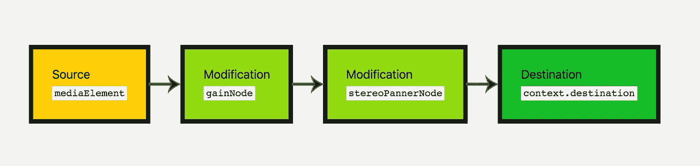

# 使用网络音频 API:编程遇到声音工程

> 原文：<https://medium.com/codex/using-the-web-audio-api-where-programming-meets-sound-engineering-b3a1e0e64a44?source=collection_archive---------18----------------------->

安迪·马克里在 [Unsplash](https://unsplash.com/s/photos/audio?utm_source=unsplash&utm_medium=referral&utm_content=creditCopyText) 上拍摄的照片

在我发现自己对编程的热爱之前，我去学校学过音乐录制，学到了很多音频处理的知识。当我第一次开始学习编码时，我真的想在一个项目中结合我的两个兴趣。我最近一直在用 React 构建一个鼓音序器，并对 Web 音频 API 有所了解。在为这个项目做研究的时候，我发现在这个项目中有很多地方，我很高兴有音频方面的背景。

# 入门指南

要开始使用 Web 音频 API，您需要初始化一个`AudioContext`。`AudioContext`是一个对象，它将包含使用 Web 音频 API 所需的一切。这将为我们提供解码、处理和播放声音所需的所有特性和功能。要设置一个`AudioContext`，使用下面的代码。第一行是允许更广泛的浏览器支持。

设置音频上下文

# 加载预先录制的声音

在 web 浏览器中播放预先录制的声音有两种主要方式。最简单的方法是使用`<audio>`标签。如果您只需要对正在回放的音频进行基本控制，这种方法最有效。如果你想在音频播放前对其进行处理，或者播放的精确度对你的应用很重要，那么`<audio>`标签不是你想要的路线。

当从`<audio>`标签播放音频文件时，浏览器必须向音频文件的来源发送请求，检索和解码数据并缓冲音频，然后才能播放音频文件。虽然你的浏览器可以很快做到这一点，但如果用户想在点击按钮时听到声音，那么在点击和播放之间可能会有明显的延迟。

播放预先录制的声音的另一个选项是预先缓冲音频，并将缓冲的音频存储在一个变量中，以便在需要时播放。为此，您需要使用`fetch()`或`XMLHttpRequest()`提前检索数据。(我更喜欢使用`fetch()`，所以我将详细介绍这个过程，但是`XMLHttpRequest()`过程是相似的，如果你愿意，我将在下面提供一个例子。)对来自`fetch()`的响应，调用`arrayBuffer()`将响应放入 arrayBuffer 中。在 arrayBuffer 上，可以使用`audioContext`提供的`decodeAudioData()`对数据进行解码。然后，您可以将这些数据保存到一个变量中供以后使用。使用`fetch()`或`XMLHttpRequest()`的示例见下文:

将音频文件加载到音频缓冲区

# 播放声音

现在我们已经缓冲了我们的音频，我们可能想要播放它，这样用户就可以听到音频。为此，我们需要创建一个缓冲源，并将其连接到用户的扬声器。我们可以使用`audioContext`提供的`createBufferSource()`函数来创建缓冲源。这创建了一个`audioNode`，我们可以使用不同的音频效果来操纵它，或者我们可以连接到用户的扬声器来播放声音。现在，我们将使用`connect()`功能将`audioNode`连接到用户的扬声器，而不进行任何音频操作。请参见下面的示例:

播放音频缓冲区中的声音

# 建立联系

米歇尔·迪迪埃·朱蒙在 [Unsplash](https://unsplash.com/s/photos/audio?utm_source=unsplash&utm_medium=referral&utm_content=creditCopyText) 上拍摄的照片

在声音工程中，有一个概念叫做信号流。这是一种想法，即声音信号从其来源(乐器、麦克风、合成器等)开始，经过多个音频处理器(麦克风前置放大器、均衡、混响等)，最终到达扬声器。源必须连接到音频处理器的输入端，然后音频处理器的输出被路由到下一个处理器或扬声器。网络音频 API 以类似的方式工作。音频源(音频缓冲器、振荡器或流式音频)连接到各种音频处理器(增益、声相、滤波器、混响)，并从这些音频处理器连接到用户扬声器(`audioContext.destination`)。

在现实世界中，这些连接是通过电缆实现的。在 Web Audio API 中，我们使用了`connect()`函数。多个`connect()`功能可以链接在一起，在声音传送到扬声器之前，将多种效果应用到声音中。文档将这种路由称为音频路由图。

音频路由图表(来自 MDN 文档)

> 在现实世界和网络音频 API 中路由信号的一个很好的故障排除技巧是:如果声音没有按预期播放，请跟随信号流。从信号源开始，直接连接到扬声器。逐一重新连接音频处理器，直到问题重现。然后你就会发现是什么因素导致了这个问题，并能够集中精力解决问题的根源。

# 声音处理

恭喜你。您现在可以在网络浏览器中播放声音。现在让我们在用户听到这些声音之前操纵它们。您想要使用的最常见的声音处理是增益。增益是音量的音频术语。为了给你的声音增加音量控制，你需要创建一个增益节点并将你的`audioBuffer`连接到它，然后将`gainNode`连接到`audioContext.destination`。

## 开大声点

要添加增益节点，使用`audioContext`提供的`createGain()`函数，并将其保存到变量中。然后使用`gain.value`设置增益节点的值，并给它一个值。值为 1 不会改变声音。任何低于 1 的值都会降低音量，0 表示没有声音。上限在 3 到 4 之间，但我不建议超过 1.5 太多，以避免削波和失真(除非声源的音量特别低)。我们更新后的`playSample()`功能如下:

向 playSample()函数添加 GainNode

## 声音空间化

在 web 浏览器中操纵声音的另一种方法是通过声音空间化。声音空间化为您的声音提供了一个位置。一个简单的实现方法是将声音放在左边或右边。根据您放置声音的位置，一个扬声器播放的声音会比另一个多。听众会感觉到声音在空间中有特定的位置。

Web Audio API 有两种处理声音空间化的方式:`PannerNode`和`StereoPannerNode`。平移是声音空间化的音频术语。对于大多数需要定位声音的情况来说，`StereoPannerNode`已经足够好了。它仅限于立体声定位(双扬声器设置)。`PannerNode`允许更复杂的空间化，例如在更大的扬声器设置(quad，5.1)中定位，定位随时间移动的声音，相对于声音移动听众，添加多普勒效应(想象消防车开着警报器经过你身边的声音)，等等。

由于这篇文章是针对网络音频 API 的新手，我将只解释更基本的`StereoPannerNode`。`StereoPannerNode`的设置与`GainNode`的设置非常相似。`AudioContext`给出了另一个创建立体声声相器的函数`createStereoPanner()`。将其保存到一个变量，然后通过给`pan.value`您想要的值来设置平移值。该值可以介于-1 和 1 之间，其中-1 表示向左倾斜，1 表示向右倾斜，0 表示居中定位。一旦`StereoPannerNode`被创建并赋予一个值，您就可以使用`connect()`功能将其连接到您的声源。我在前面的`playSample()`函数中添加了平移功能:

向 playSample()函数添加 StereoPannerNode

## 更多音频探索

Web Audio API 还有许多其他功能，但是要深入了解所有功能，需要的不仅仅是一本书，而是一个博客。一旦掌握了本文中的概念，就可以探索其他一些特性。您可以添加混响，过滤器，延迟，失真或压缩到您的音频源。您也可以尝试使用麦克风和 MediaStreamAudioSourceNode 生成自己的声音，或者使用振荡器合成自己的声音。也有许多方法来可视化包含在 Web Audio API 中的音频。

这应该足以让你开始添加声音到你的网络应用程序。网络音频 API 非常强大，提供了许多通常只有专业音频软件才有的功能。事实上，这一切在大多数浏览器中都是现成的，这很棒，我期待着探索它的更多功能。编码快乐！