# 用时间序列分析中的 ARIMA 和 GARCH 模型分析股票

> 原文：<https://medium.com/codex/using-time-series-analysis-with-arima-and-garch-model-in-r-to-analyze-stocks-d5e89cfe93e?source=collection_archive---------0----------------------->

在听说 Grub 和优步之间的合并可能性后，我决定对 Grub 做一个简短的股票分析，看看股票的表现如何，以及它在未来几个月的表现如何。

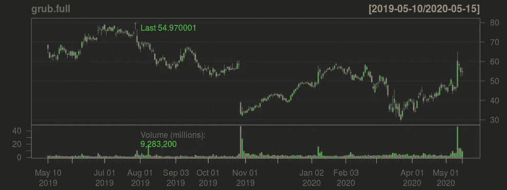

图一。(GRUB)2019 年 4 月至 2020 年 5 月之间的股票价格

我首先得到了 Grub 在 2019 年 4 月至 2020 年 5 月 18 日之间的股价图——图 1。

从图表中可以看出，Grub 在 10 月 29 日经历了 43.295%的重大股价下跌，至 38.97 美元。这一下跌发生在 Grub 公布季度业绩之后。

为了更好地了解股票，我创建了一个布林线图，交易量和 MACD(移动平均线收敛背离)。

在下面的图表中，很明显有一个强烈的下降趋势，价格开始在下降通道内交易。

在见证了多头背离之后，15 周期移动平均线的突破进一步提供了进入交易的信号。

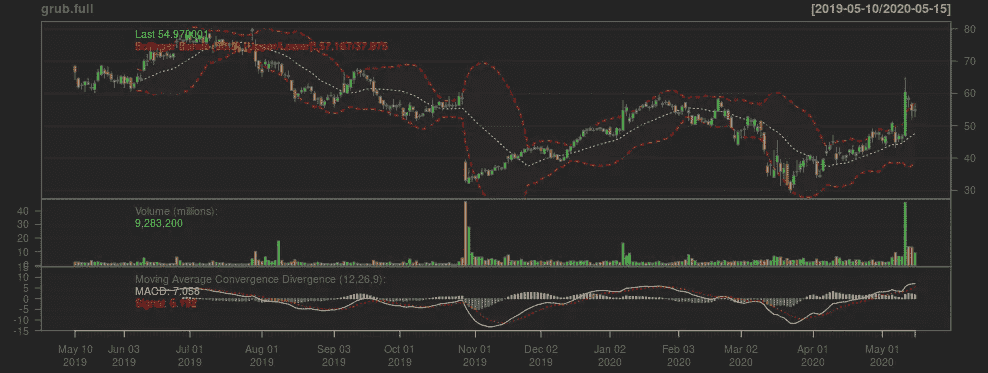

图二。布林线、成交量和 MACD

MACD 线也穿过了信号线，证明 MACD 指标支持多头交易。还可以看到，MACD 线继续在信号线上方移动，这转化为强劲的上涨动力。

我们现在开始使用 ARIMA 方法进行预测。

因为金融时间序列通常暴露于指数增长，这允许对数变换来线性化序列，所以我使用差分来稳定时间序列的方差。

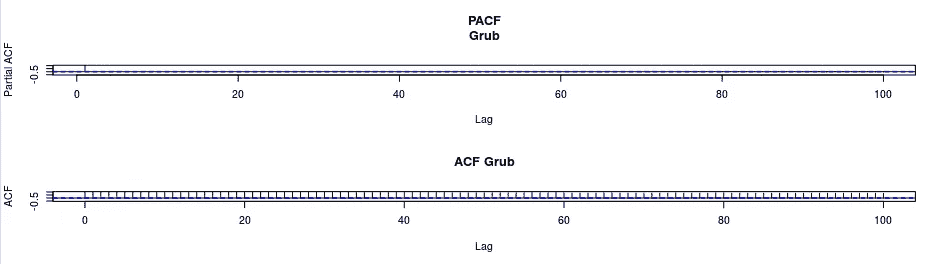

图 3

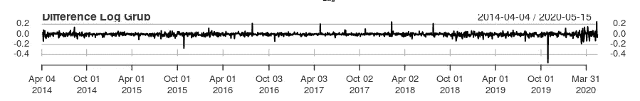

图 4。差异日志 Grub

与价格序列相比，时间序列更令人感兴趣，因为我们倾向于关注股票的回报而不是价格。对数价格的差异类似于股票价格的百分比变化。

下面的图 5 显示了一个自动回归模型，自动 ARIMA，这将有助于我们预测接近未来的价格值。

如图所示，图表中有一条蓝线，代表预测的平均值。

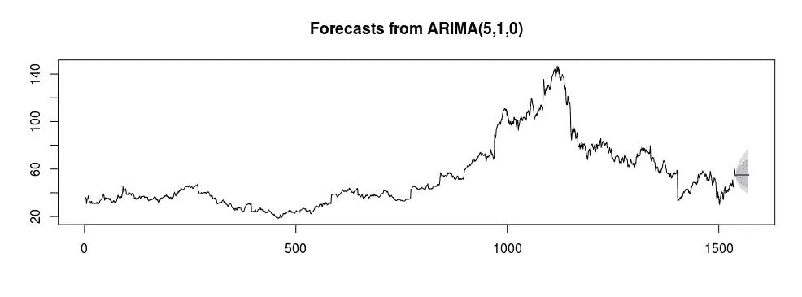

图 5

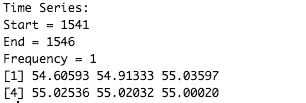

图 6

在上面的图 5 中，有深灰色和浅灰色区域，它们分别对应于 80%和 95%的置信区间。

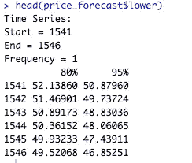

图 7。数据集预测较低的前几个值

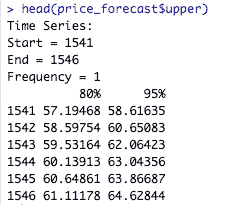

图 8。数据集预测前几个高值

仅仅用 MACD 和 ARIMA 来分析是不够的。我决定使用 GARCH 模型，利用它的功能进行“波动聚类”，这将有助于我们尽量减少波动的影响。

我运行自动 ARIMA 函数来寻找 ARIMA 参数，我后来把它合并到 Garch 模型中。

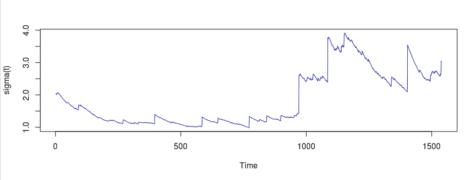

图 9

下面的图 10 显示了关于这个模型的 Akaike 和其他信息。如我们所见，我们的模型已经达到了更好的 Akaike 和 Bayes 测试值。

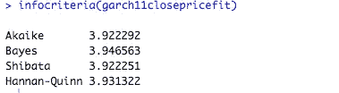

图 10

然后，所有导出的信息用于创建正常残差图，如下图 11 所示。

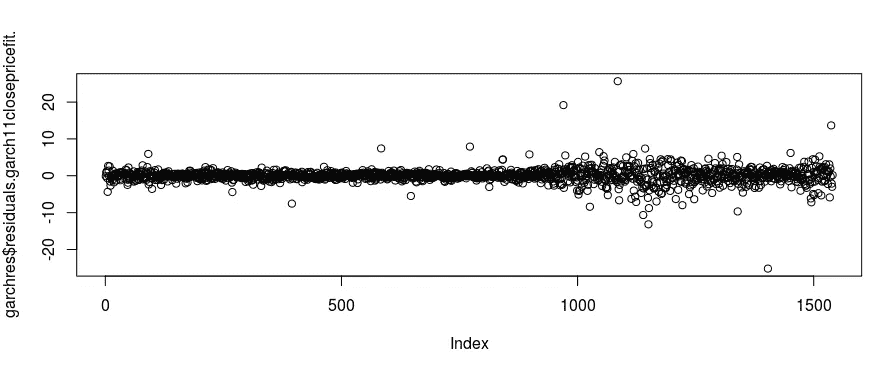

图 11

下面是标准化残差图。

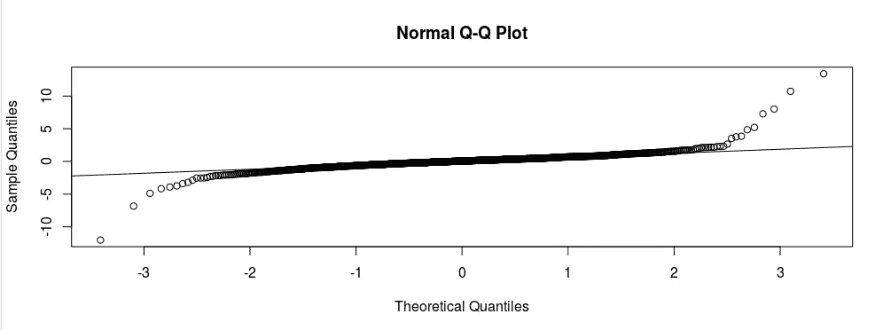

图 12

尽管我们有一些超出正态分布的异常值，但大多数数据都位于中心线上。

有了所有需要的模型后，我绘制了数据预测图，显示了未来 3 个月的预测——如下所示。

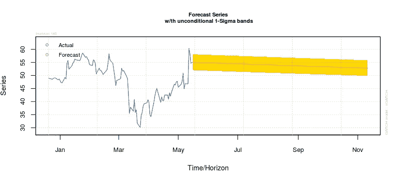

图 13

正如我们所见，该模型预测了未来 3 个月的价格下降趋势。但是，请注意，自回归模型使用历史数据来预测未来值。ARIMA 模型也没有考虑到最近可能发生的变化。

**书籍推荐**

[Python 食谱第三版](https://amzn.to/3bqc7Vy)

[Python 机器学习简介:数据科学家指南](https://amzn.to/39Mi1zI)