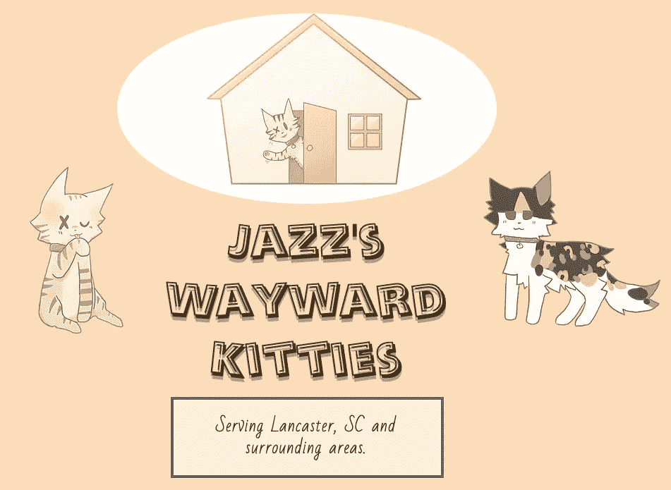
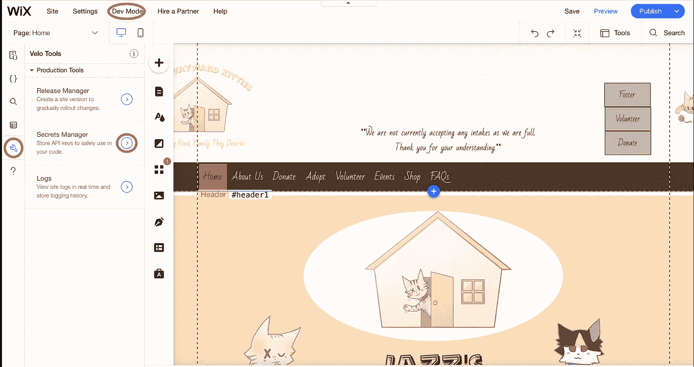
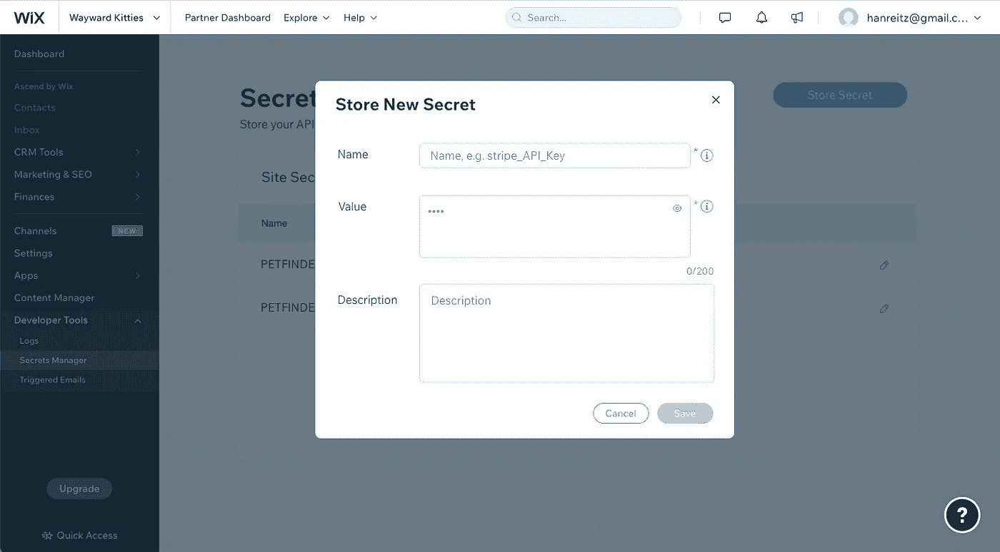
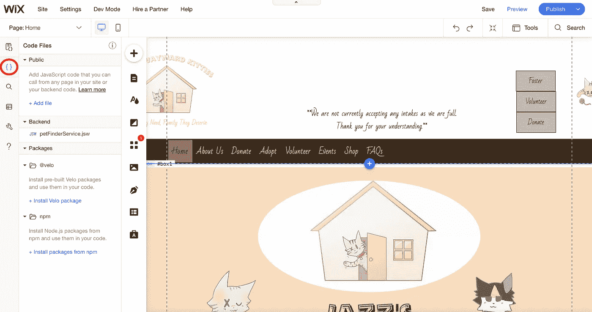
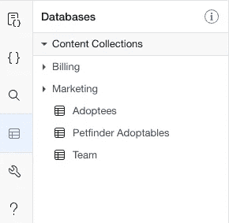
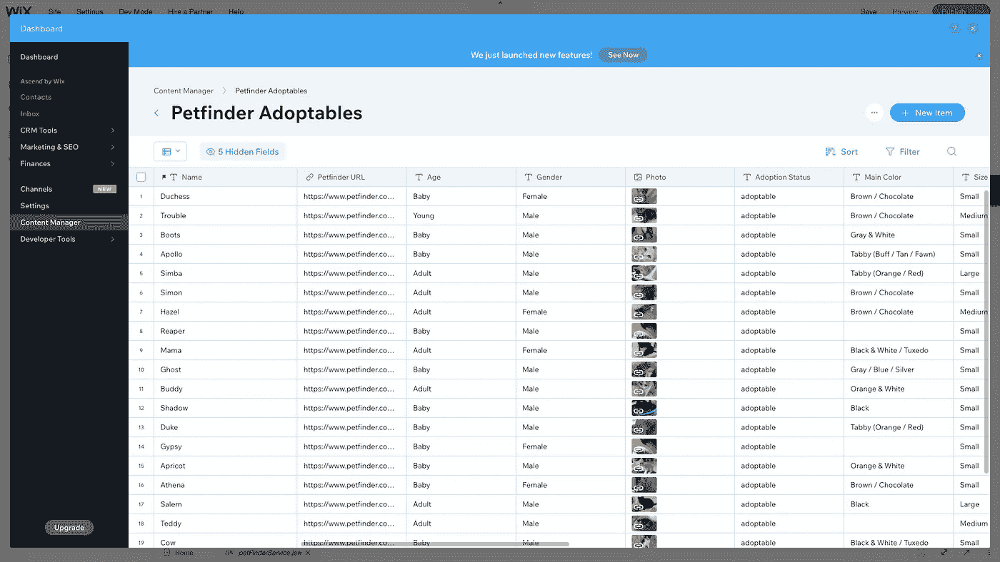
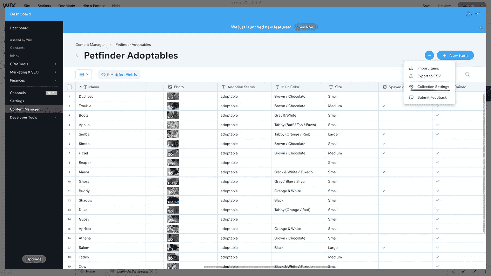
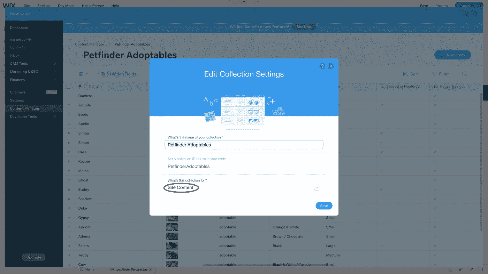
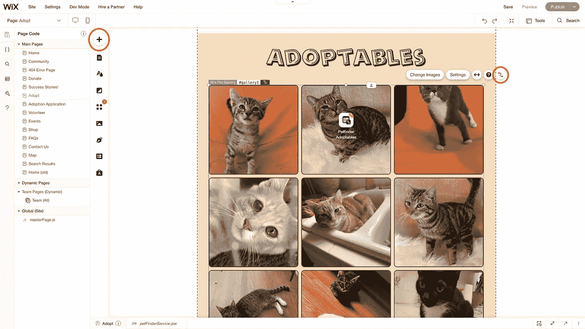
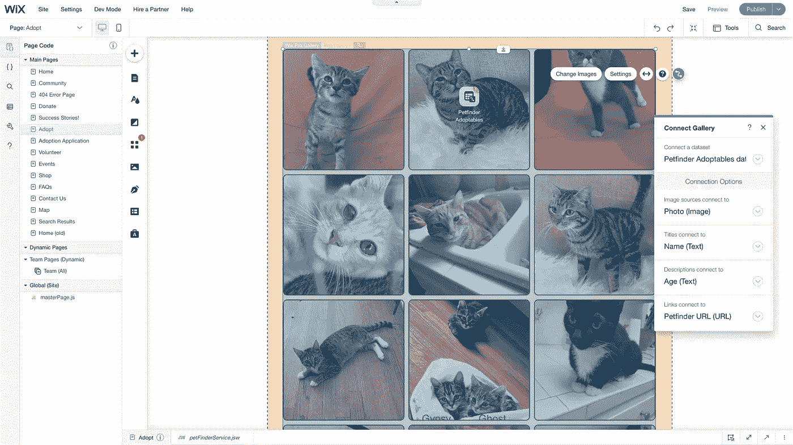

# 使用 Velo by Wix 集成第三方 API 数据

> 原文：<https://medium.com/codex/using-velo-by-wix-to-integrate-3rd-party-api-data-e9e121a638e7?source=collection_archive---------3----------------------->



最近，我参与的一个当地行动主义团体的一名成员寻求帮助，在她的猫救援网站上集成 Petfinder API 数据。rescue 的所有者拥有一个现有的 Wix 网站，她自己并不是开发者。她的目标是为她救助的所有可收养的猫建立一个画廊。每次她收养一只猫，她都会将它添加到 Petfinder 注册表中，这使得 Petfinder API 成为向她的画廊提供数据的理想方式。

当我看到她的请求——其中包括一个到 Petfinder 的 API 文档的链接——我知道我可以消化这个 API。为了确保万无一失，我简单地浏览了一下文档，然后告诉她我很乐意帮忙。

对我来说，这个项目的新挑战是使用为非技术网站建设者而不是开发者设计的界面。然而，我很快发现 Wix 有一个名为 Velo 的包，用于为他们的站点提供开发模式。在本文中，我将分解 Wix 使用 Velo 消化第三方 API 的过程，以及如何在 Wix 站点上显示这些数据。

# 第一步:在 Wix 中隐藏 API 秘密

开始使用大多数 API 的第一步也是最重要的一步是请求和保护 API 标识、密钥、令牌等。幸运的是，网站所有者已经从 Petfinder 为她的网站请求了一个 ID 和密钥。

Velo 有一种特殊的方法来存储这些信息，必须保护这些信息不被网站用户访问。登录到站点编辑器后，第一步是使用开发模式菜单打开开发模式。接下来，单击扳手符号显示 Velo 工具菜单，从那里可以访问秘密管理器。



Wix 编辑器的图像捕获，显示开发模式菜单、Velo 工具菜单和秘密管理器。

进入机密管理器会显示当前的机密(不是实际的数据，而是输入时给出的名称)和一个用于存储新机密的按钮。当一个新的秘密被存储时，Wix 对它进行加密，并且只有当一个已登录的站点管理员请求时才透露它。



Velo by Wix Secrets Manager，显示一个弹出窗口，显示存储新的秘密。

可以通过 Secrets Manager 中给定的变量名来访问这些秘密，就像在网站后端使用. env 文件来隐藏敏感信息一样。虽然 Velo 确实为后端代码提供了一个位置，但最好在 Secrets Manager 中保存和加密敏感数据。要了解为什么会出现这种情况的更多信息，请查看 Wix 的 Secrets Manager 文档。

# 第二步:从 Wix 访问第三方 API 端点

假设开发人员熟悉他们想要使用的 API 的端点，以及如何访问特定的 API，下一步就是从 Wix 执行 API 调用。对于 Petfinder API，需要一个初始 POST 请求来保护一个承载令牌，使用提供给开发人员的 ID 和密钥。一旦返回了承载密钥，就可以使用它向 API 发出数据获取请求。

我发现写这段代码的最好地方是在后端的服务模块中。Wix 使用 JSW 文件或 JavaScript web 模块在后端执行需要响应客户端调用的代码(这里的 fetch 请求就是这样做的)。



开发模式下 Wix 编辑器的屏幕截图，显示了代码文件的位置(圆圈)。

在代码文件部分的“后端”部分，我添加了一个名为 petFinderService.jsw 的文件。

```
import {fetch} from 'wix-fetch'; 
import {getSecret} from 'wix-secrets-backend';
import wixData from 'wix-data';async function getBearerToken(){
 const clientId = await getSecret('PETFINDER_ID')
 const clientSecret = await getSecret('PETFINDER_SECRET_KEY')
 const configObj = {
  method: 'POST',
  headers: {
   'Content-Type': 'application/x-www-form-urlencoded'
  },
  body: `grant_type=client_credentials&client_id=${clientId}&client_secret=${clientSecret}`
 }
 return fetch('[https://api.petfinder.com/v2/oauth2/token'](https://api.petfinder.com/v2/oauth2/token'), configObj)
 .then(resp => resp.json())
 .then(data => data.access_token)
}export async function petFinderService(){
 const bearer = await getBearerToken()
    const url = '[https://api.petfinder.com/v2/animals?organization=sc544'](https://api.petfinder.com/v2/animals?organization=sc544')
 const headers = {
  headers: {
   'Authorization': `Bearer ${bearer}`
  }
 }
 fetch(url, headers)
 .then(resp => resp.json())
 .then(data => {
  data.animals.forEach(animal => {
   wixData.query('PetfinderAdoptables')
    .eq('url', `${animal.url}`)
    .find()
    .then(results => {
     if(results.items.length === 0){
      const infoToAdd = {
       url: animal.url,
       name: animal.name,
       age: animal.age,
       gender: animal.gender,
       photo: animal.photos[0].medium,
       status: animal.status,
       mainColor: animal.colors.primary,
       size: animal.size,
       spayedNeutered: animal.attributes.spayed_neutered,
       houseTrained: animal.attributes.house_trained,
       declawed: animal.attributes.declawed,
       specialNeeds: animal.attributes.special_needs,
       shotsCurrent: animal.attributes.shots_current,
       goodWithKids: animal.environment.children,
       goodWithDogs: animal.environment.dogs,
       goodWithCats: animal.environment.cats,
      }
      wixData.insert('PetfinderAdoptables', infoToAdd)
     }
    })
  })
 })
}
```

三个导入中的两个是不言自明的——fetch 是进行 API 调用所需要的，getSecret 是 Wix 提供的使用存储在 Secrets Manager 中的数据的函数(如上所述)。第三个导入 wixData 用于将 Petfinder 返回的信息添加到 Wix 站点的内容集合中。对于开发人员来说，内容集合的功能很像站点后端的数据库，除了非技术站点编辑可以通过 Wix 编辑器 GUI 对这些集合进行更改。下面有更多关于内容集合及其管理的信息。

代码的其余部分相当简单明了；首先，petFinderService 调用 getBearerToken 函数，该函数使用客户机 ID 和密钥访问 API，然后在 API 响应后返回访问令牌。接下来，petFinderService 使用承载令牌发出 GET 请求，然后将相关数据添加到内容集合中(如果它还不存在的话)。在撰写本文时，删除已经从 Petfinder API 中删除的宠物的功能还没有实现。这实际上是这个项目所需的所有代码。接下来，必须使用一些 Wix GUI 组件来处理数据。

# 第三步:用 Wix 管理和显示数据

为了以编程方式向内容集合添加信息，它必须首先存在。不需要创建列或其他信息。对于这个项目，我创建了内容集合 PetfinderAdoptables，并使用 wixData 函数‘insert’在成功返回时将 Petfinder API 数据添加到集合中(如上一节所示)。



Wix 编辑器开发人员菜单，突出显示内容集合。



PetfinderAdoptables 内容集合—由 Petfinder API 提供的所有数据。

最初填充内容集合时，列名会有一个小标记，表示它们已被导入，需要正式命名并选择它们的数据类型以供其他 Wix 站点功能访问。这可能有一个程序性的解决方法，但是我还没有找到。我发现使用 GUI 来更改这些列名并不太费力，因为只需要做一次。所有将来的导入都使用现有列。

> 我从反复试验中学到的一个非常重要的经验是，在设置菜单中使网站内容集合可见，否则，当在编辑器中时内容是可见的，但当网站被外部访问者查看时内容就会消失。



显示内容集合中集合设置菜单位置的屏幕截图。



“收藏集设置”窗格，显示在“此收藏集的用途是什么？”下选择网站内容的位置

唯一的“常规权限”选项(使数据对未登录用户可见的选项)是网站内容和表单提交。由于我正在建立一个画廊，我选择了网站内容。



Wix 编辑器的屏幕截图，显示了用于添加内容的“+”按钮和图库上的数据链接按钮。

从那里，我转到 Adopt 页面上站点所有者想要她的图库的地方，并添加了一个链接到我刚才用 API 数据填充的内容集合的图库。首先，我使用可用于添加站点内容的大“+”按钮添加了一个 gallery 对象。我选择了网格画廊，因为这是客户的要求。接下来，我将图库链接到内容集合 PetfinderAdoptables。



显示“连接图库”菜单的屏幕截图。

当内容集合第一次连接到像图库这样的 Wix 元素时，必须创建一个新的数据集，但是，现有的内容集合位于用于创建新数据集的菜单中，因此只需单击所需的集合即可生成数据集。接下来，对于图库功能非常重要的是，可以选择数据集中的列作为图像源、标题、描述和链接。我的选择在上图中可见。在 gallery 设置中，我选择将链接附加到图片本身，这样当网站用户点击一只猫时，一个新的选项卡会将他们带到该猫的 Petfinder 网站。翻转图片显示猫的名字和年龄。这些都是使用 Wix GUI 编辑器定制的特性。

# 最后一步:调用服务函数并发布站点

> 注意:实际上可以先调用服务函数。事实上，我建议这样做。这是一小段不需要我从外部测试 API 调用的代码。

为了让这项工作的任何成果显示出来——一旦 API 调用开始工作并且数据被设置为显示——就需要从 Wix 页面调用服务模块。两个最佳选项是全局/站点页面或显示元素的特定页面。由于我消化的数据只需要加载到 Adopt 页面上，所以我选择将代码放在那里。

```
**import** {petFinderService} **from** 'backend/petFinderService'$w.onReady(**function** () {
  petFinderService();
});
```

每个 Wix 页面上的“onReady”事件处理程序与普通 JavaScript 中的 DOMContentLoaded 事件处理程序非常相似，因此一旦页面准备就绪，这段代码只需从 petFinderService 模块中调用异步函数 petFinderService。

最后，我必须记得点击蓝色的发布按钮来完成我对网站的修改。我启用了自动保存功能，并且一直在预览作品，但是为了让访问者可以看到修改，我需要发布。

尽管这个项目涉及的代码比普通项目少得多，但是学习如何使用像 Wix 这样的混合开发环境是很重要的，它允许技术和非技术利益相关者的直接贡献。有趣的是，我们看到了在 GUI 驱动的环境中 DOM 内容特性是如何不同的，以及一些代码——比如这里显示的 fetch 请求——是如何显著相同的。实际上，我会向某些类型的站点的开发人员推荐 Wix，比如 portfolio 站点，这些站点需要快速启动并运行，同时仍然具有专业的外观和感觉。有了 Velo，即使相当高级的代码应用也是可能的。

> 如果你在夏洛特-加斯托尼亚-米尔-洛克希尔大都会区寻找一只猫，那就去看看爵士乐队的任性猫咪吧！