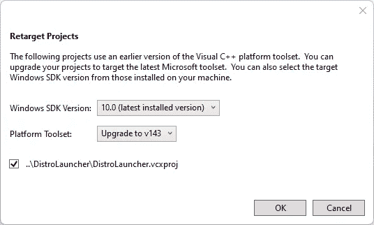

# 在企业中使用 WSL 2

> 原文：<https://medium.com/codex/using-wsl-2-in-enterprises-d9cef1f60c73?source=collection_archive---------0----------------------->

在企业环境中安装、配置和分发 WSL 2


用于 **L** inux (WSL)的**W**Windows**S**子系统支持直接在 Windows 上执行 Linux 环境，而不需要虚拟机或任何其他类似的设置。与第一个版本相比，使用 WSL 2 很多事情变得更容易和更快。但是当在位于企业环境中的系统上运行时，通常会有一些限制，如企业代理、自定义名称服务器或 SSL 检查。因此，在访问互联网、安装额外的包或使用 WSL 2 的 Visual Studio 调试器等之前，必须首先完成一些挑战。本文总结了在企业环境中开始使用 WSL 2 的一些常见步骤。

# 安装 WSL 2 发行版

在进入特定配置之前，必须在系统上安装 WSL 2。微软提供的伟大[文档涵盖了 WSL 2 的安装。在新的 Windows 系统(Windows 10 Build 19041 和更高版本或 Windows 11)上，这相当容易。](https://docs.microsoft.com/en-us/windows/wsl/install)

```
*# Schema*
wsl --install -d <<distro>>*# Install Ubuntu*
wsl --install -d Ubuntu
```

您唯一需要做的就是在 PowerShell 提示符下执行上述命令。


在 Windows 11 上安装 WSL 2

在较旧的系统上，还需要执行更多的步骤。它们在[单独文件](https://docs.microsoft.com/en-us/windows/wsl/install-manual)中描述。WSL 使用的默认发行版是 Ubuntu，我们在本文中也使用它。

默认情况下，该发行版将通过 Microsoft Store 安装。但在企业环境中，当您尝试访问商店时，可能会受到限制，例如应用程序或防火墙的限制。在这种情况下，可以使用各自的*通过手动过程安装这些发行版。appx 文件。要找到您选择的发行版的下载链接，只需查看一下[Microsoft Docs](https://docs.microsoft.com/en-us/windows/wsl/install-manual#downloading-distributions)中的链接集合。Ubuntu 20.04 可以通过[https://aka.ms/wslubuntu2004](https://aka.ms/wslubuntu2004)下载，下载后从 windows 主机执行安装 appx-package。

此时，您应该能够通过命令行访问 WSL 2 系统，例如，通过显示所有已安装发行版的列表:

```
wsl --list
```

Windows 终端有一个很好的 WSL 2 集成，可以直接启动一个实例。


Windows 终端— WSL2 集成

# 配置 WSL 2 发行版

企业环境中的互联网访问通常由代理服务器和自定义名称服务器管理和限制。为了允许 WSL 2 实例访问互联网，需要一些特殊的设置。下一节将介绍这些步骤。

## 处理公司代理服务器

代理服务器最常见的设置是由环境变量 *http_proxy* 和 *https_proxy 控制的。*由于一些工具使用区分大小写的访问，我们必须使用小写和大写来创建变量。

在下面的例子中，我们使用`[http://server.domain:8080](http://server.domain:8080)`作为我们的代理服务器。

```
*# Create or edit the global available environment variables*
sudo nano /etc/environment*# Append the following lines and save/exit the file*
http_proxy=”*http://server.domain:8080*”
HTTP_PROXY=”*http://server.domain:8080*”https_proxy=”*http://server.domain:8080*”
HTTPS_PROXY=”*http://server.domain:8080*”
```

上述配置确实适合许多情况。但是有些工具和场景需要单独设置。比如，如果你想[调试。使用 Visual Studio 的 WSL 2 中的. NET 应用程序](https://docs.microsoft.com/en-us/visualstudio/debugger/debug-dotnet-core-in-wsl-2?view=vs-2019)。该扩展会自动检查并安装缺少的依赖项。如果没有如下所述的 *wget、*的额外设置，使用公司代理时安装将会失败。

**卷曲**

> Curl 是一个命令行工具，用于传输用 url 语法指定的数据。([卷曲/卷曲](https://github.com/curl/curl))

```
*# Edit curl configuration*
sudo nano ~/.curlrc*# Add/append the following line and save/exit the file*
proxy = *http://server.domain:8080*
```

**wget**

> wget 是一个免费的软件包，用于使用 HTTP、HTTPS、FTP 和 FTPS 这些最广泛使用的互联网协议来检索文件。( [Wget — GNU 项目](https://www.gnu.org/software/wget/))

```
*# Edit wget configuration*
sudo nano /etc/wgetrc*# Add/append the following line and save/exit the file*
https_proxy = *http://server.domain:8080*
http_proxy = *http://server.domain:8080*use_proxy = on
```

**apt**

> apt 命令是一个命令行工具，它与 Ubuntu 的*高级打包工具* (APT)配合使用，执行安装新软件包、升级现有软件包、更新软件包列表索引，甚至升级整个 Ubuntu 系统等功能。([包管理| Ubuntu](https://ubuntu.com/server/docs/package-management) )

```
*# Create apt configuration*
cd /etc/apt/apt.conf.dsudo touch proxy.conf
sudo nano proxy.conf*# Add the following line and save/exit the file*
Acquire::http::Proxy "*http://server.domain:8080*";
Acquire::https::Proxy "*http://server.domain:8080*";
```

## **考虑定制域名服务器**

企业环境中的另一种常见设置是自定义名称服务器。它们被用来代替公共可用的域名，比如 8.8.8.8，它代表谷歌提供的域名服务器。

在某些情况下，默认情况下，WSL 2 无法解析匹配的配置。在这种情况下，我们必须修改 */etc/wsl.conf* 并手动添加定制服务器。为此，只需遵循以下步骤:

1.  禁用自动生成 resolv.conf

```
*# Edit the default* WSL *configuration*
sudo nano /etc/wsl.conf*# Add the following lines and save/exit the file*
[network]
generateResolvConf = false
```

2.关闭并重新启动 WSL 2 实例

```
*# Shutdown running instance*
wsl --shutdown*# Restart and enter a new instance*
wsl
```

3.使用 */etc/resolv.conf* 添加特定的 DNS 名称服务器

```
*# Create/Edit the configuration*
sudo nano /etc/resolv.conf*# Append the setup using the custom nameservers and save/exit the file*
nameserver <<ip-address>>
nameserver <<ip-address>>
```

在某些情况下，编辑过程中可能会出错。您可以通过使用`sudo rm /etc/resolv.conf`删除文件来解决这个问题

## 处理 SSL 检查

完成代理和名称服务器配置后，可能会有另一个步骤，重点是处理 SSL 检查所需的设置。

> SSL 检查通过服务器和用户浏览器创建专用的 SSL 隧道，允许解密和检查传入和传出的 HTTPS 流量。

在这种情况下，我们必须将相应的证书添加到 WSL 2 特定的证书存储中。否则，通过 HTTPS 的连接将由于 SSL 错误而被阻止。

```
*# Create a directory for custom root certificates* sudo mkdir /usr/local/share/ca-certificates/extra*# Copy the the certificate from local system to WSL2 file system*sudo 
sudo cp custom.crt /usr/local/share/ca-certificates/extra/custom.crt*# Import the custom**.crt file* sudo dpkg-reconfigure ca-certificates
sudo update-ca-certificates
```

从这一点开始，在公司环境中使用 WSL 2 所需的所有设置都已设置好。但还是有不好的一面。整个设置仅对本地 WSL 2 实例有效。但是如果设置应该在同事之间共享呢？欲知详情，请阅读下一节。

# 构建自己的 WSL 2 包

在企业环境中，在全球范围内管理和共享设置和工具是最佳实践。对于 WSL 2，目前有两种选择。

*   使用 WSL 2 命令在内部共享映像
*   使用 [WSL 发行版启动器](https://github.com/microsoft/WSL-DistroLauncher)创建特定于企业的发行版

其他与安全和控制相关的选项仍在开发中。但是，让我们从共享定制的 WSL 2 映像这个更简单的选项开始，来讨论一下目前可用的可能性。

## 使用文件共享来共享 WSL 2 映像

```
wsl --export Ubuntu CustomizedUbuntu.tar.gz
```

之后，导出的映像可以很容易地导入到同一环境中运行 WSL2 的其他系统中。

```
wsl --import Ubuntu <<path-to-image>>\CustomizedUbuntu.tar.gz
```

这就是在不同系统间共享预配置的 WSL 2 实例所要做的全部工作。

## 创建特定于企业的启动器应用程序

第二个选项侧重于创建一个定制的启动器包，没有上面提到的第一个选项那么容易。它基于 GitHub 上的一个项目模板[。接下来的步骤包括最小设置。](https://github.com/microsoft/WSL-DistroLauncher)

**克隆存储库**

首先，您必须克隆存储库。该存储库包含 Windows Subsystem for Linux (WSL)分发安装程序/启动器应用程序的 C++参考实现。因此，除此之外，您还必须确保 Visual Studio 的 C++工作负载安装在您的系统上。

[](https://github.com/microsoft/WSL-DistroLauncher.git) [## GitHub-Microsoft/WSL-DistroLauncher:WSL 发行版 Microsoft Store 的示例/参考启动器应用程序…

### 这是 Linux (WSL)发行版安装程序/启动程序的 Windows 子系统的 C++参考实现…

github.com](https://github.com/microsoft/WSL-DistroLauncher.git) 

**包含导出的发行版**

将之前导出的 WSL 2 映像作为`install.tar.gz`复制到 *DistroLauncher-Appx* 目录中。

**重定目标项目**

根据您的特定系统设置(Visual Studio 和 Windows SDK 版本)，您必须在继续构建包之前重新定位这两个项目。



使用 Visual Studio 重定项目目标

确保为解决方案中的每个项目执行此步骤。

**添加证书签名包**

Windows 要求对生成的包进行签名。因此，必须将 CA 可信证书应用于 appx 项目。因此，您必须打开*.appx.manifest 文件并导航到标签名*打包*。通过*选择证书，可以应用*自定义证书，如下图所示。


将自定义证书添加到 WSL 2 发行版启动器

考虑到所有需要的步骤现在都已完成，我们可以执行初始构建了。在继续进一步定制之前，我们可以使用这个构建来检查所有设置是否正确。

**构建包**

为了简化构建过程，创建者在存储库根目录下放置了一个名为`build.bat`的文件。在执行批处理文件之前，检查`build.bat`中的 MSBuild 路径是否有效。根据您的系统设置，您必须扩展这个路径列表。现在执行批处理并等待第一个包。


最终结果是，现在有了一个定制包，可以在您的环境中分发。


自定义发行版启动器来分发 WSL 2 包

# 包扎

在本文中，我向您介绍了与常见企业环境挑战相关的 WSL 2 设置的具体设置，以及如何在不同的系统之间分配设置。在此基础上，您现在能够构建自己的 WSL 2 包来满足您的特定需求，并将其分发给企业内的不同系统。

# 参考

[](https://docs.microsoft.com/en-us/windows/wsl/install) [## 安装 WSL

### 您必须运行 Windows 10 版本 2004 和更高版本(内部版本 19041 和更高版本)或 Windows 11。如果您正在运行一个…

docs.microsoft.com](https://docs.microsoft.com/en-us/windows/wsl/install) [](https://docs.microsoft.com/en-us/windows/wsl/install-manual) [## 旧版本 WSL 的手动安装步骤

### 为了简单起见，我们通常建议使用 wsl - install 来安装 Linux 的 Windows 子系统，但是如果您…

docs.microsoft.com](https://docs.microsoft.com/en-us/windows/wsl/install-manual) [](https://askubuntu.com/questions/73287/how-do-i-install-a-root-certificate) [## 如何安装根证书？

### 感谢贡献回答问 Ubuntu！请务必回答问题。提供详细信息并分享您的…

askubuntu.com](https://askubuntu.com/questions/73287/how-do-i-install-a-root-certificate) [](https://docs.microsoft.com/en-us/windows/wsl/enterprise) [## 为您的公司设置 Linux 的 Windows 子系统

### 作为管理员或经理，您可能要求所有开发人员使用相同的批准软件。这种一致性…

docs.microsoft.com](https://docs.microsoft.com/en-us/windows/wsl/enterprise)