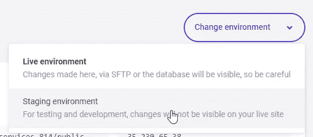
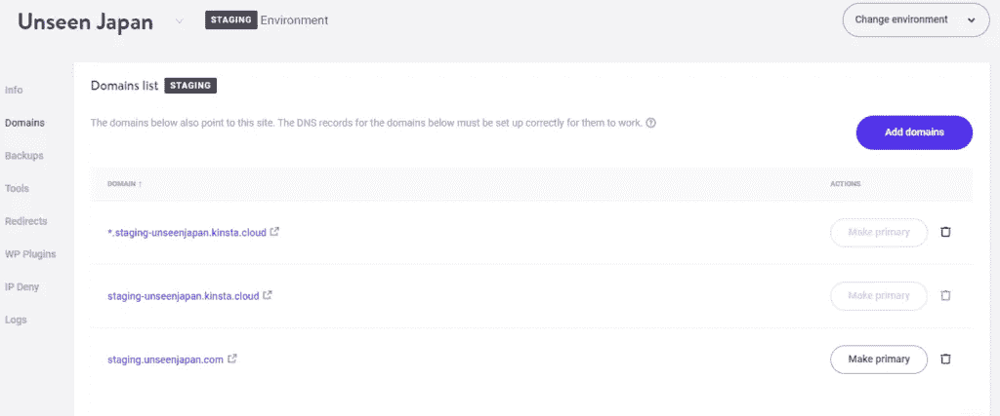
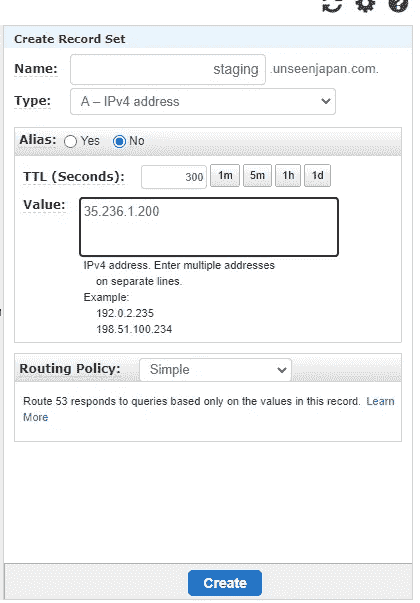
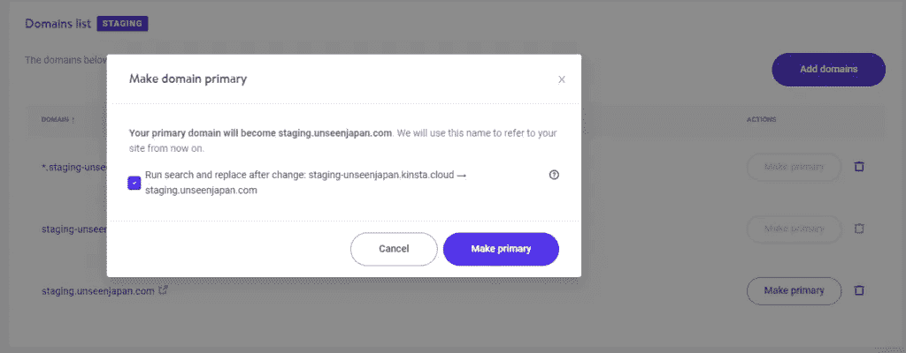
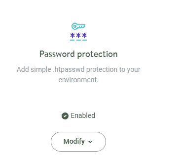

# 有效地使用您的 Kinsta 中转站点

> 原文：<https://medium.com/codex/using-your-kinsta-staging-site-effectively-daedaca5fb57?source=collection_archive---------1----------------------->

## 为什么你需要一个 WordPress 暂存站点，以及如何在 Kinsta 上正确设置一个暂存站点。

图:霍比特人/ Shutterstock

正如普通读者所知，我是《T2》的忠实粉丝。我用 Kinsta 为我所有的 WordPress 站点提供快速、可扩展的托管服务。

然而，除了速度之外，我喜欢 Kinsta 的一点是，创建网站的升级版是多么容易。在这篇文章中，我会稍微谈一谈为什么 WordPress staging 站点是至关重要的，如何在 Kinsta 上创建一个，以及在使用时可能会出现的一些问题。

# 为什么一键分期网站是一件美好的事情

我敢肯定，如果你是一名软件开发人员，接下来的事情对你来说都不是新闻。但是如果你是一个刚刚适应 WordPress 的内容创建者，需要做一点解释。

如果你的网站每天有成千上万(甚至数百)的访问者，你不希望对它进行可能会破坏用户体验的修改。可能对您的站点功能产生显著影响的更改包括:

*   激活新插件
*   对您的主题进行更改
*   完全替换你的主题
*   添加 PHP 代码，如自定义函数(如短代码)

对于这样的变化，在你的站点的第二个版本上测试你的变化要安全得多，与你的现场站点分开。这就是集结地的用武之地。一个*试运行站点*仅仅是你的站点的一个副本，你可以用它来进行测试、开发和实验。一旦您确认某项更改如您所愿，您就可以将它移动到您的实时站点。

# 在金斯塔创建中转站点

Kinsta 集结地有好消息也有不太好的消息。这个不太好的消息与 Kinsta 没有直接关系，而与 WordPress 的本质(尤其是 WordPress 插件)有很大关系。

好消息是，很容易从您当前的实时站点创建一个临时站点。只需转到您的 Kinsta 仪表板，并在您的网站的右上角，单击更改环境。如果您切换到暂存环境，但不存在任何暂存环境，Kinsta 将为您创建暂存环境。

# 您在试运行站点可能会遇到的问题

不太好的消息是，你的临时站点上的东西一开始可能有点…不稳定。这里有一些你容易遇到的问题。

# 插件许可证很难管理

WordPress 插件的许可——像 [Elementor](https://elementor.com/?ref=11725) 和 [Ultimate Add-Ons](https://uaelementor.com/?bsf=4913) 可能是你的网站及其设计的基础——通常与你的域名相关。默认情况下，您的临时站点位于自己的定制域中，比如`staging-<sitename>.kinsta.cloud`。因此，除非你购买的插件支持许可一个 staging 和一个 production 环境，否则你很容易在 staging 中看到你的插件的许可无效的抱怨。

我将在下面谈一谈你如何克服一些插件的这个问题。

# 插件导致的缓存问题(例如，自动优化)

如果你使用一个性能插件——比如 Autoptimize，它将 JS 和 CSS 文件压缩到一个脚本中以减少页面加载时间——你可能需要在你的临时站点中关闭它们以避免浏览器中的渲染问题。因为您的临时站点不需要针对性能进行优化，所以这没什么大不了的。

# 使您的临时站点成为一个合适的子域

有一件事可以帮助缓解站点 URL 问题，那就是让你的临时站点成为你当前站点的一个子域。这很容易做到与 Kinsta 和您目前的 DNS 提供商。它还为您的临时站点提供了一个更容易记住的名称，以便您的站点协作者可以很容易地找到它并登录。

在 Kinsta 中，在您的暂存站点中，转到**域**并单击**添加域**。添加`staging.<yoursite>`来创建您的临时站点主机名。对于我的网站看不见的日本，我输入:staging.unseenjapan.com

然后，找到管理您的 DNS 的人，添加一个新的 A 记录，指向您的临时站点的 IP 地址。(这可以在 My Kinsta 中您的中转站点的**信息**选项卡的顶部找到。)如果您使用 AWS Route 53 来管理您的 DNS，这看起来是这样的。

完成后，域名已经传播，您将需要使这个新的临时站点名称成为临时站点的主域。在 My Kinsta 的您的域名列表中，点击**成为主要域名**按钮。如果您不这样做，那么无论何时您转到新的 URL，您都会被简单地重定向回默认情况下为您创建的*.kinsta.cloud URL。

做出这一更改后，如果您在实时网站上启用了 HTTPS，您的 Web 浏览器可能会出现安全错误。这是因为您需要生成一个 SSL 证书，并为此子站点打开 HTTPS。幸运的是， [Kinsta 让这成为一个点击式的过程](https://jayandrewallen.me/easy-https-with-wordpress/)。

请注意，这仍然无法解决某些产品的许可问题。比如 WordPress 设计包 [Elementor](https://jayandrewallen.me/ref/elementor) (这个我也信誓旦旦！)会抱怨有域名不匹配，并要求您重新激活您的许可证。

不幸的是，至少在 Elementor 的情况下，没有好的解决方案，除非你有一个多站点许可。 [Elementor 他们自己推荐使用 WordPress](https://elementor.com/blog/wordpress-staging-site/) 的本地版本作为中转站点——这是一个容易出错且难以配置的解决方案，不允许团队协作。希望这是他们在不久的将来会改变的事情。

(**注**:自从我第一次写这个，Kinsta 就出了 [DevKinsta](https://kinsta.com/feature-updates/local-wordpress-development/?kaid=EEGBLAADGLRQ) ，这是一个 WordPress 的本地开发环境，与 Kinsta hosting 配合得很好。我打算不久就写一篇评论！)

# 密码保护您的临时站点

根据定义，您的暂存站点是一个正在进行的工作。默认情况下，您的临时站点也是公开可见的。如果你在做一些应该保密的事情，这可能不是你想要的。如果您使用的插件或 PHP 代码被证明是不安全的，它还会使您面临潜在的安全问题。

幸运的是，这是金斯塔让事情变得简单得可笑的另一件事。只需转到您的暂存站点的工具，然后单击**密码保护**按钮来添加用户名和密码。

# 将更改迁移到 Live

请注意，Kinsta 还能够将您的临时站点迁移到您的实时站点。然而，**这是一个你几乎不想使用的特性**。这种“推送”完全取代了您的生产环境——包括所有已发表和起草的文章、所有评论等。

当涉及到迁移变更时，最好简单地在 live 中进行与在临时站点中相同的变更。取消不打算保留的阶段更改也是一个好主意。

如果您想在暂存站点上重新开始，您可以随时在 Kinsta 仪表板中删除它并重新创建它。

暂存站点会让你有信心在一个安全的空间里对你的 WordPress 站点做出大胆的改变。如果您目前没有使用它们，请尝试今天就设置一个！

*免责声明:Kinsta 和其他工具的链接是附属链接；如果您购买服务，我会在不增加您成本的情况下赚取佣金。*

# 我是华盛顿州西雅图的一名作家，分享关于健康快乐生活的建议和见解。一定要跟着我！不是中等会员？[立即成为会员](https://gaiaslastlaugh.medium.com/membership)关注我的所有帖子，包括我的独家媒体会员专用内容！