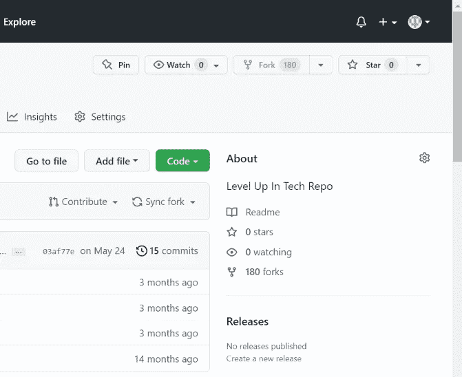
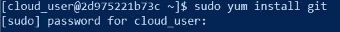
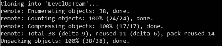
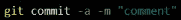

# 利用 GitHub 叉子

> 原文：<https://medium.com/codex/utilizing-a-github-fork-13ecc9f42aee?source=collection_archive---------11----------------------->


Pixabay 提供

GitHub 是一个免费的软件开发，Git 存储库托管服务，允许开发人员制作存储库的副本，修改代码，并将它们合并回原始版本作为一个协作。它还是一个社交网站，鼓励开发者交流想法和项目。

GitHub 成立于 2008 年，是全球同类平台中最受欢迎的平台。

本演练提供了安装和配置 Git、在 GitHub 中派生一个存储库、贡献给派生的存储库，然后推回到 GitHub 的基本说明。最后，将提交一个 pull 请求供开发人员批准，以便将更改合并到主存储库中。

***要求:***

*   GitHub.com 账户
*   CentOS 7 服务器
*   具有 sudo 权限的用户帐户
*   命令行终端

## **步骤 1:分叉存储库**

fork 是我们希望贡献的源存储库(Repo)的精确副本。它使我们能够在不弄乱日志文件或直接在源报告中出错的情况下操作数据。

登录我们的 GitHub.com 账户后，我们导航到将成为我们合作来源的实体的项目页面。



如上所示，我们选择页面右上角的 fork 选项。这将创建源存储库的副本，并将其放在我们的帐户中。

从我们的项目仪表板中，我们将选择绿色代码选项，并复制和保存 URL 以将我们的分支克隆到我们的本地机器上。

## **第二步:安装 Git**

我们将使用 CentOS7 的默认存储库来安装 Git。

输入 sudo yum install git 命令。



## **第三步:配置 Git**

我们将运行两个命令来记录我们的身份，以跟踪我们的 Gitcommits。首先运行 git config 命令输入我们的名字，然后输入一个电子邮件地址，如下所示。


## **第四步:克隆叉子**

要在本地机器上访问我们的 fork，我们将输入 git clone 命令，后跟我们从 GitHub 复制的 URL。

```
$ git clone [https://github.com/*username*/*repo*.gi](https://github.com/username/repo.git)t
```

或者可以表示为:

git 克隆 https://github.com/<your-username>/<project-name>。饭桶</project-name></your-username>

一旦完成，我们应该会看到类似下面显示的措辞。



## **第五步:添加投稿**

我们将使用默认的文本编辑器 vim 在项目目录中打开一个文件。


这将允许我们添加或编辑文本。

步骤 6:提交文件

做出更改后，需要输入以下命令来提交文件，并添加关于所做更改的注释。



## **第七步:将文件推送到 GitHub**

要将编辑过的文件推回我们的 GitHub 帐户，我们需要在我们的帐户仪表板上生成一个个人访问令牌。通过命令行进行身份验证时，这将代替密码使用。下面的列表可以指导我们完成生成令牌的过程。

*   选择设置>开发者设置>个人访问令牌
*   选择生成新令牌
*   插入令牌的描述
*   选择访问权限
*   选择生成令牌
*   制作令牌的副本

使用后跟 URL 的 git push 命令将文件推送到 GitHub。


## **步骤 8:请求合并贡献**

在 GitHub 仪表板上选择 Pull Requests 选项卡，然后选择 New Pull Request。

输入关于我们修改的意见，然后选择“创建拉动式请求”

我们现在将等待开发商的决定，批准我们的合并。