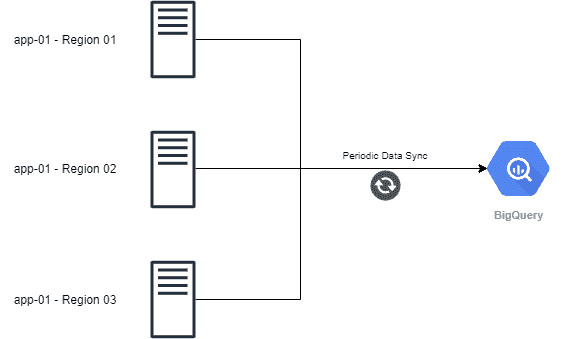
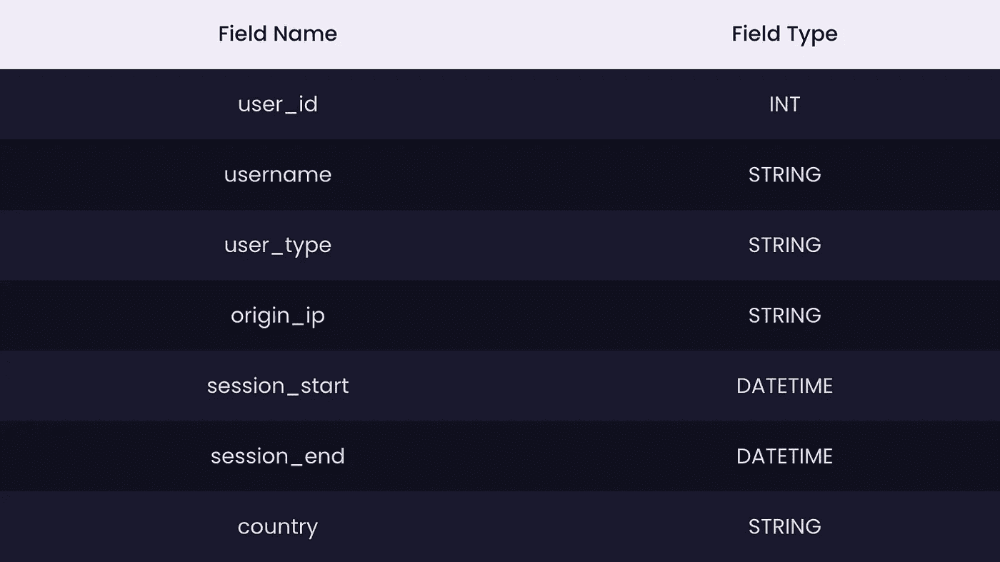
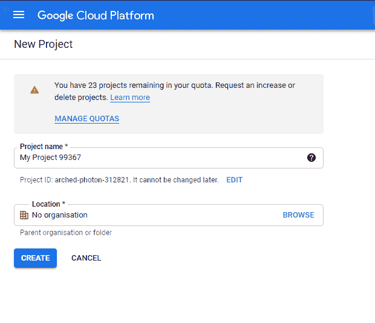
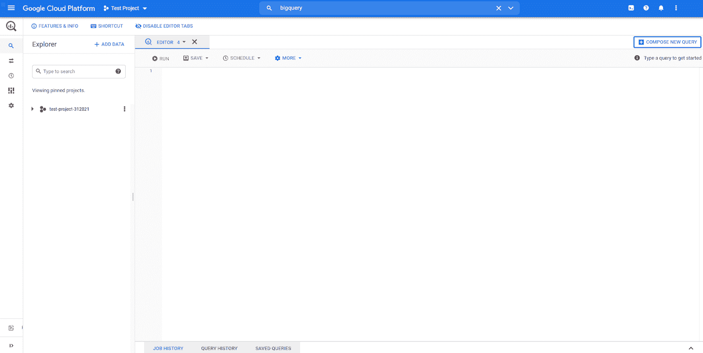
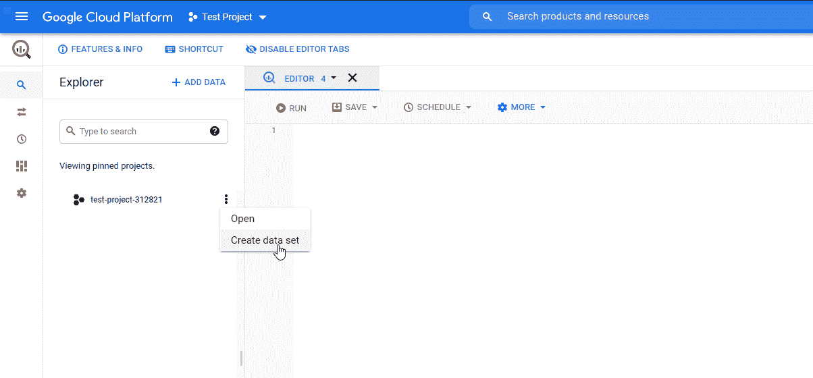
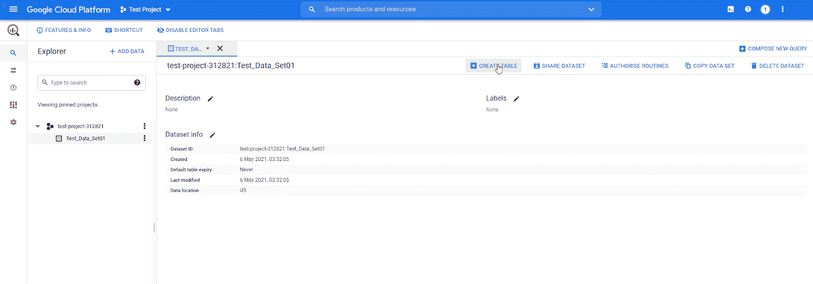
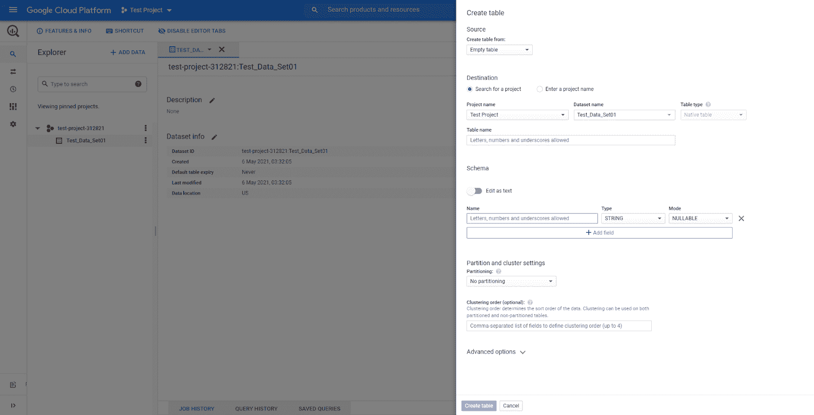
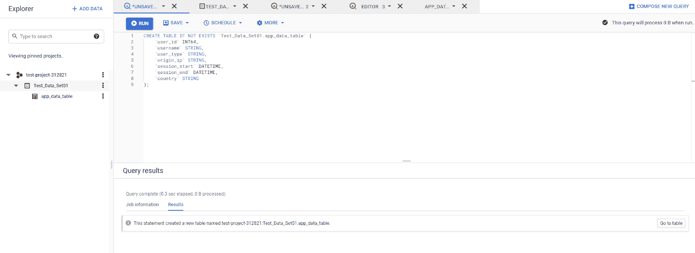
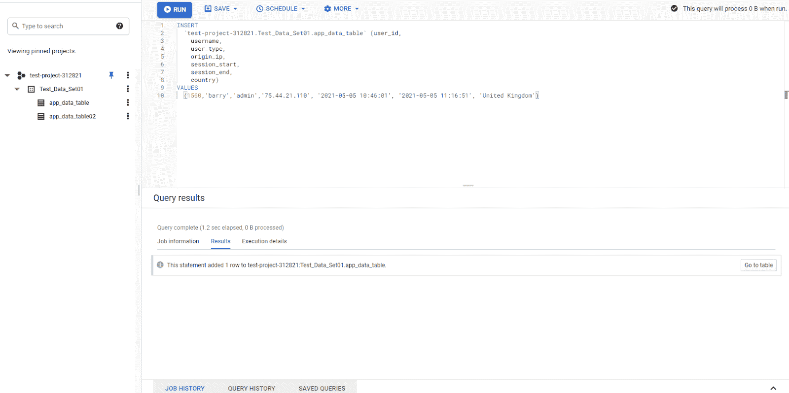
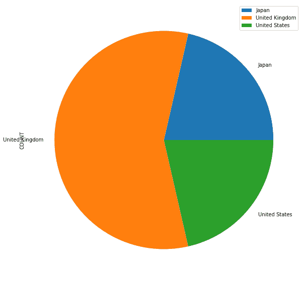

# 在分布式应用程序中使用 BigQuery 作为数据仓库

> 原文：<https://medium.com/codex/utilizing-bigquery-as-a-data-warehouse-in-a-distributed-application-d60af9133453?source=collection_archive---------8----------------------->


# 介绍

数据在任何组织中都扮演着不可或缺的角色。由于现代组织的数据驱动性质，几乎所有业务及其技术决策都基于可用数据。假设我们有一个应用程序分布在云服务提供商不同区域的多个服务器上，我们需要将该应用程序数据存储在一个集中的位置。理想的解决方案是使用某种类型的数据库。然而，传统数据库不适合处理超大型数据集，并且缺乏有助于数据分析的功能。在这种情况下，我们需要一个合适的数据仓库解决方案，比如 Google BigQuery。

# 什么是 Google BigQuery？

BigQuery 是一个企业级的、完全托管的数据仓库解决方案，是 Google 云平台的一部分。它旨在存储和查询海量数据集，同时使用户能够通过基于标准 SQL 方言的 BigQuery 数据操作语言(DML)来管理数据。

BigQuery 还提供了一套强大的工具来管理数据集，从其云控制台到 BigQuery REST API，支持多种编程语言，如 Java、Python、.网等。…此外，BigQuery 为机器学习和人工智能集成提供了内置支持，并与 BigQueryML、人工智能平台和 TensorFlow 集成。凭借其强大的 BI 引擎，BigQuery 可用于支持任何类型的现代商业智能平台。

## BigQuery 的替代方案

**Amazon Redshift —** 完全托管的云数据仓库解决方案，用于收集和存储 AWS 提供的数据。

**Azure Synapse Analytics —** 微软 Azure 提供的企业数据仓库和数据分析解决方案

# 利用 BigQuery 作为数据仓库

为数据仓库解决方案从多个服务器收集数据的最佳方式是定期将数据从应用程序同步(推送)到数据仓库。

让我们看看下面的图表。有三个应用服务器分布在多个地区，一个脚本被配置为定期将数据从每个服务器推送到 BigQuery。在本文中，我们将主要关注开发人员如何与 BigQuery 存储和查询数据进行交互。

## 示例解决方案架构



## 样本数据结构

出于演示目的，我们将在 BigQuery 中使用下面的表结构。



# 创建 BigQuery 项目

要与 BigQuery 交互，首先，我们需要创建一个 BigQuery 帐户。为此，只需在谷歌云平台中导航到 [BigQuery](https://cloud.google.com/bigquery/) ，注册一个 GCP 账户，并在那里创建一个新项目。我们将在这个项目中使用 BigQuery。



然后，导航到 BigQuery，用户将看到云控制台，在那里他们可以使用 GUI 或通过运行 SQL 查询与 BigQuery 进行交互。



# 创建 BigQuery 表

在将数据插入 BigQuery 之前，我们需要创建一个数据集和底层表，以便我们可以正确地将相关数据映射和推送到 BigQuery。

## 步骤 1 —创建一个大查询数据集

[数据集](https://cloud.google.com/bigquery/docs/datasets-intro)是 BigQuery 中的顶层容器，用于组织和控制底层的表和视图。这类似于传统的数据库。

**使用云控制台**创建数据集
点击项目然后点击“创建数据集”然后，我们将看到数据集创建面板。提供名称和数据集位置(数据集所在的区域)，然后单击“创建数据集”



**以编程方式创建数据集**
我们可以使用以下用 Python 编写的代码块来创建数据集:

```
from google.cloud import bigquery
from google.oauth2 import service_account
# Create credentials object using a service account
creds = service_account.Credentials.from_service_account_file('test-project-xxxxxxxx.json')
client = bigquery.Client(credentials=creds)
# Define Dataset Name
dataset_id = "{}.Test_Data_Set02".format(client.project)
# Construct a Dataset object.
dataset = bigquery.Dataset(dataset_id)
# Specify the Dataset location
dataset.location = "US"
# Create the Dataset
dataset = client.create_dataset(dataset, timeout=30)
print("Created dataset {}.{}".format(client.project, dataset.dataset_id))
```

## 步骤 2 —创建一个大查询表

数据集由作为存储所需数据的基础的表组成，类似于常规数据库中的表。

**云控制台建表**
点击需要的数据集，会打开数据集视图。然后点击“创建表格”选项:



这将打开创建表部分。提供表名，定义表模式，最后单击“创建表”



**使用 SQL 创建表**
由于 BigQuery 支持标准的 SQL 方言，我们可以使用带有适当数据类型的“CREATE TABLE”命令来创建所需的表。为此，只需在云控制台中执行以下 SQL 查询。

```
CREATE TABLE IF NOT EXISTS `Test_Data_Set01.app_data_table` (
`user_id` INT64 NOT NULL,
`username` STRING NOT NULL,
`user_type` STRING,
`origin_ip` STRING NOT NULL,
`session_start` DATETIME NOT NULL,
`session_end` DATETIME,
`country` STRING NOT NULL
);
```



**以编程方式创建表格**
创建表格的另一种方式是使用 google 客户端库创建脚本。以下代码块演示了如何使用 Python 在 BigQuery 中创建表。

```
from google.cloud import bigquery
from google.oauth2 import service_account
creds = service_account.Credentials.from_service_account_file('test-project-xxxxxxx.json')
client = bigquery.Client(credentials=creds)
# Configure a Table Name
table_id = "{}.Test_Data_Set01.app_data_table02".format(client.project)
# Define the Schema
schema = [
	bigquery.SchemaField("user_id", "INTEGER", mode="REQUIRED"),
	bigquery.SchemaField("username", "STRING", mode="REQUIRED"),
	bigquery.SchemaField("user_type", "STRING", mode="NULLABLE"),
	bigquery.SchemaField("origin_ip", "STRING", mode="REQUIRED"),
	bigquery.SchemaField("session_start", "DATETIME", mode="REQUIRED"),
	bigquery.SchemaField("session_end", "DATETIME", mode="NULLABLE"),
	bigquery.SchemaField("country", "STRING", mode="REQUIRED"),
]
# Create the Table
table = bigquery.Table(table_id, schema=schema)
table = client.create_table(table)
print(
"Created table {}.{}.{}".format(table.project, table.dataset_id, table.table_id)
)
```

# 向 BigQuery 插入数据

现在我们知道了如何创建数据集和表。下一步是插入数据。在向 BigQuery 中插入数据时，有两种选择:

1.  使用 SQL 插入数据(DML)
2.  流数据

以上两个选项都是插入数据的可行方法。让我们来看看每个选项。

## 数据操作语言

BigQuery DML 使用户能够使用标准 SQL 方言对 BigQuery 表执行各种操作，如插入、更新和删除。这个选项提供了最大的灵活性，因为它允许我们使用 DML 创建查询来匹配任何需求。

使用 DML 的一个主要限制是，您不能操作通过流式传输写入表中的最新数据(行)(通常是 30 分钟内发生的写入)。您可以参考 [GCP 文档](https://cloud.google.com/bigquery/docs/reference/standard-sql/data-manipulation-language)来获得对 BigQuery DML 的完整理解。

我们可以创建一个简单的插入查询，方法是用数据集和项目名定义表名，然后定义列和值，如下所示。

**样本插入查询**

```
INSERT INTO
`test-project-312821.Test_Data_Set01.app_data_table` (user_id,
username,
user_type,
origin_ip,
session_start,
session_end,
country)
VALUES
(1560,'barry','admin','75.44.21.110', '2021-05-05 10:46:01', '2021-05-05 11:16:51', 'United Kingdom')
```



**样本脚本**

```
from google.cloud import bigquery
from google.oauth2 import service_account
creds = service_account.Credentials.from_service_account_file('test-project-xxxxxxx.json')
client = bigquery.Client(credentials=creds)
# Define the Table
table_id = "{}.Test_Data_Set01.app_data_table".format(client.project)
# Define the Columns
columns = "(user_id, username, user_type, origin_ip, session_start, session_end, country)"
# Define the Data
data = "(1560,'barry','admin','75.44.21.110', '2021-05-05 10:46:01', '2021-05-05 11:16:51', 'United Kingdom')"
# Create the Query
insert_data_query = f"""
INSERT `{table_id}` {columns}
VALUES {data}
"""
query_job = client.query(insert_data_query)
print(query_job.result())
results = query_job.result()
for row in results:
print(row)
```

## 流式数据

流数据使用户能够使用“tabledata.insertAll”方法一次发送(流)一条记录或成批发送数据。与使用作业将数据加载到 BigQuery(使用 DML)相比，这是一种相对更快的方式。参考 Google 的官方文档了解更多关于流数据的信息。

我们使用“insert_rows_json”方法通过在下面的代码块中将所需的数据定义为 json 字符串来传输数据。

**样本脚本**

```
from google.cloud import bigquery
from google.oauth2 import service_account
creds = service_account.Credentials.from_service_account_file('test-project-xxxxxxx.json')
client = bigquery.Client(credentials=creds)
# Define the Table
table_id = "{}.Test_Data_Set01.app_data_table".format(client.project)
# Define the rows to INSERT
rows_to_insert = [
{"user_id": 2054, "username": 'jake', "user_type": 'user', "origin_ip": '277.12.12.55',
"session_start": '2021-05-06 05:05:41', "session_end": '2021-05-06 10:10:15', "country": 'United States'},
{"user_id": 8755, "username": 'harry', "user_type": 'user', "origin_ip": '155.15.22.222',
"session_start": '2021-05-04 01:10:01', "session_end": '2021-05-04 03:45:15', "country": 'Japan'},
]
# Stream the Data
errors = client.insert_rows_json(table_id, rows_to_insert)
# Capture Errors
if errors == []:
print("New rows have been added.")
else:
print("Encountered errors while inserting rows: {}".format(errors))
```

既然我们知道了如何插入数据。在我们的分布式应用程序场景中，我们可以创建一个脚本，将数据流式传输到 BigQuery，并通过 cron 作业定期触发。让我们假设我们的分布式应用程序将所需的数据保存到一个 JSON 文件中，并且我们需要在每天午夜将该数据流式传输到 BigQuery。我们可以通过在所有服务器上运行以下脚本来流式传输数据来实现这一点。

**流数据(Cronjob — 0 0 * * *)**

```
from google.cloud import bigquery
from google.oauth2 import service_account
import datetime as dt
import json
creds = service_account.Credentials.from_service_account_file('test-project-312821-ebd8bff1ae68.json')
client = bigquery.Client(credentials=creds)
# Opening JSON file (JSON file for the specific day)
currnet_date = current_date = dt.date.today().strftime("%Y-%m-%d")
f = open(f'{currnet_date}-app-data.json')
# Load the JSON data
app_data = json.load(f)
# Define the Table
table_id = "{}.Test_Data_Set01.app_data_table".format(client.project)
# Stream the JSON data
errors = client.insert_rows_json(table_id, app_data)
# Capture Errors
if errors == []:
print("New rows have been added.")
else:
print("Encountered errors while inserting rows: {}".format(errors))
```

我们使用流，因为我们不需要使用 DML 更新或删除新添加的记录。当我们通过互联网传输多个数据流(多个服务器)时，通过流传输获得的性能优势至关重要。

# 从 BigQuery 检索数据

困难的部分已经过去，现在我们成功地将数据从每个应用服务器传输到 BigQuery。下一步是从 BigQuery 读取数据。我们可以使用一个简单的 SELECT 语句从 BigQuery 读取数据。

由于 BigQuery 支持标准的 SQL 方言，因此我们可以使用各种语句(如 WHERE、ORDER BY、GROUP BY、LIMIT 和 JOIN)来过滤和提取所需的数据集。

## 样本选择查询

```
SELECT * FROM `test-project-312821.Test_Data_Set01.app_data_table` LIMIT 1000
SELECT
user_id AS `USER_ID`,
username AS `USERNAME`,
user_type AS `USER_TYPE`,
origin_ip AS `ORIGIN_IP`,
COUNT(user_id) AS `COUNT`
FROM
`test-project-312821.Test_Data_Set01.app_data_table`
WHERE
country = 'United Kingdom'
GROUP BY
user_id,
username,
user_type,
origin_ip
ORDER BY
user_id ASC;
```

现在让我们看看如何通过 BigQuery API 将这些数据发送给 python 程序。当处理大型数据集时，Python 库的 Pandas 是允许开发人员使用数据框轻松管理和转换数据的最佳选择。

下面的代码块从 BigQuery 中检索按每个国家分组的记录数。

```
from google.cloud import bigquery
from google.oauth2 import service_account
import pandas as pd
creds = service_account.Credentials.from_service_account_file('test-project-312821-ebd8bff1ae68.json')
client = bigquery.Client(credentials=creds)
# Define the Table
table_id = "{}.Test_Data_Set01.app_data_table".format(client.project)
# Create the SELECT Query
select_data_query = f"""
SELECT
country AS `COUNTRY`,
COUNT(user_id) AS `COUNT`
FROM
`Test_Data_Set01.app_data_table`
GROUP BY
country
ORDER BY
country ASC;
"""
# Create a Data Frame from the Results
results_df = client.query(select_data_query).to_dataframe()
print(results_df)
```

然后，我们可以使用此数据框来可视化数据，以便更好地理解底层数据集。我们将根据从 BigQuery 检索到的数据创建一个饼图，以直观显示每个国家的用户数量。

# 示例数据可视化脚本

```
from google.cloud import bigquery
from google.oauth2 import service_account
import pandas as pd
import matplotlib
import pyarrow
creds = service_account.Credentials.from_service_account_file('test-project-312821-ebd8bff1ae68.json')
client = bigquery.Client(credentials=creds)
# Define the Table
table_id = "{}.Test_Data_Set01.app_data_table".format(client.project)
# Create the SELECT Query
select_data_query = f"""
SELECT
country AS `COUNTRY`,
COUNT(user_id) AS `COUNT`
FROM
`Test_Data_Set01.app_data_table`
GROUP BY
country
ORDER BY
country ASC;
"""
# Create a Data Frame from the results
results_df = client.query(select_data_query).to_dataframe()
results_df = results_df.set_index('COUNTRY')
print(results_df)
# Visualize the data as a Pie chart
plot = results_df.plot.pie(y='COUNT', figsize=(10, 10))
```

## 结果



这只是一个简单的例子，我们可以将数据传递给各种工具和库，如 Google Data Studio、Power BI 等。更有效地将它们可视化。

# 结论

这就是全部，我们已经涵盖了 BigQuery 的所有基础知识。通过本文，我们了解了如何通过将数据流式传输到 BigQuery 数据集中，将 BigQuery 用作分布式应用程序的数据仓库。下一步是深入挖掘 BigQuery 和应用程序，在此基础上进行扩展，以 BigQuery 为基础构建一个全面的数据分析解决方案。