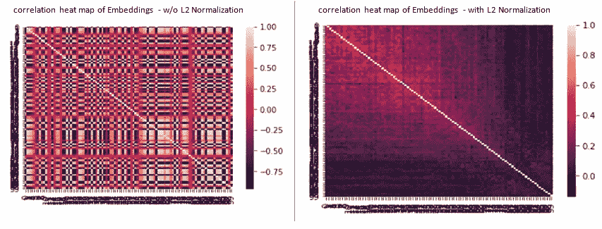

# 在非英语在线工匠服务市场上利用 NLP 的力量

> 原文：<https://medium.com/codex/utilizing-the-power-of-nlp-in-non-english-online-craftsman-service-marketplace-2dc33d4d5e?source=collection_archive---------13----------------------->

图片鸣谢:[https://images.app.goo.gl/boAPRc6Cm8XGwt1J7](https://images.app.goo.gl/boAPRc6Cm8XGwt1J7)

## 指导客户选择正确的服务 Id 类别

手机 App 截图

在像德国这样的发达经济体中，获得经济**劳动力** - **密集型**家政服务(管道、电工、油漆、修理等)。)对于像我们这样的说英语的外籍人士来说，立即和紧急处理过去是很困难的。然而，电子商务行业最近爆发式增长的日子已经一去不复返了，随着 co-tasker、Handwerker finden 等市场的出现，这个利基在线服务市场也不例外。这些应用程序将客户与专业助手和选项联系起来，以选择最佳和合适的产品。他们中很少有人有完整的英文支持和界面。然而，他们中的大多数仍然是在德国。

## **商业案例**

由于是新的，还没有完全接触到人工智能，这些平台的一个难点是根据任务描述或任务标题找到或选择正确的服务 ID。例如，没有下拉选项的选项/智能来选择合适的服务 ID 类别(例如，管道、阳台维修、烟囱工程等。)根据工作描述，消费者经常在错误的 serviceId 类别中提交服务请求，大多数情况下他们倾向于选择简单的选项，如“Sonstiges”(其他)。

例如，一个实际的油漆作业被提交到“Others”服务 Id 类别。这种错误的服务 ID 选择存在以下问题:

工作属于错误的类别

由于上述情况，技工找不到合适的工作。

这对收入有直接影响，因为零售商在搜索时找不到相关的工作。目标是通过基于服务请求细节提供正确的 serviceId 类别的建议，帮助消费者选择正确的类别。因此，我们的任务是构建一个高效的分类器，它可以根据描述和其他作业细节对错误的正确的 serviceId 进行分类。

手机 App 截图

数据集和详细的解决方案保存在这个 [gitHub 存储库](https://github.com/nitsourish/NLP_serviceID)中。数据集主要包含以下关键字段，语言为德语。

> 原始特征

a)标题:工作标题(字符串)

b)描述:详细的工作描述(字符串)

c)贸易分类类型:(分类)

d)目标日期:相对于工作创建日期的工作完成的目标日期

> 目标- *服务 Id*

## 解决方法

虽然在 jupyter 笔记本的这个 [gitHub 库](https://github.com/nitsourish/NLP_serviceID)中解释了详细的方法，但是该解决方案主要有以下两个组件:

I)NLP-使用文本字段(标题和描述)预处理和嵌入创建。在这里，我尝试了两种流行的文本嵌入方法——a)word 2 vec，b) FastText，每种都有 100 个维度，然后选择更好的一种。

ii)多分类器-最终超参数调整分类器，使用嵌入和其他特征工程管道来预测 ServiceId。

解决方案概述

总数据集(646 个数据点)被分成训练(85%)和验证(15%)。

## 评定标准

作为一个多类问题，主要的评估标准是验证数据的准确性(96 个数据点)。此外，我们还查看了其他分类报告指标——分类精度、召回率、f1 分数等。

> L2 归一化—嵌入矩阵

规范化嵌入矩阵是一个很好的做法。它将达到以下两个目的。
- a) L2 在旋转下不变，因此更适合基于梯度的学习方法。
- b)这将降低矢量间的相关性

具有最佳超参数的最终分类器

具有最佳超参数的最终分类器

因此，随着进一步的 l2 归一化和超参数调整，分类器精度从 69.8%提高到 77.1%(提高了 10.46%)。同样作为一个不平衡分类器，其他指标如 f1 分数、召回率和精确度在类别和整体上都有所提高。

## 进一步改进策略

*   基于 PCA 的嵌入向量空间去相关
*   尝试使用其他 NLP 嵌入特征提取，例如 TensorFlow。Keras 嵌入层、GloVe(单词表示的全局向量)等。并使用这些嵌入向量构建最终分类器
*   尝试不同的 clasifier 算法- RandomForrest，LightGBM，CatGBM 等。
*   作为基于 NLP 的海量数据分类器，可以探索基于 Keras-LSTM(长短期记忆)(LSTM)的人工递归神经网络(RNN)架构。