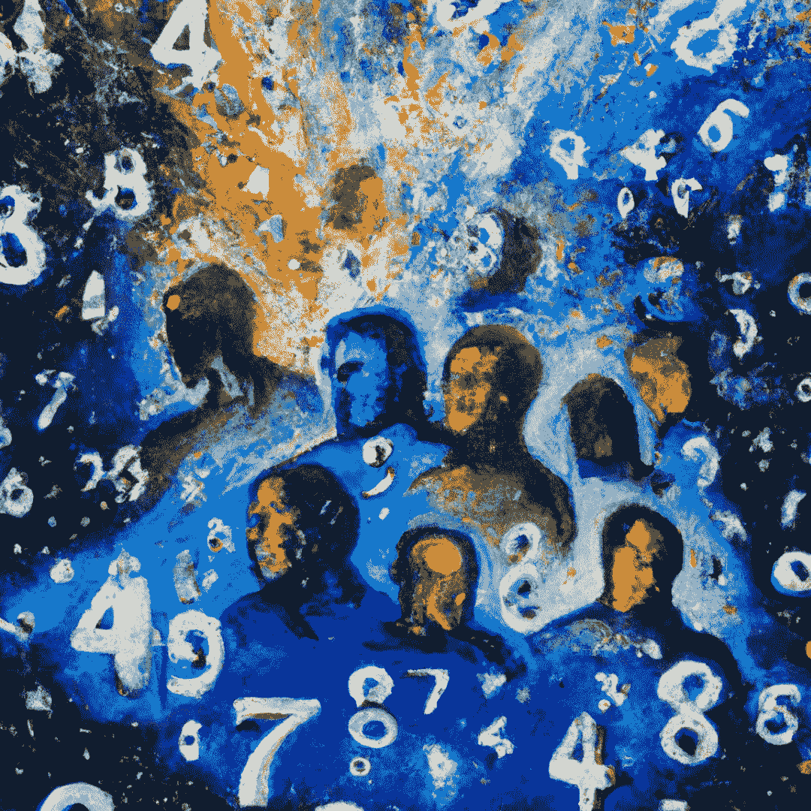

# UUIDs 被认为是有害的——它们让我们看不到我们都是一样的。

> 原文：<https://medium.com/codex/uuids-considered-harmful-they-blind-us-from-the-fact-that-we-are-all-the-same-5d4dcf9be6b3?source=collection_archive---------3----------------------->

UUIDs 是编程中经常使用的标识符。他们看起来无害，但实际上有一个黑暗的目的。

首先，你近距离看过 UUID 吗？这里有一个例子:

`e94c1d8e-e801-11ec-8fea-0242ac120002`