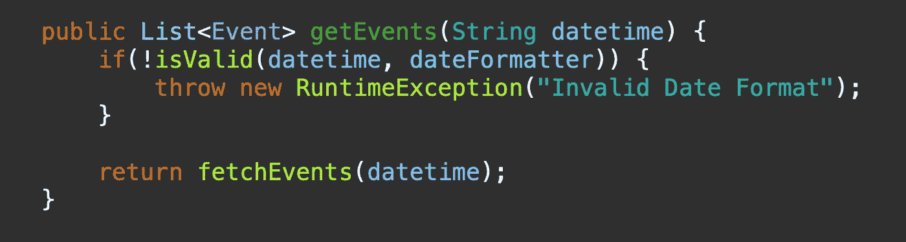
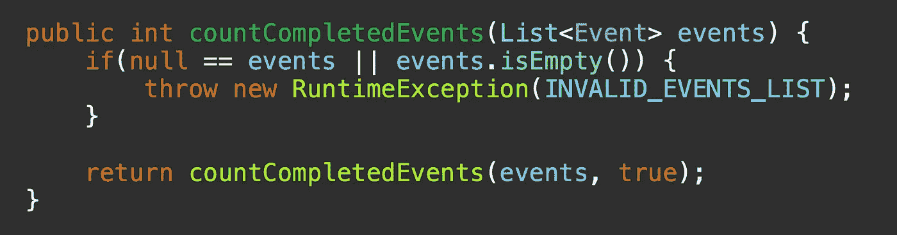
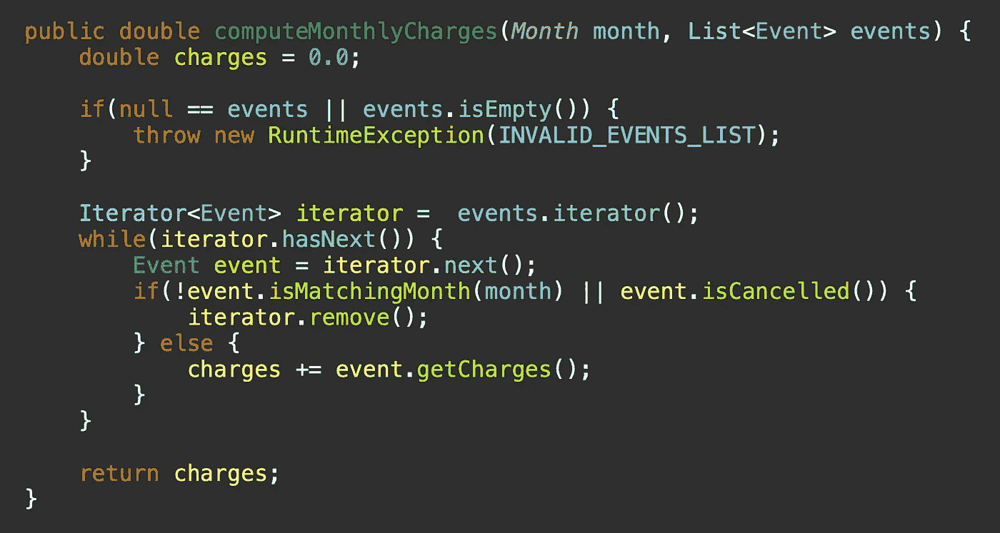
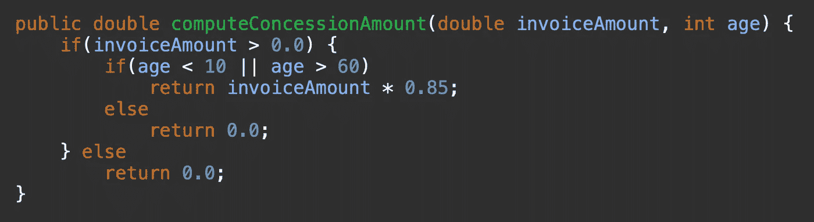

# 输入验证:第一道防线

> 原文：<https://medium.com/codex/validation-first-line-of-defense-220e47351d0a?source=collection_archive---------15----------------------->

每次收到输入时，它只能处于两种状态，即正确或不正确。为了使输入正确，它必须遵循某些规则，例如，它应该是预期的类型，或者它应该只在 x 和 y 之间，或者可能是基于业务需求的其他东西。对于不正确的输入，所有需要做的就是不遵守这些规则。

> 验证输入有许多优点，例如，它可以从处理不正确的输入中节省宝贵的资源。早期验证类似于先发制人的思维，它允许在执行正确性的同时对已知问题采取预防措施。

# 实施验证的好处

验证输入数据对于确保计算后生成的输出的正确性和准确性至关重要。如果做得正确，它有助于减少错误并提高算法的可信度。

提前应用验证确保了计算是在正确的数据上进行的。下面将介绍对输入数据应用验证的一些直接好处。

## 1.防止不正确的输入值

传递不正确的输入可能会导致错误的计算、异常甚至某些情况下的错误。

验证作为参数接收的日期类型变量的格式

## 2.过滤具有无效输入状态的请求

未初始化的变量和数据结构可能会在不知情的情况下作为参数传递给方法。

验证传递的集合包含一些可以处理的元素

## 3.通过过滤掉“超出范围”的输入值，强制执行计算的正确性

并非所有数据对某些计算都有效，在处理之前验证数据可以确保只使用正确和有意义的数据，而忽略其他数据。

验证事件是否与作为参数传递的月份值匹配

## 4.确保算法的准确性和正确性

验证输入数据的正确性和范围也确保了整个算法的准确性和正确性。

在计算特许权金额之前验证年龄和发票金额

> 这是我最近写的关于设计模式的书的链接。希望你会发现它有用。

 [## 面向 Java 开发人员的软件设计模式:构建可重用软件的专家引导方法和…

### 《面向 Java 开发人员的软件设计模式》讨论了软件设计的基本原理以及成熟的…

www.amazon.in](https://www.amazon.in/Software-Design-Patterns-Java-Developers/dp/9391392474)