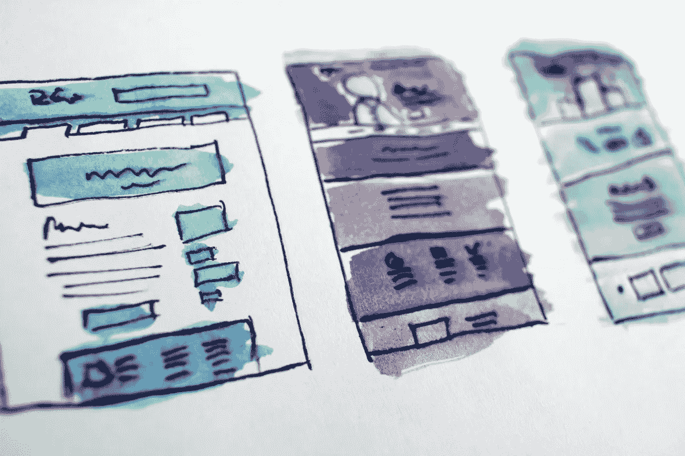

# 价值流图:完整而简单的指南

> 原文：<https://medium.com/codex/value-stream-mapping-a-complete-and-simple-guide-cfba91fbe7b2?source=collection_archive---------7----------------------->

一旦转化的结果开始显现，实施扩展的敏捷框架将会是一次令人兴奋和激动的经历。但达到这个阶段可能需要一段时间。安全实施与概念、流程和大量信息交织在一起，如果没有适当的指导，要掌握这些信息可能会非常困难和复杂。

扩展敏捷框架的精髓之一是**价值流**，这是传统项目管理的革命性进步。在本文中，我们旨在为您提供一份简明客观的价值流概要。你将了解什么是价值流，为什么需要它，以及它是如何产生的。对于那些坚持到最后的人来说，有一个免费的可下载模板可以帮助你开始绘制价值流图。

# 什么是价值流？

价值流由组织开发解决方案或服务从概念到向客户交付价值所采取的一系列步骤组成。它专注于创造、理解、组织和构建一个为最终用户提供持续价值的产品。外管局的投资组合可以由一个甚至多个价值流组成。

# 为什么需要价值流？

在传统项目中，您利用临时团队的服务，这些团队可能只是为了按时完成项目而工作。这些团队通常各自为政，很少进行协调，阻碍了全面合作。这种条块分割本身就是一个可怕的问题。这也增加了延迟和移交，从而影响项目质量和生产力。

然而，对于价值流，可以有长期的跨职能团队，他们在持续的基础上工作，并在过程中不断学习和改进。价值流中的跨职能团队不仅仅是交付产品，而是完全专注于提供价值，并且只致力于交付价值。没有明显的筒仓，允许想法和讨论在团队之间自由流动，创造一个高度协作和支持的环境。

价值流是优化整个系统的一个很好的方法。通过帮助清晰地可视化正在进行的有价值的工作，以及小批量工作，它有助于加快上市时间，并有助于构建高质量的产品。它不仅在筒仓间流动，而且鼓励彼此更多面对面的交流，帮助减轻结盟的痛苦。当然，创建独立的价值流也将那些可怕的依赖最小化。

# 价值流的类型

在扩展的敏捷框架中，有两种类型的价值流。

# 1.运营价值流:

以向最终用户交付由开发价值流开发的解决方案为中心。外管局将其进一步细分为四种运营价值流:

*   **履行价值流:**由履行客户要求的必要步骤组成。例如，一位顾客在网上订购了一条牛仔裤，并通过向顾客发货来履行订单。

*   **制造价值流:**原材料转化为顾客可以购买的产品。这方面的一个例子可以是脉搏血氧计。

*   **软件产品价值流:**客户使用的软件产品。这可能是 CRM、ERP 或 SaaS 解决方案。

*   **支持价值流:**支持当前正在进行的流程的一系列步骤。这方面的一个例子可以是对一个组织进行年度审核所必需的所有活动。

# 2.发展价值流

由开发可被运营价值流利用的解决方案的人员组成。这是大多数组织关注的部分，因为这涉及到需要构建系统的人。

在开发价值流之前理解运营价值流非常重要，因为运营价值流的映射可能是一对一的，可能涉及多个开发价值流，或者多个运营价值流可能需要一个开发价值流。

# 识别价值流

发现和规划任何类型的价值流都不是一个简单的过程。在为运营价值流启动 ART 之前，您必须管理各种各样的方面。将需要一系列研讨会来识别流，因为它们可能与组织内预先安排的筒仓相矛盾。

下面列出了一些有助于理解和规划你的价值流的要点。

*   **对你的产品和业务建立清晰的理解:**你需要知道你将启用什么样的业务流程，以及如何实现你的业务目标。使用您以前的工作作为参考点，以更好地理解您的流程是如何工作的，然后在此基础上进行构建。为了计划你的预算，仔细检查所有早期价值流的支出和收入。
*   **建立对协调运营价值流的理解:**了解业务架构和团队如何协调非常重要。你需要清楚地了解价值流将如何调整，这意味着你需要知道艺术的调整。这将使您能够理解存在的依赖性，从而减少瓶颈和移交。
*   **拥有健壮的技术架构:**介绍重构、减少技术债务和改进架构的实践。尝试识别技术风险。意识到你的延迟，并优化正在使用的东西，以适应功能。确定组成产品的所有较大和较小的系统。
*   **关注客户:**你打算向客户销售什么服务或产品？你服务于什么市场？你目前销售什么产品？这些都是你要问自己的问题。有时你必须放弃控制，以便更好地为顾客服务，这对一些人来说是非常困难的。你需要在更大的范围内思考，放下自我，这样你才能实现真正需要的东西。
*   **了解问题:**由于它的协作性质，在确定你的价值流时，它有助于突出所有影响你的组织的潜在问题。这有助于对未来做什么做出更明智的决定。

# 绘制价值流图的模板

确定了价值流的所有变量后，现在是时候使用模板来绘制它了。到目前为止，我们已经讨论了识别价值流的所有方法。这是您绘制价值流图的地方。
每个价值流都由构成其基本结构的这 5 个要素组成。下面列出了这些:

1.  **触发**:由客户要求或订单发起
2.  步骤:列出并描述你想要实现目标的步骤
3.  **价值:**确保所有步骤完成后，价值是否交付给客户
4.  **人员:**将完成工作的个人
5.  **交付周期:**从开始到价值交付结束所花费的时间。

这个简化的模板可以帮助您在绘制开发价值流图时减少复杂性。这是假设你已经完成了你的运营价值流，并准备围绕交付价值组织艺术。为了帮助您完成这项练习，请发送电子邮件至 media@kendis.io，获取我们的免费发展价值流图模板。此处的模板将用于指导或说明目的。

# 价值流映射工具

在大型组织中，一个或多个敏捷发布系列参与价值流中的交付解决方案。因此，价值流图在构建灵活的结构或复杂的项目中非常重要。不可忽视对可扩展的价值流映射工具的需求。凭借其卓越的可视化和智能数据集，Kendis 提供了一种高效的方法，可以灵活、轻松地将您的价值流与您的敏捷发布系列精确地对应起来。尽快组织和创建你的工作室。

想了解 Kendis 如何满足您特定的价值流绘制需求吗？免费试用！