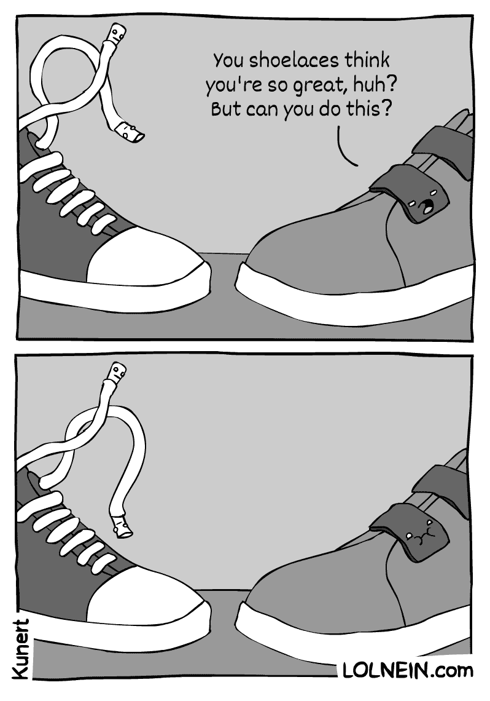

# 香草味不是我最喜欢的 JavaScript 味道(但是我总是在我的代码编辑器中保留一夸脱)

> 原文：<https://medium.com/codex/vanilla-isnt-my-favorite-flavor-of-javascript-but-i-always-keep-a-quart-in-my-code-editor-8679943dfa11?source=collection_archive---------18----------------------->

现在我已经完成了我的软件工程项目，找工作已经消耗了我所有的时间。网络，研究，学习技术面试的各种 DSA 这些都很重要！但是当我尝试另一个编码挑战练习题时，我意识到我已经一个多星期没有编码任何东西了。没有建筑，没有设计，没有推进一个新的 Github repo——在启动我的职业生涯的忙碌中，我忘记了我最初到底在做什么。最重要的是，我解决所有这些算法问题的技能受到了影响，因为我在日常工作中没有充分使用这种语言。

作为一名训练营的毕业生，我的个人经历是快速、紧张和适度的疯狂。我们学习了 Ruby，只是为了实现 Rails。我们学习了 JavaScript，然后直接进入 ReactJS(和 Redux)。我所记得的关于基本的“香草”JavaScript 被 JSX 和一个为我做了这么多工作的框架的不可思议的便利所吞噬，以至于我理所当然地认为语言本身是多么强大！

这是我的一些噩梦的样子，只是没有缩进的代码海洋…

作为一名新开发人员，我想在构建东西方面做得更好。作为求职者，我需要学习大量的逻辑和数学理论来通过大多数公司的面试过程(坦白地说，这是我迄今为止做过的最困难的事情，因为它不会像凭空创造一样让我的大脑参与进来。耶，艺术家的大脑！).人类能做什么？！

我脑海中闪现出一个最奇怪的画面——六岁的我，得到了我的第一双 velcro 鞋。当然，我学会了如何系鞋带，所有的孩子都会，但是 velcro 棒极了！这么多的方便，更少的工作——但是当我几个月后试着穿上系带鞋时，我实际上不得不思考系带是如何工作的。我太习惯新的方式了，我都忘了原来系鞋带的技巧了！所以…

我很喜欢好的 GIF。

我回去了。回到 B.F .时代(框架之前)。我决定构建一个简单的 web 应用程序，使用 HTML、CSS 和普通的 JavaScript。为了寻找一点灵感，我看了一些视频，读了一些博客(下面列出了一些资源)。然后，我花了几个小时制作了一个声音制作应用程序，当一个按钮被点击时，它会产生音频，并发送一个从点击中反弹的小动画气泡。我靠在 DevEd [here](https://www.youtube.com/watch?v=2VJlzeEVL8A&list=PLDyQo7g0_nsXlSfuoBpG5Fgz0Qe3IvWnA&index=11) 的一个视频上，主要是为了造型——当我刚刚起步时，他的视频是一个很好的资源，我喜欢他的风格。

一旦应用程序建立起来，我感觉棒极了。完成了。就像一个真正的软件开发人员，而不仅仅是一个努力递归求解斐波那契数列的学生(如果你知道，你就知道！).这给了我信心，并在旧 Github 的个人资料上添加了一些闪亮的绿色方框。我开始了另一个更长的项目，并决定每天给它一个小时的编码时间，同时兼顾我现在正在平衡的其他需求。

一些优秀的项目创意来源:

这个列表列出了 40 多个项目想法——强调普通的 JS，但是可以修改以用于其他语言(如果你愿意，也可以升级到使用框架)

[Github](https://gist.github.com/MWins/41c6fec2122dd47fdfaca31924647499)上的这个列表充满了各种各样的项目创意，包括前端和后端

[YouTube 上的 DevEd 频道](https://www.youtube.com/c/DevEd)——他的很多材料都是面向初学者的，但他对 HTML/CSS 和教学风格的掌握非常好。优秀的回顾事物，或想法的项目尝试

请分享你推荐的任何其他资源——我总是在寻找灵感！