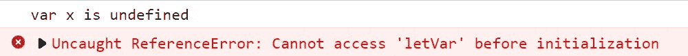

# js 中的 Var 与 let

> 原文：<https://medium.com/codex/var-vs-let-in-js-7001005d68db?source=collection_archive---------7----------------------->

[腾雅特](https://unsplash.com/@tengyart?utm_source=medium&utm_medium=referral)在 [Unsplash](https://unsplash.com?utm_source=medium&utm_medium=referral) 上拍照

> `let`在 ES6(2015)中首次推出。

在这篇文章中，我想讨论一下 javascript 中的`var`和`let`之间的区别。

## 提升

> 提升是 JavaScript 将声明移动到顶部的默认行为。

为了理解下面的例子，我们需要知道在 JavaScript 中，当试图访问一个先前未声明的变量时，会抛出一个`[ReferenceError](/@aastha6348/undefined-error-v-s-reference-error-80f552fcfe94)`[。**另一方面**，如果一个变量被声明但没有赋值，那么它就是`undefined`](/@aastha6348/undefined-error-v-s-reference-error-80f552fcfe94)

当我们试图访问变量`x`时，没有抛出`ReferenceError`，因为**允许用`var`提升**，因此变量`x`被声明但没有赋值。

**在`let`变量上**不允许吊装，因此`ReferenceError`被抛出。

## 函数范围与块范围

两种作用域类型的区别在于作用域内声明的变量的可访问性。

在**函数作用域中，**声明的变量可以在声明它的函数中访问，也可以在嵌套在该函数中的任何函数中访问。用`**var**` 关键字定义的变量有函数作用域。

来自 chrome

正如您在示例中看到的，变量`d`在嵌套函数`nestedFunc`中是可访问的，因为它是在主函数`f`中声明的。变量`r`可以从`if-statement`中访问，因为它是在声明它的同一个函数下使用的。

当谈到**块范围**时，花括号内的每个代码块都有自己的范围，变量在声明它们的块之外是不可访问的。用`**let**`关键字定义的变量具有块范围。

因此，如果我们将变量`r`的定义改为`let`，我们将失败:

## 申报

不允许使用`let`重新声明变量，将抛出`SyntaxError`。

使用`var`重新声明一个变量是允许的，但这是一个不好的做法，它非常令人困惑，正如你在下面的例子中看到的:

因此，举例来说，如果你是一名 C#开发人员，在 JavaScript 中使用`let`可能会更熟悉，而且在某些情况下会更安全，因为它可以防止混淆。