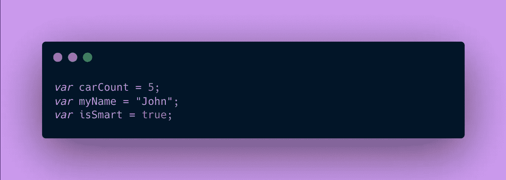
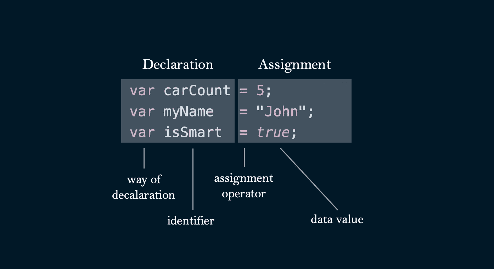
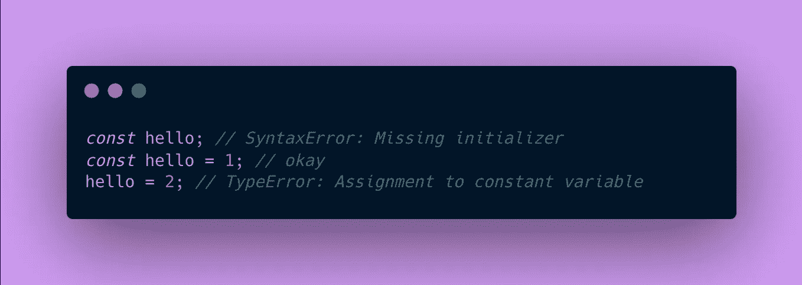
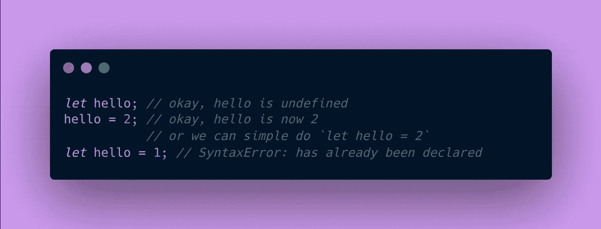

# Javascript 中的变量—揭开 var、const 和 let 的神秘面纱

> 原文：<https://medium.com/codex/variables-in-javascript-using-var-const-and-let-91fb0c6a809a?source=collection_archive---------22----------------------->

在编程中，变量是一个存储桶，用来在计算机内存中存储数据值。我们在编程中主要使用变量来构建逻辑结构来处理数据。编程语言都有不同的定义和声明变量的方式，今天我们将讨论用 Javascript 来实现。这里有一些变量的例子。

让我们把这些语句分成两部分:声明和赋值。

分裂变量初始化

在存储一个值之前，我们首先通过选择一个**声明方式**和一个唯一的**标识符**来声明变量。这是我们告诉程序在内存中分配一些空间来存储信息的阶段。在像 Java 这样的语言中，我们通常指定变量的类型，比如整型、字符串型、双精度型或布尔型，但是 Javascript 是“松散类型”的，这意味着没有指定这一方面。

一旦声明了一个变量，就可以给它赋一个数据值。`=` **赋值运算符**之后是**数据值**。由于 Javascript 的松散类型特性，赋给变量的值可以是任何值，从数字到布尔值到对象到数组。

# 声明方式:如何声明变量？

在 2015 年(ES6 之前)之前，声明变量的方式普遍使用`var`方法。然而，由于[范围](/@codingsam/awesome-javascript-no-more-var-working-title-999428999994)中的问题，两种新的声明变量的方式成为了规范:`const`和`let`。

## 什么时候用哪个？

`const`代表常量变量，不能再次声明，赋值不能改变。同样，由于这个性质，`const`变量需要同时声明和赋值(也称为*初始化*)。认为*只读。*

`let`是一种声明变量的方式，声明后可以更改。不能再次声明它。

根据 W3，一般规则是使用`const`作为默认值。如果变量需要新的赋值，使用`let`声明变量。在所有其他情况下，如果需要保留遗留或旧的代码库，请使用`var`。

# 标识符:如何命名变量？

Javascript 变量必须有惟一的标识符，这意味着它们应该有惟一的名称来描述被存储的数据。这些可以很短，但必须充分描述我们存储的内容，比如上面的第一个例子，比如`carCount`、`myName`和`isSmart`(不像`hello`)。这里有一些从 W3 构造名字的一般规则。

*   名称可以包含字母、数字、下划线和美元符号。
*   名字必须以字母开头。
*   名称也可以以$和 _ 开头。
*   名称区分大小写(Y 和 Y 是不同的变量)。
*   保留字(如 JavaScript 关键字)不能用作名称。

我倾向于使用常用的 [camelCase](https://en.wikipedia.org/wiki/Camel_case) 来命名我的变量。简洁是关键，确保标识符对别人和你自己来说都是可理解的。这里是另一个优秀的[风格指南](https://developer.mozilla.org/en-US/docs/MDN/Writing_guidelines/Writing_style_guide/Code_style_guide/JavaScript#variables)用于 MDN 中的变量。

# 关闭

对于任何努力使自己的程序有用的人来说，变量是必不可少的。当给一个变量赋值时，一定要理解发生了什么。了解什么时候使用`const`、`let`和`var`也会帮助我们在未来成为更好的程序员。