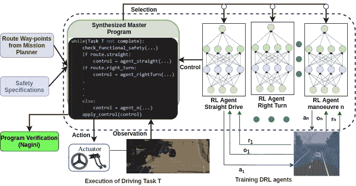
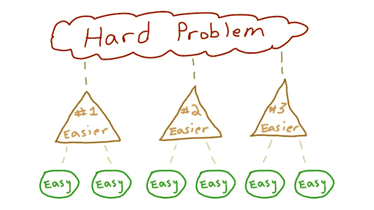
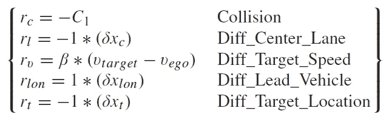
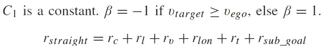
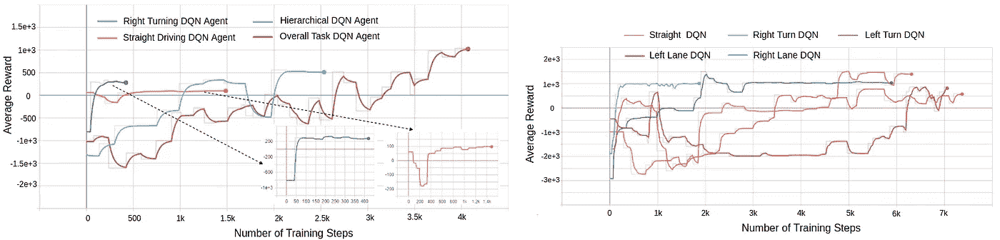
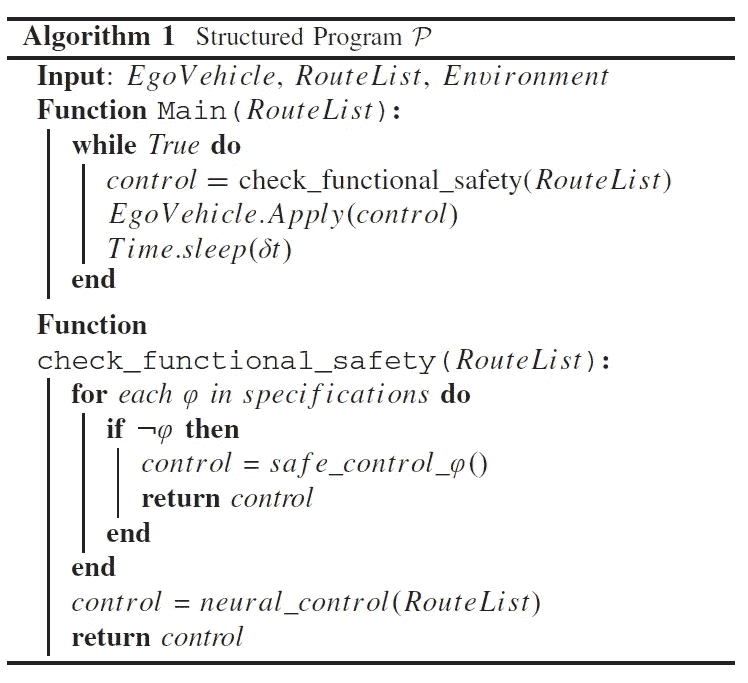
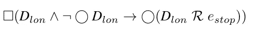
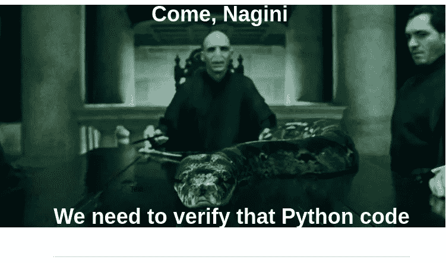

# 可验证程序触发的深度强化学习代理

> 原文：<https://medium.com/codex/verifiable-program-triggered-deep-reinforcement-learning-agents-27b54c13a70d?source=collection_archive---------11----------------------->



分层程序触发强化学习(HPRL)框架。图的右侧描绘了 RL 代理的异步训练，具有个体观察(oi)、动作空间(ai)和奖励信号(ri)。左边部分描述了驾驶任务的程序控制执行，其中程序检查功能安全，并根据任务规划器生成的路线计划或根据安全模块推荐的控制策略触发 RL 代理。

**深度强化学习(DRL)** 是一种流行的技术，使用神经网络将复杂任务的状态映射到动作，从而使奖励信号最大化。鉴于它们在游戏中的超人表现，如 AlphaGo [1]，这些算法正在被广泛研究，以学习可以自动驾驶智能车辆的策略[2，3]。在自动驾驶中使用 DRL 智能体可以带来流畅的类似人类的驾驶体验，但 DRL 网络有两个主要警告:-

1.  它们遭受冷启动，即学习期间的初始策略是非最优的，并且网络需要大量的训练样本来收敛到合理的策略。
2.  由于神经网络的不可解释性和不透明性，功能安全性(安全关键系统认证的重要要求)无法得到保证。

我们在我们的 ***分层程序触发强化学习(HPRL)*** 框架中解决了上述每个问题。



> *“如果你被一个问题的大小压垮了，那就把它分解成更小的部分”——****查克·克洛斯***

人类在驾驶时经常使用交通/道路规则和经验的微妙组合。人类的驾驶政策是语义的，而不是几何的和数字的，例如，“直行到路口右转”，而不是“以当前速度行驶 50 米并转向 90⁰".”这些语义指令有子目标，这些子目标可以划分为层次抽象。子目标受到应用于不同时间和空间点的符号规则的严格监管(例如，在红灯时停下)。受此启发，我们将驾驶任务分解为一系列基本驾驶动作；即直行、右/左转、右/左变道。我们异步训练 *RL* 智能体，使用特定动作、观察空间和奖励信号来学习这些驾驶动作中的每一个。从而使他们比单一的 T2 DRL T3 政策更有效率。此后，代理被结构化程序触发执行，以完成驾驶任务。功能安全要求作为嵌入的断言包含在程序中，从而有助于驾驶策略正确性的正式证明。然后，我们仔细查看负责直线行驶操纵的 *DRL* 代理商之一的配方。

***直行智能体:*** 这个智能体的目标是跟踪速度，保持车道，与前方车辆保持安全距离。*直线驾驶主体*的观察空间为 ***(δx_t，δx_c，v_ego，δx_lon)*** 其中 *δx_t* 是距子任务目标路点的 L2 范数距离，δx_c 是距车道中心的距离，v_ego 是自我车辆的当前速度，δx_lon 是距前导车辆的距离。这些动作可以控制加速、减速和受限转向。奖励功能是以下奖励的组合:



比较了扁平和分级 *DRL* 的抽样效率和每个 *DRL* 代理商获得的报酬如下图所示:-



(a)学习单独策略的个体代理之间的比较，在两个策略之间选择的分级 DQN 和学习在直行之后在交叉路口右转任务的整体策略的平坦 DQN。(b)所有机动特定 DQN 模型每步的平均奖励

# **结构化程序 P 和嵌入式断言**



结构化程序***【P】***的作用是将驾驶任务的子路线序列作为输入，并调用合适的(预训练的) *RL* 代理来执行每个子路线。除了充当 *RL* 代理的定序器和触发器，程序 ***P*** 还充当从众所周知的驾驶规则中收集的安全规范开发的安全屏障。这些规格在**线性时序逻辑(LTL)**【4】中表示。我们具体使用以下 *LTL* 运算符来表示*安全属性****φ***；*始终操作符* ▢φ，指定属性φ应在所有时间步保持，*下一个操作符* 〇φ指定属性φ应在下一个时间步保持，*释放操作符* φ₁ ***R*** φ₂表示属性φ₂始终保持到φ₁变为真的时间。我们通过对要求进行编码来阐明这一点: ***如果本车与前方车辆的距离低于规定的安全阈值，则本车不应进行任何纵向移动。*** 为了跟踪*自我车辆(由 *HPRL* 框架驱动的车辆)与引导车辆之间的安全距离，我们使用命题 *Dlon。*当本车和引导车之间的距离安全时，命题 *Dlon* 变为真。如果距离在时间 ***t*** 处是安全的，而在采样时间*处变得不安全，那么从***【t+1】***起，自我车辆应开始纵向制动并停止，直到停止操纵 *estop* 被释放，距离在未来某个时间变得安全。该要求在任何时候都适用，使用 always 运算符▢.来表示需求被编码为以下属性φ:**

****

**这简单地解释为*始终(安全距离，如果在下一个时间步不是安全距离，则从下一个时间步开始保持停止，直到被安全距离释放)*。我们在*check _ functional _ safety()*函数中编码了五个这样的断言，在为给定的路由选项触发神经网络代理之前对它们进行检查。此后，我们使用程序验证工具*纳吉尼*【5】正式验证结构化程序的正确性。纳吉尼是 Python 的自动化工具，能够在程序所有可能的运行中正式证明嵌入式断言的有效性。**

****

**为了正式证明结构化程序保证性质φ，在结构化程序中嵌入以下断言，并使用*纳吉尼*进行验证:-**

**1. ***保证纵向安全隐患被正确捕获的断言:*** 算法 1 中的函数*check _ functional _ safety()*调用方法 *is_vehicle_hazard(…)* ，负责检查前方车辆是否违反纵向安全约束。该方法检查前方车辆和本车之间的 *L2* 距离是否危险，如果危险，则返回*真*。为了正式证明方法*是 _vehicle_hazard(…)* 返回*真*当 *L2* 距离小于指定的安全距离时，嵌入以下断言:-**

```
**Assert(Implies(L2_distance <= safe_distance,Result()==True))**
```

**该方法的返回值存储在标志变量 *long_hazard_detected* 中。因此，该断言保证当φ的前提为真时，即*dlon*t26】∧〇*dlon，标志 *long_hazard_detected* 被置位。***

*2. ***保证安全覆盖的断言:*** 在结构化代码的任何执行中，如果发现标志 *long_hazard_detected* 被设置，则结构化程序必须覆盖 *RL* 代理，并设置 brake = 1.0，steering = 0.0，throttle = 0.0(自动驾驶模拟器 Carla [6]的高级驱动模型)。因此，函数*check _ functional _ safety()*中嵌入的断言为:*

```
*Assert(Implies((long_hazard_detected and not lane_change),
vehicle.brake == 1.0 and
vehicle.steer == 0.0 and
vehicle.throttle == 0.0))*
```

*这个断言说明了时间属性*dlon*t42】∧〇*dlon→*〇*estop。**

*3. ***保证解除超驰的断言:*** 如果结构化程序没有检测到纵向危险，那么它必须允许*check _ functional _ safety()*返回 RL 控制器建议的控制，即函数 *neural_control()* 。这通过下面的嵌入式断言来表达:*

```
*Assert(Implies((not(long_hazard_detected)),control == neural_control()))*
```

*在我们的例子中，如果结构化程序满足上面概述的所有断言，那么我们已经证明了以下内容:*

*a.当与前方车辆的距离低于安全裕度时，结构化程序正确地设置标记*long _ hazard _ detected*。*

*b.结构化程序覆盖 *RL* 代理，以确保当 *long_hazard_detected* 为 **True** 时制动器启动。*

*c.当 *long_hazard_detected* 不再为真时，结构化程序释放超驰(即制动)。加上前面的断言，这保证了目标的安全属性:▢(*dlon*∧〇*dlon→*〇(*dlon****r****estop)**

**HPRL* 框架已经在开源动态城市模拟环境 CARLA【6】上的不同基准驾驶场景下进行了测试。下面的视频显示了一辆自动驾驶汽车使用 *HPRL* 框架安全驾驶，同时遵守交通规则。关于这项工作的更多细节可以在出版的版本中找到[7]。*

**

# *结论*

*越来越多的人同意使用基于 *RL* 的控制器来模仿人类在自动驾驶任务中的行为，但总的来说，期望一个单独的 *RL* 智能体学习所有复杂的机动动作过于雄心勃勃。 *HPRL* 框架提供了一个平台，用于训练几个 *RL* 代理学习不同的机动动作，并用一个监督程序协调它们的使用。监督程序是形式上可验证的，并且因此当由指定的形式安全属性强制时，可以证明覆盖由 RL 模型选择的动作。*

# *参考*

*[1] D. Silver 等人，“用深度神经网络和树搜索掌握围棋博弈”，《自然》，第 529 卷，第 7587 期，第 484–489 页，2016 年 1 月。*

*[2] E. Perot，M. Jaritz，M. Toromanoff 和 R. De Charette，“在具有深度强化学习的现实赛车游戏中的端到端驾驶”，在 Proc .IEEE 会议。计算机。Vis。模式识别。工作坊(CVPRW)，2017 年 7 月，第 474–475 页。*

*[3] A. E. Sallab，M. Abdou，E. Perot 和 S. Yogamani，“自动驾驶的深度强化学习框架”，电子。Imag。，2017 年第 19 卷，第 70–76 页，2017 年。*

*[4]A. Pnueli，“程序的时序逻辑”，在 Proc .18 年。症状。找到了。计算机。Sci。(SFCS)，1977 年 9 月，第 46-57 页。*

*[5] M. Eilers 和 P. Müller，纳吉尼:Python 的静态验证器(计算机科学讲义:人工智能讲义和生物信息学讲义)，第 10981 卷。斯普林格，2018 年，第 596–603 页。*

*[6] A. Dosovitskiy、G. Ros、F. Codevilla、A. Lopez 和 V. Koltun，“卡拉:一个开放的城市驾驶模拟器”，正在进行中。第一年。糖膏剂机器人学习。，2017 年，第 1–16 页。*

*[7]用于自动驾驶的分层程序触发强化学习代理，B Gangopadhyay，H Soora，P Dasgupta，2021 年 7 月 IEEE 智能交通系统汇刊 PP(99):1–10*