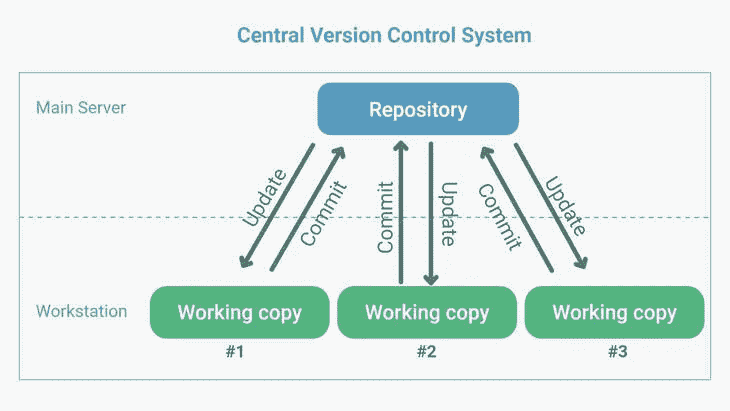
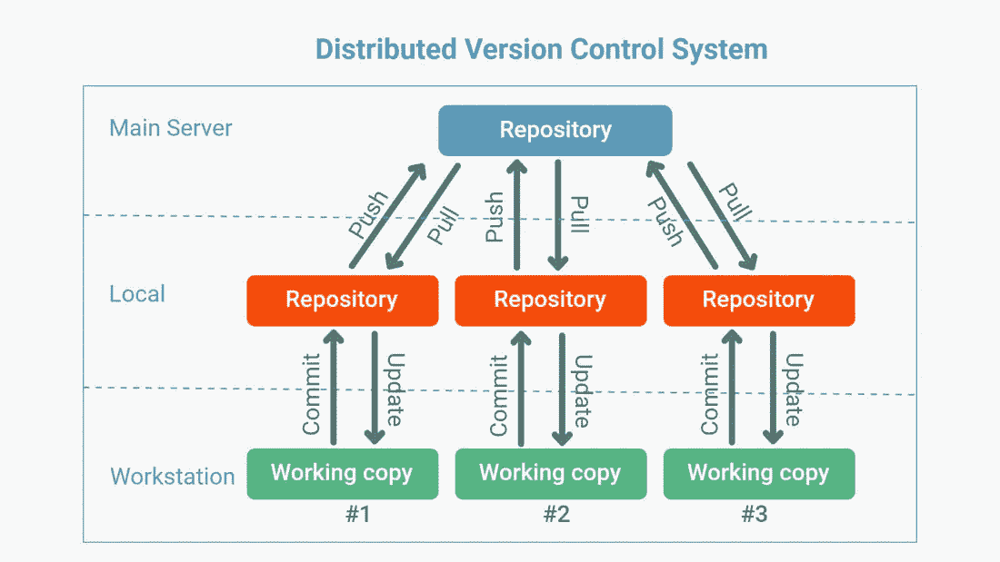

# 版本控制？为什么它很重要！

> 原文：<https://medium.com/codex/version-control-why-it-is-important-cde8eaf86d8f?source=collection_archive---------9----------------------->

## 酷派科技系列

## 我的目标将是解释为什么存在版本控制，存在的主要种类，以及每一种的一些例子和优缺点。

感谢 [htown-tech](https://www.htown-tech.com/blogs/centralized-vs-distributed-version-control-system) 提供的图片。

软件工程作为一项任务是非常容易出错的，它使用复杂的逻辑，在很长一段时间内，在许多不同的文件中工作，通常有许多人，有多个功能要处理，通常一次不止一个，这种情况加上日常生活的需要，在试图创建一个解决方案时，创建一个非常容易把事情弄糟的场景。虽然可以尝试在每次更新时完整地保存文件，并重新开始备份，但这不是一个解决方案。

虽然从 [Youtube 视频](https://www.youtube.com/watch?v=0xzN6FM5x_E)来看，这似乎是可行的，但在隐喻的背景下，是的，你不应该使用一个半生不熟的解决方案。感谢 Flex Tape 带给我们这个神奇的迷因！

让我们更深入地研究软件开发过程中出现的问题，将这些问题分类，然后讨论解决这些问题的不同技术，每种技术都有自己的体系结构，从最老的到新的，同时，我将分享我对软件如何不断发展的看法，没有规则可以统治所有这些问题，最好是以开放的态度对待各种可能性，特别是当您的需求没有得到满足或无法扩展时。

史麦戈在成为咕噜之前，因为对至尊魔戒的痴迷。[谢谢你的图片！](https://www.looper.com/92012/things-lord-rings-notice-adult/)

版本控制系统解决的主要问题是:

*   协作，你的项目变得越大，或者初创公司越来越多，你将需要与越来越多的开发人员合作，一个不能快速发展的产品注定会消亡，因为当涉及到软件时，你的客户如果不能随时使用你的产品，它就不能立即工作，或者他们经常发现任何错误，他们就会离开你，因此能够有一个开发团队持续地开发一个产品， 能够独立于整个项目，修复任何可能出现的错误，发展特性并创建新的特性，您需要一个系统来实现这一点。
*   商店版本，当你的产品/项目发展时，最终的最终版本不太可能存在，除非它被废弃或不再有用，任何东西都要经受时间的考验，一致的发展是唯一的方法，因此版本不断地诞生，以处理不断发生的需求或错误，因为在这个时代，特别是在技术领域，没有什么是静态的，每年都有新的硬件和软件在以前的基础上改进。
*   备份，虽然人为错误可能是常见的，但硬件也会不断出现故障，你不能让一切都依赖于一台计算机，如果网络中断一个小时或你将咖啡洒在笔记本电脑上，会发生什么情况，你需要备份来恢复工作。
*   可见性，作为一个物种，我们从互相帮助中茁壮成长，在任何时候任何地方，你实际上都是站在前人的工作上，除非你是一个隐士，放弃社会，生活在森林中，因为即使是你可能想到的最平凡的事情，有人设计了它，或者你从别人那里学到了它，所以在某些时候你会需要别人来审查或处理你的代码， 因此，必须有一种方法让其他人能够立即跳到你的工作上来看看发生了什么。
*   交付产品，你需要在某个时候交付产品，你不能永远做任何事情，因为产品必须跟上用户的需求，你必须能够始终如一地交付产品，有人会被雇佣，有人会被解雇，尽管如此，产品将继续发展，否则公司将会倒闭，需要一个系统来让人们根据正在发生的事情的需要或你所处的阶段，立即从事产品的任何部分。

> “随着时间的推移，事情会发生变化，永远不要假设现在会是永远，或者任何过去都很遥远，或者未来不会随时到来并改变一切。”——埃贡·费德勒又名我自己。

在您可能已经找到的关于版本控制主题的任何其他文章中，您可能已经看到有两种主要类型，

中央版本控制系统(CVCS)和

感谢 htown-tech 的图片！

分布式版本控制系统(DVCS)，

[感谢图片 htown-tech！](https://www.htown-tech.com/blogs/centralized-vs-distributed-version-control-system)

重要的是要认识到，在不同的时间点，彼此的普及取决于可用的东西，现在计算机的普及是一种趋势，这种趋势已经形成了一段时间，在 10 年或 20 年前没有多少，我们现在享受的宽带也是社会发展的一个新特征，现在每台计算机的能力都是微芯片发展的结果， 或者说[摩尔定律](https://www.investopedia.com/terms/m/mooreslaw.asp#:~:text=Moore's%20Law%20refers%20to%20Moore's,will%20pay%20less%20for%20them.)，软件项目的复杂性也随着我们时代的这一特征而发展，因此版本控制系统也随之发展。

解释这两个主题的方法将是简要解释使用这两种不同架构来解决前面提到的问题的系统。

**下一部分的形状是:**

首先，系统的名称及其采用的体系结构类型。

第二，它是何时制作的，是否仍在积极开发中。

第三，是在什么情况下开始的。

第四，它的流行程度，谁在使用它，以及我可能有的任何其他见解。

# 并行版本系统。中央版本控制系统(CVCS)

它是由迪克·格鲁内于 1986 年在[拍摄的。似乎还活着，但自从 2006 年以来没怎么发生过。](https://en.wikipedia.org/wiki/Concurrent_Versions_System)

> “我创建 CVS 是为了能够在 ACK([Amsterdam Compiler Kit](https://en.wikipedia.org/wiki/Amsterdam_Compiler_Kit))C 编译器上与我的学生 Erik Baalbergen 和 Maarten Waage 合作。我们三个人的时间表有很大不同(一个学生是稳定的朝九晚五的工人，另一个是不固定的，我只能在晚上做这个项目)。他们的项目从 1984 年 7 月持续到 1985 年 8 月。CVS 最初被称为 cmt，原因很明显，它允许我们独立提交版本。—迪克·格鲁内

在它的启发下，颠覆应运而生。

# Subversion，中央版本控制系统(CVCS)

它是由 CollabNet 于 2000 年制作的。仍然存在，更新仍在进行，许多项目的一部分仍在进行。

> " CollabNet 在 2000 年创立了 Subversion 项目，致力于编写一个开源版本控制系统，它的运行方式很像[的 CVS](https://en.wikipedia.org/wiki/Concurrent_Versions_System) ，但它修复了缺陷并提供了 CVS 中缺少的一些功能。"—维基百科

它被公认为有价值数据的避风港，其模型和使用的简单性使它成为许多公司非常有吸引力的选择。

# 分布式版本控制系统(DVCS)

它是由莱纳斯·托沃兹于 2005 年在[制作的。它仍在积极开发中，是目前最流行的版本控制系统。](https://en.wikipedia.org/wiki/Git#Implementations)

它始于一场争论，因为 Linus Torvalds 曾经依赖 BitKeeper 作为 Linux 内核的版本控制系统，但他们可用的免费版本被拿走了，他选择创建自己的版本，在此规范下，打补丁不应超过 3 秒钟，以并发版本系统(CVS)为例，如果有疑问，可以做出完全相反的决定，支持分布式的类似 Bitkeeper 的工作流，包括非常强大的防止意外或恶意损坏的保护措施。

它是最流行的版本控制系统，如果你想开始使用它，我强烈推荐你去看看。

# Mercurial 分布式版本控制系统(DVCS)

它是由奥利维亚·马克尔于 2005 年 10 月 11 日制作的。虽然它被另一个名为 Git 的开源项目大大超越，但它仍在积极开发中，并被大公司使用。

Mercurial 名称是对 Larry McVoy 个性的引用，因为这个项目是在一场争议发生后与 Git 一起开始的，这场争议导致 Bitkeeper 所有者 Larry McVoy 停止为 Linux 内核提供免费版本的 Bitkeeper，另一个版本控制系统。

虽然与 Git 相比，它在软件行业中并不十分普遍，但它仍然在一些公司中占有一席之地，包括脸书，[由于 Facebook 无法扩展 Git 以满足其需求](https://engineering.fb.com/2014/01/07/core-data/scaling-mercurial-at-facebook/)，他们转向了 Mercurial，在那里他们发现开源项目更受欢迎，更容易适应其需求，因为它是用 Python 编写的，考虑到公司的规模和他们产品的软件规模，他们更容易适应他们已经开发的工具，也更容易改进它以满足他们的需求。

# 结论

虽然版本控制的更新解决方案仍在诞生，但就像一天结束时的任何软件一样，您需要满足您需求的东西，而许多人会试图支持一种或另一种技术，看看您需要什么，然后从那里选择您的工具，或者如果没有什么可以为您做，那么自己制作或从您喜欢的东西改进，以创建您自己的任何技术版本。