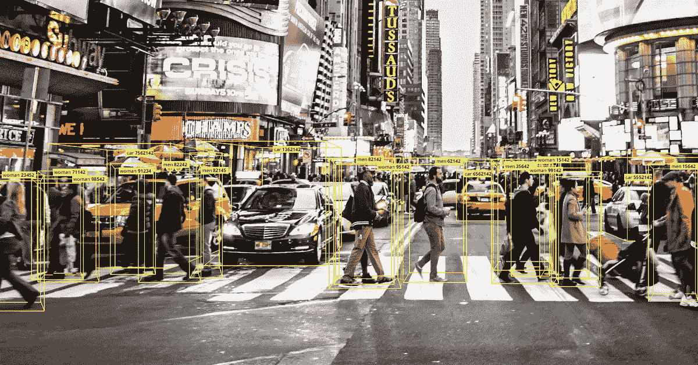
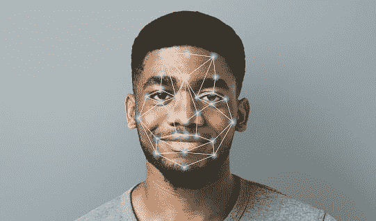
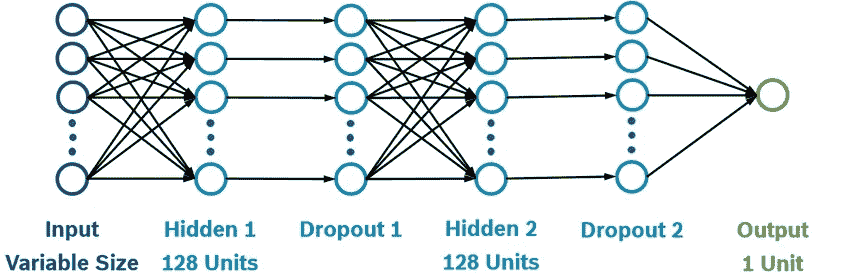
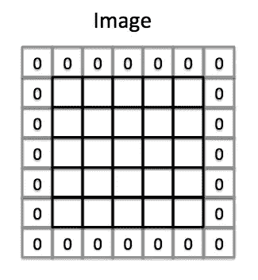
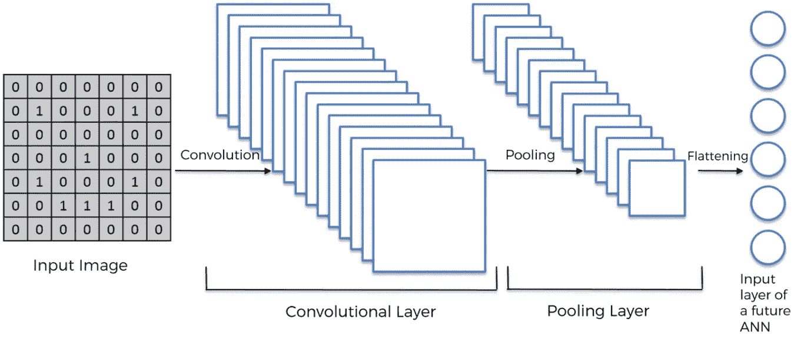
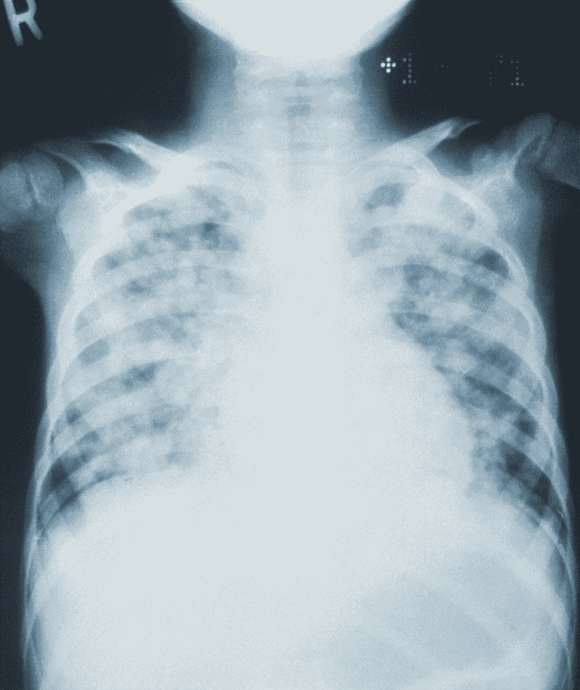
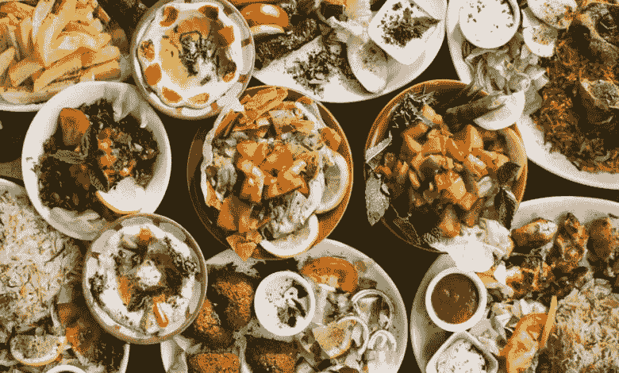

# VGG-16 模型应用 2021

> 原文：<https://medium.com/codex/vgg-16-model-applications-2021-e57f17157147?source=collection_archive---------6----------------------->

## 用于分类的卷积神经网络

[计算机视觉&它的进步](https://www.google.com/url?sa=i&url=https%3A%2F%2Fwww.techaheadcorp.com%2Fknowledge-center%2Fcomputer-vision-can-transform-businesses%2F&psig=AOvVaw3h5fM49zOO2Dar6a5QZ3aR&ust=1637416900262000&source=images&cd=vfe&ved=0CAsQjRxqFwoTCLi8-bnLpPQCFQAAAAAdAAAAABAP)

在深入研究模型规范之前，问题是“CNN 是什么？”。嗯，CNN 简称**卷积神经网络**，是一种**深度学习算法**，用于分析视觉表象；又称 C **计算机视觉**。这种算法因其先进的图像分析策略而变得非常重要，是由牛津大学的*卡伦·西蒙扬*和*安德鲁·齐泽曼*提出的。随着其获得大量关注并以高达 99%的准确度分析图像模式的流行，这已经成为理解图像分类和清晰度最常用的算法之一。

# 为什么它被命名为 VGG-16？

[VGG-图像检测-无刷图像](https://www.istockphoto.com/photo/futuristic-and-technological-scanning-of-face-for-facial-recognition-gm1136827583-302905415?utm_source=unsplash&utm_medium=affiliate&utm_campaign=srp_photos_top&utm_content=https%3A%2F%2Funsplash.com%2Fs%2Fphotos%2Fcomputer-vision&utm_term=computer%20vision%3A%3A%3A)

VGG-16 模型是由*卡伦·西蒙扬*和*安德鲁·齐泽曼*以他们牛津大学视觉几何小组实验室的名字命名的。该算法于 2013 年问世，当时 **ImageNet 大规模视觉识别**挑战赛( [ILSVRC](http://www.image-net.org/challenges/LSVRC/) )正在举办 2013 年年度计算机视觉竞赛。幸运的是，该模型在 2014 年 ILSVRC 挑战赛中获得了上述类别的第一名和第二名，并在 ImageNet 数据集上实现了 92.7% *top-5* 的测试准确率，该数据集包含属于 1000 个类别的*1400 万*幅图像。—根据 [Geek4geeks](https://www.geeksforgeeks.org/vgg-16-cnn-model/#:~:text=92.7%25%20top%2D5%20test%20accuracy%20on%20ImageNet%20dataset%20which%20contains%2014%20million%20images%20belonging%20to%201000%20classes.)

> VGG-16-视觉几何组& 16，因为它有 16 个层，具有多达 1.38 亿个参数的权重。

# 定义了丰富的层次和内部特征

[图片来源:Researchgate.net](https://www.google.com.pk/url?sa=i&url=https%3A%2F%2Fwww.researchgate.net%2Ffigure%2FFig-A1-The-standard-VGG-16-network-architecture-as-proposed-in-32-Note-that-only_fig3_322512435&psig=AOvVaw3tTQESLDZIFx8yYy2IiznB&ust=1637422704659000&source=images&cd=vfe&ved=0CAsQjRxqFwoTCIDW35bhpPQCFQAAAAAdAAAAABAV)

> 我们越深入，事情就越复杂——匿名

是的，这是真的，对于每个微小的细节，这种算法都着迷于惊人的微小细节，对图像产生整体影响，并了解图像如何通过最终反射进行训练和测试。这些层是通过 Keras 模型应用的，演示如下:

## 1.致密层

密集层是一个**神经网络层**，并且是深度连接的模型中最常用的层，这意味着密集层中的每个神经元接收来自其前一层的所有神经元的输入。

【researchgate.net 解释的 密集层

## 2.卷积 2D 层

卷积 2D 层是一个重要的层，它创建卷积核，并与输入层一起操作，以生成输出张量。

[数据科学—enthusiast.com](https://www.google.com/imgres?imgurl=https%3A%2F%2Fdatascience-enthusiast.com%2Ffigures%2FConvolution_schematic.gif&imgrefurl=https%3A%2F%2Fdatascience-enthusiast.com%2FDL%2FConvolution_model_Step_by_Stepv2.html&tbnid=1VHtR2R2SFEVMM&vet=12ahUKEwiqic_szLr0AhWNweAKHVTrAtUQMygCegUIARCuAQ..i&docid=EUXYPMNHC7IAjM&w=526&h=384&q=convolution2d&ved=2ahUKEwiqic_szLr0AhWNweAKHVTrAtUQMygCegUIARCuAQ)

## 3.Maxpool2D 层

Max pool layer 通过提供表示的抽象形式、减少要学习的参数数量以及为内部表示提供基本的平移不变性来帮助过拟合。

而在 Keras 中，使用的是 **Maxpool2D** 。这通过对输入的每个通道在输入窗口(由池大小定义的大小)上取最大值来缩减输入的维度(高度和宽度)。该窗口沿着每个维度以步长移动。

[图片来自计算机科学维基](https://www.google.com.pk/url?sa=i&url=https%3A%2F%2Fcomputersciencewiki.org%2Findex.php%2FMax-pooling_%2F_Pooling&psig=AOvVaw0d9LjvHH9MyuyHdvw7LFp2&ust=1638171540640000&source=images&cd=vfe&ved=0CAgQjRxqFwoTCOi01uvGuvQCFQAAAAAdAAAAABAD)

## **5。填充层**

这一层只是在我们的输入图像中添加 0 的过程，只是为了避免问题。

【medium.com 图片来源

## 6.展平层

展平图层用于展平图像。这一层用于将数据转换为一维数组，以将其输入到下一层，并连接到最终的分类模型，这被称为全连接层。

[展平过程——来自 medium.com](https://www.google.com/url?sa=i&url=https%3A%2F%2Fmedium.com%2F%40PK_KwanG%2Fcnn-step-2-flattening-50ee0af42e3e&psig=AOvVaw0SXDWFjbH3P-m8yyfGdHc4&ust=1638173047217000&source=images&cd=vfe&ved=0CAgQjRxqFwoTCJDp6avMuvQCFQAAAAAdAAAAABAN)

# 如何在实际应用中使用 VGG-16 模型？

这篇文章的主旨——你能用 VGG-16 模型做什么项目！是的，这就是你在整个博客中看到的。有了这个强大的模型，你几乎可以在任何范围、任何领域应用它来识别模式，并从局限于图像的细节中得出结论。好吧，这是你可以用 VGG-16 模型做的事情。

## 1.通过 X 射线图像检测肺炎

肺炎是一种传染病，如果不采取某些健康措施，可能会有令人担忧的风险。肺炎会影响肺部，导致咳嗽、发烧、发冷和呼吸问题等症状。在 VGG-16 模型的帮助下，我们可以通过扫描 x 射线图像来分析和诊断肺炎，显示胸部肋骨和区域是否受到影响。这将有助于医生在诊断和作出正确的预防措施，需要采取必要的。

该模型不仅限于一种医学疾病，还可以根据需要考虑的某些因素，诊断癌症(所有类型)、结核病、关节炎、艾滋病毒、疟疾、伤寒、偏头痛、**冠状病毒**(最近最流行)和许多其他疾病。

## 2.电影

电影是一个可以探索的领域。保留电影的某些类别(动作片、奇幻片、剧情片、爱情片、科幻片、惊悚片、悬疑片、犯罪片)，然后检查演员的进一步分类，看该角色是否在该电影中发挥了作用。我知道这个想法没有意义，但它让我们更深入地了解哪些演员在电影中工作。这个想法是检查电影并提取更多信息，使用户体验更具互动性，并成为他们的主要解决方案。

## 3.食品

美食，做美食爱好者让我垂涎三尺。食物是一个巨大的领域，几乎有无限种类的食物，还有更多的变种。有一个问题要问你们。世界上有多少种食物？令你惊讶的是，这里有 150 多种不同类型的食物，我们没有一个人完全探索过

在这个模型的帮助下，世界各地的美食大数据集可以被识别和分类，无论是东方，泰国，德西，中国，黎巴嫩还是快餐。

食物也不仅仅局限于烹饪，还包括开胃菜、甜点等等..

许多人面临着理解菜肴类型的问题，这可以真正帮助他们做出选择。

## 4.查找路径

在这个人工卷积神经网络的帮助下寻找路径让我们帮助并找到人类的路径和路线，如人行道，公园道路，森林路径。该项目实现了语义分割方法，并使用 VGG16 预训练模型。

VGG-16 是一个非常强大的工具，应该在每个领域进行探索，以揭示我们需要寻找的所有细节。除了上述领域，我们还可以在犯罪调查和犯罪现场、医疗分析、科学实验、动物(猫、狗、鹦鹉、鸟等)的路径和分类中使用该算法..)以及许多迁移学习项目。

有了这个，你现在就能想出新的点子，在你的项目中应用 computer visionary。应用 **OpenCV** 以及像 **VGG-16** 这样的神经网络是一个额外的收获。

尽力用最简单的方式解释这些想法。

让你把想法变成现实。在那之前，

请继续关注更多，