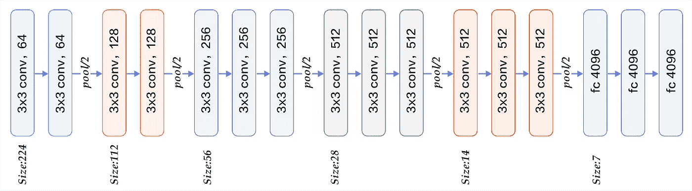
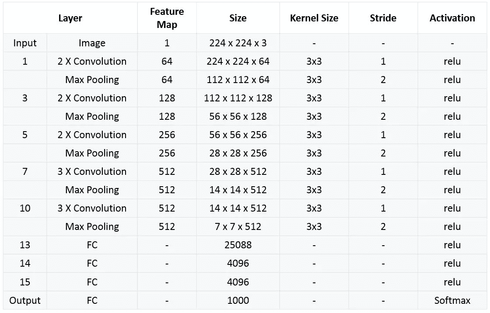
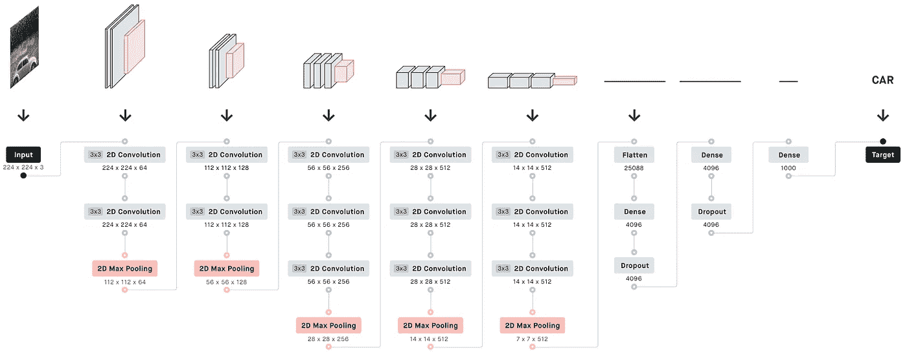
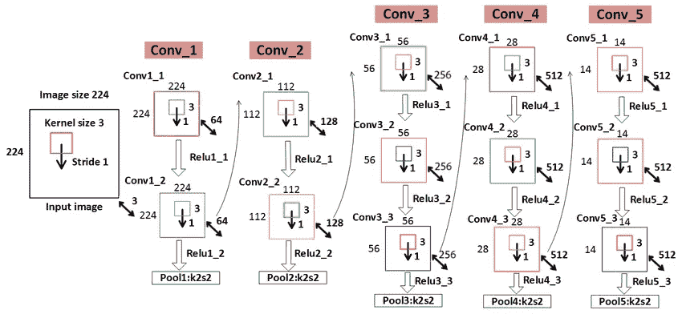
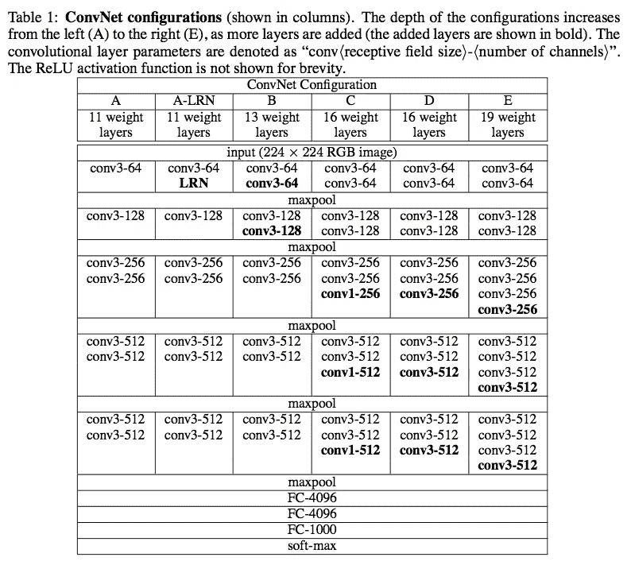

# VGGNet 完整架构

> 原文：<https://medium.com/codex/vggnet-complete-architecture-5c6fa801502b?source=collection_archive---------11----------------------->

# VGGNet 简介

VGG 的全称是**视觉几何组**，隶属于牛津大学科学与工程系。它发布了一系列从 VGG 开始的卷积网络模型，可以应用于人脸识别和图像分类，从 VGG16 到 VGG19。VGG 研究卷积网络深度的最初目的是了解卷积网络的深度如何影响大规模图像分类和识别的准确度和精度。-Deep-16 CNN)，为了加深网络层数，避免参数过多，所有层都使用了一个小的 3×3 卷积核。

[vgg 19](http://ethereon.github.io/netscope/#/gist/dc5003de6943ea5a6b8b)的网络结构

# 网络结构

*   VGG 的输入设置为 224x244 大小的 RGB 图像。为训练集图像上的所有图像计算平均 RGB 值，然后将该图像作为输入输入到 VGG 卷积网络。使用 3×3 或 1×1 滤波器，卷积步长是固定的。。有 3 个 VGG 全连接层，根据卷积层+全连接层的总数，可以从 VGG11 到 VGG19 不等。最小的 VGG11 有 8 个卷积层和 3 个全连接层。最大的 VGG19 有 16 个卷积层。+3 个完全连接的层。此外，VGG 网络在每个卷积层之后没有跟随池层，或者在不同的卷积层下总共分布 5 个池层。下图是 VGG 的结构图:



*   VGG16 包含 16 层，VGG19 包含 19 层。一系列 vgg 在最后三个全连接层完全相同。整体结构包括 5 组卷积层，后面是一个最大池。不同的是，五组卷积层中包含了越来越多的级联卷积层。



*   AlexNet 中的每个卷积层只包含一个卷积，卷积核的大小为 7 * 7，。在 VGGNet 中，每个卷积层包含 2 到 4 个卷积运算。卷积核的大小是 3 * 3，卷积步长是 1，池核是 2 * 2，步长是 2。VGGNet 最明显的改进是减小了卷积核的大小，增加了卷积层数。



*   使用具有较小卷积核的多个卷积层而不是具有卷积核的较大卷积层一方面可以减少参数，并且作者认为它相当于更多的非线性映射，增加了拟合表达能力。



*   两个连续的 3 * 3 卷积相当于一个 5 * 5 感受野，三个相当于 7 * 7。使用三个 3 * 3 卷积而不是一个 7 * 7 卷积的优点是双重的:一个，包括三个 ReLu 层而不是一个，使得判定函数更具鉴别性；第二，减少参数。比如输入输出都是 C 通道。3 个使用 3 * 3 的卷积层需要 3 (3 * 3 * C * C) = 27 * C * C，1 个使用 7 * 7 的卷积层需要 7 * 7 * C * C = 49C * C，这可以看作是对 7 * 7 卷积应用了一种正则化，使其分解为三个 3 * 3 卷积。
*   1 * 1 卷积层主要是在不影响卷积层感受野的情况下，增加判决函数的非线性。虽然 1 * 1 卷积运算是线性的，但 ReLu 增加了非线性。

# 网络结构

*   表 1 显示了所有网络配置。这些网络遵循相同的设计原则，但深度不同。



*   介绍 VGG16 的时候肯定用这张图。这张图片包含了很多信息。我在这里的解读可能是有限的。如有补充，欢迎留言。
*   **数字 1** :这是 6 个网络的对比图。从 A 到 E，网络越来越深。添加了几个层来验证效果。
*   **数字 2** :每一栏都详细解释了每个网络的结构。
*   **数字 3** :这是一个正确的做实验的方法，就是用最简单的方法解决问题，然后针对出现的问题逐步优化。

**网络 A:** 先提一个浅层网络，这个网络很容易汇聚到 ImageNet 上。然后呢？
**网络 A-LRN** :加上别人(AlexNet)实验过说有效(LRN)但好像没用的东西。然后呢？
**网 B** :那就试试加 2 层？似乎有效。然后呢？
**网络 C** :再加两层 1 * 1 卷积，一定会收敛。效果好像更好。有点激动。然后呢？
**网络 D** :将 1 * 1 卷积核改为 3 * 3。试试看。效果又提升了。好像是最好的(2014)。

# 培养

*   **优化方法**是带动量的随机梯度下降 SGD + momentum (0.9)。批量大小为 256。
*   **正则化**:使用 L2 正则化，权重衰减为 5e-4。压差出现在前两个完全连接的层之后，p = 0.5。
*   虽然它比 AlexNet 网络更深，参数更多，但我们推测 VGGNet 可以在更少的周期内收敛，原因有两个:一是更大的深度和更小的卷积带来隐式正则化；第二，一些层的前期训练。
*   **参数初始化**:对于浅 A 网络，参数随机初始化，权重 w 从 N (0，0.01)采样，偏差初始化为 0。然后，对于更深的网络，首先用 A 网络的参数初始化前四个卷积层和三个全连接层。但是，后来发现也可以不使用预先训练的参数直接初始化它。
*   为了获得 224 * 224 的输入图像，在每次 SGD 迭代中随机裁剪每个重新缩放的图像。为了增强数据集，裁剪后的图像也随机水平翻转，并进行 RGB 颜色转换。

# VGGNet 改进点总结

1.  使用更小的 3 * 3 卷积核和更深的网络。两个 3 * 3 卷积核的堆叠是相对于 5 * 5 卷积核的视场而言的，三个 3 * 3 卷积核的堆叠相当于 7 * 7 卷积核的视场。这样可以有更少的参数(3 个堆叠的 3 * 3 结构只有 7 * 7 个结构参数(3 * 3 * 3)/(7 * 7)= 55%)；另一方面，它们具有更多的非线性变换增加了 CNN 的学习能力的特性。
2.  在 VGGNet 的卷积结构中，引入了 1 * 1 卷积核。在不影响输入输出维数的情况下，引入非线性变换，增加网络的表达能力，减少计算量。
3.  训练时，先训练一个简单的(低级的)VGGNet A 级网络，然后用 A 级网络的权值初始化后面的复杂模型，以加快训练的收敛速度。

# 一些基本常见问题

**Q1:为什么 3 个 3×3 的卷积可以代替 7×7 的卷积？**

***答案 1***
3 个 3x3 卷积，使用 3 个非线性激活函数，增加非线性表达能力，使分割平面更可分减少参数数量。对于 C 通道的卷积核，7×7 包含参数，3×3 的参数数量大大减少。

**Q2:1x1 卷积核的作用**

***答案 2***
在不影响感受野的情况下增加模型的非线性 1x1 绕线机相当于线性变换，非线性激活函数起非线性作用

**Q3:网络深度对结果的影响(同年 Google 也独立发布了深度为 22 层的网络 Google net)**

***答案 3***
VGG 和 GoogleNet 模型都是深度小卷积 VGG 只用 3x3，而 GoogleNet 用 1x1，3x3，5x5，模型更复杂(模型开始用大卷积核来减少后续机器层的计算)

# **代码实现:**

```
from tensorflow.keras.layers import Input, Conv2D, MaxPooling2D
from tensorflow.keras.layers import Dense, Flatten
from tensorflow.keras.models import Model

import warnings
warnings.filterwarnings("ignore", category=FutureWarning)

_input = Input((224,224,1)) 

conv1  = Conv2D(filters=64, kernel_size=(3,3), padding="same", activation="relu")(_input)
conv2  = Conv2D(filters=64, kernel_size=(3,3), padding="same", activation="relu")(conv1)
pool1  = MaxPooling2D((2, 2))(conv2)

conv3  = Conv2D(filters=128, kernel_size=(3,3), padding="same", activation="relu")(pool1)
conv4  = Conv2D(filters=128, kernel_size=(3,3), padding="same", activation="relu")(conv3)
pool2  = MaxPooling2D((2, 2))(conv4)

conv5  = Conv2D(filters=256, kernel_size=(3,3), padding="same", activation="relu")(pool2)
conv6  = Conv2D(filters=256, kernel_size=(3,3), padding="same", activation="relu")(conv5)
conv7  = Conv2D(filters=256, kernel_size=(3,3), padding="same", activation="relu")(conv6)
pool3  = MaxPooling2D((2, 2))(conv7)

conv8  = Conv2D(filters=512, kernel_size=(3,3), padding="same", activation="relu")(pool3)
conv9  = Conv2D(filters=512, kernel_size=(3,3), padding="same", activation="relu")(conv8)
conv10 = Conv2D(filters=512, kernel_size=(3,3), padding="same", activation="relu")(conv9)
pool4  = MaxPooling2D((2, 2))(conv10)

conv11 = Conv2D(filters=512, kernel_size=(3,3), padding="same", activation="relu")(pool4)
conv12 = Conv2D(filters=512, kernel_size=(3,3), padding="same", activation="relu")(conv11)
conv13 = Conv2D(filters=512, kernel_size=(3,3), padding="same", activation="relu")(conv12)
pool5  = MaxPooling2D((2, 2))(conv13)

flat   = Flatten()(pool5)
dense1 = Dense(4096, activation="relu")(flat)
dense2 = Dense(4096, activation="relu")(dense1)
output = Dense(1000, activation="softmax")(dense2)

vgg16_model  = Model(inputs=_input, outputs=output)

# Working with pretrained model

from keras.applications.vgg16 import decode_predictions
from keras.applications.vgg16 import preprocess_input
from keras.preprocessing import image
import matplotlib.pyplot as plt 
from PIL import Image 
import seaborn as sns
import pandas as pd 
import numpy as np 
import os 

img1 = "../input/flowers-recognition/flowers/tulip/10094729603_eeca3f2cb6.jpg"
img2 = "../input/flowers-recognition/flowers/dandelion/10477378514_9ffbcec4cf_m.jpg"
img3 = "../input/flowers-recognition/flowers/sunflower/10386540696_0a95ee53a8_n.jpg"
img4 = "../input/flowers-recognition/flowers/rose/10090824183_d02c613f10_m.jpg"
imgs = [img1, img2, img3, img4]

def _load_image(img_path):
    img = image.load_img(img_path, target_size=(224, 224))
    img = image.img_to_array(img)
    img = np.expand_dims(img, axis=0)
    img = preprocess_input(img)
    return img 

def _get_predictions(_model):
    f, ax = plt.subplots(1, 4)
    f.set_size_inches(80, 40)
    for i in range(4):
        ax[i].imshow(Image.open(imgs[i]).resize((200, 200), Image.ANTIALIAS))
    plt.show()

    f, axes = plt.subplots(1, 4)
    f.set_size_inches(80, 20)
    for i,img_path in enumerate(imgs):
        img = _load_image(img_path)
        preds  = decode_predictions(_model.predict(img), top=3)[0]
        b = sns.barplot(y=[c[1] for c in preds], x=[c[2] for c in preds], color="gray", ax=axes[i])
        b.tick_params(labelsize=55)
        f.tight_layout()

#Using pretrained weights

from keras.applications.vgg16 import VGG16
vgg16_weights = '../input/vgg16/vgg16_weights_tf_dim_ordering_tf_kernels.h5'
vgg16_model = VGG16(weights=vgg16_weights)
_get_predictions(vgg16_model)
```