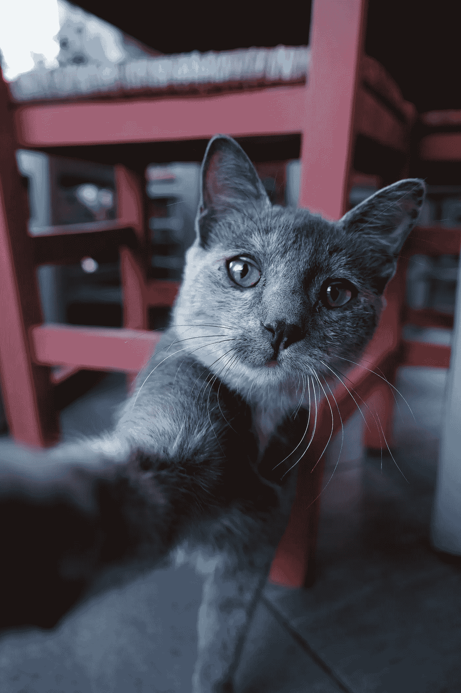

# 进步工程师的视频通话 101

> 原文：<https://medium.com/codex/video-calls-101-for-progressive-engineers-742be0275bb6?source=collection_archive---------13----------------------->

如何让自己看起来更好，让朋友(而不是你自己)更环保，并影响人们不再邀请你参加任何会议。

照片由 [Pexels](https://www.pexels.com/photo/selective-focus-photo-of-a-cute-russian-blue-cat-taking-a-selfie-9718154/?utm_content=attributionCopyText&utm_medium=referral&utm_source=pexels) 的 [Monica Oprea](https://www.pexels.com/@nuptune?utm_content=attributionCopyText&utm_medium=referral&utm_source=pexels) 拍摄

作为软件工程大游戏中的一名进步软件工程师，在远程工作这一美好且日益普遍的时代，你的视频会议游戏是需要持续关注的事情。