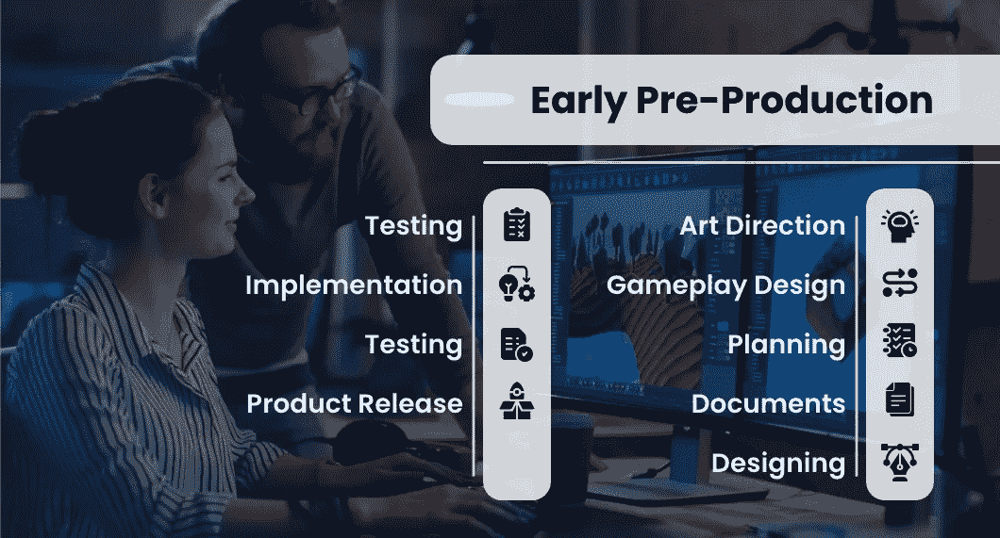
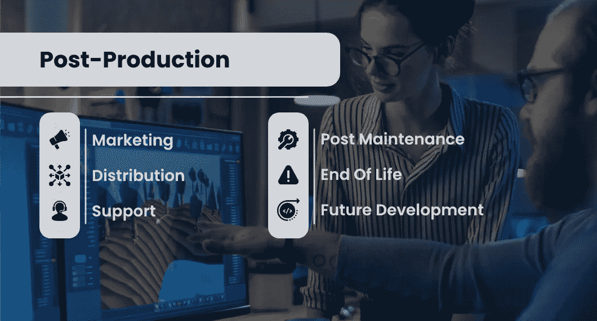
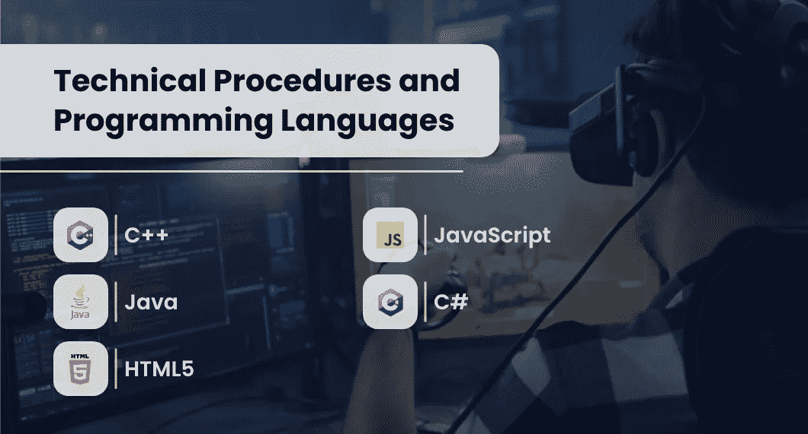

# 视频游戏开发过程:基本指南。

> 原文：<https://medium.com/codex/video-game-development-process-essential-guide-97e678567b06?source=collection_archive---------5----------------------->

视频游戏开发流程

视频游戏是一个巨大的产业，2015 年销售额超过 590 亿美元。制作电子游戏的过程比你想象的要复杂得多，涉及到许多不同的学科和跨代的团队合作。我们已经将这个过程分解成了几个组成部分，这样你就可以看到每个团队成员扮演了什么角色，从而使类似看守这样的事情成为可能。

# 早期预生产

游戏:早期前期制作

游戏开发的第一阶段**发生了。这就是所谓的前期制作阶段，在实际设计工作开始之前，视频游戏的所有工作都在这个阶段完成。**

## **#1-艺术指导:**

**这是游戏世界被构思和设计的地方。关键艺术是由艺术总监或设计师创作的，它实际上传达了比任何游戏内艺术更多的关于游戏设定世界的信息。艺术指导也可以要求设计不同的虚拟物体，如武器、盾牌和其他游戏元素。**

## **#2-游戏设计:**

**设计师与编程团队一起工作，为游戏的运作机制制定游戏计划。在这个阶段，可以发现制作优秀视频游戏的能力。它需要深刻理解让游戏有趣的核心原则，以及如何使用简单的规则集将各种系统联系在一起。这也意味着某些元素，如需要快速反应时间或反应的游戏，必须从头开始设计，这样游戏才能变得既有趣又有挑战性。**

## **#3-规划:**

**这是游戏被分解成组成部分的地方，每个组成部分都被分配给一个团队。每个团队将有一个经理和子团队领导，他们将监督该开发阶段的实施。你可能还会看到在这个阶段组建的小型写作团队和美术团队。**

## **#4-文件:**

**内部和外部文档都是为了展示游戏是如何工作的以及到目前为止已经做了哪些工作而创建的。**

> ****也看:** [**如何制作一个成功的迷你游戏 App**](https://www.quytech.com/blog/how-to-make-mini-game-app/) **！！！****

## **#5-设计:**

**游戏设计大部分完成，但不是全部。设计文档是在此时创建的，并将作为其余开发的试金石。**

## **#6-测试:**

**虽然测试可以在开发的任何阶段进行，但是人们常常忽略了它在多大程度上有助于指导和控制开发。在生产过程中有许多不同类型的测试，包括用户体验测试、技术性能分析、兼容性测试、基本功能测试等等。**

## **#7-实施:**

**这是编程和美术团队开始实施前几个阶段的工作的地方。**

## **#8-测试:**

**同样，测试可以在整个开发过程中多次进行，但它非常重要，因为如果没有测试，就不可能发现游戏实际上是如何运行的，以及如果某些方面不能正常工作，如何改进。**

## **#9-产品发布:**

**一旦游戏被完全测试并准备好发布，它就被传递给市场和发行团队，这样它就可以向公众销售了。**

# **后期制作**

****

**游戏:后期制作**

## **营销:**

**在这个阶段，一款游戏可能需要进行一些调整，以迎合市场需求，如徽标、标语和其他宣传材料。这款游戏可能还需要进行一些小的改动，以使其更具市场价值，并遵守各种法律问题，如年龄分级。**

## **分发:**

**一旦所有的营销环节都完成了，游戏就可以通过数字下载门户或物理媒体等多种渠道进行分发。**

## **支持:**

**这是玩家可以获得帮助解决他们在游戏中可能遇到的问题的地方，即使是在游戏发布之后。示例包括错误报告和修补游戏的破损方面，以及任何其他可能使游戏的某些方面无法正常工作的高度技术性的支持问题。**

> ****阅读也:** [**游戏中的人工智能——你需要知道的一切**](https://www.quytech.com/blog/artificial-intelligence-in-game-development/) **！！！****

## **后期维护:**

**这是当一个游戏退役，这意味着它可能不再出售或更新。**

## **寿命结束:**

**也称为“EOL”，这描述了游戏支持停止的时间，实际上意味着它不再获得任何更新或增强，因为一切都已经完成，并且已经正常工作。**

## **未来发展:**

**这是下一代视频游戏可能被制造出来的时候，而一款游戏的退役意味着它将不会被考虑用于未来的开发。然而，开发者仍然可以选择继续工作，但是没有任何官方的支持。有些开发者会完全支持他们的游戏。他们将在游戏发布后或在其生命周期中根据需要制作补丁或其他内容。**

# **在一个游戏的开发过程中，使用了哪些技术程序和编程语言？**

****

**技术程序和编程语言**

**答案是很多，但我们将涵盖最受欢迎的。**

**第一个要回答的问题是:“你想做什么类型的游戏？”这在很大程度上影响了开发中使用的技术。**

**例如，开发一款流行游戏的人必须使用不同于开发手机游戏的语言。还有更微妙的区别，例如当设计一个在线多人游戏环境和一个单人游戏的叙事体验时。**

**如果你有只使用一种技术开发游戏的经验，并且想要扩展你的视野，那么向那些使用多种不同技术制作多种游戏的人学习会有所帮助。**

**游戏的编码语言是根据游戏最初设计的发展而选择的。根据平台(控制台、计算机或移动设备)和游戏的复杂程度，可以使用各种编程语言来创建游戏。游戏是使用多种编程语言开发的。不同的编程语言用于创建游戏，这取决于平台(控制台、计算机或移动设备)。**

**此外，并不是所有的游戏都是使用单一的编程语言创建的；相反，他们可能会结合几个。**

**下面是现代**视频游戏开发中一些最广泛使用的语言的快速总结:****

******#01- C++:******

****C++是一种面向对象的编程语言。由于它的速度、可用性和广泛采用，它脱颖而出，成为一种非常理想的语言。Game-Ace 声称，它经常被称为游戏编程的黄金标准，许多人认为它是游戏的最佳编码语言。生化奇兵系列、毁灭战士和刺客信条是一些使用基于 C++的引擎构建的游戏。****

******#02- Java:******

****Java 是一种通用编程语言，旨在适应不断发展的环境。Java 是当今最常用的语言之一，它几乎是普遍兼容的，这使它具有不可思议的通用性。《我的世界》、RuneScape 和星球大战星系是用 Java 开发的视频游戏的例子。****

******#03- HTML5******

****HTML 的最新版本，即 HTML5，是 web 浏览器显示的底层代码。由于其基于 web 的特性和增加的灵活性，HTML5 在开发人员中越来越受欢迎；GameDeveloper 甚至将其称为“游戏开发的未来”流行的 HTML5 游戏包括《宝石迷阵》、《愤怒的小鸟》、《Rush 王国》和《3D 俄罗斯方块》。****

> ******也念:** [**为什么游戏测试重要**](https://medium.datadriveninvestor.com/why-game-testing-is-important-for-successful-game-app-development-60251c9e5266) **！！！******

******#04- JavaScript******

****全球超过 95%的网站运行在 JavaScript 上，这使得它成为 web 开发的核心技术之一。根据 GameDevAcademy 的说法，由于 HTML5 在游戏行业的采用，JavaScript 已经成为 HTML5 游戏开发的主要支柱。Browser Quest、Diablo JS、HexGL 都是大家熟知的 JavaScript + HTML5 游戏的例子。****

******#05- C#** :****

****这种编程语言是开发各种应用程序和视频游戏的流行选择。实际上，它是 Unity 中的关键代码，Unity 是当今使用最广泛的游戏引擎之一。Pokemon Go，炉石，神庙逃亡，刺客信条身份是少数用 C#开发的游戏。****

# ****结论****

****总而言之，你可以看到制作一个视频游戏的简单过程比它看起来要复杂得多。有多个团队和跨代组件组成了制作一个视频游戏的整个过程。通过观看视频游戏制作的不同过程和角色，你不仅能理解游戏是如何制作的，还能更好地理解游戏的复杂性。****

# ****相关文章-****

> ****[**如何开发一款类似 Zedrun 的玩赚游戏？**](https://www.quytech.com/blog/play-to-earn-game-like-zedrun/)****
> 
> ****[**如何打造像 Roblox 这样的角色扮演游戏平台？—完整指南**](https://www.quytech.com/blog/how-to-create-rpg-like-roblox/)****
> 
> ****[**手机游戏开发成本——影响价格的所有因素**](https://www.quytech.com/blog/game-development-cost-features-tools-technologies/)****