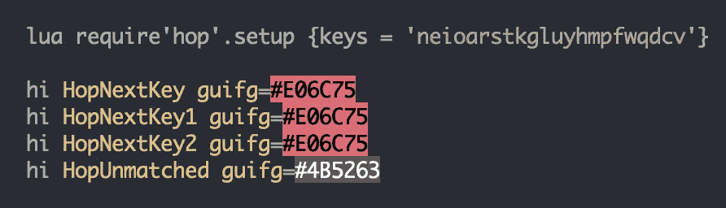

# Vim Hop/EasyMotion:单字符、多行运动的力量

> 原文：<https://medium.com/codex/vim-for-the-win-the-power-of-single-char-motion-82d93b4bf6d6?source=collection_archive---------2----------------------->

# f 和 t 运动

从头开始学习 Vim 意味着先学习`hjkl`动作。然后，`w`(单词)和`e`(单词结束)动作。最终，随着`f`(寻找)和`t`(‘直到’)的动作。

`f`和`t`效率很高，但也有缺点:

*   只能在当前线路上使用
*   如果有不唯一的字符，需要反复按`;`直到击中目标，或者键入一个与字母相比不符合人体工程学的数字。
*   向后运动需要`F`和`T`
*   [可能有命中/未命中行为](https://www.youtube.com/watch?v=SZ-xHGD7sMc&t=480s)取决于字符序列

举例来说，我们想回到单词`coordinates`的开头:

以下是使用`f`或`t`时的一些选项:

*   `fc;;`
*   `3fc`
*   `to;;;` (使用`o`，因为`c`是`o`之前的字符)
*   `4to`

我们不能在这里使用`w`或`e`，因为`point_converted`和`get_converted_coordinates`被视为一个词/组。

# EasyMotion

[vim-easymotion](https://github.com/easymotion/vim-easymotion) 革新了 vim 的运动。增加了很多新动作，也修正了`f`和`t`的局限性:

*   甚至可以用在现有生产线之外
*   如果有非唯一字符，无需按`;`或数字
*   不需要为向后运动记忆单独的键
*   即使对于复杂的字符序列，也没有命中/未命中行为

你可以把`s`映射成一个更强大的双向`f`:

*水平运动*

使用 EasyMotion，您可以键入以下序列以转到`coordinates`的开头:

*   `scd`

**sc** :在任意位置搜索`c`人物，会显示`c`出现的`a`、`s`、`d`(见下图)

**d** :用`d`标签选择`c`的发生。

`scd`比`fc;;`或`3fc`打字更方便。此外，你可以准确一致地用 3 个字母去任何地方。

*垂直运动*

使用此代码示例:

你可以跳到任何地方。说，你想去`def get_foo`的开头。您将按下`sd`来搜索所有的`d`字符。然后将显示 **3** 的可能性:

然后，我们选择`d`。因此，我们只需输入`sdd`就可以准确地跳到方法`get_foo`。假设我们想要复制/编辑/删除/缩进方法`get_foo`，我们也可以通过找到我们想要操作的区域的结束字符来使用相同的动作，在本例中是`'`字符。这将给我们带来 4 种可能性:

因此，我们输入`s`，因为它是方法`get_foo`中的最后一个字符。整个操作将是这样的:

*   `ys's`:复制方法`get_foo`
*   `ds's`:删除方法`get_foo`
*   `cs's`:变更方法`get_foo`
*   `>s's`:缩进方式`get_foo`
*   `=s's`:对齐方式`get_foo`

拉动操作的其他选项:

*   `yap`:在段落周围复制，很有效，但并不总是可靠/适用的，因为大多数时候方法内容中有间隔/空行。
*   `y4j`:使用向下运动进行复制(效率很高，但是输入数字不符合人体工程学，对于较大的代码块，您还需要输入 2 位数)
*   `Vjjjjy`:使用可视线条复印
*   `y/def get_bar<CR>`:使用搜索复印(`/`)
*   `ysdea`:使用*标签模式*中的[潜行](https://github.com/justinmk/vim-sneak)进行复印

我以前使用过 skyve(即使用 2 个字符而不是 1 个字符进行搜索)，但令人讨厌的是，它在任何地方跳转时的行为都像一个`f`(包含)，但在其上操作时的行为却像一个`t`(独占)。因此，在进行操作(拉拽、编辑、删除等)时，你需要检查/前瞻下一个目标，而不是关注目标边界。它的行为就像原生的`/`。除了必须键入更多的字符之外，这还增加了认知负荷。然而，EasyMotion 单字符搜索在跳转或操作模式下表现一致:它总是包含的。

EasyMotion 如此强大，以至于它也启发了各种流行的项目: [Vimium](https://github.com/philc/vimium) 、 [Vimac](https://github.com/dexterleng/vimac) 、 [Onivim](https://www.onivim.io/) 、 [VimMotion](https://github.com/dwarvesf/VimMotionApp) 等。现在它已经是第 3 版了，并且经历了多年的重构和性能改进。

# 跳舞

hop.nvim 是最近从零开始创建的一个插件，用于更新 EasyMotion，并避免 Neovim 的 LSP/Treesitter 的问题。因此，对于 Neovim 用户来说，这比 EasyMotion 更值得推荐，而且性能更好，重量更轻。它还有一个单字符搜索模式(通过`HopChar1`):

使用与 EasyMotion 相似的映射，以及上面相同的例子，您将有相同的击键。需要添加`omap`，以便它在操作模式下具有类似于 EasyMotion 的包容性行为，并且[需要使用](https://github.com/phaazon/hop.nvim/issues/89#issuecomment-854648965) `[<cmd>](https://github.com/phaazon/hop.nvim/issues/89#issuecomment-854648965)` 而不是通常的`:`，以便视觉模式扩展将按预期工作。需要额外的`omap`映射，因为[仍在讨论](https://github.com/phaazon/hop.nvim/issues/82)是否`f`和`t`类行为必须通过配置在`HopChar1`中得到支持。不过，我每天都在广泛使用这个插件。

*定制*

Hop 也提供一些定制。我使用的是 [Colemak](https://en.wikipedia.org/wiki/Colemak) 键盘布局，所以为了更好的人机工程学，我更喜欢把字母放在第一排。同样，您可以设置颜色高光。我在我的编辑器、终端以及我的媒体故事中使用了一种深色的配色方案，所以我在 Hop 中使用了相似的颜色进行无缝混合。

# 在巨大的块上操作

如果你想复制整个类的内容怎么办？假设您在`get_foo`方法中，您可以通过搜索`c`字符(`s`)，然后键入`a`提示，也就是说，只需键入`sca`全部:

这也证明了你可以逆向运动，而不需要记忆额外的映射。到达目标后，您现在可以使用`g`提示搜索类体的最后一个字符`'`，这意味着只需键入`ys'g`即可。这将复制整个类的内容。

单字符搜索对于处理任意区域是非常强大的，但是对于已知/预定义的文本对象，比如**内缩进**，使用 [vim-indent-object](https://github.com/michaeljsmith/vim-indent-object) 更有效。假设您使用的是`get_foo`方法，您可以这样做:

*   `yii`:复制类似缩进的行(例如一个类的所有方法)
*   `yai`:复制类似缩进的行和它上面的行(例如类名和它的所有方法)

不过，Vim 缩进对象对于孤立的/较小的块来说不是很有效。这就是为什么我根据用例同时使用 Hop 和 Vim 缩进对象插件的原因。

# 关键要点

*   单字符搜索是一个强有力的动作，你可以**去**任何地方/ **做**任何事情，只需更少的按键。你可能仍然想使用`f`、`t`、`w`和`e`来完成同一行中的短动作。
*   使用 **EasyMotion** (Vim)或 **Hop** (Neovim)可以进行水平和垂直的单字符搜索。这些插件有其他强大的功能，但我只使用/喜欢单字符运动。
*   单字符搜索比使用**潜行**要好，因为击键更少，操作更包容。
*   **Vim Indent Object** 比 EasyMotion/Hop 更好的操作一些已知的涉及缩进的文本对象。大多数时候，你将处理任意的文本对象，尽管 EasyMotion/Hop 在其中大放异彩。你不能使用 Vim 缩进对象进行跳跃。

感谢您的阅读。如果你发现了一些价值，请关注我，或者给文章鼓掌/评论，或者[请我喝杯咖啡](https://ko-fi.com/ranelpadon)。这对我意义重大，鼓励我创作更多高质量的内容。